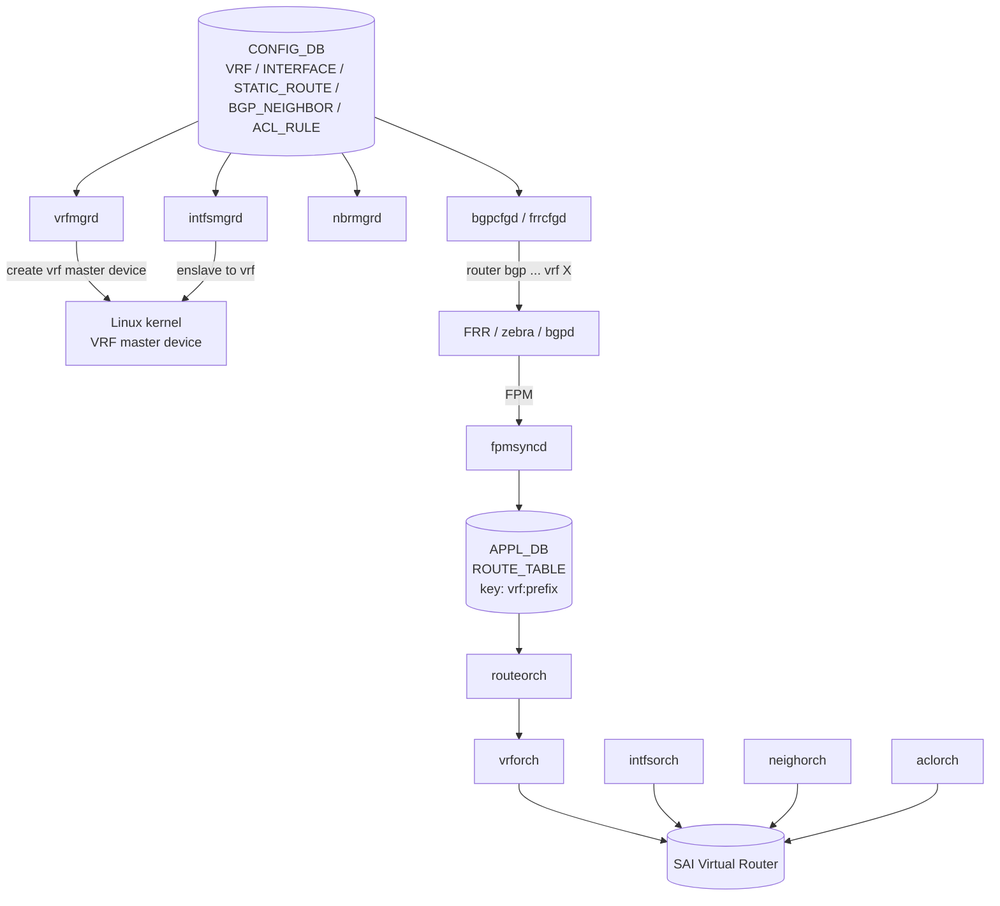

!!! success "裏取りステータス: Code-verified"
    現行 master の `sonic-swss/orchagent/vrforch.cpp` / `sonic-swss/cfgmgr/vrfmgrd.cpp` で vrfmgrd / vrforch 実装を確認。`sonic-buildimage/src/sonic-yang-models/yang-models/sonic-vrf.yang` L24 `container VRF` / L27 `list VRF_LIST` で VRF YANG を確認、`sonic-utilities/config/main.py` で `config vrf` CLI を確認。HLD 記載の SAI Virtual Router 機構と Linux VRF master device 連携は現行 master でも維持されている（verified 2026-05-09）。Loopback per-VRF / route leak の実装詳細差分は別途各機能ページで追跡。

# VRF サポート（vrfmgrd / vrforch / FRR vrf-aware）

## 概要

SONiC の VRF（Virtual Routing and Forwarding）サポートは、Linux kernel の **VRF master device** を基盤に、FRR（zebra / bgpd）を vrf-aware 化し、SONiC 側に vrfmgrd / vrforch を新設して L3 interface・static route・BGP セッション・ACL redirect の VRF binding を一気通貫で扱えるようにするものである[^1]。

本 HLD のスコープ:

- VRF instance の add/del、L3 interface（physical / VLAN / LAG / Loopback）の bind/unbind
- VRF aware static route / BGP / ACL redirect
- VRF 間 route leak（v1.1 で追加）
- Loopback per-VRF（v1.2 で追加）。BGP multihop の source などに使う

スコープ外: VRF の admin up/down、fallback lookup（RFC 4364）。スケールは「FRR バグ修正後 1000 VRF まで」と明記[^1]。

## 動作仕様

### コンポーネント階層



### 各モジュールの責務

| モジュール | 役割 |
|-----------|------|
| `vrfmgrd` | `CONFIG_DB.VRF` を購読し Linux VRF master device 作成 / 削除 |
| `intfsmgrd` | interface を VRF master に enslave（既存 IP は一旦取り外して再付与）。Loopback も対象 |
| `nbrmgrd` | neighbor 学習を vrf-scope で APP_DB へ |
| `fpmsyncd` | FPM 経由 route を `ROUTE_TABLE:<vrf>:<prefix>` 形式で書く |
| `bgpcfgd` (現 `frrcfgd`) | `BGP_NEIGHBOR` の `vrf` フィールドから FRR 設定を生成 |
| `vrforch` | `APP_DB.VRF_TABLE` を SAI Virtual Router にマッピング、OID 払い出し |
| `intfsorch` / `routeorch` / `neighorch` / `aclorch` | OID を引いて vrf-scope で SAI に設定 |

### CONFIG_DB / APPL_DB スキーマ要点

```
CONFIG_DB:
  VRF|<vrfname> = { v4: enable, v6: enable, fallback: false }
  INTERFACE|<iface> = { vrf_name: <vrfname>, ... }
  STATIC_ROUTE|<vrf>|<prefix> = { nexthop: ..., nexthop-vrf: ... }
  BGP_NEIGHBOR|<vrf>|<peer> = { ... }
  ACL_RULE_TABLE|<table>|<rule> = { PACKET_ACTION: REDIRECT:<vrf>|<nh>, ... }

APPL_DB:
  VRF_TABLE:<vrfname> = { v4, v6, fallback }
  INTF_TABLE:<iface>:<prefix>          # 1 segment key（vrf を含まない interface 行）
  INTF_TABLE:<iface>                   # vrf binding 行（v4/v6/vrf_name）
  ROUTE_TABLE:<vrf>|<prefix>           # default VRF は省略可
```

`INTF_TABLE` は **2-segment key** をサポートし、interface の vrf binding と IP 付与を分離する[^1]。

### Route leak

v1.1 で `STATIC_ROUTE` に `nexthop-vrf` フィールドを追加し、`vrf A` の prefix を `vrf B` の next-hop で解決できるようにした[^1]。動的（BGP 経由の）route leak は本 HLD ではスコープ外。

### Loopback per-VRF

v1.2 で `LOOPBACK_INTERFACE` の VRF binding をサポート。BGP multihop の source IP に使えるため、interface oper 状態に左右されずに BGP セッションが持続する[^1]。

<!-- evidence:
source: sonic-net/SONiC/doc/vrf/sonic-vrf-hld.md#L84-L108 (sha: 49bab5b5ff0e924f1ea52b3d9db0dfa4191a7c06)
excerpt: |
  1. Add or Delete VRF instance
  2. Bind L3 interface to a VRF.
  ...
  7. VRF Scalability: Currently VRF number can be supported up to 1000 after fixing a bug in FRR.
  8. loopback devices with vrf.
reasoning: スコープと制約（特に 1000 VRF・Loopback per-VRF）の根拠。
-->

## 設定

### 関連する CLI

| Command | 用途 |
|---------|------|
| `config vrf add <name>` / `config vrf del <name>` | VRF 作成/削除 |
| `config interface vrf bind <if> <vrf>` / `unbind <if>` | interface 紐付け |
| `config route add prefix <p> nexthop vrf <nh-vrf> <ip>` | static leak route |
| `show vrf` | VRF 一覧と紐付き interface |

CLI 文法は HLD 記載ベース。現行 sonic-utilities では細部が違う可能性あり。

### 設定例

```bash
config vrf add Vrf-Red
config interface vrf bind Ethernet0 Vrf-Red
config interface ip add Ethernet0 10.0.0.1/24
config bgp neighbor add Vrf-Red 10.0.0.2 65001
```

## 制限事項

- **VRF level の admin up/down は非対応**[^1]
- **Fallback lookup（RFC 4364）は未対応**（本 HLD バージョン時点）[^1]
- スケール: FRR バグ修正後 1000 VRF[^1]
- VLAN / LAG interface の VRF 移動時は IP を一旦剥がして再付与が必要。SAI 側の oid も再生成される
- ACL redirect の syntax 変更を伴う

## 干渉する機能

- **FRR**: `bgpd` / `zebra` 双方が vrf-aware である必要。SONiC では FRR template / `frrcfgd` 経由で生成
- **fpmsyncd / orchagent**: `ROUTE_TABLE` キーが `<vrf>:<prefix>` に拡張されるため、消費側全部に影響
- **EVPN / VXLAN**: tenant VRF と組み合わせた使い方は別 HLD（`evpn-vxlan-hld.md` 等）参照
- **Loopback per-VRF と BGP multihop**: source IP として使えるため BGP セッション安定化に効くが、interface oper との関係に注意

## トラブルシューティング

- VRF に bind した interface で IP が消えた → enslave 時の剥がし→再付与の race。`intfsmgrd` ログ確認
- `show vrf` に出ない VRF → kernel に master device があるか `ip link show type vrf` で確認
- VRF をまたぐ static route が効かない → `nexthop-vrf` 指定確認、leak 対応 SAI 実装か確認

## 引用元

[^1]: `sonic-net/SONiC` `doc/vrf/sonic-vrf-hld.md` @ `49bab5b5ff0e924f1ea52b3d9db0dfa4191a7c06`

<!-- concerns hint:
- vrfmgrd / vrforch の現行 master 実装存在確認
- VRF テーブル / INTF_TABLE 2-segment key の YANG / sonic-buildimage 取り込み確認
- config vrf / config interface vrf bind CLI の現行 sonic-utilities 取り込み確認
- SAI Virtual Router の community SAI 取り込み確認（既知）
- 2018-2019 年 HLD のため、Loopback per-VRF / route leak の現行実装乖離リスク（priority=high）
- FRR upstream の vrf-aware bgpd / zebra 仕様との差分確認
-->
