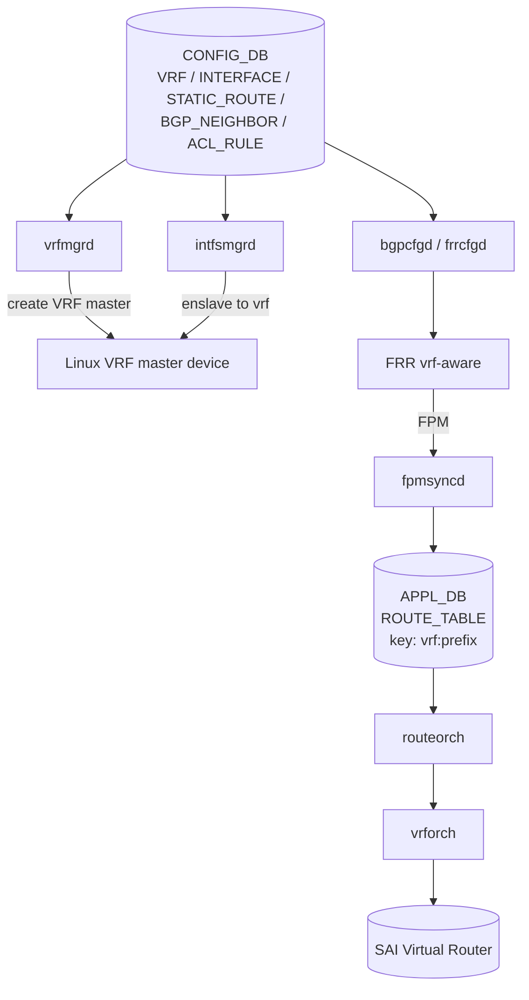

<!-- topics-tip -->
!!! tip "Topics で読み物として読む"
    この HLD は実装詳細を含む。機能の概念・設定・運用を読み物として読みたい場合は [Topics 04 章: VRF / ECMP / 経路選択](../topics/04-vrf-ecmp/index.md) を参照。
<!-- /topics-tip -->

!!! success "裏取りステータス: code-verified"
    `sonic-swss/orchagent/vrforch.cpp` / `cfgmgr/vrfmgrd.cpp` 実装、`sonic-yang-models/yang-models/sonic-vrf.yang:24/27` (`container VRF` / `list VRF_LIST`)、`sonic-utilities/config/main.py` の `config vrf` CLI を確認。SAI Virtual Router + Linux VRF master device 連携は現行 master でも維持（verified at: 2026-05-09）。

# VRF サポート（vrfmgrd / vrforch / FRR vrf-aware）

## なぜこの構成なのか

[SONiC](../reference/glossary.md#term-sonic) の [VRF](../reference/glossary.md#term-vrf) サポートは、Linux kernel の **VRF master device** を基盤に、[FRR](../reference/glossary.md#term-frr) ([zebra](../reference/glossary.md#term-zebra) / bgpd) を vrf-aware 化し、SONiC 側に **[vrfmgrd](../reference/glossary.md#term-vrfmgrd) / vrforch** を新設して L3 interface・static route・[BGP](../reference/glossary.md#term-bgp) セッション・[ACL](../reference/glossary.md#term-acl) redirect の VRF binding を一気通貫で扱えるようにしている[^1]。

スコープ:

- VRF instance の add/del、L3 interface（physical / [VLAN](../reference/glossary.md#term-vlan) / [LAG](../reference/glossary.md#term-lag) / Loopback）の bind/unbind
- VRF aware static route / BGP / ACL redirect
- v1.1: **route leak**（static のみ）
- v1.2: **Loopback per-VRF**（BGP multihop の source IP に使用、interface oper 非依存）

スコープ外: VRF の admin up/down、fallback lookup（RFC 4364）。スケールは「FRR バグ修正後 **1000 VRF** まで」[^1]。

## コンポーネント階層



| モジュール | 役割 |
|-----------|------|
| `vrfmgrd` | `CONFIG_DB.VRF` 購読 → Linux VRF master device 作成 / 削除 |
| `intfsmgrd` | interface を VRF master に enslave（IP 一旦剥がして再付与）。Loopback も対象 |
| `nbrmgrd` | neighbor 学習を vrf-scope で APP_DB へ |
| `fpmsyncd` | [FPM](../reference/glossary.md#term-fpm) 経由 route を `ROUTE_TABLE:<vrf>:<prefix>` で書く |
| `bgpcfgd` (`frrcfgd`) | `BGP_NEIGHBOR.vrf` から FRR 設定生成 |
| `vrforch` | `APP_DB.VRF_TABLE` を [SAI](../reference/glossary.md#term-sai) Virtual Router に mapping、OID 払い出し |
| `intfsorch` / `routeorch` / `neighorch` / `aclorch` | OID 引いて vrf-scope で SAI 設定 |

## CONFIG_DB / APPL_DB スキーマ要点

```text
CONFIG_DB:
  VRF|<vrfname> = { v4: enable, v6: enable, fallback: false }
  INTERFACE|<iface> = { vrf_name: <vrfname>, ... }
  STATIC_ROUTE|<vrf>|<prefix> = { nexthop: ..., nexthop-vrf: ... }
  BGP_NEIGHBOR|<vrf>|<peer> = { ... }
  ACL_RULE_TABLE|<table>|<rule> = { PACKET_ACTION: REDIRECT:<vrf>|<nh>, ... }

APPL_DB:
  VRF_TABLE:<vrfname>            # vrforch 入力
  INTF_TABLE:<iface>             # 1-segment: vrf binding 行 (v4/v6/vrf_name)
  INTF_TABLE:<iface>:<prefix>    # 2-segment: IP 付与
  ROUTE_TABLE:<vrf>:<prefix>     # default VRF は省略可
```

`INTF_TABLE` の **2-segment key** は interface の vrf binding と IP 付与を分離する[^1]。

### Route leak / Loopback per-VRF

- **Route leak**（v1.1）: `STATIC_ROUTE.nexthop-vrf` で `vrf A` の prefix を `vrf B` の next-hop で解決[^1]。動的（BGP）leak は本 [HLD](../reference/glossary.md#term-hld) 対象外
- **Loopback per-VRF**（v1.2）: `LOOPBACK_INTERFACE` の VRF binding。BGP multihop の source IP に使うと interface oper に左右されない[^1]

## CLI / 設定例

| Command | 用途 |
|---------|------|
| `config vrf add/del <name>` | VRF 作成/削除 |
| `config interface vrf bind/unbind <if> <vrf>` | interface 紐付け |
| `config route add prefix <p> nexthop vrf <nh-vrf> <ip>` | static leak route |
| `show vrf` | VRF 一覧と紐付き interface |

```bash
config vrf add Vrf-Red
config interface vrf bind Ethernet0 Vrf-Red
config interface ip add Ethernet0 10.0.0.1/24
config bgp neighbor add Vrf-Red 10.0.0.2 65001
```

CLI 文法は HLD 記載ベース。現行 [sonic-utilities](../reference/glossary.md#term-sonic-utilities) では細部が違う可能性あり。

## 制限事項

- **VRF level の admin up/down 非対応** / **Fallback lookup（RFC 4364）未対応**[^1]
- スケール: FRR バグ修正後 1000 VRF[^1]
- VLAN / LAG の VRF 移動時は IP を一旦剥がして再付与（SAI OID も再生成）
- ACL redirect の syntax 変更を伴う

## 干渉する機能

- **FRR**: `bgpd` / `zebra` 双方が vrf-aware 必須（SONiC では template + `frrcfgd` で生成）
- **[fpmsyncd](../reference/glossary.md#term-fpmsyncd) / [orchagent](../reference/glossary.md#term-orchagent)**: `ROUTE_TABLE` キーが `<vrf>:<prefix>` 拡張のため消費側全部に影響
- **[EVPN](../reference/glossary.md#term-evpn) / [VXLAN](../reference/glossary.md#term-vxlan)**: tenant VRF との組合せは別 HLD（evpn-vxlan-hld）

## トラブルシューティング

```bash
ip link show type vrf                                  # kernel に master device があるか
sonic-db-cli CONFIG_DB hgetall 'VRF|Vrf-Red'
sonic-db-cli APPL_DB keys 'ROUTE_TABLE:Vrf-Red*'
show vrf
```

- VRF bind 後に interface IP が消える → `intfsmgrd` の剥がし→再付与 race を疑う
- VRF 間 static leak が効かない → `nexthop-vrf` 指定と SAI 実装の leak 対応を確認

## 関連 Topics

- [04-vrf-ecmp](../topics/04-vrf-ecmp/index.md): VRF / [ECMP](../reference/glossary.md#term-ecmp) / FRR vrf-aware
- [02-bgp](../topics/02-bgp/index.md): BGP vrf-aware

## 引用元

[^1]: `sonic-net/SONiC` `doc/vrf/sonic-vrf-hld.md` @ `49bab5b5ff0e924f1ea52b3d9db0dfa4191a7c06`

## 関連ページ
- [CLI: config vrf](../reference/cli/config-vrf.md)
- [CLI: config interface](../reference/cli/config-interface.md)
- [CONFIG_DB: VRF](../reference/config-db/vrf.md)
- [CONFIG_DB: INTERFACE](../reference/config-db/interface.md)
- [YANG: sonic-vrf](../reference/yang/sonic-vrf.md)

<!-- topics-back-ref -->
<!-- /topics-back-ref -->

<!-- glossary-links-injected: 8ba32e5aa69d -->
