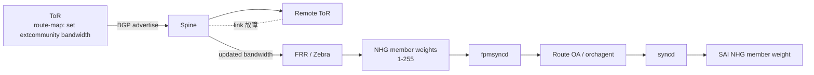

<!-- topics-tip -->
!!! tip "Topics で読み物として読む"
    この HLD は実装詳細を含みます。機能の概念・設定・運用を読み物として読みたい場合は [Topics 04 章: VRF / ECMP / 経路選択](../topics/04-vrf-ecmp/index.md) を参照。
<!-- /topics-tip -->

!!! success "裏取りステータス: code-verified"
    `bgpcfgd/managers_device_global.py` で `wcmp_template = ... bgpd/wcmp/bgpd.wcmp.conf.j2`、`wcmp_enabled` キー処理、`configure_wcmp(data)` を master で確認。`docker-fpm-frr/frr/bgpd/wcmp/` テンプレートディレクトリも存在。

# Weighted ECMP（WCMP）

## 読み手が知りたいこと

- 通常 [ECMP](../reference/glossary.md#term-ecmp) では何が問題で、なぜリンク帯域に応じた重み付けが要るのか
- WCMP の重みは何で運ばれ、どこで NHG member weight に変換されるか
- [SONiC](../reference/glossary.md#term-sonic) 側で増えるのは [CONFIG_DB](../reference/glossary.md#term-config_db) のどのキーか、SWSS/[SAI](../reference/glossary.md#term-sai) に変更があるか
- [EVPN](../reference/glossary.md#term-evpn) Type-5 や warm-boot の扱い

## なぜ通常 ECMP では足りないか

各 ToR-Spine リンクが部分故障した際、通常 ECMP は **生存リンクの容量差を反映できず** 均等分散して輻輳する。**WCMP** は **[BGP](../reference/glossary.md#term-bgp) link bandwidth 拡張コミュニティ** で各 path の利用可能帯域を運び、[FRR](../reference/glossary.md#term-frr) / Zebra が 1〜255 に正規化した weight で NHG member を作る[^1]。

本 [HLD](../reference/glossary.md#term-hld) のスコープは **L3 用途のみ**。EVPN Type-5 は **Out of scope**[^1]。SWSS / SAI は既に NHG member weight をサポートしているので **SWSS OA は変更不要**[^1]。

## データフロー



- 入口 ToR が `route-map` で `set extcommunity bandwidth num-multipaths` を付与[^1]
- 受信 BGP は default で **link bandwidth ext community を weight に変換**。一部 path が community を持たないと **通常 ECMP に fallback**
- Zebra が NHG 再計算 → [fpmsyncd](../reference/glossary.md#term-fpmsyncd) → Route OA → SAI

### Weight 正規化

- 各 NHG 内で `bw / total_bw` 比を **1..255** に正規化[^1]
- 全 0 / 同一値は通常 ECMP と等価
- multipath の一部に bandwidth コミュニティ無し → **全体 ECMP fallback**

## FRR 設定

### L3（ipv4 unicast）

```text
route-map wcmp-map permit 100
  set extcommunity bandwidth num-multipaths
exit
router bgp 65100
  address-family ipv4 unicast
    neighbor SPINE route-map wcmp-map out
    neighbor SPINE activate
  exit-address-family
```

### EVPN Type-5（参考、scope 外）

```text
address-family l2vpn evpn
  advertise ipv4 unicast route-map wcmp-map
  neighbor SPINE activate
exit-address-family
```

EVPN 経路は `docker_routing_config_mode` が `split` / `split-unified` のときのみ有効[^1]。

## CONFIG_DB と bgpcfgd

```text
BGP_DEVICE_GLOBAL|STATE:
  wcmp_enabled = "true" | "false"
```

初期 config（`init_cfg.json.j2`）で **default `false`**[^1]。

`DeviceGlobalCfgMgr` に `set_wcmp` API を追加。`BGP_DEVICE_GLOBAL|STATE` 変更で jinja2 テンプレ `bgpd.wcmp.conf.j2`（`docker-fpm-frr/frr/bgpd/wcmp/`）を反映[^1]:

```jinja

  set extcommunity bandwidth num-multipaths

  no set extcommunity bandwidth

```

## CLI

```bash
config bgp device-global wcmp <enabled|disabled>
show bgp device-global [-j|--json]
```

```bash
$ show bgp device-global
TSA        WCMP
---------  --------
Disabled   Enabled
```

## Warm / Fast boot

- `wcmp_enabled` を再読込し FRR を reload する想定
- 詳細は本 HLD では別途扱われていない[^1]

## 制限事項

- **EVPN Type-5 は scope 外**（将来）
- 一部 multipath が link-bandwidth コミュニティを持たないと ECMP fallback
- 正規化精度は 8bit (1-255) なので極端な比は表現不能
- [ASIC](../reference/glossary.md#term-asic) によっては NHG member weight に resource 制約あり（HLD 未明記、SWSS HLD #738 参照）

## 干渉する機能

- **BGP PIC**: NHG を共有
- **EVPN over L2VPN**: 将来 scope（Type-5）
- **local-ars-hld** 等の multipath: weight 計算は独立
- **fpmsyncd / Route OA**: 既存の NHG member weight 経路を流用

## 関連 Topic

- [04 VRF & ECMP / ecmp](../topics/04-vrf-ecmp/ecmp.md)
- [04 VRF & ECMP / advanced](../topics/04-vrf-ecmp/advanced.md)
- [02 BGP / advanced](../topics/02-bgp/advanced.md)

## 参考

- [WCMP SWSS HLD #738](https://github.com/sonic-net/SONiC/pull/738)

## 確認コマンド

- `show bgp device-global` — WCMP の有効/無効を確認
- `vtysh -c "show bgp ipv4 unicast <prefix>"` — link-bandwidth extended community と nexthop weight を確認
- `vtysh -c "show ip route <prefix>"` — RIB 段で NHG メンバの weight を確認
- `sonic-db-cli APPL_DB hgetall "ROUTE_TABLE:<prefix>"` / `NEXT_HOP_GROUP_TABLE` で weight 反映を確認

### コマンド例

weighted ECMP の path weight を確認する。

```bash
show ip route summary
redis-cli -n 0 hgetall 'ROUTE_TABLE:0.0.0.0/0' 2>/dev/null
redis-cli -n 1 keys 'ASIC_STATE:SAI_OBJECT_TYPE_NEXT_HOP_GROUP_MEMBER*' | head
```

## 引用元

[^1]: `sonic-net/SONiC` `doc/wcmp/wcmp-design.md` @ `49bab5b5ff0e924f1ea52b3d9db0dfa4191a7c06`

<!-- topics-back-ref -->
## 関連 Topics

- [Topics: VRF / ECMP / RIB-FIB パイプライン](../topics/04-vrf-ecmp/index.md)

<!-- /topics-back-ref -->

<!-- glossary-links-injected: ec18b66e3507 -->
