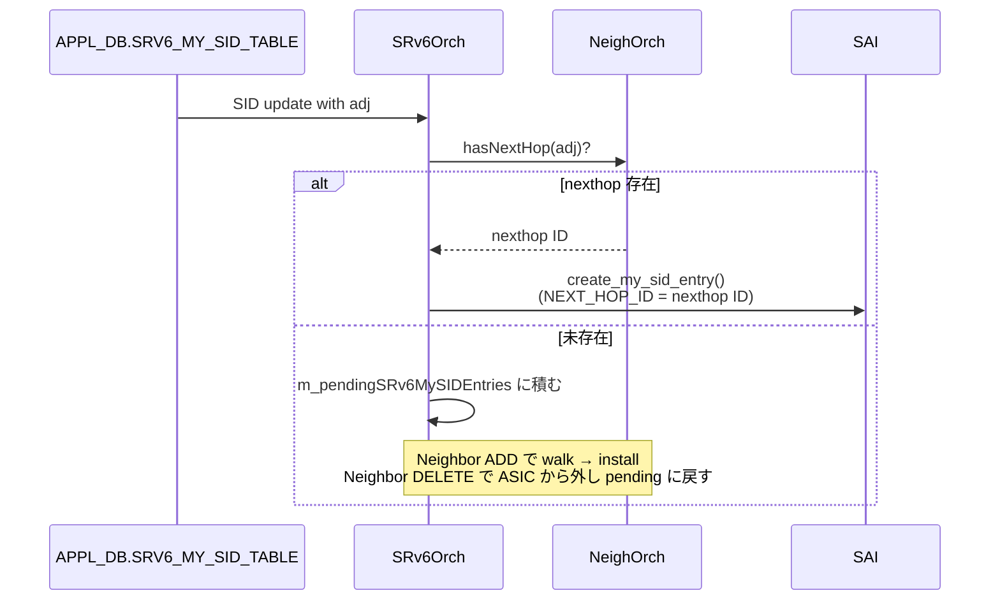

<!-- topics-tip -->
!!! tip "Topics で読み物として読む"
    この HLD は実装詳細を含む。機能の概念・設定・運用を読み物として読みたい場合は [Topics 04 章: VRF / ECMP / 経路選択](../topics/04-vrf-ecmp/index.md) を参照。
<!-- /topics-tip -->

!!! success "裏取りステータス: code-verified"
    `sonic-swss/orchagent/srv6orch.h:189` で `createUpdateMysidEntry(my_sid_string, vrf, adj, end_action)`、`:277` で `m_pendingSRv6MySIDEntries: map<NextHopKey, set<tuple<...>>>` を確認。`srv6orch.cpp:1227-1259` で Neighbor 確定時の pending 解決、`:1341/:1533/:1541` で未解決時の queue 投入、`:1544` で `SAI_MY_SID_ENTRY_ATTR_NEXT_HOP_ID` を SAI に渡す経路を確認（verified at: 2026-05-09）。

# SRv6 SID の L3 隣接（uA / End.X / uDX4 / uDX6 / End.DX4 / End.DX6）

## なぜ必要か

[SONiC](../reference/glossary.md#term-sonic) の [SRv6](../reference/glossary.md#term-srv6) サポートは別 [HLD](../reference/glossary.md#term-hld)（[srv6_hld.md](https://github.com/sonic-net/SONiC/blob/master/doc/srv6/srv6_hld.md)）で定義済みだが、**cross-connect 系 behavior**（`uA` / `End.X` / `uDX4` / `uDX6` / `End.DX4` / `End.DX6`）は出口の **L3 隣接 (L3Adj)** を必要とする[^1]。これらの behavior 用に **[APPL_DB](../reference/glossary.md#term-appl_db) に `adj` パラメータ** が追加されているにもかかわらず、`SRv6Orch` がこれを処理していなかった。本 HLD は **`SRv6Orch` を L3Adj 対応に拡張** し、SID と nexthop ID を [ASIC](../reference/glossary.md#term-asic) に programming できるようにする[^1]。

対象 behavior[^1]:

| Behavior | 意味 |
|----------|------|
| `End.X` | L3 Cross-Connect |
| `End.DX4` / `End.DX6` | Decap + IPv4/IPv6 Cross-Connect |
| `uA` | End.X with NEXT-CSID + PSP + USD flavors |
| `uDX4` / `uDX6` | End.DX4 / End.DX6 with NEXT-CSID flavor |

## 何が変わるか（SRv6Orch のフロー）



ポイント[^1]:

- `SRv6Orch` は **`APPL_DB.SRV6_MY_SID_TABLE`** の subscriber
- SID に `adj` が付くと **`NeighOrch::hasNextHop()`** で nexthop の存在を確認、無ければ **`m_pendingSRv6MySIDEntries`** に保留
- `SRv6Orch` は NeighOrch の Neighbor 変化通知を購読し、ADD で walk → install、DELETE で ASIC から SID を削除して pending に戻す

## SAI 側はどうなるか

`SAI_OBJECT_TYPE_MY_SID_ENTRY` には既に `SAI_MY_SID_ENTRY_ATTR_NEXT_HOP_ID` 属性があり、cross-connect 系 endpoint behavior（`X`, `DX4`, `DX6`, `B6_ENCAPS`, `B6_ENCAPS_RED`, `B6_INSERT`, `B6_INSERT_RED`）で `validonly` として参照される[^1]。**[SAI](../reference/glossary.md#term-sai) 側に新規 API は不要**[^1]。

```c
SAI_MY_SID_ENTRY_ATTR_NEXT_HOP_ID
  type: sai_object_id_t (NEXT_HOP / NEXT_HOP_GROUP / ROUTER_INTERFACE)
  flags: CREATE_AND_SET, allownull
  validonly: ENDPOINT_BEHAVIOR ∈ {X, DX4, DX6, B6_ENCAPS*, B6_INSERT*}
```

参考 PR: `sonic-swss#2902` (`[orchagent]: Extend the SRv6Orch to support the programming of the L3Adj`)[^1]。

## 設定

本 HLD は **[CONFIG_DB](../reference/glossary.md#term-config_db) / CLI / [YANG](../reference/glossary.md#term-yang) への変更を伴わない**。`SRV6_MY_SID_TABLE` の `adj` パラメータは既存スキーマ（srv6_hld 側で定義済み）であり、本 HLD はその処理を実装するだけ。実際の SID 投入は [FRR](../reference/glossary.md#term-frr) + `dplane_fpm_sonic` 経由で APPL_DB に書かれる。

```bash
# 直接 APPL_DB に書く例（通常は FRR 経由）
sonic-db-cli APPL_DB hset 'SRV6_MY_SID_TABLE:fc00:1::ffff:0:0:0/128' \
  action 'uA' adj '10.0.0.1' vrf 'default'
```

## 制限事項

- L3Adj 対応は **uA / End.X / uDX4 / uDX6 / End.DX4 / End.DX6 のみ**[^1]。`End` / `End.T` / `End.DT4` / `End.DT6` 等は別経路（[VRF](../reference/glossary.md#term-vrf) 等）
- nexthop が未解決のまま SID が長く pending list に残っても気付きづらい
- Neighbor DELETE で SID を ASIC から削除する設計は traffic 断を伴う
- ベンダ SAI 実装で `SAI_MY_SID_ENTRY_ATTR_NEXT_HOP_ID` の `validonly` 制約が異なる可能性

## 干渉する機能

- **`SRv6Orch`**: 主体。`m_pendingSRv6MySIDEntries` 管理 + Neighbor 通知購読
- **`NeighOrch`**: nexthop 存在判定 + ADD/DELETE 通知の発行元
- **`fpmsyncd` + `dplane_fpm_sonic`**: SRv6 SID を APPL_DB に書く前段

## トラブルシューティング

```bash
sonic-db-cli APPL_DB keys 'SRV6_MY_SID_TABLE*'        # SID が APPL_DB にあるか
sonic-db-cli APPL_DB hgetall 'NEIGH_TABLE:default:10.0.0.1'  # adj 先 neighbor
sonic-db-cli ASIC_DB keys '*MY_SID*'                  # ASIC に降りているか
```

- SID が pending のまま → `NeighOrch::hasNextHop()` の readiness、SRv6Orch の Neighbor ADD 通知購読
- SID 削除で nexthop が残る → 正常（nexthop 自体は他経路でも参照されうる）

## 関連 Topics

- [17-srv6-mpls](../topics/17-srv6-mpls/index.md): SRv6 / [MPLS](../reference/glossary.md#term-mpls) / Segment Routing 全般

## 引用元

[^1]: `sonic-net/SONiC` `doc/srv6/srv6_sid_l3adj.md` @ `49bab5b5ff0e924f1ea52b3d9db0dfa4191a7c06`

<!-- topics-back-ref -->
## 関連 Topics (自動リンク)

- [Topics: SRv6 / MPLS / Path Tracing](../topics/17-srv6-mpls/index.md)

<!-- /topics-back-ref -->

<!-- glossary-links-injected: ec18b66e3507 -->
