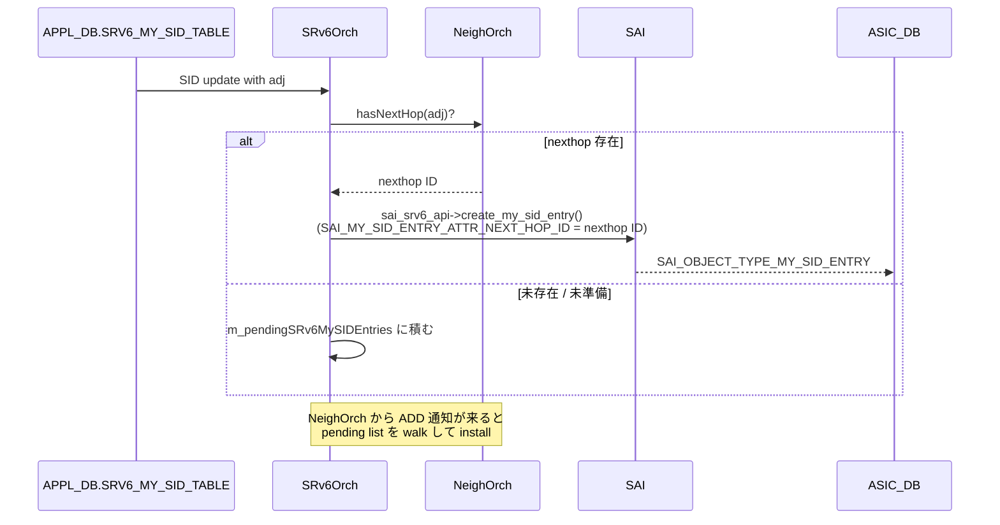
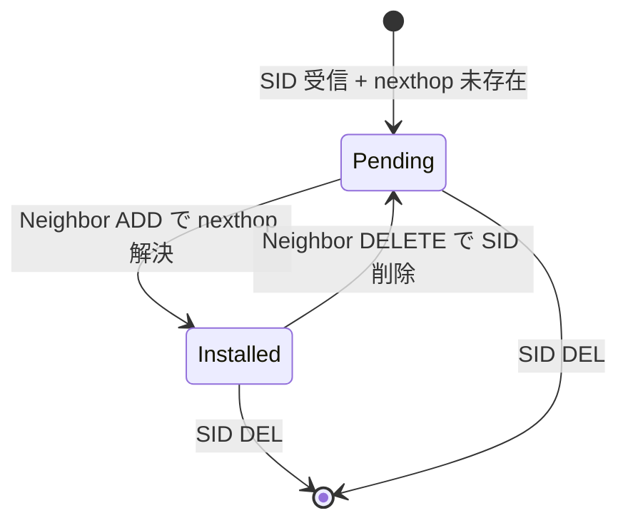

!!! success "裏取りステータス: Code-verified"
    `sonic-swss/orchagent/srv6orch.h` L189 で `createUpdateMysidEntry(my_sid_string, vrf, adj, end_action)` シグネチャを、L277 で `m_pendingSRv6MySIDEntries: map<NextHopKey, set<tuple<...>>>` を確認。`srv6orch.cpp` L1227-1259 で Neighbor 確定時の pending 解決、L1341/L1533/L1541 で未解決時の queue 投入、L1544 で `SAI_MY_SID_ENTRY_ATTR_NEXT_HOP_ID` を SAI に渡す経路を確認（verified at: 2026-05-09）。

# SRv6 SID の L3 隣接（uA / End.X / uDX4 / uDX6 / End.DX4 / End.DX6）

## 概要

SONiC の SRv6 サポートは別 HLD（[srv6_hld.md](https://github.com/sonic-net/SONiC/blob/master/doc/srv6/srv6_hld.md)）で定義済みだが、**`uA` / `End.X` / `uDX4` / `uDX6` / `End.DX4` / `End.DX6` 等の cross-connect 系 behavior** は出口の **L3 隣接 (L3Adj)** を必要とする[^1]。これらの behavior 用に **APPL_DB に `adj` パラメータ** が追加されているにもかかわらず、`SRv6Orch` がこれを処理していなかった。

本 HLD は **`SRv6Orch` を L3Adj 対応に拡張** し、SID と nexthop ID を ASIC に programming できるようにする[^1]。

対象 behavior[^1]:

| Behavior | 意味 |
|----------|------|
| `End.X` | L3 Cross-Connect |
| `End.DX4` | Decap + IPv4 Cross-Connect |
| `End.DX6` | Decap + IPv6 Cross-Connect |
| `uA` | End.X with NEXT-CSID + PSP + USD flavors |
| `uDX4` | End.DX4 with NEXT-CSID flavor |
| `uDX6` | End.DX6 with NEXT-CSID flavor |

## 動作仕様

### `SRv6Orch` のフロー



ポイント[^1]:

- `SRv6Orch` は **`APPL_DB.SRV6_MY_SID_TABLE`** の subscriber
- SID に `adj` が付くと **`NeighOrch::hasNextHop()`** で対応 nexthop の存在を確認
- 存在しなければ **`m_pendingSRv6MySIDEntries`** に保留
- `SRv6Orch` は **NeighOrch の Neighbor 変化通知** を購読し、ADD で pending list を walk → install、DELETE で ASIC から SID を削除して pending list に戻す

### `m_pendingSRv6MySIDEntries`

新規データ構造[^1]:

- 用途: nexthop が未準備で install できない SID を一時保留
- triggers:
    - **Neighbor ADD**: list を walk し、nexthop が解決した SID を ASIC に install
    - **Neighbor DELETE**: 対応 SID を ASIC から削除し pending に戻す（neighbor 復活時に再 install するため）



### SAI 側

`SAI_OBJECT_TYPE_MY_SID_ENTRY` には既に `SAI_MY_SID_ENTRY_ATTR_NEXT_HOP_ID` 属性が存在し、cross-connect 系 endpoint behavior（`X`, `DX4`, `DX6`, `B6_ENCAPS`, `B6_ENCAPS_RED`, `B6_INSERT`, `B6_INSERT_RED`）で `validonly` として参照される[^1]。**SAI 側に新規 API は不要**[^1]。

```c
SAI_MY_SID_ENTRY_ATTR_NEXT_HOP_ID
  type: sai_object_id_t (SAI_OBJECT_TYPE_NEXT_HOP / NEXT_HOP_GROUP / ROUTER_INTERFACE)
  flags: CREATE_AND_SET, allownull
  default: SAI_NULL_OBJECT_ID
  validonly: ENDPOINT_BEHAVIOR ∈ {X, DX4, DX6, B6_ENCAPS, B6_ENCAPS_RED, B6_INSERT, B6_INSERT_RED}
```

### 参考 PR

`sonic-swss#2902` (`[orchagent]: Extend the SRv6Orch to support the programming of the L3Adj`)[^1]。

## 設定

### CONFIG_DB / CLI / YANG

本 HLD は **CONFIG_DB / CLI / YANG への変更を伴わない**。`SRV6_MY_SID_TABLE` の `adj` パラメータは **既存スキーマ**（[srv6_hld.md](https://github.com/sonic-net/SONiC/blob/master/doc/srv6/srv6_hld.md) で定義済み）であり、本 HLD はその処理を実装するだけ。

### 設定例

SID 投入は SRv6 設定経路（FRR + `dplane_fpm_sonic` 等）または直接 APPL_DB:

```bash
# 例（HLD は具体例なし。SRv6 一般運用例として）
sonic-db-cli APPL_DB hset 'SRV6_MY_SID_TABLE:fc00:1::ffff:0:0:0/128' \
  action 'uA' adj '10.0.0.1' vrf 'default'
```

実際には FRR 経由で programming されるため、ユーザは BGP / IGP / static で SRv6 経路を構成する。

## 制限事項

- L3Adj 対応は **uA / End.X / uDX4 / uDX6 / End.DX4 / End.DX6 のみ**[^1]。`End` / `End.T` / `End.DT4` / `End.DT6` 等は別経路（VRF 等）で処理
- nexthop が未解決のまま SID が長く pending list に残ると **install 漏れ** に気付きづらい
- Neighbor DELETE で SID を ASIC から削除する設計は traffic 断を伴う。upstream NSR (Non-Stop Routing) 等とは独立
- 本 HLD は **SAI 側の変更を要求しない** が、ベンダ SAI 実装で `SAI_MY_SID_ENTRY_ATTR_NEXT_HOP_ID` の `validonly` 制約が異なる可能性
- 既存 SRv6 HLD との結合度が高く、`SRV6_MY_SID_TABLE` の他フィールド（`block_len` / `node_len` 等）の整合は別 HLD 側で担保される必要

## 干渉する機能

- **`SRv6Orch`**: 主体。`m_pendingSRv6MySIDEntries` 管理 + Neighbor 通知購読
- **`NeighOrch`**: nexthop 存在判定 + ADD/DELETE 通知の発行
- **`fpmsyncd` + `dplane_fpm_sonic`**: SRv6 SID を APPL_DB に書く前段
- **`SRV6_MY_SID_TABLE`**: APPL_DB スキーマ（既存）
- **SAI MY_SID_ENTRY オブジェクト**: ASIC への反映先

## トラブルシューティング

- SID が ASIC に降りない → APPL_DB の `SRV6_MY_SID_TABLE` を確認、`adj` が指す neighbor が `NEIGH_TABLE` にあるか確認
- Neighbor 復活で再 install されない → `SRv6Orch` の `m_pendingSRv6MySIDEntries` ログ、Neighbor ADD 通知購読が機能しているか確認
- nexthop が解決しているのに SID が pending → `NeighOrch::hasNextHop()` の戻り値、nexthop の readiness 判定ロジックを確認
- SID 削除で nexthop が残る → これは正常（nexthop 自体は他経路でも参照されうるため SRv6Orch は触らない）

## 引用元

[^1]: `sonic-net/SONiC` `doc/srv6/srv6_sid_l3adj.md` @ `49bab5b5ff0e924f1ea52b3d9db0dfa4191a7c06`

<!-- concerns hint:
- SRv6Orch の L3Adj 取り扱い拡張の現行 master 実装存在確認 (sonic-swss/orchagent/srv6orch.cpp、PR #2902)
- m_pendingSRv6MySIDEntries データ構造の取り込み確認
- NeighOrch から SRv6Orch への Neighbor ADD/DEL 通知購読経路の実装確認
- SAI_MY_SID_ENTRY_ATTR_NEXT_HOP_ID の libsairedis / community SAI 取り込み状況確認
- SRV6_MY_SID_TABLE の adj パラメータが上流の dplane_fpm_sonic 経由で書き込まれる経路の整合確認
-->
