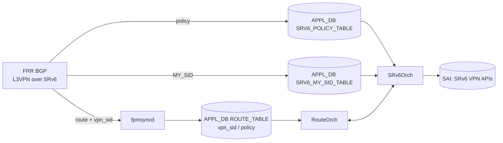

!!! success "裏取りステータス: Code-verified（基本構成のみ）"
    現行 master の `sonic-swss/orchagent/srv6orch.cpp` に `srv6_prefix_agg_id_table_` (1721-)、`createSrv6Vpn`/`deleteSrv6Vpn` (1025/776)、`vpn_sid` 管理が実装され、HLD の Prefix AGG_ID / VPN encap mapper 設計と一致。SRV6_MY_SID テーブル管理も APP_SRV6_MY_SID_TABLE_NAME / CFG_SRV6_MY_SID_TABLE_NAME 経由で確認済み。SRV6_POLICY_TABLE のキー名そのものは見えなかったが、内部データ構造として agg_id/vpn_sid が存在することを確認（verified at: 2026-05-09）。

# SRv6 VPN（L3VPN over SRv6 と SRv6 Policy）

## 概要

Alibaba がエッジルータで SONiC ホワイトボックスに SRv6 VPN を実装した実機運用ベースの提案 HLD。FRR 8.4 以上を前提に、**SRv6 を network programming framework** として VPN 識別と policy ベースのトラフィックステアリングを実装する[^1]。

主な変更領域：

- **FRR**: VRF route leak / BGP advertise delay / conditional advertisement / SRv6 Policy
- **SAI**: SRv6 VPN 用 SAI（Cisco による別途貢献の SAI 拡張モデルが前提）
- **SWSS / SONiC**: 新規 `SRv6_POLICY_TABLE`、`ROUTE_TABLE` への `vpn_sid` / `policy` フィールド追加、`SRv6Orch` / `RouteOrch` 拡張

## 動作仕様

### 全体フロー



### APPL_DB スキーマ追加

#### SRV6_POLICY_TABLE（新規）

```text
SRV6_POLICY_TABLE|<policy_name>
    segment = comma-list of SRV6_SID_LIST.key
    weight  = comma-list of int
```

#### ROUTE_TABLE 拡張

```text
ROUTE_TABLE:<VRF>:<prefix>
    nexthop    = ...
    intf       = ...
    vni_label  = ...
    router_mac = ...
    blackhole  = 0|1
    segment    = SRV6_SID_LIST.key      ; OPTIONAL
    seg_src    = address                ; OPTIONAL
    vpn_sid    = vpn_sid                ; NEW: BGP 学習時の VPN SID
    policy     = comma-list             ; NEW: 適用する SRv6 policy
```

### MY_SID と nexthop id

Alibaba の運用では **anycast routes を MY_SID として使う** ことで BGP NH 収束時のアウトを抑える。FRR の zebra は `SRV6_MY_SID` をカーネルに直接書くため、netlink 経由で fpmsyncd に渡らない問題があり、本 HLD で workaround を導入している[^1]。また `End.X` action の nexthop id 処理を `srv6orch` に追加。

```text
SRV6_MY_SID_TABLE:<block_len>:<node_len>:<func_len>:<arg_len>:<ipv6address>
    action  = uN | End.X | End.DT46 | End.B6.ENCAP | ...
    vrf     = <vrf>             ; END.DT46 用
    adj     = comma-list ip     ; END.X 用
    segment = SRV6_SID_LIST.key ; END.B6.ENCAP 用
    source  = address           ; END.B6.ENCAP 用
```

### Segment 拡張

セグメントリストの先頭 SID が MY_SID（action=End.X）に一致するとき、`SAI_SRV6_SIDLIST_ATTR_NEXT_HOP_ID` を設定し、`SAI_SRV6_SIDLIST_ATTR_SEGMENT_LIST` から先頭 SID を除外する最適化が入る[^1]。

### VPN Routes / 暗号化マッパー

SRv6 VPN ルートが追加されると、`SRv6Orch` は `vpn_sid` を持つ BGP NH に対応した SRv6 トンネルを必要なら作成し、各トンネルを **encap mapper** で参照する。Mapper のキーは `Prefix AGG_ID` で、同一 NH を共有する複数 VPN ルートで encap 情報を集約する。

## 設定

### 関連する CONFIG_DB

HLD には CONFIG_DB エントリの記述は無い。設定は FRR / コントローラから APPL_DB に流れ込む形。

### 関連する CLI

HLD には新規 SONiC CLI 追加の記述は無い。FRR の VPNv4/VPNv6 SAFI 経由で BGP 制御平面が走る。

### 関連する YANG

HLD に YANG モデルの記述は無い。

### 設定例

```bash
# FRR 側 (vtysh) - 概念的な L3VPN over SRv6 設定
configure terminal
router bgp 65001
 segment-routing srv6
  locator loc1
 address-family ipv4 vpn
  neighbor 10.0.0.1 activate
  rd vpn export 65001:1
  rt vpn both 65001:1
```

具体的な FRR 構文は HLD で詳述されておらず、FRR 8.4+ の SRv6 VPN ガイドを参照する必要がある。

## 制限事項

- FRR 8.4 以上が必要。SONiC 採用 FRR バージョンと整合させる。
- FRR が `SRV6_MY_SID` を netlink で fpmsyncd に渡せないため、Alibaba 流の workaround（anycast route 経路ハック）が必要[^1]。
- SAI 側は SRv6 VPN 拡張がプラットフォームでサポートされている必要があり、未対応プラットフォームでは動作しない。
- HLD は提案段階で、現行 master の取り込み状況は別途裏取り。

## 干渉する機能

- **SRv6 Static Configuration HLD**: 同じ SRv6 機能群の別経路（`SRV6_MY_LOCATORS` / `SRV6_MY_SIDS` を CONFIG_DB から bgpcfgd 経由で投入）で、本ページの BGP 学習経路と組み合わせて使う。
- **VRF / VRF leaking**: FRR の VRF route leak 拡張が前提。
- **BGP PIC**: FRR 側で PIC が無い場合の workaround として anycast MY_SID を使う、という選択が記述されている[^1]。

## トラブルシューティング

- VPN ルートが ASIC に積まれない → APPL_DB の `ROUTE_TABLE:<VRF>:<prefix>` に `vpn_sid` が入っているかを確認。
- SRv6 トンネルが作られない → `SRv6Orch` のログで encap mapper / Prefix AGG_ID の生成を確認。
- MY_SID 削除がうまくいかない → anycast route ハックの workaround が効いているか、fpmsyncd のログで route delete メッセージを確認。

## 引用元

[^1]: `sonic-net/SONiC` `doc/srv6/srv6_vpn.md` @ `49bab5b5ff0e924f1ea52b3d9db0dfa4191a7c06`
