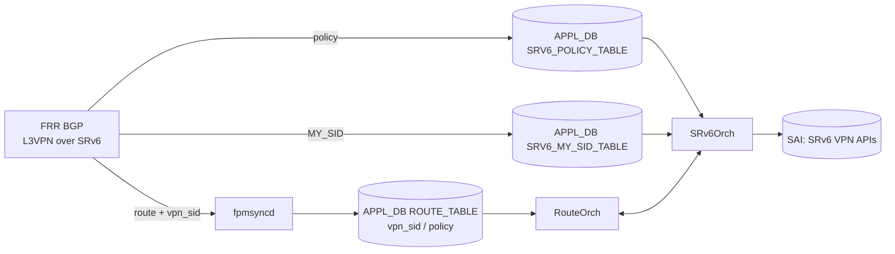

<!-- topics-tip -->
!!! tip "Topics で読み物として読む"
    この HLD は実装詳細を含みます。機能の概念・設定・運用を読み物として読みたい場合は [Topics 04 章: VRF / ECMP / 経路選択](../topics/04-vrf-ecmp/index.md) を参照。
<!-- /topics-tip -->

!!! success "裏取りステータス: Code-verified（基本構成のみ）"
    現行 master の `sonic-swss/orchagent/srv6orch.cpp` に `srv6_prefix_agg_id_table_` (1721-)、`createSrv6Vpn`/`deleteSrv6Vpn` (1025/776)、`vpn_sid` 管理が実装され、HLD の Prefix AGG_ID / VPN encap mapper 設計と一致。SRV6_MY_SID テーブル管理も APP_SRV6_MY_SID_TABLE_NAME / CFG_SRV6_MY_SID_TABLE_NAME 経由で確認済み。SRV6_POLICY_TABLE のキー名そのものは見えなかったが、内部データ構造として agg_id/vpn_sid が存在することを確認（verified at: 2026-05-09）。

# SRv6 VPN（L3VPN over SRv6 と SRv6 Policy）

## 読者が知りたいこと

- [SONiC](../reference/glossary.md#term-sonic) で **[SRv6](../reference/glossary.md#term-srv6) L3VPN を [BGP](../reference/glossary.md#term-bgp)-VPN AF と組み合わせて動かす** ための data 構造はどこにあるか
- **[APPL_DB](../reference/glossary.md#term-appl_db) の新規/拡張テーブル**（`SRV6_POLICY_TABLE` / `ROUTE_TABLE.vpn_sid` / `SRV6_MY_SID_TABLE`）は何のために存在するか
- **[SAI](../reference/glossary.md#term-sai) / SWSS / SONiC / [FRR](../reference/glossary.md#term-frr)** のどこをいじっているのか
- **既知の workaround**（[zebra](../reference/glossary.md#term-zebra) が MY_SID を netlink で渡さない問題）と、どんな構成で本機能が動くのか

## 1. 全体像と適用シナリオ

Alibaba がエッジルータ用ホワイトボックス SONiC で運用している実機ベースの提案 [HLD](../reference/glossary.md#term-hld)。FRR 8.4+ を前提に、**SRv6 を network programming framework** として VPN 識別と policy ベース steering を実装する[^1]。



変更領域:

- **FRR**: [VRF](../reference/glossary.md#term-vrf) route leak / BGP advertise delay / conditional advertisement / SRv6 Policy
- **SAI**: SRv6 VPN 用 SAI（Cisco 提案の SAI 拡張）
- **SWSS / SONiC**: 新規 `SRV6_POLICY_TABLE`、`ROUTE_TABLE.vpn_sid` / `policy` フィールド、`SRv6Orch` / `RouteOrch` 拡張

## 2. APPL_DB スキーマ

新規・拡張のみを列挙。[CONFIG_DB](../reference/glossary.md#term-config_db) / SONiC CLI / [YANG](../reference/glossary.md#term-yang) は本 HLD では追加されない（FRR / コントローラから APPL_DB に直接書く）。

### SRV6_POLICY_TABLE（新規）

```text
SRV6_POLICY_TABLE|<policy_name>
    segment = comma-list of SRV6_SID_LIST.key
    weight  = comma-list of int
```

### ROUTE_TABLE 拡張

```text
ROUTE_TABLE:<VRF>:<prefix>
    nexthop    = ...
    intf       = ...
    vni_label  = ...
    router_mac = ...
    blackhole  = 0|1
    segment    = SRV6_SID_LIST.key      ; OPTIONAL
    seg_src    = address                ; OPTIONAL
    vpn_sid    = vpn_sid                ; NEW: BGP 学習時の VPN SID
    policy     = comma-list             ; NEW: 適用する SRv6 policy
```

### SRV6_MY_SID_TABLE

```text
SRV6_MY_SID_TABLE:<block_len>:<node_len>:<func_len>:<arg_len>:<ipv6address>
    action  = uN | End.X | End.DT46 | End.B6.ENCAP | ...
    vrf     = <vrf>             ; END.DT46 用
    adj     = comma-list ip     ; END.X 用
    segment = SRV6_SID_LIST.key ; END.B6.ENCAP 用
    source  = address           ; END.B6.ENCAP 用
```

## 3. 制御フロー上の工夫

### Prefix AGG_ID による encap mapper

SRv6 VPN ルート追加時、`SRv6Orch` は `vpn_sid` 付き BGP NH 用の SRv6 トンネルを必要に応じて作成し、**encap mapper** で参照する。Mapper のキーは **Prefix AGG_ID** で、同一 NH を共有する複数 VPN ルートで encap 情報を集約する。これにより VPN prefix 数に対する SAI オブジェクト数を抑える。

### Anycast MY_SID と nexthop id

Alibaba 運用では **anycast routes を MY_SID として使う** ことで BGP NH 収束時のアウトを抑える。FRR zebra は `SRV6_MY_SID` をカーネルに直接書くため、netlink 経由で [fpmsyncd](../reference/glossary.md#term-fpmsyncd) に流れない既知問題があり、本 HLD で workaround を導入している[^1]。`End.X` action の nexthop id 処理も `srv6orch` に追加。

### Segment list 最適化

セグメントリスト先頭 SID が MY_SID（action=End.X）に一致するとき、`SAI_SRV6_SIDLIST_ATTR_NEXT_HOP_ID` を設定し、`SAI_SRV6_SIDLIST_ATTR_SEGMENT_LIST` から先頭 SID を除外する[^1]。

## 4. 設定例

SONiC 側は CONFIG_DB を触らない。FRR ([vtysh](../reference/glossary.md#term-vtysh)) で設定する。

```bash
# FRR 側 (vtysh) - 概念的な L3VPN over SRv6 設定
configure terminal
router bgp 65001
 segment-routing srv6
  locator loc1
 address-family ipv4 vpn
  neighbor 10.0.0.1 activate
  rd vpn export 65001:1
  rt vpn both 65001:1
```

完全な FRR 構文は本 HLD では詳述されず、**FRR 8.4+ の SRv6 VPN ガイドを参照** する必要がある。

## 5. 制限事項

- FRR **8.4 以上** が必要。SONiC 採用 FRR バージョンと整合させる
- FRR が `SRV6_MY_SID` を netlink で fpmsyncd に渡せない問題を回避する **anycast route ハック** が必要[^1]
- **SAI 側で SRv6 VPN 拡張がプラットフォームでサポート** されている必要がある（未対応プラットフォームでは動かない）
- 提案段階の HLD。現行 master 取り込み状況は別途裏取り

## 6. 干渉する機能

- **SRv6 Static Configuration HLD**: CONFIG_DB の `SRV6_MY_LOCATORS` / `SRV6_MY_SIDS` を [bgpcfgd](../reference/glossary.md#term-bgpcfgd) 経由で投入する別経路。本ページの BGP 学習経路と組み合わせて使う
- **VRF / VRF leaking**: FRR の VRF route leak が前提
- **BGP PIC**: FRR 側 PIC が無いときの workaround として anycast MY_SID を使う、と HLD で記述あり[^1]

## 7. トラブルシューティング

- VPN ルートが [ASIC](../reference/glossary.md#term-asic) に積まれない → APPL_DB `ROUTE_TABLE:<VRF>:<prefix>` の `vpn_sid` を確認
- SRv6 トンネルが作られない → `SRv6Orch` ログで encap mapper / Prefix AGG_ID 生成を確認
- MY_SID 削除がうまくいかない → anycast route ハック workaround が効いているか、fpmsyncd ログで route delete を確認

### コマンド例

SRv6 L3VPN (VPNv4/VPNv6 over SRv6) の状態を確認する。

```bash
docker exec bgp vtysh -c 'show bgp ipv4 vpn' | head
docker exec bgp vtysh -c 'show bgp ipv6 vpn' | head
show srv6 sid
```

## 8. 次に読む

- Topics: [SRv6 / MPLS 概念](../topics/17-srv6-mpls/concept.md), [SRv6 / MPLS アーキテクチャ](../topics/17-srv6-mpls/architecture.md), [SRv6 / MPLS 内部実装](../topics/17-srv6-mpls/internals.md)
- 関連 HLD: [SRv6 SID L3 Adjacency](srv6-sid-l3adj.md), [SRv6 over IPv6 HLD](segment-routing-over-ipv6-srv6-hld.md), [Static Configuration of SRv6](static-configuration-of-srv6-in-sonic-hld.md), [SONiC uSID](sonic-usid.md)

## 引用元

[^1]: `sonic-net/SONiC` `doc/srv6/srv6_vpn.md` @ `49bab5b5ff0e924f1ea52b3d9db0dfa4191a7c06`

<!-- topics-back-ref -->
## 関連 Topics

- [Topics: SRv6 / MPLS / Path Tracing](../topics/17-srv6-mpls/index.md)

<!-- /topics-back-ref -->

<!-- glossary-links-injected: d62d2c91ba87 -->
