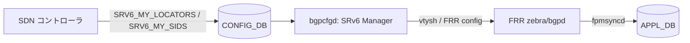

<!-- topics-tip -->
!!! tip "Topics で読み物として読む"
    この HLD は実装詳細を含みます。機能の概念・設定・運用を読み物として読みたい場合は [Topics 04 章: VRF / ECMP / 経路選択](../topics/04-vrf-ecmp/index.md) を参照。
<!-- /topics-tip -->

!!! success "裏取りステータス: Code-verified"
    sonic-buildimage `src/sonic-bgpcfgd/bgpcfgd/managers_srv6.py` L12 `SRV6_MY_SIDS_TABLE_NAME`、L14 `class SRv6Mgr(Manager)`、L37 `locators_set_handler` / L56 `sids_set_handler`（locator 不在時に `SRV6_MY_LOCATORS` を subscribe して deferred 解決する経路を含む）を確認。`src/sonic-bgpcfgd/bgpcfgd/main.py` L30 で `from .managers_srv6 import SRv6Mgr` を確認。`src/sonic-frr-mgmt-framework/frrcfgd/frrcfgd.py` L121 で `'SRV6_MY_LOCATORS': ['zebra']` / L123 で `'SRV6_MY_SIDS': ['mgmtd']` のターゲット daemon 設定、L2732 SRV6_MY_LOCATORS handler、L2751-2768 SRV6_MY_SIDS handler で `vtysh -c "segment-routing" -c "srv6" -c "static-sids" -c "sid {} locator {} behavior {} vrf {}"` の vtysh コマンドラインを生成する経路を確認。YANG は sonic-yang-models `yang-models/sonic-srv6.yang` の `SRV6_MY_LOCATORS` / `SRV6_MY_SIDS` リスト定義を確認、`Configuration.md` L3281-3285 で SRv6 テーブルが正式に文書化されていることを確認（verified at: 2026-05-09）。

# SRv6 Static SID/Locator 設定（CONFIG_DB → bgpcfgd → FRR）

## 概要

[SRv6](../reference/glossary.md#term-srv6) SDN を [BGP](../reference/glossary.md#term-bgp) に頼らず構築するシナリオ向けに、[SONiC](../reference/glossary.md#term-sonic) の [CONFIG_DB](../reference/glossary.md#term-config_db) から SRv6 ロケータと local SID を **静的に** 投入する仕組みを定義する。BGP signaling を使わない SDN コントローラ運用を想定している。

既存の SONiC では [FRR](../reference/glossary.md#term-frr) が SRv6 関連テーブルを [APPL_DB](../reference/glossary.md#term-appl_db) に書く経路（`fpmsyncd` 経由）はあるが、CONFIG_DB から SRv6 そのものを構成する経路がなかった。本機能は `bgpcfgd` に **SRv6 Manager** モジュールを追加し、2 つの新規 CONFIG_DB テーブル `SRV6_MY_LOCATORS` / `SRV6_MY_SIDS` を購読して FRR の `segment-routing srv6` config に変換する[^1]。

なお `frrcfgd` 側にも SRv6 を FRR にプログラムする経路は別途存在するが、そちらは BGP で SID を伝搬するシナリオ向けで、本ページの仕組みとはユースケースが異なる（コントローラはどちらかを選択する）[^1]。

## 動作仕様

### モジュール構成



### CONFIG_DB スキーマ

#### SRV6_MY_LOCATORS

ロケータ（block + node-id 部）の定義。キーはロケータ名、値は IPv6 プレフィクスとビット長。`block_len` / `node_len` / `func_len` / `arg_len` は省略時のデフォルトが 32 / 16 / 16 / 0 で、`vrf` 省略時は `default`[^1]。

```text
key = SRV6_MY_LOCATORS|locator_name
prefix     = ipv6 address    ; ロケータプレフィクス（SID 共通の上位ビット）
block_len  = uint            ; default 32
node_len   = uint            ; default 16
func_len   = uint            ; default 16
arg_len    = uint            ; default 0
vrf        = VRF_TABLE.key   ; default "default"
```

#### SRV6_MY_SIDS

local SID 定義と behavior 割り当て。キーは `locator|ip_prefix` の複合キーで、SID プレフィクス（uSID 上での圧縮形式を含む）と動作を紐付ける[^1]。

```text
key = SRV6_MY_SIDS|locator|ip_prefix
action          = uN | uDT46 | uA       ; default uN
decap_dscp_mode = pipe | uniform        ; mandatory
decap_vrf       = VRF_TABLE.key         ; uDT4/uDT46/uDT6 のみ、default "default"
interface       = string                ; uA 必須
adj             = ipv6 address          ; uA 任意（省略時は interface から解決）
```

サポート behavior（[HLD](../reference/glossary.md#term-hld) 時点）は次の 3 種類。

| Alias  | Meaning                  |
|--------|--------------------------|
| `uN`   | End with NEXT-CSID（uSID transit） |
| `uDT46`| End.DT46 with CSID（VPN decap, IPv4/IPv6 共通） |
| `uA`   | End.X with NEXT-CSID（隣接ノード向け）            |

### bgpcfgd によるコンパイル

#### ロケータ

CONFIG_DB の `SRV6_MY_LOCATORS` エントリは、FRR 側の `segment-routing > srv6 > locators > locator <name>` ブロックに変換される。`prefix` は HLD 上 `block_len + node_len` を `/<bits>` に詰める形でセットされる（例: `block_len=32, node_len=16` → `/48`）[^1]。

#### static-sids

`SRV6_MY_SIDS` エントリは FRR の `static-sids` ブロックに変換される。`uA` の場合は `interface` と `nexthop` がそのまま付与される。

```text
segment-routing
  srv6
    locators
      locator loc1
        prefix fcbb:bbbb:20::/48 block-len 32 node-len 32 func-bits 16
        behavior usid
      locator loc2
        prefix fcbb:bbbb:21::/48 block-len 32 node-len 16 func-bits 16
        behavior usid
    static-sids
      sid fcbb:bbbb:20::/48        locator loc1 behavior uN
      sid fcbb:bbbb:20:f1::/64     locator loc1 behavior uDT46 vrf Vrf1
      sid fcbb:bbbb:21::/48        locator loc2 behavior uN
      sid fcbb:bbbb:21:fe24::/64   locator loc2 behavior uA interface Ethernet24 nexthop 2001:db8:4:501::5
      sid fcbb:bbbb:fe28::/48      locator loc2 behavior uA interface Ethernet28
```

<!-- evidence:
source: sonic-net/SONiC/doc/srv6/srv6_static_config_hld.md#L221-L290 (sha: 49bab5b5ff0e924f1ea52b3d9db0dfa4191a7c06)
excerpt: |
  Bgpcfgd will compile the following configuration in FRR:
  segment-routing
    srv6
      locators
        locator loc1
          prefix fcbb:bbbb:20::/48 block-len 32 node-len 32 func-bits 16
          behavior usid
      static-sids
        sid fcbb:bbbb:20:f1::/64 locator loc1 behavior uDT46 vrf Vrf1
        sid fcbb:bbbb:21:fe24::/64 locator loc2 behavior uA interface Ethernet24 nexthop 2001:db8:4:501::5
reasoning: HLD 3.2.1 / 3.2.2 セクションのコンパイル例。CONFIG_DB エントリと FRR config の対応関係の根拠。
-->

<!-- evidence-rendered:start -->
??? note "📋 検証エビデンス: sonic-net/SONiC/doc/srv6/srv6_static_config_hld.md#L221-L290 (sha: 49bab5b5ff0e924f1ea52b3d9db0dfa4191a7c06)"

    **出典**:

    `sonic-net/SONiC/doc/srv6/srv6_static_config_hld.md#L221-L290 (sha: 49bab5b5ff0e924f1ea52b3d9db0dfa4191a7c06)`

    **抜粋**:

    ```text
    Bgpcfgd will compile the following configuration in FRR:
    segment-routing
      srv6
        locators
          locator loc1
            prefix fcbb:bbbb:20::/48 block-len 32 node-len 32 func-bits 16
            behavior usid
        static-sids
          sid fcbb:bbbb:20:f1::/64 locator loc1 behavior uDT46 vrf Vrf1
          sid fcbb:bbbb:21:fe24::/64 locator loc2 behavior uA interface Ethernet24 nexthop 2001:db8:4:501::5
    ```

    **判断根拠**: HLD 3.2.1 / 3.2.2 セクションのコンパイル例。CONFIG_DB エントリと FRR config の対応関係の根拠。

<!-- evidence-rendered:end -->

### バリデーション

`SRv6 Manager` は CONFIG_DB エントリを FRR に投入する前にバリデーションする。`action` フィールド未指定、未サポート action、必須フィールド欠落のエントリは syslog に出すだけで FRR には反映されない[^1]。

### Warm Boot

HLD は「planned warm reboot で SRv6 設定が保持される」要件を立てているのみで、具体的な保存・復元シーケンスは記述していない[^1]。

## 設定

### 関連する CONFIG_DB

| Table | Key | 説明 |
|-------|-----|------|
| `SRV6_MY_LOCATORS` | `<locator_name>` | ロケータプレフィクスとビット長分割 |
| `SRV6_MY_SIDS` | `<locator>|<ip_prefix>` | local SID と behavior（uN / uDT46 / uA） |

### 関連する CLI

HLD には新規 SONiC CLI（`config srv6 ...` 等）の追加記述はない。SDN コントローラから直接 CONFIG_DB に書き込む運用が想定されている。

### 関連する YANG

`sonic-srv6` モジュールが新規追加され、上記 2 テーブルを反映する。HLD には簡略化された tree が示されている[^1]。

### 設定例

```bash
sonic-cfggen -a '{
  "SRV6_MY_LOCATORS": {
    "loc2": {"prefix": "FCBB:BBBB:21::"}
  },
  "SRV6_MY_SIDS": {
    "loc2|FCBB:BBBB:21::/48": {"action": "uN", "decap_dscp_mode": "pipe"},
    "loc2|FCBB:BBBB:21:FE24::/64": {
      "action": "uA",
      "decap_dscp_mode": "pipe",
      "interface": "Ethernet24",
      "adj": "2001:db8:4:501::5"
    }
  }
}' --write-to-db
```

## 制限事項

- HLD 時点でサポートされる behavior は `uN` / `uDT46` / `uA` のみ。`uDT4` / `uDT6` 単独や `End.B6.Encaps` などは未サポート。
- FRR 側に PR#16894 の `static-sids` CLI が必要。古い FRR バージョンでは投入できない。
- `bgpcfgd` 経路と `frrcfgd` 経路の二重設定は想定されていない（コントローラはどちらかに統一する）。

## 干渉する機能

- **[fpmsyncd](../reference/glossary.md#term-fpmsyncd) / SRV6_MY_SID_TABLE (APPL_DB)**: FRR は今回投入された static-sids を最終的に APPL_DB の SRv6 関連テーブルに書き出すため、[orchagent](../reference/glossary.md#term-orchagent) / [SAI](../reference/glossary.md#term-sai) 側の SRv6 サポートが前提となる。
- **[VRF](../reference/glossary.md#term-vrf)**: `decap_vrf` / `vrf` 引数は `VRF_TABLE` に該当キーが存在することが前提。
- **BGP SRv6 (frrcfgd 経路)**: 同一ノードで BGP signaling 由来の SID と本機能の static SID が重複しないよう、コントローラ側で名前空間を整理する必要がある。

## トラブルシューティング

- 設定が FRR に反映されない場合、まず syslog で `bgpcfgd` の SRv6 Manager がバリデーションエラーを出していないか確認する。
- FRR 側の取り込み状況は `vtysh -c 'show running-config' | grep -A20 srv6` で確認する。
- APPL_DB に SID が出ていない場合は FRR バージョンと PR#16894 の有無を疑う。

### コマンド例

static SRv6 SID / locator 設定の反映を確認する。

```bash
show srv6 sid
show srv6 locator
sonic-cfggen -d -v 'SRV6_MY_SIDS'
```

## 引用元

[^1]: `sonic-net/SONiC` `doc/srv6/srv6_static_config_hld.md` @ `49bab5b5ff0e924f1ea52b3d9db0dfa4191a7c06`

<!-- topics-back-ref -->
## 関連 Topics

- [Topics: SRv6 / MPLS / Path Tracing](../topics/17-srv6-mpls/index.md)

<!-- /topics-back-ref -->

<!-- glossary-links-injected: 8ba32e5aa69d -->
