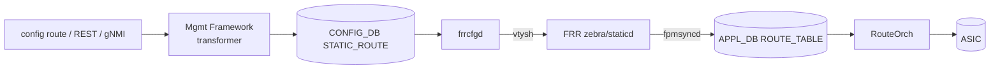

<!-- topics-tip -->
!!! tip "Topics で読み物として読む"
    この HLD は実装詳細を含みます。機能の概念・設定・運用を読み物として読みたい場合は [Topics 04 章: VRF / ECMP / 経路選択](../topics/04-vrf-ecmp/index.md) を参照。
<!-- /topics-tip -->

!!! success "裏取りステータス: Code-verified（基本構成のみ）"
    現行 master の `sonic-buildimage/src/sonic-frr-mgmt-framework/frrcfgd/frrcfgd.py` で STATIC_ROUTE 監視 (`'STATIC_ROUTE': ['mgmtd']`, `nexthop/ifname/distance/nexthop-vrf/blackhole/track` フィールド) を確認、staticd.db.conf.j2 テンプレートで実 staticd 設定生成。`sonic-utilities/config/main.py` に `config route add/del`、テストでも STATIC_ROUTE への書き込みを検証。HLD は古いが現行実装と整合（verified at: 2026-05-09）。

# Static IP Route 設定（STATIC_ROUTE → frrcfgd → FRR）

## 概要

CLI / REST / [gNMI](../reference/glossary.md#term-gnmi) から **non-management な static route** を SONiC 管理フレームワーク経由で投入する設計。[CONFIG_DB](../reference/glossary.md#term-config_db) の `STATIC_ROUTE` テーブルに書き込み、`frrcfgd` がそれを vtysh 経由で [FRR](../reference/glossary.md#term-frr) に流し込む形を取る[^1]。[VRF](../reference/glossary.md#term-vrf) 間の route leak（`nexthop-vrf`）と blackhole route も同じテーブルで表現する。

## 動作仕様

### モジュール構成



### CONFIG_DB スキーマ

```text
STATIC_ROUTE|<vrf_name>|<prefix>
    nexthop      = comma-list of IP    ; 0.0.0.0 を埋め草に使う
    ifname       = comma-list of ifname ; "" を埋め草に使う
    distance     = comma-list of int   ; default 0
    nexthop-vrf  = comma-list of VRF    ; route leak 用、空文字列で同 VRF
    blackhole    = comma-list of bool   ; default false
```

各カンマリストの **同一インデックス** が 1 つの next-hop set を表す。プレフィクスと next-hop の AF は揃える必要がある[^1]。

例: 同じ prefix `10.11.1.0/24` に 3 つの next-hop（うち 1 つは VRF leak）を設定するエントリ：

```text
key  = STATIC_ROUTE|Vrf-RED|10.11.1.0/24
nexthop      = 0.0.0.0,    2.2.2.1, 0.0.0.0
ifname       = Ethernet0,  "",      Ethernet12
distance     = 10,         0,       30
nexthop-vrf  = default,    "",      Vrf-GREEN
```

Blackhole 例：

```text
key       = STATIC_ROUTE|default|10.12.11.0/24
nexthop   = 2.2.2.3, ""
distance  = 10,       40
blackhole = false,    true
```

### NEIGH_RESOLVE_TABLE（APPL_DB）

next-hop が [ARP](../reference/glossary.md#term-arp)/ND 未解決の場合、[orchagent](../reference/glossary.md#term-orchagent) の router/neighbor モジュールが [APPL_DB](../reference/glossary.md#term-appl_db) の `NEIGH_RESOLVE_TABLE` に書き、`nbrmgrd` が解決を起こす[^1]。

### VRF 間の挙動

インタフェースが他 VRF に移動すると、その IF を ifname に持つ静的経路は **inactive** になる（vtysh の running-config と CONFIG_DB の `STATIC_ROUTE` には残る）。元の VRF に戻れば再アクティブ化する。stale エントリの掃除はユーザ責任[^1]。

### YANG マッピング

OpenConfig 側は次のモジュールを使う[^1]：

- `openconfig-network-instance.yang`
- `openconfig-local-routing.yang`
- `openconfig-local-routing-ext.yang`（未対応フィールドや拡張用）

## 設定

### 関連する CONFIG_DB

| Table | 説明 |
|-------|------|
| `STATIC_ROUTE` | VRF + prefix 単位の静的経路定義 |

### 関連する CLI

| Command | 用途 |
|---------|------|
| `config route add prefix <p> nexthop <ip>` | 静的経路追加 |
| `config route del prefix <p> nexthop <ip>` | 削除 |
| `show ip route` / `show ipv6 route` | FRR 経由で経路確認 |

### 関連する YANG

- `openconfig-network-instance` / `openconfig-local-routing`（OpenConfig 標準）
- 拡張は `openconfig-local-routing-ext`

### 設定例

```bash
# 通常の静的経路
sudo config route add prefix 10.11.1.0/24 nexthop 2.2.2.1

# VRF leak 付き
sonic-cfggen -a '{
  "STATIC_ROUTE": {
    "Vrf-RED|10.11.1.0/24": {
      "nexthop":     "0.0.0.0,2.2.2.1,0.0.0.0",
      "ifname":      "Ethernet0,,Ethernet12",
      "distance":    "10,0,30",
      "nexthop-vrf": "default,,Vrf-GREEN"
    }
  }
}' --write-to-db
```

## 制限事項

- next-hop の AF は prefix と同じである必要がある（IPv4 prefix に IPv6 next-hop は不可）。
- インタフェース VRF 移動時の inactive 経路の自動 cleanup は無し（ユーザ責任）[^1]。
- `nexthop` / `ifname` / `distance` / `nexthop-vrf` / `blackhole` のリスト長は同一インデックスで対応関係を持つため、揃える必要がある。
- Warm boot 時の静的経路保持は [HLD](../reference/glossary.md#term-hld) で要件として明記されている[^1]。

## 干渉する機能

- **frrcfgd / FRR staticd**: 本機能の出力先。FRR 側で `staticd` daemon が動いている必要がある。
- **VRF**: route leak 機能はターゲット VRF が事前定義されている必要がある。
- **[fpmsyncd](../reference/glossary.md#term-fpmsyncd) / RouteOrch**: 投入された静的経路は FRR を経由して通常の RIB 経路として APPL_DB に流れる。orchagent / [SAI](../reference/glossary.md#term-sai) 側の特別処理は不要。

## トラブルシューティング

- 静的経路が ASIC に積まれない → `vtysh -c 'show ip route static'` で FRR 側に入っているか確認、`fpmsyncd` のログでエラーがないか確認。
- VRF leak が動かない → `nexthop-vrf` で指定した VRF が VRF テーブルに存在し、対象インタフェースがその VRF にバインドされているかを確認。
- 設定が反映されない → `frrcfgd` が起動しているか、CONFIG_DB の `STATIC_ROUTE` キーフォーマット（`vrf|prefix`）が正しいか確認。

### コマンド例

static route 設定とインストール状況を確認する。

```bash
show ip route static
show ipv6 route static
sonic-cfggen -d -v 'STATIC_ROUTE'
```

## 引用元

[^1]: `sonic-net/SONiC` `doc/static-route/SONiC_static_route_hdl.md` @ `49bab5b5ff0e924f1ea52b3d9db0dfa4191a7c06`

<!-- topics-back-ref -->
## 関連 Topics

- [Topics: VRF / ECMP / RIB-FIB パイプライン](../topics/04-vrf-ecmp/index.md)

<!-- /topics-back-ref -->

<!-- glossary-links-injected: 33284a13dfdc -->
