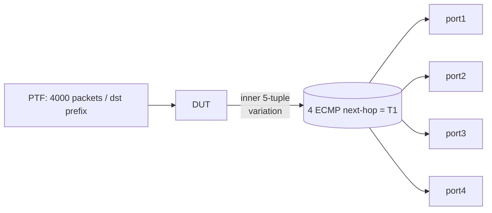

<!-- topics-tip -->
!!! tip "Topics で読み物として読む"
    この HLD は実装詳細を含みます。機能の概念・設定・運用を読み物として読みたい場合は [Topics 04 章: VRF / ECMP / 経路選択](../topics/04-vrf-ecmp/index.md) を参照。
<!-- /topics-tip -->

!!! success "裏取りステータス: code-verified"
    Verifier 2026-05-09: `sonic-swss/orchagent/pbhorch.{cpp,h}` と `sonic-swss/orchagent/pbh/pbhmgr.cpp` を確認。`pbhmgr.cpp:36-42` で `INNER_DST_IPV4` / `INNER_SRC_IPV4` / `INNER_DST_IPV6` / `INNER_SRC_IPV6` / `INNER_L4_DST_PORT` / `INNER_L4_SRC_PORT` / `INNER_IP_PROTOCOL` の `SAI_NATIVE_HASH_FIELD_*` マッピングと VxLAN/NVGRE 用 case が実装済み。CLI は `sonic-utilities/config/plugins/pbh.py` および `utilities_common.helper.get_port_pbh_binding` で取り込み済み。HLD と整合。

# ECMP inner packet hashing テストプラン（PBH 経由の VxLAN/NVGRE 内側 5-tuple ハッシュ）

## 概要

[ECMP](../reference/glossary.md#term-ecmp) nexthop の選択を **outer ヘッダではなく inner パケットの 5-tuple**（src/dst IP、L4 port、IP proto）でハッシュさせる動作を T0 上で検証するテスト[^1]。dynamic Policy Based Hashing (PBH) を使って ECMP ハッシュキーを上書きし、4 種の outer (IPv4/IPv6 × VxLAN/NVGRE) × 2 種の inner (IPv4/IPv6) を網羅する。

## 動作仕様

### PBH 構成[^1]

| 構成要素 | 内容 |
|---------|------|
| PBH table | T0 トポロジの **[VLAN](../reference/glossary.md#term-vlan) 内 PTF ポート**を bind（Up かつ非 [LAG](../reference/glossary.md#term-lag)） |
| hash field | `inner_ip_proto`/`inner_l4_dst_port`/`inner_l4_src_port`/`inner_dst_ipv4`/`inner_src_ipv4`/`inner_dst_ipv6`/`inner_src_ipv6`。L4 port と IP は **symmetric=Yes** |
| hash | 上記 7 フィールドをまとめた `inner_hash` |
| rule | outer encap ごとに 8 ルール（NVGRE × {v4,v6}×{v4,v6} priority=2、VxLAN × {v4,v6}×{v4,v6} priority=1）。action=`SET_ECMP_HASH`、counter=ENABLED |

VxLAN は L4 dst port = `0x3412`（テストプラン固有の定数。ソース [HLD](../reference/glossary.md#term-hld) の PBH 設定値で、標準 VxLAN UDP 4789 とは異なる）をマッチ条件に含める。NVGRE は IP proto/IPv6 next header = `0x2f`[^1]。

### 測定方法[^1]

- ECMP nexthop あたり **1000 パケット** 送出 → 4 nexthop で 4000 packets
- 期待値からの **±25% 偏差以内** で OK
- inner 5-tuple のうち 1 要素ずつ変えた 7 ケース実施

### 逆検証

inner tuple を固定し outer tuple を変えた 4000 packets を流すと **すべて単一 nexthop** に着弾しなければならない。outer がハッシュに混ざっていない確認[^1]。

### symmetric / warm-boot

オプションで symmetric ハッシュ確認（往復で同じ nexthop に landing）[^1]。warm-boot 中に inner ハッシュテストを継続して通常時と同じ分布になることも確認[^1]。

## 制限事項

- T0 トポロジ前提。他トポロジは将来拡張[^1]
- ハッシュ偏差許容は 25%。少サンプルでは偏差が大きいので **1000 packets/nexthop** が下限
- VxLAN dst port は `0x3412` 固定（テストプラン固有の定数）

## 干渉する機能

- **既存 hash_test**: outer 5-tuple ECMP のテスト。本テストは inner 版
- **ECMP / Overlay ECMP**: PBH で書き換えられる ECMP ハッシュキーに依存
- **warm-boot**: トラフィック継続テストの対象

## 引用元

[^1]: [sonic-net/SONiC doc/ecmp/inner_packet_hashing_test_plan.md @ 49bab5b](https://github.com/sonic-net/SONiC/blob/49bab5b5ff0e924f1ea52b3d9db0dfa4191a7c06/doc/ecmp/inner_packet_hashing_test_plan.md)

<!-- glossary-links-injected: 167700005048 -->
