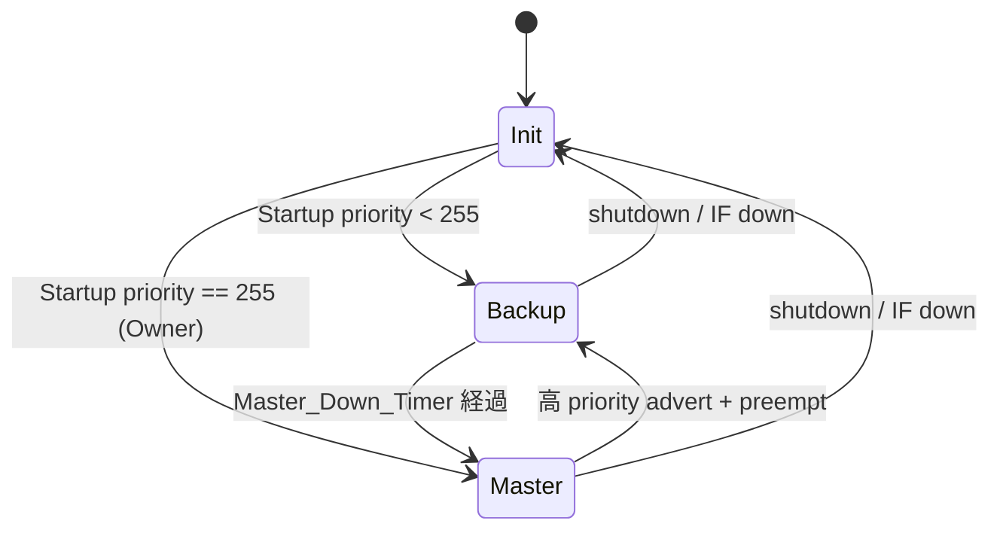
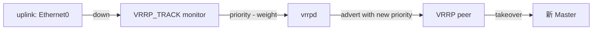

<!-- topics-tip -->
!!! tip "Topics で読み物として読む"
    この HLD は実装詳細を含みます。機能の概念・設定・運用を読み物として読みたい場合は [Topics 04 章: VRF / ECMP / 経路選択](../topics/04-vrf-ecmp/index.md) を参照。
<!-- /topics-tip -->

!!! success "裏取りステータス: code-verified"
    FRR vrrpd: sonic-frr/ にモジュール存在。`sonic-swss-common/common/schema.h:109,380,381` で `CFG_VRRP_TABLE` / `CFG_VRRP6_TABLE` / `APP_VRRP_TABLE_NAME`、`sonic-utilities/config/main.py:6853-6868` / `show/main.py:1278-1313` で CLI、`sonic-mgmt-common/models/yang/openconfig-if-ip.yang:678-716` で `ip-vrrp-tracking` を確認。

# VRRP（FRR vrrpd 連携 / VRRPv2/v3 / uplink tracking）

## なぜ必要か

VRRP (RFC 5798) は **複数ルータが 1 つの仮想ルータ (VIP + VMAC) を演じ**、Master 障害時に Backup が自動引き継ぐ L3 冗長プロトコル。[FRR](../reference/glossary.md#term-frr) には `vrrpd` 実装があり、本 [HLD](../reference/glossary.md#term-hld) はそれを SONiC に取り込む方法を定める[^1]。

主な要件[^1]:

1. **VRRPv2 (IPv4) / VRRPv3 (IPv4, IPv6)**
2. Ethernet / [VLAN](../reference/glossary.md#term-vlan) / sub-interface / [PortChannel](../reference/glossary.md#term-portchannel) 上で動作
3. interface あたり複数 instance（VRID 違い）
4. priority / preempt 設定可能
5. **uplink interface tracking**（uplink down で priority 降下）
6. **non-default [VRF](../reference/glossary.md#term-vrf)** で動作

## どう動くか

### コンテナ配置

`vrrpd` は **VRRP container**（FRR 系 daemon 同居）または **[BGP](../reference/glossary.md#term-bgp) container** 同居の設計が選択肢[^1]。最終案は Rev 0.2 で固まる傾向、実装側で要確認。

### CoPP trap

VRRP advertisement は multicast 224.0.0.18 (IPv4) / ff02::12 (IPv6)。これを CPU に punt するため **[CoPP](../reference/glossary.md#term-copp) trap** が必要[^1]: `vrrp` (IPv4)、`vrrp6` (IPv6)。

### CONFIG_DB スキーマ

```text
VRRP|<interface>|<vrid>
  vip          = "<v4 prefix>,..."
  priority     = 1..254               # 既定 100
  adv_interval = sec               # 秒単位。既定 1 sec
  preempt      = "enabled" | "disabled"
  version      = "2" | "3"

VRRP6|<interface>|<vrid>     # IPv6 版、フィールドは同じ
VRRP_TRACK|<interface>|<vrid>|<tracked_interface>
  weight = 1..254     # tracked down で差し引く weight
```

### 状態機械



### Owner / VMAC

- **Owner**: VIP = 自身の real interface IP のルータ。priority 255 で常に Master[^1]
- **VMAC**: `00-00-5E-00-01-XX` (v2) / `00-00-5E-00-02-XX` (v3 IPv6)、`XX` = VRID

### Uplink tracking

uplink down → 自身の priority を `weight` 分減算[^1]。他ルータが Master になり得る。`VRRP_TRACK` テーブルで関連付け。



### swss 側

`vrrpd` 由来の routing decision (VMAC / VIP) が swss を通って ASIC へ降りる[^1]:

- `INTF_TABLE` に VIP を secondary IP として登録
- VMAC は L2 に install、ASIC の MAC table と route table へ反映

multicast advertisement は host stack 経由。

<!-- evidence:
source: sonic-net/SONiC/doc/vrrp/VRRP_Adaptation_HLD.md#L51-L98 (sha: 49bab5b5ff0e924f1ea52b3d9db0dfa4191a7c06)
excerpt: |
  Support VRRPv2(IPv4) and VRRPv3(IPv4 and IPv6)
  Support VRRP on Ethernet, VLAN, sub-interfaces and PortChannel interfaces
  Support uplink interface tracking feature
  Support VRRP working on non-default VRF
reasoning: 要件 (v2/v3, IF 種別, uplink tracking, VRF) の根拠。
-->

<!-- evidence-rendered:start -->
??? note "📋 検証エビデンス: sonic-net/SONiC/doc/vrrp/VRRP_Adaptation_HLD.md#L51-L98 (sha: 49bab5b5ff0e924f1ea52b3d9db0dfa4191a7c06)"

    **出典**:

    `sonic-net/SONiC/doc/vrrp/VRRP_Adaptation_HLD.md#L51-L98 (sha: 49bab5b5ff0e924f1ea52b3d9db0dfa4191a7c06)`

    **抜粋**:

    ```text
    Support VRRPv2(IPv4) and VRRPv3(IPv4 and IPv6)
    Support VRRP on Ethernet, VLAN, sub-interfaces and PortChannel interfaces
    Support uplink interface tracking feature
    Support VRRP working on non-default VRF
    ```

    **判断根拠**: 要件 (v2/v3, IF 種別, uplink tracking, VRF) の根拠。

<!-- evidence-rendered:end -->

## 設定

### CONFIG_DB

| Table | Key | フィールド |
|-------|-----|------------|
| `VRRP` | `<if>\|<vrid>` | `vip`, `priority`, `adv_interval`, `preempt`, `version` |
| `VRRP6` | 同上 (IPv6) | 同上 |
| `VRRP_TRACK` | `<if>\|<vrid>\|<tracked>` | `weight` |

### CLI（追加想定）

```bash
config interface vrrp add <if> <vrid> [--version 2|3] [--priority N] [--preempt enabled|disabled]
config interface vrrp vip <if> <vrid> <prefix>
config interface vrrp track <if> <vrid> <tracked-if> --weight N

show vrrp
show vrrp <if>
```

具体名は HLD 文章ベース、実装側で確認のこと。

### 設定例

```bash
sudo config interface vrrp add Vlan100 1 --version 3 --priority 200
sudo config interface vrrp vip Vlan100 1 10.0.0.1/24
sudo config interface vrrp track Vlan100 1 Ethernet48 --weight 50
show vrrp
```

## 制限事項

- HLD Rev 0.2 (2024-09)。master 取り込み確認は要
- VRRP version mismatch (v2/v3 混在) はリンクで disable
- **CoPP trap が無いと advertisement が CPU に届かず Master/Backup 判定が崩れる**
- VMAC は ASIC MAC アドレス表を 1 個消費、多 VRID 環境ではリソース注意
- non-default VRF 対応はあるが routing leak / shared interface での挙動は HLD 明示限定
- warm-boot / fast-boot の詳述は実装側で確認

## 干渉する機能

- **FRR / BGP**: 同/別 container かで起動順影響
- **CoPP**: `vrrp` / `vrrp6` trap 必須
- **[portmgrd](../reference/glossary.md#term-portmgrd) / VlanMgrd**: interface state 変化に追従
- **[MCLAG](../reference/glossary.md#term-mclag) / dual-ToR**: VMAC の MAC 学習との相互作用
- **[gNMI](../reference/glossary.md#term-gnmi) / openconfig-vrrp**: 標準モデルへの mapping は本 HLD では未詳述

## トラブルシューティング

```bash
show vrrp
docker exec bgp vtysh -c 'show vrrp'
docker logs bgp 2>&1 | grep -i vrrp
redis-cli -n 4 HGETALL "COPP_TRAP|vrrp"
ip neigh show | head
bridge fdb show | grep -i 5e:00:01
```

## 関連トピック

- [Topics: L2 / VLAN / LAG](../topics/06-l2-vlan-lag/index.md) — VRRP は L3 だが VLAN / PortChannel 上で動く文脈
- [Topics: ACL / CoPP / Mirror](../topics/07-acl-copp-mirror/index.md) — VRRP advertisement の CoPP trap
- [Topics: Dual-ToR](../topics/05-dual-tor/index.md) — 冗長アクティブ-スタンバイの別解
- [bgp-router-id-explicitly-configured](bgp-router-id-explicitly-configured.md)

## 引用元

[^1]: `sonic-net/SONiC` `doc/vrrp/VRRP_Adaptation_HLD.md` @ `49bab5b5ff0e924f1ea52b3d9db0dfa4191a7c06`

<!-- glossary-links-injected: 461c54e12955 -->
