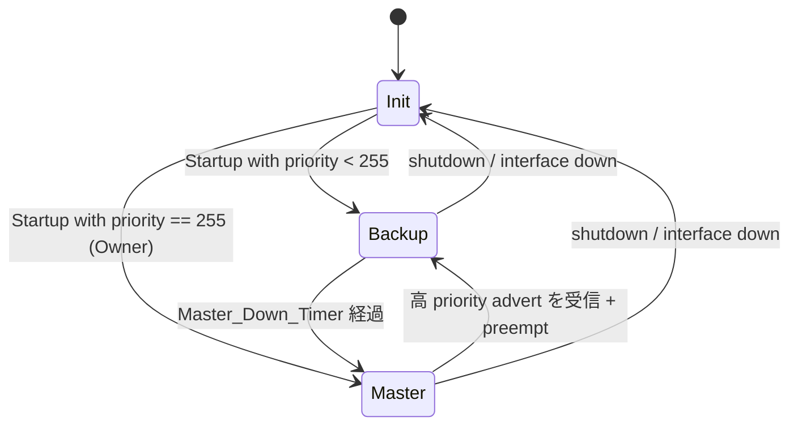
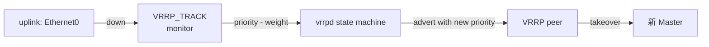

!!! info "裏取りステータス: HLD-only"
    HLD は Rev 0.2 (2024-09)。FRR `vrrpd` の SONiC コンテナ取り込み、`VRRP` / `VRRP6` / `VRRP_TRACK` テーブルの現行 master スキーマ、`config interface vrrp` 系 CLI の sonic-utilities 取り込みは未確認。

# VRRP（FRR vrrpd 連携 / VRRPv2/v3 / uplink tracking）

## 概要

VRRP（RFC 5798）は **複数ルータが 1 つの仮想ルータ（VIP + VMAC）を演じ**、Master に障害が起きたら Backup が自動で引き継ぐ Layer-3 冗長プロトコル。FRR には `vrrpd` 実装があり、本 HLD はそれを SONiC に取り込む方法を定める[^1]。

主な要件[^1]:

1. **VRRPv2 (IPv4) / VRRPv3 (IPv4, IPv6)**
2. **Ethernet / VLAN / sub-interface / PortChannel** 上で動く
3. interface あたり **複数 instance**（VRID 違い）
4. priority / preempt 設定可能
5. **uplink interface tracking**（uplink down で priority 降下）
6. **non-default VRF** で動作

## 動作仕様

### コンテナ配置

`vrrpd` は **VRRP container** に置く（FRR 系の他 daemon と同居）か、**BGP container** に同居する設計が選ばれている[^1]。Rev 0.2 で詳細が固まる傾向で、最終案は実装側で要確認。

### CoPP 設定

VRRP advertisement は **multicast** で 224.0.0.18（IPv4）/ ff02::12（IPv6）に流れる。これらを CPU に punt させるための **CoPP trap** が必要[^1]:

- `vrrp` (IPv4 multicast)
- `vrrp6` (IPv6 multicast)

### CONFIG_DB スキーマ

```
VRRP|<interface>|<vrid>
  vip          = "<v4 prefix>,..."   # VIP の集合
  priority     = 1..254               # 既定 100
  adv_interval = ms
  preempt      = "enabled" | "disabled"
  version      = "2" | "3"

VRRP6|<interface>|<vrid>
  vip = "<v6 prefix>,..."
  ... 同上 ...

VRRP_TRACK|<interface>|<vrid>|<tracked_interface>
  weight = 1..254     # tracked が down のとき差し引く weight
```

### 状態機械（簡易）



### Owner / VMAC

- **VRRP Owner**: VIP = 自身の real interface IP のルータ。Owner は priority 255 で常に Master[^1]
- **VMAC**: `00-00-5E-00-01-XX` (VRRPv2) / `00-00-5E-00-02-XX` (VRRPv3 IPv6) で `XX` = VRID

### Uplink tracking

uplink が down → 自身の priority を `weight` 分 **減算**[^1]。これにより別 router が Master になり得る。`VRRP_TRACK` テーブルで関連付けする。



### swss 側の処理

`vrrpd` 由来の routing decision（VMAC / VIP）が swss を通って ASIC に降りる[^1]:

- `INTF_TABLE` に VIP secondary IP として登録
- VMAC は L2 に install
- ASIC の MAC table と route table が反映される

multicast advertisement は host stack 経由で送受信。

<!-- evidence:
source: sonic-net/SONiC/doc/vrrp/VRRP_Adaptation_HLD.md#L51-L98 (sha: 49bab5b5ff0e924f1ea52b3d9db0dfa4191a7c06)
excerpt: |
  | 0.1 | Aug-16-2023 | Philo-micas | Initial version |
  | 0.2 | Sept-27-2024 | Vijay-Broadcom | Second version |
  Support VRRPv2(IPv4) and VRRPv3(IPv4 and IPv6)
  Support VRRP on Ethernet, VLAN, sub-interfaces and PortChannel interfaces
  Support uplink interface tracking feature
  Support VRRP working on non-default VRF
reasoning: 改訂履歴と要件 (v2/v3, interface 種別, uplink tracking, VRF) の根拠。
-->

### CLI（追加想定）

```
config interface vrrp add <if> <vrid> [--version 2|3] [--priority N] [--preempt enabled|disabled]
config interface vrrp vip <if> <vrid> <prefix>
config interface vrrp track <if> <vrid> <tracked-if> --weight N

show vrrp
show vrrp <if>
```

具体名は HLD 文章ベース。実装側で確認のこと。

## 設定

### 関連する CONFIG_DB

| Table | Key | フィールド |
|-------|-----|------------|
| `VRRP` | `<if>\|<vrid>` | `vip`, `priority`, `adv_interval`, `preempt`, `version` |
| `VRRP6` | 同上 (IPv6) | 同上 |
| `VRRP_TRACK` | `<if>\|<vrid>\|<tracked>` | `weight` |

### 関連する CLI

`config interface vrrp ...`、`show vrrp ...`（具体形は実装側で確認）。

### 設定例

```bash
sudo config interface vrrp add Vlan100 1 --version 3 --priority 200
sudo config interface vrrp vip Vlan100 1 10.0.0.1/24
sudo config interface vrrp track Vlan100 1 Ethernet48 --weight 50

show vrrp
```

## 制限事項

- HLD Rev 0.2 (2024-09) でアクティブ。実装の master 取り込み確認は要
- VRRP version mismatch（v2/v3 混在）はリンクで disable
- multicast 経路: **CoPP trap が無いと advertisement を受信できず Master/Backup 判定が崩れる**
- VMAC は ASIC の MAC アドレス表エントリを 1 個食う。多数の VRID はリソース消費に注意
- VRF: non-default VRF 対応はあるが routing leak / shared interface での挙動は HLD で明示限定
- HLD は warm-boot / fast-boot 影響欄を持つが詳述は実装側で確認

## 干渉する機能

- **FRR / BGP**: 同 container か別 container かで起動順影響
- **CoPP**: trap 設定が必須。`vrrp` / `vrrp6` trap が無いと advertisement が CPU に届かない
- **portmgrd / VlanMgrd**: VRRP は interface に紐づくため、interface state 変化に追従
- **MCLAG / dual-ToR**: VMAC の MAC 学習との相互作用に注意
- **gNMI / openconfig-vrrp**: 標準モデルとの mapping は本 HLD では未詳述

## トラブルシューティング

```bash
# VRRP 状態
show vrrp

# vrrpd ログ
docker exec bgp vtysh -c 'show vrrp'
docker logs bgp 2>&1 | grep -i vrrp

# CoPP の trap が enable か
redis-cli -n 4 HGETALL "COPP_TRAP|vrrp"

# VMAC が install されているか
ip neigh show | head
bridge fdb show | grep -i 5e:00:01
```

## 引用元

[^1]: `sonic-net/SONiC` `doc/vrrp/VRRP_Adaptation_HLD.md` @ `49bab5b5ff0e924f1ea52b3d9db0dfa4191a7c06`
