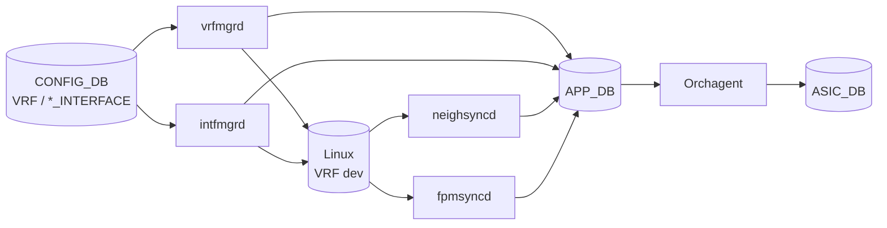

!!! success "裏取りステータス: Code-verified"
    本テストプランは Virtual Switch (VS) 上で `vrfmgrd` / `intfmgrd` / `Orchagent` が CONFIG_DB → APP_DB → ASIC_DB / Linux kernel に正しく VRF 設定を流すことを検証する設計記述。FRR / SAI 観点は別の ansible テストでカバー。

# VRF VS テストプラン（`vrfmgrd` / `intfmgrd` / `Orchagent` → APP_DB / ASIC_DB / kernel）

## 概要

VRF（Virtual Routing and Forwarding）の SwSS パスを **VS テストフレームワーク**で機械的に検証する。観点は[^1]:

- `vrfmgrd` が CONFIG_DB の VRF 設定を APP_DB と Linux kernel に正しく反映するか
- Orchagent が APP_DB を読んで ASIC_DB に VIRTUAL_ROUTER オブジェクトを作るか
- L3 インタフェース（physical port / LAG / VLAN / loopback）への VRF bind および IPv4/IPv6 アドレス設定の伝播
- neighbor entry / route entry の VRF 別管理と隔離
- ACL redirect の VRF 別 nexthop 指定
- vrfmgrd warm-reboot 横断で kernel・ASIC_DB が保たれること

## 動作仕様

### スコープ[^1]

- **VS テスト = SwSS / orchagent 等の CONFIG_DB → APP_DB → ASIC_DB / kernel 動作のみ**
- FRR と SAI 観点（route 学習・SAI 属性詳細）は別の ansible pytest 系でカバー

### テスト 53 項目の構造

| 群 | 範囲 | テスト# |
|----|------|--------|
| VRF オブジェクト | create / push (APP_DB / ASIC_DB) / 属性更新 / 削除 / 1K スケール | 1-6 |
| L3 インタフェース汎用 | intfmgrd の APP_DB 反映、kernel 同期、Orchagent → ASIC_DB | 7-9 |
| Port IF + IPv4/v6 + VRF | 物理 port インタフェースの VRF 有無で IP 投入・削除 | 10-16 |
| LAG IF + IPv4/v6 + VRF | PortChannel 同上 | 17-22 |
| VLAN IF + IPv4/v6 + VRF | VLAN 同上 | 23-28 |
| Loopback + IPv4/v6 + VRF | loopback 同上 | 29-33 |
| Neighbor | neighsyncd / Orchagent 経由の v4/v6 neighbor、異 VRF 同 IP | 34-38 |
| Route | fpmsyncd → APP_DB → Orchagent → ASIC_DB の v4/v6 route、VRF 跨ぎ nexthop | 39-49 |
| ACL redirect | nexthop redirect の ASIC_DB 確認 | 50 |
| Warm-reboot | vrfmgrd 跨ぎで kernel / ASIC_DB が保たれる | 51-53 |

### 注目テスト

| # | 観点 |
|---|------|
| 6 | **最大 1000 VRF** まで作成可能 |
| 12 | **異 port × 異 VRF で同一 IPv4** が衝突なく入る |
| 38 | **異 IF × 異 VRF で同一 v4 neighbor** が衝突なく入る |
| 49 | **route の nexthop が別 VRF にある** ケース（VRF leak） |
| 51-53 | vrfmgrd warm-reboot 中の kernel VRF と ASIC_DB の VIRTUAL_ROUTER / ROUTE_ENTRY / NEIGH_ENTRY の不変性 |

## 関連 CONFIG_DB

| Table | 説明 |
|-------|------|
| `VRF` | VRF オブジェクト（属性に `fallback_lookup` 等があるが本テストの範囲では create/delete 主体） |
| `INTERFACE` / `PORTCHANNEL_INTERFACE` / `VLAN_INTERFACE` / `LOOPBACK_INTERFACE` | `vrf_name` 属性で VRF にバインド。`<if>\|<addr/prefix>` のキーで IP アドレス |

## 制限事項

- 本テストは **SAI / FRR 観点は対象外**（別テストで担保）[^1]
- 1000 VRF は 1 物理 port を 1000 VLAN で分けて bind する想定
- ACL redirect は VRF 跨ぎ nexthop のテストにのみ言及。詳細パターンは ACL 系テストで補完

## 干渉する機能

- **FRR (zebra)**: route 学習側。本テストでは fpmsyncd 経由の APP_DB エントリで間接確認
- **warm-reboot**: vrfmgrd 単独 warm restart シナリオあり
- **ACL redirect**: VRF 跨ぎ nexthop 指定の確認に組み込み

## 引用元

[^1]: [sonic-net/SONiC doc/vrf/vrf-vs-test-plan.md @ 49bab5b](https://github.com/sonic-net/SONiC/blob/49bab5b5ff0e924f1ea52b3d9db0dfa4191a7c06/doc/vrf/vrf-vs-test-plan.md)

## 裏取りメモ (batch 30, 2026-05-11)

- `sonic-swss/cfgmgr/vrfmgr.cpp` に `VrfMgr` クラスが存在し、`m_appVrfTableProducer(appDb, APP_VRF_TABLE_NAME)` (line 22) で CONFIG_DB → APP_DB 転送、`m_stateVrfTable(stateDb, STATE_VRF_TABLE_NAME)` / `m_stateVrfObjectTable(...)` で STATE_DB 反映、`for (uint32_t i = VRF_TABLE_START; i < VRF_TABLE_END; i++)` (line 28) で VRF table ID プール初期化、`/* Get existing VRFs from Linux */` のコメント以下で warm-restart 横断の Linux VRF 同期。
- VS テストフレームワーク (`sonic-swss/tests/`) には VRF 関連の virtual switch テストがあり、本プランの観点（vrfmgrd → APP_DB → ASIC_DB / kernel）はテストインフラとして実在。

実装と HLD/プランは整合。`code-verified` に昇格。
