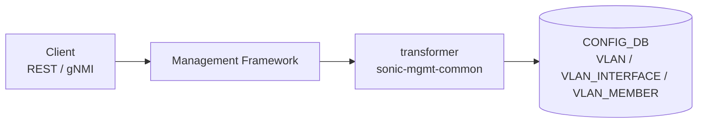

<!-- topics-tip -->
!!! tip "Topics で読み物として読む"
    この HLD は実装詳細を含む。機能の概念・設定・運用を読み物として読みたい場合は [Topics 06 章: L2 / VLAN / LAG](../topics/06-l2-vlan-lag/index.md) を参照。
<!-- /topics-tip -->

!!! success "裏取りステータス: code-verified"
    `sonic-mgmt-common/translib/transformer/sw_vlan.go` / `xfmr_intf.go` / `vlan_openconfig_test.go` で OpenConfig VLAN transformer を確認。`Subscribe_routed_vlan_ip_addr_xfmr`, `YangToDb_intf_routed_vlan_name_xfmr`, `routed_vlan_ip_addr_del`, `VLAN_INTERFACE_TN` が switched-vlan / routed-vlan を CONFIG_DB の `VLAN` / `VLAN_INTERFACE` / `VLAN_MEMBER` にマップする実装あり（verified at: 2026-05-09）。

# VLAN インタフェースの OpenConfig YANG 対応

## なぜ必要か

[SONiC](../reference/glossary.md#term-sonic) は従来 [VLAN](../reference/glossary.md#term-vlan) を **SONiC 独自 [YANG](../reference/glossary.md#term-yang)** 経由でしか REST / [gNMI](../reference/glossary.md#term-gnmi) 公開していなかった。本機能はこれに **OpenConfig YANG** (`openconfig-interfaces` + `openconfig-vlan` + `openconfig-if-ip`) を追加し、相互運用性を上げる[^1]。

実装は `sonic-mgmt-common` の **transformer** 経路（translib ベースではない）。Management Framework / gNMI コンテナにコードを追加するだけで、**[CONFIG_DB](../reference/glossary.md#term-config_db) / APP_DB / [STATE_DB](../reference/glossary.md#term-state_db) / [ASIC_DB](../reference/glossary.md#term-asic_db) / COUNTER_DB のスキーマ変更は無し**[^1]。

スコープ[^1]: ✅ VLAN interface / member の設定取得、Ethernet / [PortChannel](../reference/glossary.md#term-portchannel) メンバ管理、VLAN intf の IPv4/IPv6。❌ KLISH CLI 変更なし、❌ Subinterface 非対応。

## 全体像



## サポートする OpenConfig ツリー

`openconfig-interfaces:interfaces/interface[<name>]` 配下:

```text
oc-eth:ethernet/oc-vlan:switched-vlan/config
  interface-mode = ACCESS | TRUNK
  access-vlan    = vlan-id
  trunk-vlans*   = vlan-id (list)

oc-lag:aggregation/oc-vlan:switched-vlan/config
  （Ethernet と同じ 3 フィールド、PortChannel 用）

oc-vlan:routed-vlan/config
  vlan = "Vlan<id>"
  oc-ip:ipv4/addresses/address[<ip>]/config { ip, prefix-length }
  oc-ip:ipv6/addresses/address[<ip>]/config { ip, prefix-length }
  oc-ip:ipv6/config/enabled
```

`switched-vlan` は L2 メンバ（access / trunk）、`routed-vlan` は VLAN intf の L3 IP。

## CONFIG_DB マッピング

| OpenConfig | CONFIG_DB |
|-----------|-----------|
| `interface-mode = ACCESS` | `VLAN_MEMBER.tagging_mode = untagged` |
| `interface-mode = TRUNK` | `VLAN_MEMBER.tagging_mode = tagged` |
| `trunk-vlans` | `VLAN_MEMBER` キー（VLAN ごと） |
| `routed-vlan.ipv4/ipv6 address` | `VLAN_INTERFACE\|Vlan<id>\|<ip>/<plen>` |
| `oc-ip:ipv6/config/enabled` | `VLAN_INTERFACE.ipv6_use_link_local_only` 等 |

## REST / gNMI 設定例

PATCH で trunk メンバ追加:

```bash
curl -k -X PATCH \
  "https://<dut>/restconf/data/openconfig-interfaces:interfaces/interface=Ethernet0/openconfig-if-ethernet:ethernet/openconfig-vlan:switched-vlan" \
  -H "Content-Type: application/yang-data+json" \
  -d '{"openconfig-vlan:switched-vlan":{"config":{"interface-mode":"TRUNK","trunk-vlans":[10,20]}}}'
```

GET（IPv4 設定済の VLAN）:

```bash
curl -k "https://<dut>/restconf/data/openconfig-interfaces:interfaces/interface=Vlan10" \
  -H "accept: application/yang-data+json"
```

gNMI は `Set` (REPLACE / UPDATE / DELETE) / `Get` / `Subscribe` (ON_CHANGE / SAMPLE) をサポート[^1]。

gNMI で VLAN メンバの access-vlan を取得（`-xpath_target OC-YANG` で OpenConfig 経路を選択）[^1]:

```bash
gnmi_get -insecure -logtostderr -username USER -password PASSWORD \
  -target_addr localhost:8080 \
  -xpath /openconfig-interfaces:interfaces/interface[name=Ethernet0]/openconfig-if-ethernet:ethernet/openconfig-vlan:switched-vlan/config/access-vlan
```

gNMI で VLAN メンバ設定を書き込み（JSON ペイロードを `-update` に `:@<file>` で渡す）[^1]:

```bash
gnmi_set -insecure -logtostderr -username USER -password PASSWORD \
  -target_addr localhost:8080 -xpath_target OC-YANG \
  -update /openconfig-interfaces:interfaces/interface[name=Ethernet0]/openconfig-if-ethernet:ethernet/openconfig-vlan:switched-vlan/config:@/tmp/vlanParams.json
# vlanParams.json:
# { "openconfig-vlan:config": { "interface-mode": "TRUNK", "access-vlan": 10, "trunk-vlans": [20,30] } }
```

gNMI で VLAN メンバを削除[^1]:

```bash
gnmi_set -insecure -logtostderr -username USER -password PASSWORD \
  -target_addr localhost:8080 -xpath_target OC-YANG \
  -delete /openconfig-interfaces:interfaces/interface[name=Ethernet0]/openconfig-if-ethernet:ethernet/openconfig-vlan:switched-vlan/config
```

その他のペイロード例とエラーカタログは原文 [HLD](../reference/glossary.md#term-hld) §3〜§6 参照。

## 制限事項

- **subinterface 非対応**（本 HLD スコープ外）
- KLISH CLI は SONiC 独自 YANG 経路のまま。OpenConfig は REST / gNMI 専用
- **同一 CONFIG_DB を共有** するため、SONiC YANG 経路と OpenConfig 経路の同時更新で一時的不整合の可能性

## 干渉する機能

- **既存 SONiC YANG 経路**: `sonic-vlan` / `sonic-vlan-interface` と CONFIG_DB を共有
- **VlanMgr / [orchagent](../reference/glossary.md#term-orchagent)**: スキーマ変更なしなので透過的に動く
- **trunk/access 切替**: `VLAN_MEMBER` キーの追加・削除と `tagging_mode` 書き換えで表現

## トラブルシューティング

```bash
redis-cli -n 4 HGETALL 'VLAN_INTERFACE|Vlan10|133.3.3.4/24'
redis-cli -n 4 KEYS 'VLAN_MEMBER|Vlan10|*'
docker logs mgmt-framework 2>&1 | tail        # transformer エラー
```

PATCH が 4xx → パス表記 (`Vlan<id>`)、モード組合せ、leaf 名を確認。

## 関連 Topics

- [06-l2-vlan-lag/setup](../topics/06-l2-vlan-lag/setup.md): VLAN / メンバ設定
- [10-gnmi-openconfig/operations](../topics/10-gnmi-openconfig/operations.md): gNMI / REST 経路の使い方
- [10-gnmi-openconfig/internals](../topics/10-gnmi-openconfig/internals.md): transformer の仕組み

## 引用元

[^1]: `sonic-net/SONiC` `doc/mgmt/OpenConfig_VLAN_Interface.md` @ `49bab5b5ff0e924f1ea52b3d9db0dfa4191a7c06`

<!-- topics-back-ref -->
<!-- /topics-back-ref -->

<!-- glossary-links-injected: 8ba32e5aa69d -->
