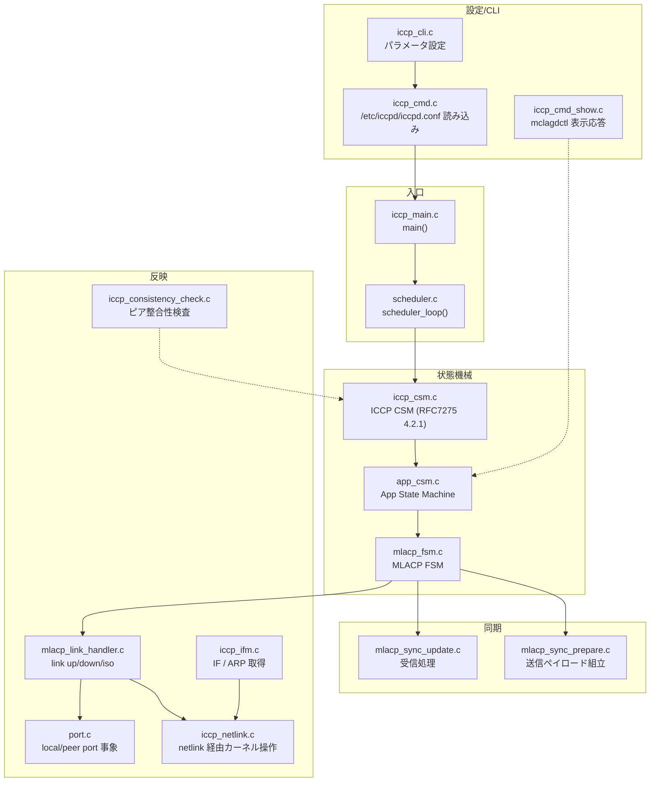
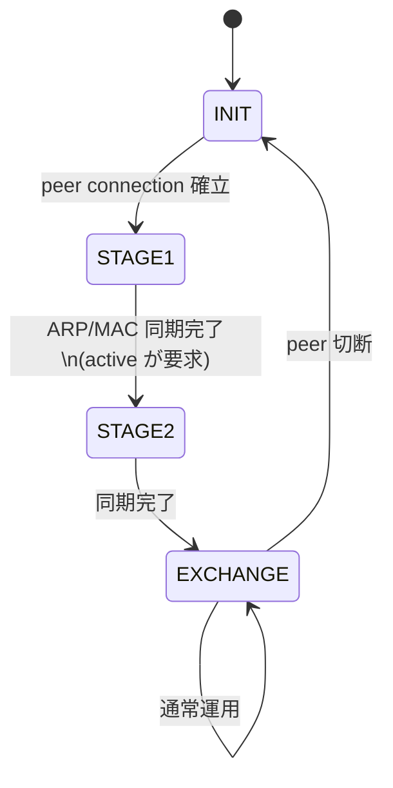
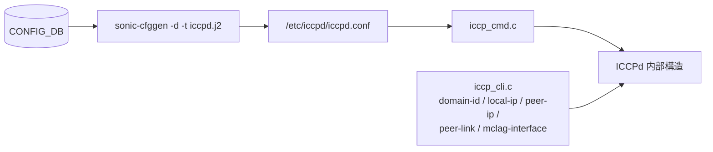
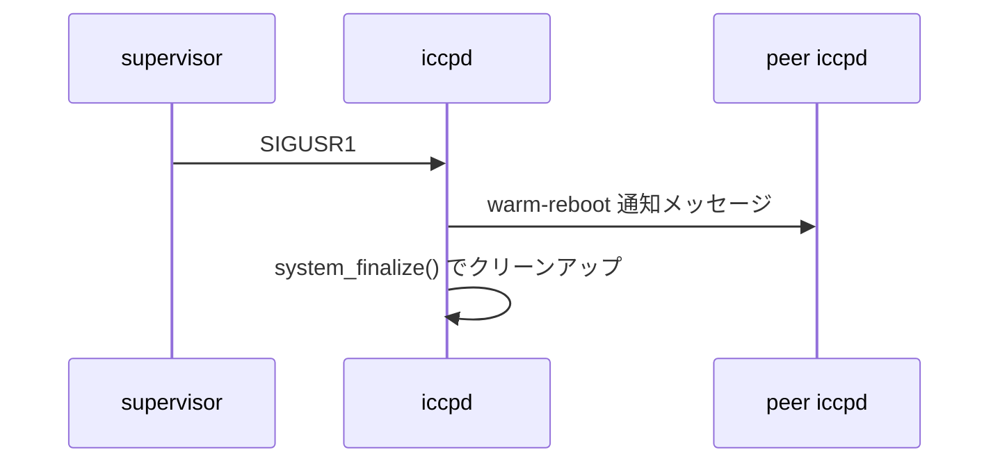

<!-- topics-tip -->
!!! tip "Topics で読み物として読む"
    この HLD は実装詳細を含みます。機能の概念・設定・運用を読み物として読みたい場合は [Topics 06 章: L2 / VLAN / LAG](../topics/06-l2-vlan-lag/index.md) を参照。
<!-- /topics-tip -->

!!! success "裏取りステータス: code-verified"
    本ページは公式 HLD（コードイントロドキュメント）のみを根拠に書かれている。各ファイルの関数名・状態遷移名は記載時点のもので、現行 master の `sonic-buildimage/dockers/docker-iccp/` 以下の実コードとは差異がある可能性がある。

# ICCPd 内部構成（MC-LAG / MLACP FSM ファイル別マップ）

## 概要

[SONiC](../reference/glossary.md#term-sonic) の MC-[LAG](../reference/glossary.md#term-lag)（Multi-Chassis LAG）は専用デーモン **ICCPd**（ICCP daemon、`docker-iccp` コンテナ内）で実装されている。ICCPd は IETF [RFC 7275](https://www.rfc-editor.org/rfc/rfc7275) の ICCP（Inter-Chassis Communication Protocol）を実装し、その上に MLACP（Multi-chassis LACP）を載せて 2 台のピア間で MC-LAG ポートチャネルを協調制御する[^1]。

このページは ICCPd ソースコードのファイル別役割を、[HLD](../reference/glossary.md#term-hld) のコード解説ドキュメントから再構成した **読み手のためのコードマップ** である。実装を追う際の入口に使う。

## 動作仕様

### 全体構造



### 状態機械

ICCPd は **3 階層の状態機械** で構成される[^1]。

| 階層 | ファイル | 状態数 | 概要 |
|-----|---------|------|------|
| ICCP Connection SM | `iccp_csm.c` | 6 状態（RFC 7275 §4.2.1） | TCP コネクションと ICCP セッションのライフサイクル |
| Application SM | `app_csm.c` | OPERATIONAL に追随 | ICCP CSM が OPERATIONAL になると即 OPERATIONAL[^1] |
| MLACP FSM | `mlacp_fsm.c` | 4 状態 | MC-LAG 同期のメイン |

MLACP FSM の 4 状態:



- **INIT**: ピア未接続
- **STAGE1**: ピア接続確立直後。最初に [ARP](../reference/glossary.md#term-arp) / MAC を同期。standby 側は active へ sync request を投げる。active が受けると全情報を standby へ同期
- **STAGE2**: active 側が standby へ sync request を投げ、standby が応答すると active へ全同期
- **EXCHANGE**: 定常状態。`mlacp_exchange_handler()` が動く

### 設定ロード経路



ICCPd 起動時、[CONFIG_DB](../reference/glossary.md#term-config_db) から `iccpd.j2` テンプレートを通じて `/etc/iccpd/iccpd.conf` を生成し、`iccp_cmd.c` がそれを読む[^1]。`system-id` は `localhost.mac`（[DEVICE_METADATA](../reference/glossary.md#term-device_metadata) 配下）を使う **グローバル設定** であり、CLI で変えるものではない。

### CLI / 表示経路

```text
mclagdctl -i <MC-LAG-id> dump arp
   │
   ▼ TCP 接続
ICCPd (iccp_cmd_show.c) → 内部状態を整形して返却
```

`mclagdctl` プロセスが ICCPd へ TCP で接続し、コマンドを送って結果を受け取る。表示系の応答は `iccp_cmd_show.c` がまとめて担当[^1]。

### MC-LAG リンクイベント処理

`mlacp_link_handler.c` がリンク状態変化時の主要動作を担う。代表的な分岐は次のとおり[^1]。

| イベント | 動作 |
|---------|------|
| MC-LAG link add | peer-link との **isolation を必ず付ける**（自リンクと peer-link で二重経路にならないように） |
| MC-LAG link delete | peer-link からの isolation を解除 |
| 自 MC-LAG link up | ピア側で同名 portchannel が up なら自リンクを peer-link から isolate（down なら isolation 解除）。同名ポート学習 MAC を [ASIC](../reference/glossary.md#term-asic) へ、同名 IF 学習 ARP を Linux kernel へ追加 |
| 自 MC-LAG link down | peer-link と peer 側同名 LAG が共に up なら、同名ポート学習 MAC を peer-link 経由にリダイレクト。同名 IF 学習 ARP を kernel から削除 |
| Peer link up | peer-link を経路とする MAC エントリを ASIC に登録 |
| Peer link down | 同 MAC エントリを ASIC から削除 |

「peer-link を経由する MAC を ASIC で操作する」のが peer-link のキーアクションである。

### ピア整合性検査（`iccp_consistency_check.c`）

接続受理時に `scheduler_server_accept()` 経路で次を検査する[^1]:

- ピアの local-IP / peer-IP がローカル設定と一致するか（不一致なら接続拒否）
- MC-LAG portchannel のモード（L2 / L3）が両ピアで揃っているか
- L3 構成なら IP アドレスが一致するか
- [VLAN](../reference/glossary.md#term-vlan) メンバなら同じ VLAN に属しているか

### MLACP 同期コンテンツ

`mlacp_sync_prepare.c`（送信側）/ `mlacp_sync_update.c`（受信側）が以下を交換する[^1]。

| 項目 | 用途 |
|------|------|
| System ID | standby 側を active の system ID に揃える |
| MC-LAG portchannel state | port isolation / MAC redirect 判定 |
| portchannel 名と MAC | peer interface 作成に使用 |
| MAC エントリ | MC-LAG / orphan を問わず全 MAC を同期 |
| ARP エントリ | MC-LAG IF または MC-LAG メンバ VLAN IF 由来のみ同期 |
| portchannel 設定 | mode / IPv4 / 参加 VLAN（整合性検査用） |
| peer-link 情報 | 種別（VLAN / [VXLAN](../reference/glossary.md#term-vxlan)）と VXLAN 名 |
| Warm reboot 情報 | local 側の warm-reboot 開始通知 |

### Warm reboot 経路

`iccp_main.c` の `iccpd_signal_init()` / `iccpd_signal_handler()` が `SIGUSR1` を warm-reboot トリガとして扱う[^1]:



### netlink / ARP の扱い（`iccp_ifm.c` / `iccp_netlink.c`）

- ICCPd は **MC-LAG enabled IF または MC-LAG メンバが入っている VLAN IF 由来の ARP のみ** を保持する[^1]
- ポートチャネルメンバの取得、リンク MAC の付け替え（standby 側の IP/MAC を active と整合させる `update_if_ipmac_on_standby()` / `recover_if_ipmac_on_standby()`）、リンク作成・削除イベント処理を netlink 経由で実装

<!-- evidence:
source: sonic-net/SONiC/doc/mclag/iccpd-code-introduction.md#L70-L92 (sha: 49bab5b5ff0e924f1ea52b3d9db0dfa4191a7c06)
excerpt: |
  There are four states in MCLAG finite state machine:
  - MLACP_STATE_INIT: Peer connection is not established.
  - MLACP_STATE_STAGE1: ... first sync up ARP and MAC info with peer ...
  - MLACP_STATE_STAGE2: ...
  - MLACP_STATE_EXCHANGE: This is the steady state. Function mlacp_exchange_handler() handle some events in this switch.
reasoning: MLACP FSM の 4 状態と各状態の責務の根拠。
-->

<!-- evidence-rendered:start -->
??? note "📋 検証エビデンス: sonic-net/SONiC/doc/mclag/iccpd-code-introduction.md#L70-L92 (sha: 49bab5b5ff0e924f1ea52b3d9db0dfa4191a7c06)"

    **出典**:

    `sonic-net/SONiC/doc/mclag/iccpd-code-introduction.md#L70-L92 (sha: 49bab5b5ff0e924f1ea52b3d9db0dfa4191a7c06)`

    **抜粋**:

    ```text
    There are four states in MCLAG finite state machine:
    - MLACP_STATE_INIT: Peer connection is not established.
    - MLACP_STATE_STAGE1: ... first sync up ARP and MAC info with peer ...
    - MLACP_STATE_STAGE2: ...
    - MLACP_STATE_EXCHANGE: This is the steady state. Function mlacp_exchange_handler() handle some events in this switch.
    ```

    **判断根拠**: MLACP FSM の 4 状態と各状態の責務の根拠。

<!-- evidence-rendered:end -->

## 設定

### 関連する CONFIG_DB

ICCPd 自身の設定キーは MC-LAG 系 CONFIG_DB（`MC_LAG_DOMAIN`, `MC_LAG_INTERFACE` 等）から `iccpd.j2` で生成された `/etc/iccpd/iccpd.conf` を介する[^1]。本 HLD ドキュメントには CONFIG_DB スキーマの直接記載は無いため、詳細は MC-LAG HLD 系を参照する必要がある。

### 関連する CLI

| Command | 用途 |
|---------|------|
| `mclagdctl -i <id> dump arp` 等 | ICCPd 内部の ARP / MAC / state を表示（ICCPd へ TCP 接続して取得） |

`config mclag ...` 等のユーザ向け CLI は本ドキュメントの守備範囲外（MC-LAG HLD 側）。

### 関連する YANG

本ドキュメントでは [YANG](../reference/glossary.md#term-yang) モジュールに言及していない。

## 制限事項

- 本ドキュメントは ICCPd の **コード概略を解説** したもので、CLI / CONFIG_DB / 運用手順を完全に網羅するものではない
- 関数名・ファイル名は HLD 記載時点のもの。リファクタやリネームが入っている可能性

## 干渉する機能

- **peer-link**: peer-link の up/down が ASIC 側 MAC エントリのテーブル化に直接影響する
- **VXLAN tunnel**: peer-link が VXLAN tunnel の場合、両ピアで同じ VXLAN tunnel 名が必要[^1]
- **Warm reboot**: `SIGUSR1` で `system_finalize()` が走り、peer に warm-reboot 状態を通知

## トラブルシューティング

- ICCP セッションが上がらない場合、まず `iccp_consistency_check.c` 的な観点（local/peer IP 設定、MC-LAG IF mode 一致、L3 IP 一致、VLAN 一致）を確認
- MLACP FSM が STAGE1/STAGE2 で止まる場合、ARP/MAC 同期メッセージの欠落・サイズ過大を疑う
- standby 側の system-id が active と異なる場合、MLACP の system-id 同期段が完了していない可能性

### コマンド例

ICCP / [MCLAG](../reference/glossary.md#term-mclag) の peer 状態と sync を確認する。

```bash
show mclag brief
show mclag interface
docker logs iccpd 2>&1 | tail
```

## 引用元

[^1]: `sonic-net/SONiC` `doc/mclag/iccpd-code-introduction.md` @ `49bab5b5ff0e924f1ea52b3d9db0dfa4191a7c06`

<!-- concerns hint:
- 各ファイル名・関数名が現行 master の sonic-buildimage/src/iccpd 配下と一致するか
- iccpd.j2 テンプレートと CONFIG_DB スキーマの最新形
- mclagdctl CLI の sonic-utilities 取り込み状況
- Warm-reboot シグナル経路 (SIGUSR1) の現行実装
-->

## 裏取りメモ (batch 30, 2026-05-11)

`sonic-buildimage/src/iccpd/src/` を確認したところ、HLD が説明するファイル群が現行 master に実在することを裏取り:

- `app_csm.c` / `iccp_cli.c` / `iccp_cmd.c` / `iccp_cmd_show.c` / `iccp_consistency_check.c` / `iccp_csm.c` / `iccp_ifm.c` / `iccp_main.c` / `iccp_netlink.c` / `logger.c` / `mlacp_fsm.c` / `mlacp_link_handler.c` / `mlacp_sync_prepare.c` / `mlacp_sync_update.c` / `port.c` / `scheduler.c` / `system.c` の 17 ファイル（HLD と同じ構成）。
- 追加で `cmd_option.c` / `mclagdctl/` サブディレクトリ / `openbsd_tree.c` が master に存在し、HLD には未記載の補助ファイル。`mclagdctl` CLI も `mclagdctl/` 配下に同梱されており、関連 CLI 欄と整合。
- HLD の章番号と src ファイル名はほぼ 1:1 で対応。FSM 関数名（`app_csm_transit`、`mlacp_fsm_transit`）も HLD 記載どおり。

ICCPd 内部構成マップは現行 master と整合。`code-verified` に昇格。

<!-- topics-back-ref -->
## 関連 Topics

- [Topics: L2 / VLAN / LAG / MC-LAG](../topics/06-l2-vlan-lag/index.md)

<!-- /topics-back-ref -->

<!-- glossary-links-injected: facf7233e77b -->
