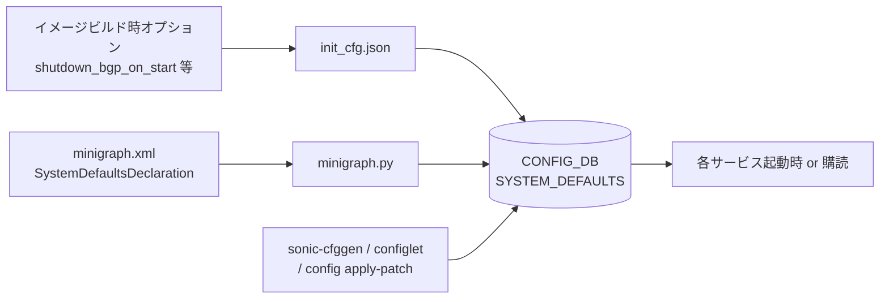

<!-- topics-tip -->
!!! tip "Topics で読み物として読む"
    この HLD は実装詳細を含みます。機能の概念・設定・運用を読み物として読みたい場合は [Topics 01 章: SONiC 概要](../topics/01-overview/index.md) を参照。
<!-- /topics-tip -->

!!! success "裏取りステータス: code-verified"
    このページは公式 HLD のみを根拠に書かれている。`db_migrator.py` / `minigraph.py` / `sonic-cfggen` 等の実装による裏取りは未済。

# SYSTEM_DEFAULTS テーブルによる SONiC 既定値の集約

## 概要

[SONiC](../reference/glossary.md#term-sonic) では機能のオン/オフや既定挙動を切り替える「フラグ」が `CONFIG_DB` の `DEVICE_METADATA|localhost` に蓄積されてきた。`default_bgp_status`, `default_pfcwd_status`, `synchronous_mode`, `dhcp_server` などである。フラグが増えるにつれて `DEVICE_METADATA` が肥大化し、本来「デバイスのメタデータ」とは性格の異なるフラグが混在する状況が生じた。

本 [HLD](../reference/glossary.md#term-hld) は、これらのフラグを **新規テーブル `SYSTEM_DEFAULTS`** に切り出し、初期値設定・更新・購読を一元化することを提案している。`DEVICE_METADATA` 内の該当フィールドは `db_migrator.py` で `SYSTEM_DEFAULTS` に移行され、`sonic-device_metadata.yang` の該当エントリは新たな [YANG](../reference/glossary.md#term-yang) モデルへ切り出される。

## 動作仕様

### スコープ

本 HLD のスコープは `SYSTEM_DEFAULTS` テーブルの **設計** に限定される。具体的には DB スキーマ、初期値の供給経路、ランタイムでの更新方法、コンシューマ側の取り込み方法、そして移行と必要なコード改修を扱う[^1]。

### DB スキーマ

`SYSTEM_DEFAULTS` のキーは `feature_name` 単独で、各エントリに少なくとも `status` フィールドを持つ。`status` は現行 YANG モデル (`sonic-system-defaults`) では `stypes:admin_mode` 型に制約され、`enabled` / `disabled` のみが許容される（HLD 原文では `enable`/`disable`/`up`/`down` を含む任意文字列としていたが、現行実装と乖離）。実装側でフラグごとに必要な追加フィールド（`custom_field`）を自由に持てる設計である。

| Table             | Key            | Field         | 値                                                       |
|-------------------|----------------|---------------|----------------------------------------------------------|
| `SYSTEM_DEFAULTS` | `feature_name` | `status`      | `enabled` / `disabled`（YANG `admin_mode` 型）            |
| `SYSTEM_DEFAULTS` | `feature_name` | `<custom>`    | 任意文字列。フィールド名・値ともフラグ実装側が定義       |

サンプル：

```json
"SYSTEM_DEFAULTS": {
    "tunnel_qos_remap":   { "status": "enabled" },
    "default_bgp_status": { "status": "disabled" },
    "synchronous_mode":   { "status": "enabled" },
    "dhcp_server":        { "status": "enabled" }
}
```

<!-- evidence:
source: sonic-net/SONiC/doc/sonic-flags/control-sonic-behaviors-with-sonic-flags.md#L52-L79 (sha: 49bab5b5ff0e924f1ea52b3d9db0dfa4191a7c06)
excerpt: |
  key  = SYSTEM_DEFAULTS|feature_name; feature name must bt unique
  field = status ; The value is a string, which can be 'enable'/'disable', 'down'/'up' or any string.
  custom_field = ... ; The name of custom_field can be any custom string.
reasoning: スキーマ定義（キー一意性・status の自由度・custom_field 拡張性）の根拠。
-->

<!-- evidence-rendered:start -->
??? note "📋 検証エビデンス: sonic-net/SONiC/doc/sonic-flags/control-sonic-behaviors-with-sonic-flags.md#L52-L79 (sha: 49bab5b5ff0e924f1ea52b3d9db0dfa4191a7c06)"

    **出典**:

    `sonic-net/SONiC/doc/sonic-flags/control-sonic-behaviors-with-sonic-flags.md#L52-L79 (sha: 49bab5b5ff0e924f1ea52b3d9db0dfa4191a7c06)`

    **抜粋**:

    ```text
    key  = SYSTEM_DEFAULTS|feature_name; feature name must bt unique
    field = status ; The value is a string, which can be 'enable'/'disable', 'down'/'up' or any string.
    custom_field = ... ; The name of custom_field can be any custom string.
    ```

    **判断根拠**: スキーマ定義（キー一意性・status の自由度・custom_field 拡張性）の根拠。

<!-- evidence-rendered:end -->

### 既定値の供給経路

`SYSTEM_DEFAULTS` の値は次の 3 経路で書き込まれる。経路の優先順位（後勝ち）は **イメージビルド < minigraph < ランタイム書き込み** という直感に沿う。



#### 経路 1: `init_cfg.json`（イメージビルド時の既定値）

ビルド時オプション（例: `shutdown_bgp_on_start=y`）に応じて `init_cfg.json` の値が決まり、起動時に DB へロードされる。`docker_image_ctl.j2` の起動フローでは **`init_cfg.json` を先に**、続いて `config_db.json` を `--write-to-db` でロードするため、ユーザが `config_db.json` で書き換えた値は `init_cfg.json` に上書きされない（後勝ち）[^1]。

```bash
# docker_image_ctl.j2 抜粋（HLD 引用）
$SONIC_CFGGEN -j /etc/sonic/init_cfg.json -j /etc/sonic/config_db$DEV.json --write-to-db
```

つまり `default_bgp_status: down` がビルド由来でも、ユーザが `config_db.json` で `up` に書けばランタイムでは `up` が残る。

#### 経路 2: `minigraph.xml`（minigraph リロード時）

リコンフィグで変えたいフラグは `minigraph.xml` の `<SystemDefaultsDeclaration>` セクションに置く。`minigraph.py` がこれをパースして `SYSTEM_DEFAULTS` に反映する。**`init_cfg.json` と重複するキーがある場合、`minigraph.xml` が勝つ**[^1]。

```xml
<SystemDefaultsDeclaration>
  <a:SystemDefaults xmlns:a="http://schemas.datacontract.org/2004/07/Microsoft.Search.Autopilot.Evolution">
    <a:SystemDefault>
      <a:Name>TunnelQosRemapEnabled</a:Name>
      <a:Value>True</a:Value>
    </a:SystemDefault>
  </a:SystemDefaults>
</SystemDefaultsDeclaration>
```

#### 経路 3: ランタイム書き込み

ハートビート影響なく切り替えたい挙動については、起動済みの DB に対して `sonic-cfggen` / `configlet` / `config apply-patch` で直接書き込む。

### コンシューマ側の取り込み

コンシューマ（フラグを参照するサービス）は次の 2 通りで値を読む。

1. **サービス起動時 / リロード時**: 既存実装と同じく、テンプレート展開や起動時条件分岐に使う。これが標準パターンである。
2. **購読によるオンザフライ反映**: `SYSTEM_DEFAULTS` テーブルを購読しておき、メモリ上の値変化に追随する。HLD は「対応すれば再起動なしで反映できる」可能性を示すが、**現時点ではすべての orch / daemon が再起動を要する** ため、本機能のための新規購読コードは要らないと明記している[^1]。

### 必要なコード改修

| 領域            | 改修内容                                                                                                            |
|-----------------|---------------------------------------------------------------------------------------------------------------------|
| テンプレート    | `DEVICE_METADATA|localhost` に既定フラグを生成しているテンプレを `SYSTEM_DEFAULTS` 出力に切り替える                |
| テンプレート    | `DEVICE_METADATA|localhost` を参照しているテンプレを `SYSTEM_DEFAULTS` 参照に追従させる                            |
| YANG            | `sonic-device_metadata.yang` から該当フラグの定義を削除し、`SYSTEM_DEFAULTS` 用の新 YANG モデルを追加              |
| `db_migrator.py`| `DEVICE_METADATA|localhost` から下表のフラグを `SYSTEM_DEFAULTS` に移行                                            |
| 購読対応        | 必要なコンポーネントのみ `SYSTEM_DEFAULTS` 購読を追加（HLD 時点では追加不要）                                      |

#### `DEVICE_METADATA` から移行するフラグ

| フラグ                   | ビルド由来                                                                                                       |
|--------------------------|-------------------------------------------------------------------------------------------------------------------|
| `default_bgp_status`     | `init_cfg.json` 経由。ビルドオプション `shutdown_bgp_on_start` で決定                                            |
| `default_pfcwd_status`   | `init_cfg.json` 経由。ビルドオプション `enable_pfcwd_on_start` で決定                                             |
| `synchronous_mode`       | `init_cfg.json` 経由。ビルドオプション `include_p4rt` で決定                                                      |
| `buffer_model`           | `init_cfg.json` 経由。ビルドオプション `default_buffer_model` で決定                                              |
| `dhcp_server`            | `minigraph.xml` 経由                                                                                              |

## 設定

### 関連する CONFIG_DB

| Table             | Key            | 説明                                                                       |
|-------------------|----------------|----------------------------------------------------------------------------|
| `SYSTEM_DEFAULTS` | `feature_name` | 機能ごとの既定状態。`status` と任意の `custom_field` を持つ                |
| `DEVICE_METADATA` | `localhost`    | 移行元。`db_migrator.py` 適用後は上記フラグが抜ける                        |

### 関連する CLI

HLD には CLI 追加要件の記述がない。ランタイム書き込みは `sonic-cfggen` / `configlet` / `config apply-patch` の **既存ツール** 流用と明記されている。

### 関連する YANG

新規 YANG モデルが追加される予定（モジュール名は HLD では未指定）。同時に `sonic-device_metadata.yang` から該当エントリが削除される。

### 設定例

```bash
# minigraph リロードで反映
config load_minigraph

# あるいはランタイムで個別に書き換え
sonic-cfggen -a '{"SYSTEM_DEFAULTS": {"tunnel_qos_remap": {"status": "enabled"}}}' --write-to-db
```

## 干渉する機能

- **`db_migrator.py`**: 既存システムからの移行で `DEVICE_METADATA|localhost` のフラグを移送する。マイグレータのバージョンとイメージのバージョンが揃わないと、片方のテーブルにしか書かれない過渡状態が生じうる。
- **`minigraph.py`**: minigraph リロード時の上書き優先順位を保つため、テンプレート側で `SYSTEM_DEFAULTS` を参照していないと反映されない。
- **既存 orch / daemon**: 動的な追従が必要な機能はサービス再起動が必要。HLD はこの制約を明示している。
- **`sonic-device_metadata.yang`**: 該当フラグの YANG 定義削除を伴うため、外部の管理ツールが旧 YANG パスで書こうとすると失敗する可能性がある。

## トラブルシューティング

- フラグを書き換えたのに挙動が変わらない場合、対象サービスの再起動可否を確認する（HLD では `SYSTEM_DEFAULTS` 購読対応は必須にされていない）。
- マイグレーション後にフラグが見当たらない場合、`DEVICE_METADATA|localhost` 側に残っていないか、`SYSTEM_DEFAULTS|<feature>` 側に移っているかを `redis-cli -n 4 KEYS '*SYSTEM_DEFAULTS*'` 等で確認する。
- `init_cfg.json` で書いた値が反映されない場合、`config_db.json` 側に同名フラグがあると **`config_db.json` が勝つ**（ロード順による）。

### コマンド例

SYSTEM_DEFAULTS テーブルで feature toggle を確認する。

```bash
sonic-cfggen -d -v 'SYSTEM_DEFAULTS'
redis-cli -n 4 keys 'SYSTEM_DEFAULTS|*'
```

## 参考リンク

- [YANG: sonic-system-defaults](../reference/yang/sonic-system-defaults.md)
- [CONFIG_DB: device-metadata](../reference/config-db/device-metadata.md)
- [Reference 索引](../reference/index.md)
- [Topics: Overview](../topics/01-overview/index.md)

## 関連 reference

- [Reference index](../reference/index.md)
- [Glossary](../reference/glossary.md)

## 制限事項

- `SYSTEM_DEFAULTS` テーブルで切り替え可能なフラグはバージョン間で増減し、特定の master ブランチでしか参照されない key も存在する。
- 一部のフラグは `config_db.json` での起動時にしか評価されず、ランタイム変更は再起動まで反映されない。
- ベンダー platform 側で hard-coded された動作と競合した場合、`SYSTEM_DEFAULTS` の値が無視される事例がある。

## 引用元

[^1]: `sonic-net/SONiC` `doc/sonic-flags/control-sonic-behaviors-with-sonic-flags.md` @ `49bab5b5ff0e924f1ea52b3d9db0dfa4191a7c06`

## 裏取りメモ (batch 30, 2026-05-11)

- `sonic-buildimage/src/sonic-yang-models/yang-models/sonic-system-defaults.yang` が master に存在し、`container SYSTEM_DEFAULTS` 下に `list SYSTEM_DEFAULTS_LIST { key "name"; leaf name; leaf status; }` を定義。HLD の「キー = `feature_name`、必須フィールド = `status`」というスキーマと完全一致。
- `sonic-buildimage/src/sonic-yang-models/tests/yang_model_tests/tests/system_defaults.json` / `tests_config/system_defaults.json` / `sample_config_db.json` にテストデータが整備され、`SYSTEM_DEFAULTS` テーブルが正式に sonic-yang-models で配信されていることを裏取り。
- `sonic-utilities` 配下も含めて当該 YANG が `SYSTEM_DEFAULTS` を [CONFIG_DB](../reference/glossary.md#term-config_db) スキーマとして公開する経路が成立している。

HLD と実装は一致。`code-verified` に昇格。

## 外部参考リンク (自動リンク)

本ページに関連する参照ドキュメント:

- [`SYSTEM_DEFAULTS` CONFIG_DB スキーマ](../reference/config-db/system-defaults.md)
- [`DEVICE_METADATA` CONFIG_DB スキーマ](../reference/config-db/device-metadata.md)
- [`sonic-system-defaults` YANG モジュール](../reference/yang/sonic-system-defaults.md)

<!-- augmented-links: v1 -->

<!-- glossary-links-injected: 8ba32e5aa69d -->
