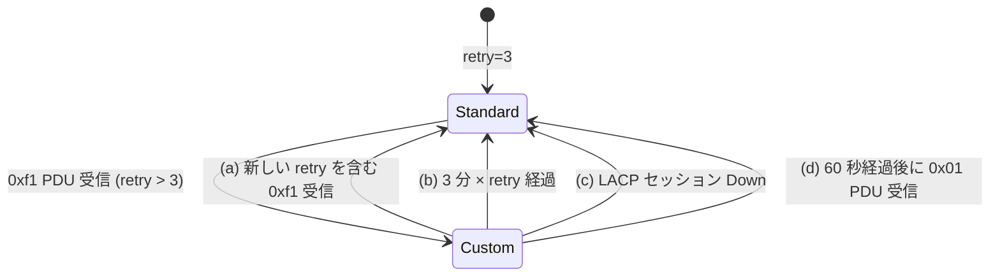
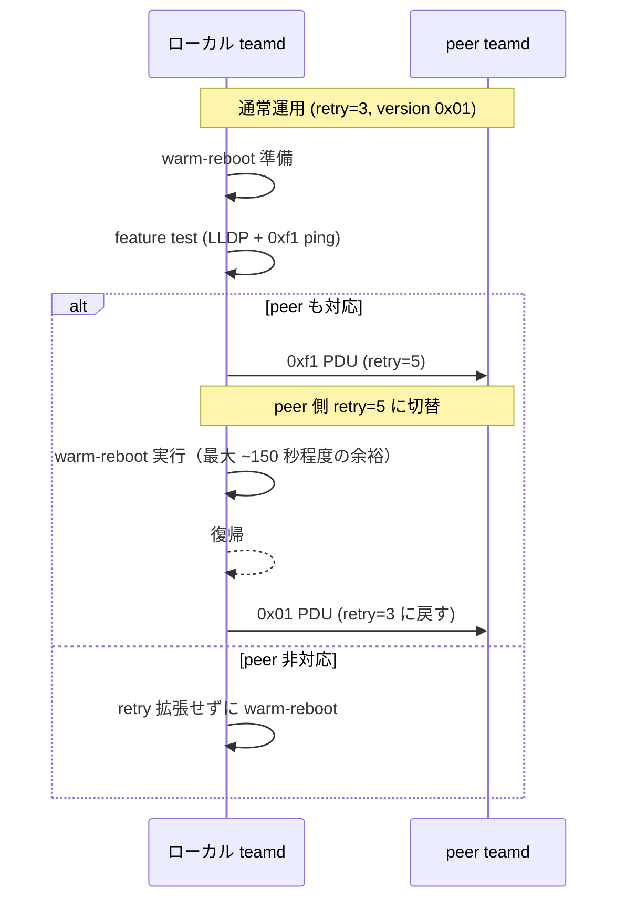

!!! success "裏取りステータス: Code-verified"
    `sonic-buildimage/src/libteam/patch/0015-add-support-for-custom-retry.patch` で libteam の retry count 拡張パッチ取り込みを、`0016-block-retry-count-changes.patch` で warm-reboot 中の保護を確認。`sonic-utilities/scripts/teamd_increase_retry_count.py` L39 で `version=0xf1` の LACPDU 拡張、L62-69 で `actor_retry_count_type=0x80` / `partner_retry_count_type=0x81` 新規 TLV scapy 定義を確認。`sonic-utilities/config/main.py` L3052 `portchannel_retry_count` クリックグループと L3061 で `teamdctl runner.enable_retry_count_feature` 状態取得、その後の get/set サブコマンドを確認（verified at: 2026-05-09）。

# Warm-reboot 中の LACP retry count 拡張（LACP version 0xf1 / 新規 TLV）

## 概要

LACP は long rate（30 秒間隔）で PDU を送り、3 回連続で受け取れないと LAG を Down 扱いにする。実効タイムアウトは 90 秒。SONiC の warm-reboot ではコントロールプレーンが最大 90 秒落ちる前提なので、LACP の retry 上限とほぼ同じになり、わずかな揺らぎで LAG が落ちる可能性がある[^1]。

本 HLD は **LACP プロトコルを SONiC 独自に拡張し、retry count を一時的に増やせる** ようにする提案である。具体的には:

- LACP のバージョンを **`0xf1`** に上げ、新規 TLV `Actor Retry Count (0x80)` / `Partner Retry Count (0x81)` を追加
- warm-reboot 開始前に retry count を 5 に上げて peer に通知。終了後に `0x01` の通常 PDU を送って 3 に戻す
- 両端が SONiC でこの拡張を持っている場合のみ動く。peer が非対応ならフォールバック

これは標準 LACP からの逸脱であり、両端 SONiC を前提とする[^1]。

## 動作仕様

### 拡張 PDU フォーマット（version `0xf1`）

通常の LACP PDU と比較した変更点[^1]:

- 先頭バイトの **LACP Version が `0x01` → `0xf1`**
- Collector Info TLV の後に **Actor Retry Count TLV (`0x80`)** と **Partner Retry Count TLV (`0x81`)** を追加
- パディングが 50B → 42B に短縮

PDU レイアウト:

| Offset | Length | フィールド | 値 |
|--------|--------|-----------|----|
| 0 | 1 | LACP Version | `0xf1` |
| 1〜20 | 20 | Actor Info TLV (type=0x01, len=20) | |
| 21〜40 | 20 | Partner Info TLV (type=0x02, len=20) | |
| 41〜56 | 16 | Collector Info TLV (type=0x03, len=16) | |
| 57〜60 | 4 | **Actor Retry Count TLV** (type=`0x80`, len=4) | retry + pad |
| 61〜64 | 4 | **Partner Retry Count TLV** (type=`0x81`, len=4) | retry + pad |
| 65〜66 | 2 | Terminator TLV | type=0x00, len=0 |
| 67〜108 | 42 | Padding | |

`Actor Retry Count TLV` / `Partner Retry Count TLV` の中身:

| Offset | Length | 説明 |
|--------|--------|------|
| 0 | 1 | retry count（3〜10） |
| 1 | 1 | padding |

### retry count のライフサイクル



ピアから受け取った非標準 retry count は次のいずれかが起きるまで有効[^1]:

- (a) 新しい retry count を含む `0xf1` PDU が来る
- (b) `3 分 × retry count` が経過する
- (c) LACP セッションが何らかの理由で Down する
- (d) `0xf1` 受信から **60 秒経過後** に `0x01` PDU が来る

(d) の 60 秒ガードは「イメージアップグレード途中で peer 側が古いコードに切り替わったとき、`0x01` を受けて即座に retry=3 に戻すと LAG が落ちるリスク」を緩和するためのトランジション機構である[^1]。`0xf1` 受信から 60 秒以内の `0x01` は **retry を 3 に戻さない** 動作になる。

### Warm-reboot との連動



要点:

- warm-reboot 直前に **ローカルから ack 待ちなしで `0xf1` PDU を投げる**[^1]
- 復帰後の最初の PDU は `0x01`（retry=3）。peer はこれを見て自分側 retry を 3 に戻す
- ただし「`0xf1` 受信後 60 秒以内の `0x01`」は無視される（前述 (d) ガード）

### Feature Test（peer が対応か判定する）

`teamd` は次の 2 段階で peer の対応を確認してから retry を上げる[^1]。

1. **LLDP のチェック**: LLDP neighbor の system description に "SONiC" が含まれるか確認。LLDP が無い、または peer が SONiC でなければ非対応として停止
2. **0xf1 ping**: Python スクリプトから `0xf1` PDU（retry=3 を両 actor/partner にセット）を送り、peer から有効な `0xf1` 応答が返れば対応と判定

非対応 peer に `0xf1` を送ると LAG が落ちる可能性があるため、この事前テストは必須[^1]。

<!-- evidence:
source: sonic-net/SONiC/doc/lag/Increasing LACP PDU timeout during warm-reboot.md#L100-L130 (sha: 49bab5b5ff0e924f1ea52b3d9db0dfa4191a7c06)
excerpt: |
  This retry count is valid until any of the following occurs:
  - A new retry count is sent
  - A duration of 3 minutes times the retry count passes
  - The LACP session goes down for whatever reason
  - The peer device sends a version 0x01 LACP PDU (only after 60 seconds)
reasoning: retry count の有効期限と 60 秒トランジションガードの根拠。
-->

## 設定

### 関連する CONFIG_DB

HLD は明示的に「**CLI で設定した retry count は再起動を跨いで永続化されず、DB にも保存されない**」と書く[^1]。よって専用の CONFIG_DB スキーマは追加されない。

### 関連する CLI

| Command | 用途 |
|---------|------|
| `config portchannel retry-count get <portchannel>` | 現在の retry count を表示 |
| `config portchannel retry-count set <portchannel> <retry_count>` | retry count を設定（3〜10） |

`<retry_count>` は 3 から 10 の整数。設定値は永続化されない[^1]。

### 関連する YANG

該当 YANG モジュールは HLD で言及されていない。

### 設定例

warm-reboot 直前の手動操作（自動化されていれば不要）:

```bash
config portchannel retry-count set PortChannel0001 5
warm-reboot
```

## 制限事項

- **両端 SONiC が前提**。peer が非 SONiC（または 0xf1 非対応の SONiC）だと LAG が落ちる可能性がある[^1]
- retry count は `3〜10` の範囲。10 を超える指定は不可
- retry 設定は `config_db.json` 等に保存されない。再起動を跨ぐと標準値 3 に戻る
- LACP プロトコル本来の拡張ではないため、IEEE 標準準拠機器との相互運用は想定外
- SAI / ASIC 側の変更は不要[^1]（teamd / libteam パッチのみ）

## 干渉する機能

- **warm-reboot**: 本機能の主用途。warm-reboot 開始時に teamd が retry を上げる
- **`teamd` / libteam**: コア実装は libteam にパッチを当てる必要がある
- **LLDP**: feature test の 1 段目で system description を見るため、LLDP が動いていないと feature test は早期に「非対応」判定で止まる
- **イメージアップグレード**: `0xf1` → `0x01` への切替時、60 秒ガードがアップグレードのトランジションを保護する

## トラブルシューティング

- warm-reboot 後に LAG が落ちる場合、まず peer 側の SONiC バージョンが `0xf1` 対応かを確認
- `0xf1` ping が失敗するなら LLDP system description に "SONiC" が入っているか確認
- retry を変えてもタイムアウトが改善しない場合、`teamd` のログで `0xf1` 送出と peer 受信が出ているか確認

## 引用元

[^1]: `sonic-net/SONiC` `doc/lag/Increasing LACP PDU timeout during warm-reboot.md` @ `49bab5b5ff0e924f1ea52b3d9db0dfa4191a7c06`

参考 PR（HLD 末尾より）:

- `sonic-net/sonic-utilities` PR #2642: CLI 追加
- `sonic-net/sonic-buildimage` PR #13453: teamd / libteam の retry count 対応
- `sonic-net/sonic-mgmt` PR #8152: テストケース

<!-- concerns hint:
- libteam の 0xf1 PDU 拡張パッチが現行 sonic-buildimage に取り込み済みか
- config portchannel retry-count CLI が sonic-utilities master に存在するか
- feature test (LLDP + 0xf1 ping) の Python スクリプトの所在
- 60 秒トランジションガードの実装値
-->
