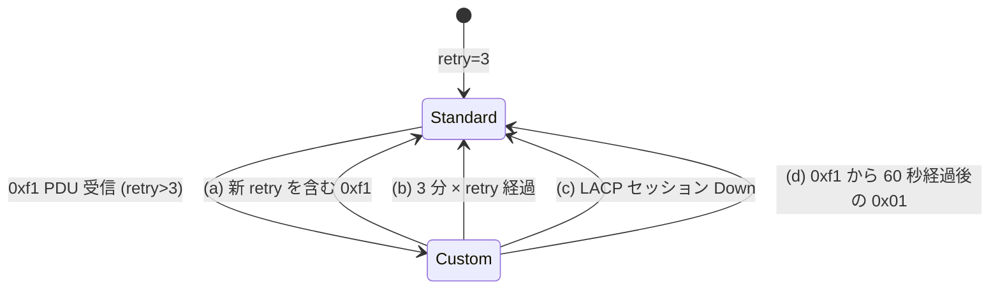
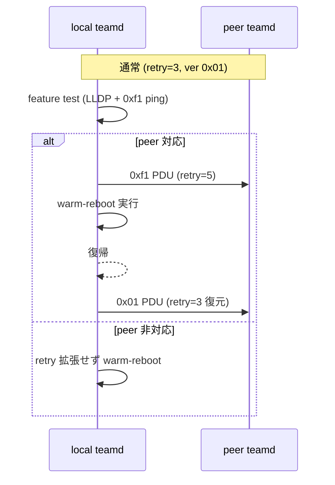

<!-- topics-tip -->
!!! tip "Topics で読み物として読む"
    この HLD は実装詳細を含む。機能の概念・設定・運用を読み物として読みたい場合は [Topics 06 章: L2 / VLAN / LAG](../topics/06-l2-vlan-lag/index.md) を参照。
<!-- /topics-tip -->

!!! success "裏取りステータス: code-verified"
    libteam パッチ `0015-add-support-for-custom-retry.patch` / `0016-block-retry-count-changes.patch`、`sonic-utilities/scripts/teamd_increase_retry_count.py` で `version=0xf1` / `actor_retry_count_type=0x80` / `partner_retry_count_type=0x81`、`sonic-utilities/config/main.py:3052` `portchannel_retry_count` グループを確認（verified at: 2026-05-09）。

# Warm-reboot 中の LACP retry count 拡張

## なぜ必要か

[LACP](../reference/glossary.md#term-lacp) の long rate は 30 秒間隔、3 回連続未受信で [LAG](../reference/glossary.md#term-lag) Down → 実効タイムアウト **90 秒**。[SONiC](../reference/glossary.md#term-sonic) の warm-reboot はコントロールプレーン断が最大 ~90 秒で、わずかな揺らぎで LAG が落ちる[^1]。

本 [HLD](../reference/glossary.md#term-hld) は LACP を **SONiC 独自に拡張** し、retry count を一時的に上げる:

- LACP version を **`0xf1`** に上げ、新規 TLV `Actor Retry Count (0x80)` / `Partner Retry Count (0x81)` を追加
- warm-reboot 直前に retry を 5 に上げて peer に通知、復帰後に `0x01` PDU で 3 に戻す
- **両端 SONiC 前提**。peer 非対応ならフォールバック（retry 拡張しない）

## 拡張 PDU フォーマット (version `0xf1`)

通常 LACP との差分[^1]:

| 位置 | フィールド | 通常 → 拡張 |
|------|-----------|------------|
| 0 | LACP Version | `0x01` → `0xf1` |
| 57〜60 | **Actor Retry Count TLV** (type=`0x80`, len=4) | retry(1B) + pad(1B) |
| 61〜64 | **Partner Retry Count TLV** (type=`0x81`, len=4) | retry(1B) + pad(1B) |
| Pad | 50B → 42B | |

retry count の有効範囲は **3〜10**。

## retry count のライフサイクル



非標準 retry は (a)-(d) のいずれかで標準に戻る[^1]。

**(d) 60 秒ガード**: イメージアップグレード途中で peer 側だけが古いコードに切り替わる場合、`0x01` を即時受けて retry を 3 に戻すと LAG が落ちる。`0xf1` 受信から 60 秒以内の `0x01` は **retry を戻さない** ようにしてトランジションを保護する[^1]。

## Warm-reboot 連動



### Feature test の 2 段階[^1]

1. **[LLDP](../reference/glossary.md#term-lldp)**: peer の system description に "SONiC" が含まれるか
2. **0xf1 ping**: Python スクリプトで `0xf1` PDU を投げ、有効な `0xf1` 応答を確認

非対応 peer に `0xf1` を送ると LAG が落ちうるため、事前テストが必須。

## CLI

| Command | 用途 |
|---------|------|
| `config portchannel retry-count get <pc>` | 現在値表示 |
| `config portchannel retry-count set <pc> <3-10>` | 設定（**永続化されない**[^1]） |

```bash
config portchannel retry-count set PortChannel0001 5
warm-reboot
```

## 制限事項

- **両端 SONiC 前提**。非対応 peer だと LAG 落ちうる[^1]
- retry は `3〜10`。それ以上不可
- **設定は永続化されない**（再起動で 3 に戻る）
- IEEE 標準準拠機器との相互運用は想定外
- [SAI](../reference/glossary.md#term-sai) / [ASIC](../reference/glossary.md#term-asic) 側変更は不要[^1]（[teamd](../reference/glossary.md#term-teamd-teamsyncd-teammgrd) / libteam パッチのみ）

## 干渉する機能

- **warm-reboot**: 本機能の主用途
- **`teamd` / libteam**: コアパッチ
- **LLDP**: feature test 1 段目で system description を使う
- **イメージアップグレード**: 60 秒ガードがトランジションを保護

## トラブルシューティング

```bash
config portchannel retry-count get PortChannel0001
docker exec teamd teamdctl PortChannel0001 state    # actor/partner 状態
tcpdump -i <pc> -nn 'ether proto 0x8809' -e -X      # LACPDU version 確認
```

warm-reboot 後に LAG が落ちる場合、まず peer の SONiC バージョンと `0xf1` 対応を確認。

## 関連 Topics

- [06-l2-vlan-lag/operations](../topics/06-l2-vlan-lag/operations.md): LAG / LACP 運用
- [11-reboot/operations](../topics/11-reboot/operations.md): warm-reboot 全般
- [11-reboot/upgrade](../topics/11-reboot/upgrade.md): イメージアップグレード時の互換

## 引用元

[^1]: `sonic-net/SONiC` `doc/lag/Increasing LACP PDU timeout during warm-reboot.md` @ `49bab5b5ff0e924f1ea52b3d9db0dfa4191a7c06`

参考 PR:

- `sonic-net/sonic-utilities` #2642 (CLI)
- `sonic-net/sonic-buildimage` #13453 (teamd / libteam)
- `sonic-net/sonic-mgmt` #8152 (テスト)

<!-- glossary-links-injected: ec18b66e3507 -->
