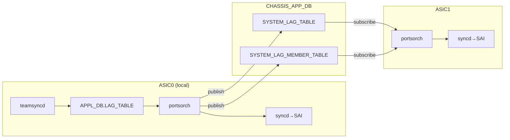
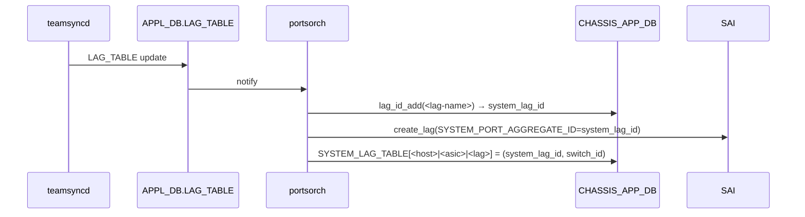

<!-- topics-tip -->
!!! tip "Topics で読み物として読む"
    この HLD は実装詳細を含みます。機能の概念・設定・運用を読み物として読みたい場合は [Topics 06 章: L2 / VLAN / LAG](../topics/06-l2-vlan-lag/index.md) を参照。
<!-- /topics-tip -->

!!! success "裏取りステータス: Code-verified"
    `portsorch.cpp` で `SAI_LAG_ATTR_SYSTEM_PORT_AGGREGATE_ID = system_lag_id` の付与（L7988）、`SYSTEM_LAG_TABLE` / `SYSTEM_LAG_MEMBER_TABLE` への sync（L8037/L8114/L6354/L8212/L8260 のコメント＋コード）を確認。`orchagent/lagids.lua` に `add` / `del` / `get` の Lua atomic 実装と `SYSTEM_LAG_ID_START/END` の redis 読み込みを確認。`tests/test_virtual_chassis.py` の VS テストが CI で回っている（verified at: 2026-05-11）。

# 分散 VOQ シャシでの LAG（`SYSTEM_LAG_TABLE` と `system_lag_id`）

## なぜ必要か

分散 [VOQ](../reference/glossary.md#term-voq) シャシは **複数 [ASIC](../reference/glossary.md#term-asic) が独立した [SONiC](../reference/glossary.md#term-sonic) instance** で動き、ASIC 間情報共有は **supervisor 上の `CHASSIS_APP_DB`** で行う[^1]。[LAG](../reference/glossary.md#term-lag) は全 ASIC で共通に見せる必要があり、本 [HLD](../reference/glossary.md#term-hld) はその仕組みを定義する。

要件と制約[^1]:

- メンバは **同一 ASIC に閉じる**（複数 ASIC 跨ぎ LAG は不可）
- 別 ASIC で受けたトラフィックを **他 ASIC 上の LAG egress** に出すのは可
- [LACP](../reference/glossary.md#term-lacp) / 動的 LAG / 動的メンバ変更は非 VOQ 機と同等

VOQ [SAI](../reference/glossary.md#term-sai) 側の前提[^1]:

- LAG は **全 ASIC SAI で create**、active メンバリストも一致
- SAI は **system port のリスト** をメンバとして受け取れるよう拡張済
- LAG 作成時に `SAI_LAG_ATTR_SYSTEM_PORT_AGGREGATE_ID` で **system 全体で一意な `LAG_ID`** を渡し、全 ASIC で同じ値

## High Level 設計

- 各 ASIC SONiC は **自 ASIC の port をメンバとする LAG** のみ設定
- `CHASSIS_APP_DB.SYSTEM_LAG_TABLE` / `SYSTEM_LAG_MEMBER_TABLE` を新設
- `system_lag_id` は supervisor 上 redis の Lua atomic で割り当て
- 各 ASIC は両 table を **subscribe**、他 ASIC の LAG (= remote LAG) を SAI に programming
- `teamd` 等は **local LAG のみ** 認識



## 動作仕様

### LAG 設定

`CONFIG_DB` の **既存 `PORTCHANNEL` / `PORTCHANNEL_MEMBER` / `PORTCHANNEL_INTERFACE`** をそのまま使う（VOQ 固有設定は不要）。LAG 名は `PortChannel` プリフィクスで ASIC instance 内 unique[^1]。

### `system_lag_id` の割当

supervisor 上 redis-server が `CHASSIS_APP_DB` で atomic 管理。範囲は `chassisdb.conf` で platform 固有[^1]:

```text
SYSTEM_LAG_ID_START=1
SYSTEM_LAG_ID_END=100
```

Lua extension で atomic に提供される API[^1]:

```text
lag_id_add(<key>, <current-id>):
    if current-id != 0 と空きならそれを allocate
    key 存在 → 既存 id を返す
    else range 内で unique id を allocate
    return -1 if 範囲枯渇

lag_id_delete(<key>): free
lag_id_get(<key>):    not exists なら -1
```

### system LAG name の形式

`SYSTEM_LAG_TABLE` のキー[^1]:

```text
<Host name>|<Asic name>|<port channel name>
例: Slot1|Asic0|PortChannel001
```

`Host name` / `Asic name` は `CONFIG_DB.DEVICE_METADATA` の `hostname` / `asic_name`。

### portsorch の処理

#### Local LAG 作成



#### Local member 追加

local member は **自 ASIC の port id** で SAI を呼び、`SYSTEM_LAG_MEMBER_TABLE` には **system port alias** で書く。

#### Remote LAG 作成

`SYSTEM_LAG_TABLE` の subscribe 通知から[^1]:

- キーが自 ASIC 以外なら remote
- `system_lag_id` を CHASSIS_APP_DB から取り、同じ ID で SAI に create
- メンバは **system port OID** で指定

#### portsorch の追加要素

- `Port` 構造体に `system_lag_name` / `system_lag_id` / `switch_id`
- `CHASSIS_APP_DB.SYSTEM_LAG_TABLE` / `SYSTEM_LAG_MEMBER_TABLE` 購読
- 既存 LAG / member 処理を local + remote 共通化（分岐最小）

### スキーマ

```text
CHASSIS_APP_DB.SYSTEM_LAG_TABLE:<host>|<asic>|<lag>
    system_lag_id : <int>
    switch_id     : <int>

CHASSIS_APP_DB.SYSTEM_LAG_MEMBER_TABLE:<host>|<asic>|<lag>|<system_port_alias>
```

`APPL_DB.LAG_TABLE` / `LAG_MEMBER_TABLE` は既存のまま **local LAG のみ** が入る。

### restart シナリオ

- **FSI (1 ASIC instance) の warm boot は未サポート**[^1]。将来は `lag_id_add(<key>, <previous_id>)` で旧 ID 再要求を予定
- supervisor / global redis-server の warm boot なし restart は **全 ASIC SONiC が exit**（pizza box 同等。graceful restart 未対応）

## 設定

| 種別 | 名前 | 用途 |
|------|------|------|
| [CONFIG_DB](../reference/glossary.md#term-config_db) | `PORTCHANNEL` / `_MEMBER` / `_INTERFACE` | 既存スキーマ、変更なし |
| CONFIG_DB | `DEVICE_METADATA.localhost.hostname/asic_name` | system LAG name 生成元 |
| [APPL_DB](../reference/glossary.md#term-appl_db) | `LAG_TABLE` / `LAG_MEMBER_TABLE` | local LAG のみ |
| CHASSIS_APP_DB | `SYSTEM_LAG_TABLE` / `SYSTEM_LAG_MEMBER_TABLE` | 全 ASIC 共有 |

```bash
# Asic0 上で local PortChannel を作成（CHASSIS_APP_DB は自動で同期）
config portchannel add PortChannel001
config portchannel member add PortChannel001 Ethernet0
config portchannel member add PortChannel001 Ethernet4
```

## 制限事項

- メンバが複数 ASIC を跨ぐ LAG は **不可**
- `SYSTEM_LAG_ID_START/END` 超過で `lag_id_add` が `-1` を返し作成失敗
- FSI 単体 warm boot **未対応**
- supervisor / SSI 再起動は **全 ASIC 巻き込み**

## 干渉する機能

- `portsorch`: Port struct 拡張 + CHASSIS_APP_DB 購読 + Lua ID 割当
- `teamd` / `teamsyncd`: local LAG のみ
- `syncd` + SAI: `SAI_LAG_ATTR_SYSTEM_PORT_AGGREGATE_ID` で local/remote 共通 LAG_ID 反映
- VOQ system port HLD: メンバ表現の system port alias / OID を提供
- 既存 VOQ neighbor 共有: 同じ CHASSIS_APP_DB を利用する先行例

## トラブルシューティング

```bash
redis-cli -h <supervisor> -n CHASSIS_APP_DB hgetall 'SYSTEM_LAG_TABLE:<host>|<asic>|<lag>'
# system_lag_id が remote ASIC でも programming されているかを確認
```

- 別 ASIC 経由 egress でパケロス → `SYSTEM_LAG_MEMBER_TABLE` の有無、購読側 [portsorch](../reference/glossary.md#term-portsorch) ログ
- LAG 作成失敗 → `chassisdb.conf` の範囲、Lua `lag_id_add` 戻り値
- warm boot で LAG が壊れる → 仕様（FSI warm boot 未対応）

## 関連 Topics

- [12-multi-asic-voq/concept](../topics/12-multi-asic-voq/concept.md): VOQ シャシの全体像
- [06-l2-vlan-lag/internals](../topics/06-l2-vlan-lag/internals.md): LAG / [teamd](../reference/glossary.md#term-teamd-teamsyncd-teammgrd) / portsorch

## 引用元

[^1]: `sonic-net/SONiC` `doc/voq/lag_hld.md` @ `49bab5b5ff0e924f1ea52b3d9db0dfa4191a7c06`

<!-- topics-back-ref -->
## 関連 Topics

- [Topics: L2 / VLAN / LAG / MC-LAG](../topics/06-l2-vlan-lag/index.md)
- [Topics: Multi-ASIC / VOQ Chassis](../topics/12-multi-asic-voq/index.md)

<!-- /topics-back-ref -->

<!-- glossary-links-injected: 45f78fb52e76 -->
