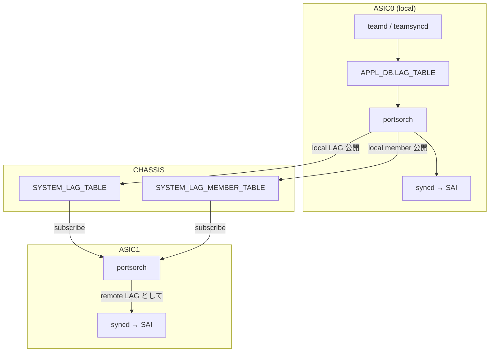
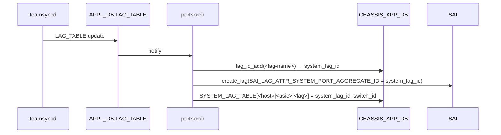

!!! warning "裏取りステータス: HLD-only"
    `portsorch` が `CHASSIS_APP_DB` の `SYSTEM_LAG_TABLE` / `SYSTEM_LAG_MEMBER_TABLE` を購読し remote LAG として SAI に programming する経路、`SAI_LAG_ATTR_SYSTEM_PORT_AGGREGATE_ID` への `system_lag_id` 反映、`chassisdb.conf` の `SYSTEM_LAG_ID_START/END` 読込、Lua atomic `lag_id_add` / `lag_id_delete` / `lag_id_get` の実装は実コードでの裏取り未済。

# 分散 VOQ シャシでの LAG（`SYSTEM_LAG_TABLE` と `system_lag_id`）

## 概要

分散 VOQ シャシは **複数 ASIC が独立した SONiC インスタンス**（`syncd` / `swss` / `bgp` / `lldp` / `teamd` / `database`）で動き、ASIC 間の情報共有は **`CHASSIS_APP_DB`**（supervisor 上の集中 DB）で行う[^1]。LAG は ASIC 間で共通に見せる必要があり、本 HLD はこのための仕組みを定義する。

要件と制約[^1]:

- **メンバが複数 ASIC を跨ぐ LAG はサポートしない**（メンバは同 ASIC に閉じる）
- 一方、ある ASIC で受けた traffic を **他 ASIC 上の LAG egress** に出すことはサポート（egress LAG member 選択は同一 ASIC 上にあるかのように動く）
- LACP / 動的 LAG 作成 / 動的メンバ変更も非 VOQ 機と同等

VOQ SAI の制約[^1]:

- 各 LAG は **全 ASIC の SAI で create** される
- 各 ASIC SAI で **active メンバリストが一致** すること
- メンバ変更は全 ASIC SAI に伝搬する
- VOQ サポート用に SAI が **メンバを system port のリスト** で受け取れるよう拡張済み
- LAG 作成時に `SAI_LAG_ATTR_SYSTEM_PORT_AGGREGATE_ID` で **system 全体で一意な `LAG_ID`** を渡す。値は全 ASIC SAI で同じであること

## 動作仕様

### High Level 提案

- 各 ASIC SONiC は **自 ASIC の port をメンバとする LAG** だけを設定対象とする
- `CHASSIS_APP_DB` に **`SYSTEM_LAG_TABLE`** と **`SYSTEM_LAG_MEMBER_TABLE`** を新設
- `SYSTEM_LAG_TABLE` のエントリは **`system_lag_id`** 属性を持ち、Lua スクリプトで atomic に割り当て
- 各 ASIC は両 table を **subscribe** し、自分以外の LAG (= remote LAG) を SAI に programming する
- `teamd` 等は **local LAG しか知らない**（remote LAG を意識するのは `swss` / `syncd` のみ）



### LAG 設定

`CONFIG_DB` の **既存 `PORTCHANNEL` / `PORTCHANNEL_MEMBER` / `PORTCHANNEL_INTERFACE`** をそのまま使う[^1]。VOQ 用の特別な設定は不要。LAG 名は **`PortChannel` で始まる文字列** で ASIC SONiC instance 内で unique。

### `system_lag_id` の割り当て

supervisor 上の **redis-server** が `CHASSIS_APP_DB` で atomic に管理する[^1]。範囲は **`chassisdb.conf`** で platform 固有に設定:

```text
SYSTEM_LAG_ID_START=1
SYSTEM_LAG_ID_END=100
```

割り当て / 解放 / 参照は Lua extension で atomic に[^1]:

```text
lag_id_add(<key>, <id=current-id>):
    if current-id != 0:
        if key exists and current-id == found-id → return found-id
        if current-id is free → allocate it and return
    if key exists → return found-id
    else allocate unique id within range
    return -1 if all ids used

lag_id_delete(<key>):
    free id, return 非 0 if freed

lag_id_get(<key>):
    return -1 if not exists, else found-id
```

### system LAG name のフォーマット

`CHASSIS_APP_DB.SYSTEM_LAG_TABLE` のキーは[^1]:

```text
<Host name>|<Asic name>|<port channel name>
```

例: Slot1 の Asic0 にある `PortChannel001` → `Slot1|Asic0|PortChannel001`

`Host name` と `Asic name` は **`CONFIG_DB.DEVICE_METADATA`** の `hostname` / `asic_name` から取得する。

### portsorch の処理

#### Local LAG 作成



#### Local LAG メンバ追加

local member は **自 ASIC の local port id** を使い、`SYSTEM_LAG_MEMBER_TABLE` には **system port alias** で書く（system port は VOQ アーキテクチャで全 ASIC が同じ alias で参照）。

#### Remote LAG 作成

`SYSTEM_LAG_TABLE` の subscribe 通知から処理[^1]:

- key の `<host>|<asic>|<lag>` が **自 ASIC のものでなければ remote**
- `system_lag_id` を CHASSIS_APP_DB から取得
- SAI で LAG を create（同じ `system_lag_id` を `SAI_LAG_ATTR_SYSTEM_PORT_AGGREGATE_ID` に）
- メンバは **system port object の OID** で指定（remote port なので local port object は無い）

#### portsorch の追加要素

- `Port` 構造体に **`system_lag_name` / `system_lag_id` / `switch_id`** を保持
- **CHASSIS_APP_DB の `SYSTEM_LAG_TABLE` / `SYSTEM_LAG_MEMBER_TABLE` を購読**
- 既存の LAG / member 処理を local + remote 両対応に拡張（同 API を共用、分岐は最小限）

### CONFIG_DB / APPL_DB / CHASSIS_APP_DB スキーマ

#### `CONFIG_DB.PORTCHANNEL` / `PORTCHANNEL_MEMBER` / `PORTCHANNEL_INTERFACE`

既存スキーマを変更なしで使う[^1]。

#### `APPL_DB.LAG_TABLE`

既存。**local LAG のみ** が入る。teamsyncd が書き込む。

#### `CHASSIS_APP_DB.SYSTEM_LAG_TABLE`

```text
SYSTEM_LAG_TABLE:<host>|<asic>|<port channel>
    system_lag_id : <int>
    switch_id     : <int>
```

#### `CHASSIS_APP_DB.SYSTEM_LAG_MEMBER_TABLE`

```text
SYSTEM_LAG_MEMBER_TABLE:<host>|<asic>|<port channel>|<system_port_alias>
    (フィールドは system port メンバ表現)
```

### restart シナリオ

#### FSI (1 ASIC instance) の warm boot

初期実装では **未サポート**[^1]。将来的には orchagent が warm boot 起動時に `lag_id_add(<key>, <previous_id>)` で **以前と同じ ID を再要求** することを想定（Lua API がそれを許す設計）。

#### SSI (= supervisor) / global redis-server の restart

warm boot なし restart は **全 ASIC SONiC が exit する**（pizza box と同じ。graceful restart 未対応）[^1]。

## 設定

### 関連する CONFIG_DB

| Table | 説明 |
|-------|------|
| `PORTCHANNEL` | 既存。VOQ 機でも変更なし |
| `PORTCHANNEL_MEMBER` | 既存。local port のみメンバ可 |
| `PORTCHANNEL_INTERFACE` | 既存 |
| `DEVICE_METADATA.localhost.hostname/asic_name` | system LAG name 生成元 |

### 関連する APPL_DB

| Table | 説明 |
|-------|------|
| `LAG_TABLE` | 既存。local LAG のみ |
| `LAG_MEMBER_TABLE` | 既存 |

### 関連する CHASSIS_APP_DB

| Table | 説明 |
|-------|------|
| `SYSTEM_LAG_TABLE` | 全 ASIC の LAG を一覧化、`system_lag_id` を保持 |
| `SYSTEM_LAG_MEMBER_TABLE` | system port 単位のメンバ |

### 関連する CLI

新 CLI は HLD 内では明示されず、既存 `show interfaces portchannel` 等が VOQ 文脈用に拡張される（Rev 1.1 で show コマンド更新あり）[^1]。

### 設定例

設定は通常の SONiC LAG と同じ:

```bash
# Asic0 上で local PortChannel を作成
config portchannel add PortChannel001
config portchannel member add PortChannel001 Ethernet0
config portchannel member add PortChannel001 Ethernet4
```

各 ASIC SONiC が CHASSIS_APP_DB に書き、他 ASIC が remote LAG として programming する。ユーザは local 設定だけを意識すればよい。

## 制限事項

- **メンバが複数 ASIC を跨ぐ LAG は不可**[^1]
- `system_lag_id` の範囲は platform 固定（`SYSTEM_LAG_ID_START/END`）。範囲超過すると **`lag_id_add` が -1 を返し作成失敗**
- **FSI 単体 warm boot 未サポート**[^1]
- supervisor 側 redis-server / SSI 再起動は **全 ASIC 巻き込み**（graceful restart 未対応）
- LACP の packet 処理は local ASIC で完結（teamd は remote LAG を知らない）
- system port object 番号の付与・運用は別 HLD（VOQ system port HLD）に依存

## 干渉する機能

- **`portsorch`**: 主体。Port struct 拡張 + CHASSIS_APP_DB 購読 + Lua 経由 ID 割当
- **`teamd` / `teamsyncd`**: local LAG のみ扱う
- **`syncd` + SAI**: `SAI_LAG_ATTR_SYSTEM_PORT_AGGREGATE_ID` で remote/local 共通の LAG_ID 反映
- **`CHASSIS_APP_DB` (supervisor)**: 全 ASIC 共有 DB
- **VOQ system port**: メンバ ID の表現に system port alias / OID を使用
- **Neighbor 情報共有 (既存 VOQ 機構)**: 同様に CHASSIS_APP_DB を使う先行例

## トラブルシューティング

- 別 ASIC 経由の egress でパケロス → `redis-cli -n CHASSIS_APP_DB hgetall 'SYSTEM_LAG_TABLE:<host>|<asic>|<lag>'` で system_lag_id が remote ASIC でも programming されているか確認
- LAG 作成失敗 → `chassisdb.conf` の `SYSTEM_LAG_ID_START/END` 範囲、Lua `lag_id_add` 戻り値ログを確認
- メンバが remote ASIC SAI で表示されない → `SYSTEM_LAG_MEMBER_TABLE` の存在を確認、購読側 portsorch のログを確認
- warm boot で LAG が壊れる → 初期実装は **FSI warm boot 未サポート** 仕様

## 引用元

[^1]: `sonic-net/SONiC` `doc/voq/lag_hld.md` @ `49bab5b5ff0e924f1ea52b3d9db0dfa4191a7c06`

<!-- concerns hint:
- portsorch の SYSTEM_LAG_TABLE / SYSTEM_LAG_MEMBER_TABLE 購読と remote LAG 作成経路の現行実装確認
- SAI_LAG_ATTR_SYSTEM_PORT_AGGREGATE_ID への system_lag_id 反映実装確認
- supervisor 側 redis-server の Lua スクリプト（lag_id_add / delete / get）の取り込み確認
- chassisdb.conf の SYSTEM_LAG_ID_START / END 読み込み実装確認
- Port struct への system_lag_name / system_lag_id / switch_id 追加確認
- VOQ system port object の OID と alias 表現が SYSTEM_LAG_MEMBER_TABLE と整合しているか確認
-->
