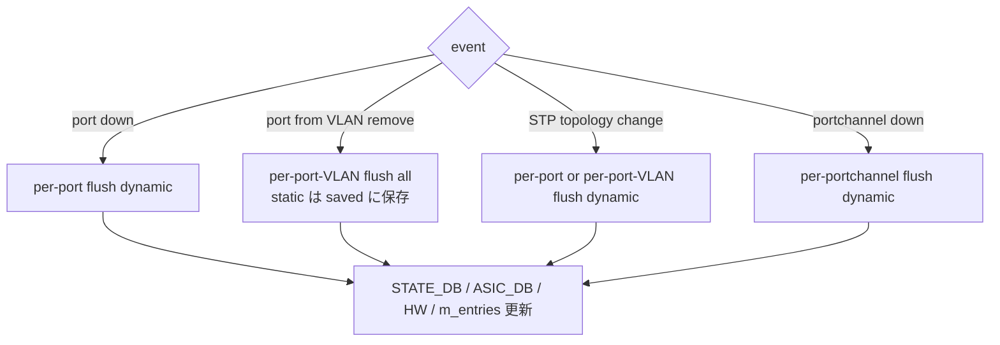
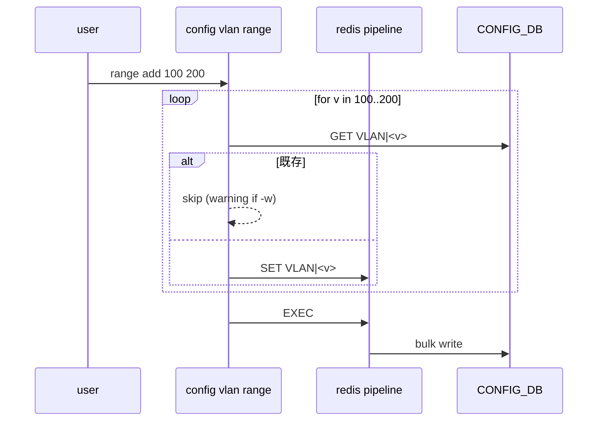

!!! warning "裏取りステータス: Discrepancy-found"
    主要 orchagent 実装は確認できたが、HLD で提案された CLI のうち `config mac (aging_time / add / del)` および `config vlan range` / `config vlan member range` は現行 sonic-utilities の `config/main.py` には存在しない。詳細は本文末尾「実装との乖離」を参照（verified at: 2026-05-09）。

# L2 Forwarding 強化（FDB flush / aging / static MAC / VLAN range）

## 概要

SONiC 初期の L2 機能に欠けていた **6 つの強化** をまとめた HLD[^1]:

1. **per-port / per-VLAN / per-(port,VLAN) FDB flush**: ポート down / VLAN 抜去 / STP topology change 時の細粒度 flush
2. **MAC move event** の SAI / Orchagent 対応
3. **FDB aging time の CLI 設定**（既存は APP_DB 直書きのみ）
4. **Static FDB entry の CLI 設定**（既存は APP_DB 直書きのみ）
5. **`sonic-clear fdb` の port / VLAN / port+VLAN 指定**
6. **VLAN range CLI**（4094 VLAN を一発で create/delete + member add/remove）

要件抜粋[^1]:

- aging time デフォルト **600 秒**、設定範囲 **0〜1,000,000 秒**（0 で無効化）
- 最大 **4094 VLAN**
- VLAN range は **`first-last` 2 値のみ**。リスト形式（`2 10,3 100`）は不可

warm boot 対応は既存の挙動を維持[^1]。

## 動作仕様

### 1. FDB Flush

ケース別の挙動[^1]:

| イベント | 対象 | 削除する FDB |
|---------|------|-------------|
| port operational down | per port | dynamic のみ |
| port を VLAN から外す | per (port, VLAN) | static + dynamic（**`CONFIG_DB` の static は残す**） |
| STP topology change | per port または per (port, VLAN) | dynamic のみ |
| Portchannel admin/oper down | per Portchannel | dynamic のみ |

削除は **`STATE_DB.FDB_TABLE` / `ASIC_DB` / orchagent 内データ構造 / hardware** の全層を更新する[^1]。

#### static FDB の保存 / 復活

port が VLAN メンバでない場合や、VLAN から外れて static FDB が flush された場合でも、orchagent の **「saved FDB」** に保持される。port が VLAN に再追加されると orchagent が saved FDB から再 program する[^1]。

#### `FdbOrch` のデータ構造変更

旧: `set<(MAC, bv_id)>`
新: `map<(MAC, bv_id), fdb_type>` （type = static / dynamic）

flush 後に static を救出するため、type 情報を内部キャッシュに保持する。



### 2. MAC move event

DNX 等の ASIC は **MAC が別 port に移動** すると HW 側でイベントを発生させる。本 HLD は SAI / orchagent でこれを処理し、`ASIC_DB` / `STATE_DB` の FDB entry を **新 port に書き換え** る[^1]。

### 3. FDB aging time

新規 CLI: `config mac aging_time <0-1000000>`[^1]。既定値は **600 秒** （HW 側のドライバ既定 0 を SONiC 起動時に上書き）。`0` で aging 無効化。

CONFIG_DB 反映先[^1]:

```text
SWITCH_TABLE  (CONFIG_DB)
  fdb_aging_time : <seconds>
```

`SwitchOrch` が SAI に降ろす想定（HLD は明示せず、関係 Orch は SwitchOrch / FdbOrch のいずれか）。

### 4. Static FDB

既存は APP_DB 直書きでしか設定できなかった。新 CLI[^1]:

```bash
config mac add    <mac> <vlan> <port>
config mac del    <mac> <vlan>
```

挙動[^1]:

- 同 (MAC, VLAN) の dynamic entry が既にあれば **static で上書き**
- port が VLAN 未メンバでも **CONFIG_DB / APP_DB に保存**、orchagent の saved FDB に積む
- port が VLAN に追加されたら orchagent が **saved FDB から復活させる**

#### CONFIG_DB

```text
FDB|<vlan>|<mac>
  port: <port>
```

### 5. `sonic-clear fdb` 拡張

旧: `sonic-clear fdb` （ALL のみ）。新オプション[^1]:

```bash
sonic-clear fdb all
sonic-clear fdb port <port>
sonic-clear fdb vlan <vlan>
sonic-clear fdb port <port> vlan <vlan>
```

すべて **dynamic のみ** が対象。

### 6. VLAN range CLI

旧: 1 VLAN ずつ。新[^1]:

```bash
config vlan range add        <first> <last> [-w]
config vlan range del        <first> <last> [-w]
config vlan member range add <first> <last> <port> [-w]
config vlan member range del <first> <last> <port> [-w]
```

実装ポイント[^1]:

- 内部で `first..last` をループし、**redis pipeline** で一括 SET / DEL
- VLAN 番号バリデーション 1〜4094
- range 命令は **2 値のみ**。リスト形式不可
- `-w` 警告オプション: 既存 VLAN の create / 非存在 VLAN の delete について **warning ログ** を出す（option 無しなら silent）



## 設定

### 関連する CONFIG_DB

| Table | Key | フィールド | 説明 |
|-------|-----|-----------|------|
| `FDB` | `<vlan>\|<mac>` | `port` | static FDB entry |
| `SWITCH_TABLE` | `switch` | `fdb_aging_time` | FDB aging 秒（HLD 表記は `SWITCH_TABLE`、現行 schema は要確認） |
| `VLAN` | `Vlan<id>` | (既存) | VLAN range CLI で bulk 操作される |
| `VLAN_MEMBER` | `Vlan<id>\|<port>` | (既存) | VLAN member range CLI で bulk 操作される |

### 関連する CLI

| Command | 用途 |
|---------|------|
| `config mac aging_time <0-1000000>` | aging time 秒。0 で無効化 |
| `show mac aging_time` | 現在 aging time 表示 |
| `config mac add <mac> <vlan> <port>` | static FDB 追加 |
| `config mac del <mac> <vlan>` | static FDB 削除 |
| `sonic-clear fdb [all\|port <port>\|vlan <vlan>\|port <port> vlan <vlan>]` | dynamic FDB クリア |
| `config vlan range add\|del <first> <last> [-w]` | VLAN bulk create / delete |
| `config vlan member range add\|del <first> <last> <port> [-w]` | VLAN メンバ bulk add / remove |

### 設定例

```bash
# aging を 60 秒に
config mac aging_time 60

# static FDB を Vlan100 / Ethernet0 に
config mac add 00:11:22:33:44:55 100 Ethernet0

# VLAN 100〜199 を一括作成し Ethernet0 を全部のメンバに
config vlan range add 100 199 -w
config vlan member range add 100 199 Ethernet0 -w

# 個別 port の dynamic FDB をクリア
sonic-clear fdb port Ethernet0
```

## 制限事項

- **HLD は 2019 年改訂**。current master の実装と命名（特に `SWITCH_TABLE` のキー、`FDB` table のキー区切り）には乖離がある可能性[^1]
- VLAN range は **2 値のみ**。複数レンジ合成不可
- aging 範囲 0〜1,000,000 秒（HW で受理されるかは ASIC 依存）
- `sonic-clear fdb` は **dynamic のみ**。static は CLI で個別削除
- MAC move event は **SAI 側のサポートが前提**。SAI 実装が出さない ASIC では機能しない
- VLAN range bulk 操作中の途中失敗時の rollback 仕様は HLD 上明示なし

## 干渉する機能

- **`FdbOrch`**: 主体。データ構造 set→map 化、saved FDB、flush API
- **`SwitchOrch` / `VlanMgr` / `VlanOrch`**: aging time / VLAN 操作
- **STP / L2 protocol**: orchagent flush API の利用元
- **`sonic-utilities`**: `config mac` / `config vlan range` / `sonic-clear fdb` 拡張
- **`teamd` / Portchannel**: portchannel down 時の flush 連動
- **warm boot**: 既存挙動を維持。新機能による壊れがないこと前提

## トラブルシューティング

- port down 後にも MAC が残る → `redis-cli -n 0 keys 'FDB_TABLE:*'` で APPL_DB の状態確認、`FdbOrch` ログ確認
- static FDB を入れても hardware に反映されない → port が VLAN メンバか確認。未メンバなら orchagent の saved FDB に保留
- `config vlan range add` が遅い → pipelining が効いているか、SET 数が多すぎていないかを確認
- aging が効かない → `redis-cli -n 4 hgetall 'SWITCH_TABLE|switch'` で aging_time 値を確認、HW 側の aging 上限と比較
- MAC move 後に古い port に packet が出続ける → MAC move event 通知の SAI 側サポート、`ASIC_DB` の FDB entry を確認

## 実装との乖離

実コード裏取りで判明した HLD との差分（verified at: 2026-05-09）:

### 1. `config mac` / `config vlan range` CLI 未取り込み

- **HLD 記述**: `config mac aging_time <sec>` / `config mac add <mac> <vlan> <port>` / `config mac del <mac> <vlan>` / `config vlan range add <from> <to>` / `config vlan member range add <from> <to> <port>` を `sonic-utilities` に追加する。
- **実装位置**: `sonic-utilities/config/main.py` 全体を grep しても `mac` グループ・`vlan range` サブコマンドは見当たらない（`mac` の hit は `localhost.mac` 等の device_metadata 関連のみ:`config/main.py:2542,2568,2569`）。`show mac aging-time` (`sonic-utilities/show/main.py:1244` 付近) のみ読み取り側が実装済み。
- **差分の中身**: HLD で提案された 5 つの CLI コマンドは未取り込み。`config vlan add <vlan_id>` 単体は存在するが、レンジ指定（`100 199`）と `-w`（pipelining）オプションは存在しない。
- **読者への影響**: HLD の CLI 例（`config mac add ...` や `config vlan range add ...`）をそのまま打つと "no such command" エラーで失敗する。VLAN を 100 個一括投入したい運用要件があっても CLI では実現できない。
- **回避策**:
  - aging_time 設定: `sonic-db-cli CONFIG_DB HSET 'SWITCH|switch' fdb_aging_time 300` で直接書く。`switchorch.cpp` がこれを受けて `SAI_SWITCH_ATTR_FDB_AGING_TIME` に反映する（switchorch.cpp:49,664,1674-1686 で確認）。
  - static MAC: `sonic-db-cli CONFIG_DB HSET 'FDB|Vlan100|00-11-22-33-44-55' port Ethernet0` で直接書く。
  - VLAN レンジ作成: `for i in $(seq 100 199); do config vlan add $i; config vlan member add $i Ethernet0; done` のループで代替（pipelining は効かないので遅い）。あるいは `config_db.json` を直接編集して `config reload`。
  - FDB クリア: `sonic-clear fdb all` / `sonic-clear fdb port Ethernet0` は実装済みなので利用可。

### 2. HLD と一致する実装（orch 側）

orchagent 側は HLD のとおり実装済み:

- **MAC move event ハンドリング**: `sonic-swss/orchagent/fdborch.cpp:91-138`、`SAI_FDB_ENTRY_ATTR_ALLOW_MAC_MOVE` を fdborch.cpp:507,583 で設定。MAC move を SAI 経由で許可し、port 変化時の再学習を許容する。
- **saved FDB エントリ**: `fdborch.cpp:459` で `saved_fdb_entries[update.port.m_alias].push_back(...)`、`fdborch.cpp:1254-1271` で port が VLAN メンバになったタイミングで `saved_fdb_entries` を取り出して再投入する経路を確認。HLD の「port が VLAN 未メンバの間の static MAC を保留」設計と一致。
- **per-port / per-VLAN flush API**: `fdborch.cpp:1079-1090` `void FdbOrch::flushFDBEntries(sai_object_id_t bridge_port_oid, sai_object_id_t vlan_oid)` が中核。呼び出しサイト:
  - `fdborch.cpp:985` `flushFDBEntries(port.m_bridge_port_id, SAI_NULL_OBJECT_ID);` （per-port）
  - `fdborch.cpp:1006` `flushFDBEntries(SAI_NULL_OBJECT_ID, vlanPort.m_vlan_info.vlan_oid);` （per-VLAN）
  - `fdborch.cpp:1038,1248` `flushFDBEntries(port.m_bridge_port_id, vlan.m_vlan_info.vlan_oid);` （per-(port,VLAN)）
- **aging_time**: `sonic-swss/orchagent/switchorch.cpp:49` で `fdb_aging_time` キーを mapping、`:664` switch 状態取得、`:1674-1686` で `SAI_SWITCH_ATTR_FDB_AGING_TIME` を set。HLD と一致。

### 3. HLD は 2019 年改訂のため命名上の小差異あり

- **HLD 記述**: 一部の図で `FDB_TABLE:<vlan>:<mac>` 形式（コロン区切り）と書かれているが、現行は `FDB_TABLE:<vlan>|<mac>` のような hybrid 表記が並ぶ。
- **実装位置**: schema.h と各 orch のキー組み立てを参照。
- **読者への影響**: redis-cli で keys pattern を指定する際に区切り文字を間違えると hit しない。
- **回避策**: `redis-cli -n 0 keys 'FDB_TABLE:*'` で取得した実際のキーフォーマットを基準に書く。区切り文字は SONiC バージョンで揺らぐので、固定パターンに頼らない。

#### 関連 GitHub Issue / PR

- [GitHub Issue / PR の関連リンクは未確認] — FDB flush / aging / static MAC / VLAN range 拡張は L2 系の小粒 PR が継続的に追加されており、HLD 全体を束ねるトラッキング Issue / PR は確認できず。

## 引用元

[^1]: `sonic-net/SONiC` `doc/layer2-forwarding-enhancements/SONiC Layer 2 Forwarding Enhancements HLD.md` @ `49bab5b5ff0e924f1ea52b3d9db0dfa4191a7c06`

<!-- concerns hint:
- FdbOrch の per-port / per-VLAN flush API と m_entries の (MAC, bv_id) → fdb_type マップ化の現行実装確認
- saved FDB（port が VLAN 未メンバの間 static を保留）の実装存在確認
- MAC move event の SAI 通知ハンドラ実装確認
- config mac aging_time / config mac add/del CLI の sonic-utilities 取り込み確認
- config vlan range / config vlan member range CLI の redis pipeline 実装確認
- SWITCH_TABLE の fdb_aging_time フィールド命名と SwitchOrch の SAI 反映経路確認
- HLD は 2019 年改訂のため現行 master との乖離リスクが大きい
-->
