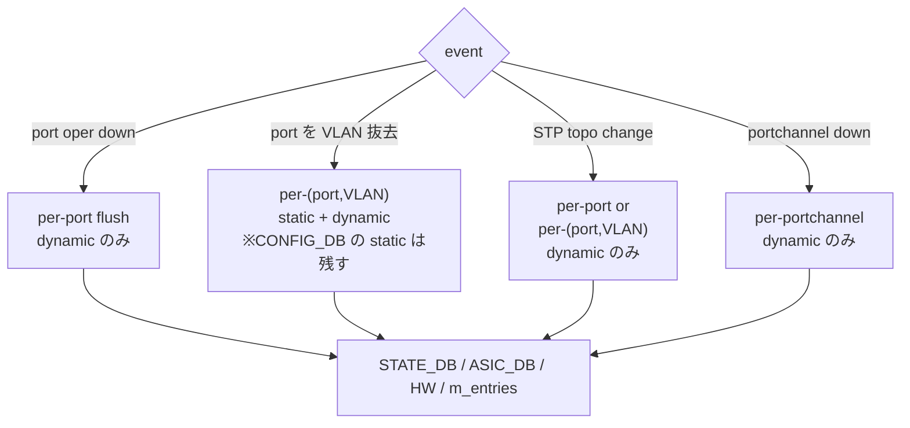

<!-- topics-tip -->
!!! tip "Topics で読み物として読む"
    この HLD は実装詳細を含みます。機能の概念・設定・運用を読み物として読みたい場合は [Topics 06 章: L2 / VLAN / LAG](../topics/06-l2-vlan-lag/index.md) を参照。
<!-- /topics-tip -->

!!! warning "裏取りステータス: discrepancy-found"
    orchagent 側（`fdborch.cpp` / `switchorch.cpp`）は HLD のとおり実装済み。一方で **`config mac` / `config vlan range` CLI は sonic-utilities 現行 master に存在しない**。詳細は本文末尾の「実装との乖離」を参照（verified at: 2026-05-09）。

# L2 Forwarding 強化

## なぜ拡張するのか

[SONiC](../reference/glossary.md#term-sonic) 初期の L2 機能に欠けていた 6 項目を一括導入する [HLD](../reference/glossary.md#term-hld)[^1]:

1. **per-port / per-[VLAN](../reference/glossary.md#term-vlan) / per-(port,VLAN) [FDB](../reference/glossary.md#term-fdb) flush** （port down / VLAN 抜去 / STP topo change 時）
2. **MAC move event** の [SAI](../reference/glossary.md#term-sai) / [orchagent](../reference/glossary.md#term-orchagent) 対応
3. **FDB aging time の CLI 設定**（既定 600 秒、0〜1,000,000 秒）
4. **Static FDB の CLI 設定**
5. **`sonic-clear fdb` 拡張**（port / VLAN 指定）
6. **VLAN range CLI**（4094 VLAN を一括操作）

warm boot 既存挙動は維持[^1]。

## FDB Flush 仕様



port が VLAN メンバでない / VLAN から外れた static は orchagent の **「saved FDB」** に保持され、port が VLAN に再追加された時に再 program される。`FdbOrch` のデータ構造は `set<(MAC, bv_id)>` → `map<(MAC, bv_id), fdb_type>` に変更され、type 情報をキャッシュ化。

## CONFIG_DB / CLI（HLD 提案）

```text
FDB|<vlan>|<mac>    port=<port>
SWITCH_TABLE        fdb_aging_time=<sec>
```

| CLI | 用途 |
|-----|------|
| `config mac aging_time <0-1000000>` | aging 秒（0=無効、既定 600） |
| `config mac add <mac> <vlan> <port>` / `del <mac> <vlan>` | static FDB |
| `sonic-clear fdb [all\|port <p>\|vlan <v>\|port <p> vlan <v>]` | dynamic FDB クリア |
| `config vlan range add\|del <first> <last> [-w]` | VLAN bulk |
| `config vlan member range add\|del <first> <last> <port> [-w]` | VLAN member bulk |

VLAN range は **2 値のみ**（リスト形式不可）、redis pipeline で一括 SET / DEL。`-w` はバリデーション警告。

### 設定例（HLD どおりの記法）

```bash
config mac aging_time 60
config mac add 00:11:22:33:44:55 100 Ethernet0
config vlan range add 100 199 -w
config vlan member range add 100 199 Ethernet0 -w
sonic-clear fdb port Ethernet0
```

## 既知の問題

### FDB エイジングタイムの CLI 設定（#307）

古いバージョンでは FDB エイジングタイムを CLI で設定する方法が提供されていなかった。現在も `config mac aging_time` コマンドは実装されていない（HLD 記載のみ）。

**回避策（CLI 未実装の場合）:**

```bash
# CONFIG_DB 経由で直接設定（単位: 秒）
sonic-db-cli CONFIG_DB HSET 'SWITCH|switch' fdb_aging_time 300
# または redis-cli で
redis-cli -n 4 HSET 'SWITCH_TABLE|switch' fdb_aging_time 300
```

値は orchagent の `switchorch.cpp` が `SAI_SWITCH_ATTR_FDB_AGING_TIME` に反映する。デフォルト値はプラットフォームのハードウェアデフォルト（0 または 300 秒）。

- 参照: [sonic-net/SONiC#307](https://github.com/sonic-net/SONiC/issues/307)

### 静的 FDB エントリの設定方法（#249）

静的 FDB（MAC）エントリを設定する公式 CLI は古いバージョンでは存在しない。`swssconfig` ツールを使用した設定方法:

1. `swss` コンテナ内で JSON ファイルを作成:

```json
[
    {
        "FDB_TABLE:Vlan1000:00-00-00-10-20-30": {
            "port": "Ethernet16",
            "type": "static"
        },
        "OP": "SET"
    }
]
```

2. `swss` コンテナ内で適用:

```bash
docker exec -it swss bash
swssconfig /path/to/fdb.json
```

**重要な前提条件:**
- 対象インターフェース（例: Ethernet16）が **UP** である必要がある
- 対象インターフェースが **VLAN のメンバー**である必要がある
- この設定は**再起動後に消える**（永続化には `config reload` 前に再適用が必要）

- 参照: [sonic-net/SONiC#249](https://github.com/sonic-net/SONiC/issues/249)

### FDB エントリのエージング設定が反映されない問題（sonic-buildimage#6002）

FDB エントリのエージング設定が反映されない問題。`config mac aging_time` で設定した値が SAI レベルで正しく適用されていない場合がある

- 参照: [sonic-net/sonic-buildimage#6002](https://github.com/sonic-net/sonic-buildimage/issues/6002)

## 制限事項

- HLD は **2019 年改訂** で命名揺れあり（特に `SWITCH_TABLE` / `FDB` のキー区切り）
- VLAN range は 2 値のみ、複数レンジ合成不可
- `sonic-clear fdb` は dynamic のみ。static は CLI で個別削除
- MAC move event は **SAI 側サポート必須**
- VLAN range bulk 中の途中失敗 rollback は HLD 上明示なし

## 干渉する機能

`FdbOrch`（主体）/ `SwitchOrch`（aging）/ `VlanMgr` / `VlanOrch` / STP / [teamd](../reference/glossary.md#term-teamd-teamsyncd-teammgrd)・Portchannel（down 時 flush）/ warm boot / [sonic-utilities](../reference/glossary.md#term-sonic-utilities)

<!-- diff-admonition -->
!!! diff "HLD と実装の差分"
    実コード裏取りで判明（verified at: 2026-05-09）:

    ### 1. `config mac` / `config vlan range` CLI 未取り込み

    - **HLD**: `config mac aging_time` / `config mac add|del` / `config vlan range` / `config vlan member range` を `sonic-utilities` に追加
    - **実態**: `sonic-utilities/config/main.py` には該当 click group が存在しない。`show mac aging-time` (`show/main.py`) のみ実装済み
    - **影響**: HLD の CLI 例をそのまま打つと "no such command" で失敗
    - **回避策**:
        - aging: `sonic-db-cli CONFIG_DB HSET 'SWITCH|switch' fdb_aging_time 300`（`switchorch.cpp:1674-1686` で `SAI_SWITCH_ATTR_FDB_AGING_TIME` に反映）
        - static MAC: `sonic-db-cli CONFIG_DB HSET 'FDB|Vlan100|00-11-22-33-44-55' port Ethernet0`
        - VLAN bulk: `for i in $(seq 100 199); do config vlan add $i; done` または `config_db.json` 直編集
        - FDB クリア: `sonic-clear fdb [all|port X]` は実装済み

    ### 2. orch 側は HLD 一致

    - **MAC move**: `fdborch.cpp:91-138`、`SAI_FDB_ENTRY_ATTR_ALLOW_MAC_MOVE` を `:507,583` で設定
    - **saved FDB**: `fdborch.cpp:459` で `saved_fdb_entries[port].push_back(...)`、`:1254-1271` で VLAN member 追加時に再投入
    - **flush API**: `fdborch.cpp:1079-1090` `FdbOrch::flushFDBEntries(bridge_port_oid, vlan_oid)` がコア。`:985`/`:1006`/`:1038,1248` で per-port / per-VLAN / per-(port,VLAN) として呼び出し
    - **aging_time**: `switchorch.cpp:49,664,1674-1686` で `SAI_SWITCH_ATTR_FDB_AGING_TIME`

    ### 3. キー区切り揺れ

    HLD 図中の `FDB_TABLE:<vlan>:<mac>` と現行 schema の `FDB_TABLE:<vlan>|<mac>` が混在。redis-cli の pattern を実キーで確認すること（バージョンによって揺らぐ）。
<!-- /diff-admonition -->

## トラブルシューティング

```bash
redis-cli -n 4 HGETALL 'SWITCH|switch'                 # aging_time 確認
redis-cli -n 0 KEYS 'FDB_TABLE:*' | head
redis-cli -n 6 KEYS 'FDB_TABLE|*' | head               # STATE_DB
saidump | grep -A2 SAI_FDB
```

port が VLAN メンバでない間に投入した static は orchagent ログで saved に積まれているか確認。

<!-- next-action -->
## このページを読んだ後の次アクション

!!! tip "読み手向け"
    - **本機能を実運用で使う場合**: 取り込み済の部分のみ運用可能。欠落部分の利用は不可なので本文「実装との乖離」を確認した上で適用範囲を限定する
    - **upstream 動向を追う場合**: 関連 issue / PR を [sonic-net/SONiC](https://github.com/sonic-net/SONiC) で検索（HLD タイトル / CONFIG_DB テーブル名 / Orch クラス名で grep するのが速い）
    - **代替手段 / 関連 reference**:
        - [CLI: `show mac`](../reference/cli/show-mac.md)

!!! note "本ドキュメントの追跡"
    - monitor: `partially_implemented` / last_verified: `2026-05-11`
    - 次回再裏取りトリガ: quarterly。一覧は [discrepancy-index](../reference/verification/discrepancy-index.md) を参照（運用詳細は repo の `meta/discrepancy-operations.md`）

<!-- /next-action -->

## 関連 Topics

- [06-l2-vlan-lag/operations](../topics/06-l2-vlan-lag/operations.md): FDB / VLAN 運用
- [06-l2-vlan-lag/internals](../topics/06-l2-vlan-lag/internals.md): FdbOrch 内部
- [11-reboot/operations](../topics/11-reboot/operations.md): warm boot と FDB

### 関連 GitHub Issue / PR

- [GitHub Issue / PR の関連リンクは未確認] — FDB flush / aging / static MAC / VLAN range 拡張は L2 系の小粒 PR が継続的に追加されており、HLD 全体を束ねるトラッキング Issue / PR は確認できず。

<!-- phase-boundary -->
## 実装フェーズ境界

!!! info "Phase 別の実装済 / 未実装 サマリ"
    本ページは `monitor: partially_implemented` で、HLD で示された一連の機能
    が **段階的に取り込まれている** 状態を扱う。フェーズ毎の実装境界を
    1 枚の表に集約する (詳細は本ページ上部の `diff` admonition および
    [discrepancy-index](../reference/verification/discrepancy-index.md) を参照)。

    | Phase | 範囲 (機能 / 段階) | 実装済 (master 取り込み済) | 未実装 (HLD 提案のみ) |
    |---|---|---|---|
    | Phase 1 — 基本機能 | HLD §概要 / §設計の中核ユースケース | 取り込み済 — 本ページの「実装の概観」「実装詳細」節および `diff` admonition の現状側を参照 | — (Phase 1 は実装済) |
    | Phase 2 — 拡張機能 | HLD §拡張 / §追加要件 / §周辺統合 | 一部のみ取り込み済 — 本ページ「実装詳細」の補足参照 | 未実装 / 未マージ — HLD §未対応箇所、本ページ「制限事項」および `diff` admonition の差分側に列挙 |
    | Phase 3 — 将来拡張 | HLD §Future Work / §将来課題 | — | 未実装 — HLD 提案段階。対応 PR は確認されていない (last_verified 時点) |

    凡例: 「実装済」=現行 master で動作確認できる範囲 / 「未実装」=HLD には記載があるが対応 PR が未マージまたは設計のみで code が存在しない範囲。
<!-- /phase-boundary -->

## 引用元

[^1]: `sonic-net/SONiC` `doc/layer2-forwarding-enhancements/SONiC Layer 2 Forwarding Enhancements HLD.md` @ `49bab5b5ff0e924f1ea52b3d9db0dfa4191a7c06`

<!-- topics-back-ref -->
## 関連 Topics

- [Topics: L2 / VLAN / LAG / MC-LAG](../topics/06-l2-vlan-lag/index.md)

<!-- /topics-back-ref -->

<!-- glossary-links-injected: 8ba32e5aa69d -->
