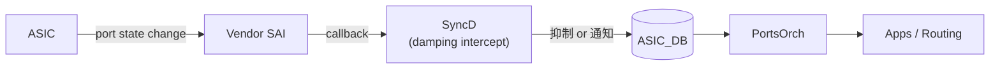

<!-- topics-tip -->
!!! tip "Topics で読み物として読む"
    この HLD は実装詳細を含みます。機能の概念・設定・運用を読み物として読みたい場合は [Topics 06 章: L2 / VLAN / LAG](../topics/06-l2-vlan-lag/index.md) を参照。
<!-- /topics-tip -->

!!! danger "裏取りステータス: Discrepancy-found（CLI 未実装）"
    swss 側は実装あり: `sonic-swss/orchagent/port/portschema.h` L101 で `PORT_DAMPING_ALGO = "link_event_damping_algorithm"`、`port.h` L288 / `portcnt.h` L251-282 / `portsorch.cpp` L3736 で `sai_redis_link_event_damping_algorithm_t` と AIED config 反映ロジックを確認、`tests/test_port.py` L437-482 でも `link_event_damping_algorithm = "aied" / "disabled"` の VS テストを確認。一方、**`sonic-utilities` 配下に `link_event_damping` をキーとする `config interface link_event_damping_algorithm` CLI のヒットが 0 件**、`sonic-buildimage` 配下にも対応する CLI plugin が見当たらず、HLD で要件化された CLI は現行 master 未取り込みである（verified at: 2026-05-09）。設定経路は `CONFIG_DB.PORT|<port>` への直接書き込み、または上位のマネジメントフレームワーク（YANG/REST）経由が必要となる可能性が高い。

<!-- diff-admonition -->
!!! diff "HLD と実装の差分"
    2026-05-11 時点の現行 master を裏取り。

    ### 1. ファイル + 行番号

    - **取り込み済み（SwSS）**: `sonic-net/sonic-swss` `orchagent/portsorch.cpp` L3736-L3760（`setPortLinkEventDampingAlgorithm` / `setPortLinkEventDampingAlgoAiedConfig`）、`orchagent/portsorch.cpp` L4939-L4941（差分検出）、`orchagent/port/porthlpr.cpp` L24, L133, L899-L900, L1345-L1373（`PortConfig` への 6 フィールドのパース）。
    - **取り込み済み（[YANG](../reference/glossary.md#term-yang)）**: `sonic-buildimage/src/sonic-yang-models/yang-models/sonic-port.yang` に `link_event_damping_algorithm` 系 leaf あり。
    - **未取り込み**: `sonic-utilities/config/main.py` および周辺に `link_event_damping_algorithm` の CLI ハンドラは無し（grep で `link_event_damping` のヒットは `sonic-swss` 配下のみ）。

    ### 2. 差分の中身

    [HLD](../reference/glossary.md#term-hld) は `config interface link_event_damping_algorithm <if> aied <max_suppress> <decay_half> <suppress_thr> <reuse_thr> <flap_penalty>` の click サブコマンド追加と、`config interface link_event_damping_algorithm <if> disabled` を要求している。`sonic-utilities` 側の取り込みが無いため、ユーザ経路は **[CONFIG_DB](../reference/glossary.md#term-config_db) の直接編集（`sonic-db-cli` / `redis-cli`）** または `config_db.json` への記述のみ。一方 SwSS 側は `PORT` テーブルからフィールドを読み取り、[SAI](../reference/glossary.md#term-sai) redis 属性 `SAI_REDIS_PORT_ATTR_LINK_EVENT_DAMPING_ALGORITHM` と `SAI_REDIS_PORT_ATTR_LINK_EVENT_DAMPING_ALGO_AIED_CONFIG` に変換するパスは完成している。

    ### 3. 読者への影響

    HLD どおりに `sudo config interface link_event_damping_algorithm Ethernet0 aied 40 30 1500 1300 1000` を打つと `Error: No such command "link_event_damping_algorithm".` で失敗する。ドキュメント主導で運用する読者が CLI 経由で機能を有効化できず、SAI 属性まで届かない。

    ### 4. 回避策

    `sonic-db-cli` で `PORT` テーブルを直接 update する（CLI 不要・即時反映）:

    ```bash
    sonic-db-cli CONFIG_DB hmset 'PORT|Ethernet0' \
        link_event_damping_algorithm aied \
        max_suppress_time 40 decay_half_life 30 \
        suppress_threshold 1500 reuse_threshold 1300 flap_penalty 1000
    ```

    `config_db.json` で永続化する場合は `PORT` セクションに 6 フィールドを記述。SwSS は 6 フィールドを **組として** 受けるので、欠落させると damping が disable になる点に注意（`porthlpr.cpp` L1345-L1373）。

    #### 関連 GitHub Issue / PR

    - [sonic-swss #2933: Add SWSS support for link event damping feature (merged)](https://github.com/sonic-net/sonic-swss/pull/2933) — AIED アルゴリズム取り込みの本体 PR。
    - [sonic-swss #2916: Implement link event damping SWSS component (closed)](https://github.com/sonic-net/sonic-swss/pull/2916) — 上記の先行 PR (closed)。
    - SyncD intercept 経路の完成度については追加トラッキング Issue 未確認。

<!-- /diff-admonition -->

## 概要

光トランシーバの汚れや不良ケーブルなどで [SerDes](../reference/glossary.md#term-serdes) の lock/unlock が繰り返されると、ポートの up/down トランジションが短時間に大量発生する（link flap）。[SONiC](../reference/glossary.md#term-sonic) ではこれらが SAI → SyncD → [ASIC_DB](../reference/glossary.md#term-asic_db) → PortsOrch → applications まで素通しに伝搬し、WCMP メンバ刈り取り・ルート再計算・broadcast 過多などの **下流負荷** を引き起こす[^1]。

本機能は **インタフェース単位で link up / down イベントを抑制（damping）** する仕組みを SONiC に追加する。多くの NOS で標準的な慣習で、SONiC では SyncD で intercept する形で実装される[^1]。

## 動作仕様

### 配置（SyncD で intercept）



- 既存: SAI から SyncD に来た state change がそのまま ASIC_DB に書かれる[^1]。
- 新方式: SyncD の **selectable loop** に link event damping ロジックを差し込み、抑制対象なら ASIC_DB 通知を **送らない**。
- 設定は CONFIG_DB の `PORT` テーブル → OA → `sai_redis_port_attr_t` 経由で SyncD へ。

将来的に SAI adapter または HW 側で damping を実装するベンダが現れた場合、OA は **`SAI_SWITCH_HOSTIF_OPER_STATUS_UPDATE_MODE`** で実装層を選び分ける[^1]。本提案では **`APPLICATION` mode 必須**（OA が hostif の oper-status を持つ）。SAI adapter 側で勝手に hostif を更新するモードでは抑制が効かない。

### AIED アルゴリズム（Additive Increase, Exponential Decrease）

各ポートに **accumulated penalty** 変数を持たせ、down イベントごとに `flap_penalty` を加算、時間とともに指数減衰させる[^1]。

| 設定 | 単位 | 意味 |
|------|------|------|
| `link_event_damping_algorithm` | enum | `disabled` / `aied`（既定 `disabled`）|
| `max_suppress_time` | sec | 最大抑制時間 |
| `decay_half_life`   | sec | penalty が半減する時間 |
| `suppress_threshold` | unitless | この値超で damping 開始 |
| `reuse_threshold`    | unitless | この値以下で damping 解除 |
| `flap_penalty`       | unitless | 1 down イベントあたりの penalty（既定 1000）|

制約[^1]:

- `decay_half_life ≤ max_suppress_time`
- `reuse_threshold ≤ suppress_threshold`
- 任意のフィールドが 0 だと「無効」扱い

#### Penalty ceiling

penalty は無制限に積めず、`max_suppress_time` を超えて damp し続けないよう **ceiling** で頭を打つ:

\[ \text{ceiling} = 2^{\frac{\text{max\_suppress\_time}}{\text{decay\_half\_life}}} \times \text{reuse\_threshold} \]

#### Damping timer

damping 中の解除予定時刻を計算する:

\[ t = -\text{decay\_half\_life} \times \log_2 \left( \frac{\text{reuse\_threshold}}{\text{accumulated\_penalty}} \right) \]

- damping 中に DOWN が来ると **timer がリセット** される
- UP イベントは penalty を増やさない（DOWN のみ加算）

### 動作のポイント

- **頻繁にフラップする interface ほど down で固定される時間が長くなる**。
- damping 解除時、最後に抑制した link UP は **即時 advertise** される[^1]。
- damping は「physical interface のイベント」を対象とし、netdev host interface の oper-status は OA が `SAI_HOSTIF_ATTR_OPER_STATUS` で post-damping 状態に追従させる[^1]。

### COUNTERS DB

各ポートで pre/post damping のトランジション数を持つ[^1]:

| カウンタ | 意味 |
|---------|------|
| pre-damping transitions | 受信した link event 総数 |
| post-damping transitions | applications に流した数 |
| pre-damping UP / DOWN | UP / DOWN 別の受信数 |
| post-damping UP / DOWN | UP / DOWN 別の advertise 数 |

更新は **イベントごとではなく定期更新**（負荷を抑える）[^1]。

### SAI / SAIREDIS 拡張

`saiswitch.h`[^1]:

```c
typedef enum _sai_switch_hostif_oper_status_update_mode_t {
    SAI_SWITCH_HOSTIF_OPER_STATUS_UPDATE_MODE_APPLICATION = 0,
    SAI_SWITCH_HOSTIF_OPER_STATUS_UPDATE_MODE_SAI_ADAPTER = 1,
} sai_switch_hostif_oper_status_update_mode_t;

SAI_SWITCH_ATTR_HOSTIF_OPER_STATUS_UPDATE_MODE  // 新規 switch 属性
```

`sairedis.h`[^1]:

```c
typedef enum _sai_link_event_damping_algorithm_t {
    SAI_LINK_EVENT_DAMPING_ALGORITHM_DISABLED = 0,
    SAI_LINK_EVENT_DAMPING_ALGORITHM_AIED     = 1,
} sai_link_event_damping_algorithm_t;

typedef struct _sai_redis_link_event_damping_algo_aied_config_t {
    sai_uint32_t max_suppress_time;
    sai_uint32_t suppress_threshold;
    sai_uint32_t reuse_threshold;
    sai_uint32_t decay_half_life;
    sai_uint32_t flap_penalty;
} sai_redis_link_event_damping_algo_aied_config_t;

// sai_redis_port_attr_t に 2 属性追加
SAI_REDIS_PORT_ATTR_LINK_EVENT_DAMPING_ALGORITHM
SAI_REDIS_PORT_ATTR_LINK_EVENT_DAMPING_ALGO_AIED_CONFIG  // valid-only AIED
```

<!-- evidence:
source: sonic-net/SONiC/doc/link_event_damping/Link-event-damping-HLD.md#L294-L356 (sha: 49bab5b5ff0e924f1ea52b3d9db0dfa4191a7c06)
excerpt: |
  typedef struct _sai_redis_link_event_damping_algo_aied_config_t {
    sai_uint32_t max_suppress_time;
    ...
  } ;
  typedef enum _sai_redis_port_attr_t {
    SAI_REDIS_PORT_ATTR_LINK_EVENT_DAMPING_ALGORITHM = SAI_PORT_ATTR_CUSTOM_RANGE_START,
    SAI_REDIS_PORT_ATTR_LINK_EVENT_DAMPING_ALGO_AIED_CONFIG,
  } ;
reasoning: SAIREDIS で port 単位の damping 設定を伝搬する API の根拠。
-->

<!-- evidence-rendered:start -->
??? note "📋 検証エビデンス: sonic-net/SONiC/doc/link_event_damping/Link-event-damping-HLD.md#L294-L356 (sha: 49bab5b5ff0e924f1ea52b3d9db0dfa4191a7c06)"

    **出典**:

    `sonic-net/SONiC/doc/link_event_damping/Link-event-damping-HLD.md#L294-L356 (sha: 49bab5b5ff0e924f1ea52b3d9db0dfa4191a7c06)`

    **抜粋**:

    ```text
    typedef struct _sai_redis_link_event_damping_algo_aied_config_t {
      sai_uint32_t max_suppress_time;
      ...
    } ;
    typedef enum _sai_redis_port_attr_t {
      SAI_REDIS_PORT_ATTR_LINK_EVENT_DAMPING_ALGORITHM = SAI_PORT_ATTR_CUSTOM_RANGE_START,
      SAI_REDIS_PORT_ATTR_LINK_EVENT_DAMPING_ALGO_AIED_CONFIG,
    } ;
    ```

    **判断根拠**: SAIREDIS で port 単位の damping 設定を伝搬する API の根拠。

<!-- evidence-rendered:end -->

## 設定

### 関連する CONFIG_DB

`PORT` テーブルに 6 フィールド追加[^1]:

```text
PORT|<port>
  link_event_damping_algorithm = "disabled" | "aied"
  max_suppress_time            = uint32 (sec)
  decay_half_life              = uint32 (sec)
  suppress_threshold           = uint32
  reuse_threshold              = uint32
  flap_penalty                 = uint32
```

例:

```json
"PORT": {
  "Ethernet0": {
    "link_event_damping_algorithm": "aied",
    "max_suppress_time": "40",
    "decay_half_life": "30",
    "suppress_threshold": "1500",
    "reuse_threshold": "1300",
    "flap_penalty": "1000"
  }
}
```

### 関連する CLI

`sonic-port` YANG にも leaf を追加（既定値 0 / `"disabled"`）[^1]。

```bash
config interface link_event_damping_algorithm <if> aied <max_suppress> <decay_half> <suppress_thr> <reuse_thr> <flap_penalty>
config interface link_event_damping_algorithm <if> disabled
```

例[^1]:

```bash
sudo config interface link_event_damping_algorithm Ethernet0 aied 40 30 1500 1300 1000
sudo config interface link_event_damping_algorithm Ethernet0 disabled
```

## 制限事項

- **vendor SAI が `APPLICATION` mode 必須**: SAI adapter モードや非対応プラットフォームでは feature が enable されない[^1]。
- **設定の一括反映**: 6 フィールドは **transformer に組として渡される**。中途半端な設定は無効と見なされ damping が disable[^1]。
- **damping 中の DOWN は timer リセット**: 連続 DOWN で抑制時間が伸びる挙動。意図しない長時間抑制を避けるため `max_suppress_time` で上限を設ける[^1]。
- **SyncD intercept なので vendor SAI 通知の到達タイミングに依存**: 高頻度フラップでは SAI コールバックの inflight キューを溜める可能性。

## 干渉する機能

- **WCMP / [ECMP](../reference/glossary.md#term-ecmp) 系**: 本機能の主要恩恵元。post-damping だけが PortsOrch → ルーティング層に届く。
- **PortsOrch / hostif**: OA が `SAI_HOSTIF_ATTR_OPER_STATUS` で netdev oper-state を post-damping に揃える[^1]。netdev 状態を見る他コードパスにも影響。
- **port flap counter / 既存 stats**: pre / post damping を別カウンタで持つので分析時に区別が必要[^1]。
- **Warm/Fast boot**: HLD 内に Warmboot 影響セクションあり（本ページでは省略、原文参照）。

## トラブルシューティング

- damping が効かない: SAI 設定が `APPLICATION` mode かを確認。`sairedis.h` の port 属性が SyncD まで届いているか確認。
- 期待より長く down のまま: 連続 DOWN で timer がリセットされている。`max_suppress_time` と decay の関係を再計算。
- pre / post counter が乖離する: 抑制が効いている証拠。差分が大きい場合は flap 多発を疑う。

### コマンド例

link event damping の有効状態とカウンタを確認する。

```bash
show interfaces link-event-damping
redis-cli -n 4 keys 'PORT|Ethernet*' | head
show interfaces counters errors
```

<!-- phase-boundary -->

## 実装フェーズ境界

!!! info "Phase 別の実装済 / 未実装 サマリ"
    本ページは `monitor: partially_implemented` で、HLD で示された一連の機能
    が **段階的に取り込まれている** 状態を扱う。フェーズ毎の実装境界を
    1 枚の表に集約する (詳細は本ページ上部の `diff` admonition および
    [discrepancy-index](../reference/verification/discrepancy-index.md) を参照)。

    | Phase | 範囲 (機能 / 段階) | 実装済 (master 取り込み済) | 未実装 (HLD 提案のみ) |
    |---|---|---|---|
    | Phase 1 — 基本機能 | HLD §概要 / §設計の中核ユースケース | 取り込み済 — 本ページの「実装の概観」「実装詳細」節および `diff` admonition の現状側を参照 | — (Phase 1 は実装済) |
    | Phase 2 — 拡張機能 | HLD §拡張 / §追加要件 / §周辺統合 | 一部のみ取り込み済 — 本ページ「実装詳細」の補足参照 | 未実装 / 未マージ — HLD §未対応箇所、本ページ「制限事項」および `diff` admonition の差分側に列挙 |
    | Phase 3 — 将来拡張 | HLD §Future Work / §将来課題 | — | 未実装 — HLD 提案段階。対応 PR は確認されていない (last_verified 時点) |

    凡例: 「実装済」=現行 master で動作確認できる範囲 / 「未実装」=HLD には記載があるが対応 PR が未マージまたは設計のみで code が存在しない範囲。
<!-- /phase-boundary -->

## 実装との乖離

`monitor: partially_implemented` — 部分実装 — HLD の中核は実装済みだが、フィールド / API / 制約のいくつかが上流に未取り込み、または挙動が緩和されている。 本ページ末尾近くの `!!! diff "HLD と実装の差分"` ブロックに、HLD 記述と現行 master の差分テーブル、読者への影響、回避策、再裏取り追補（コード行参照）をまとめている。本セクションはその概要見出しであり、詳細はそのブロックを参照のこと。

## 引用元

[^1]: `sonic-net/SONiC` `doc/link_event_damping/Link-event-damping-HLD.md` @ `49bab5b5ff0e924f1ea52b3d9db0dfa4191a7c06`

<!-- next-action -->
## このページを読んだ後の次アクション

!!! tip "読み手向け"
    - **本機能を実運用で使う場合**: 取り込み済の部分のみ運用可能。欠落部分の利用は不可なので本文「実装との乖離」を確認した上で適用範囲を限定する
    - **upstream 動向を追う場合**: 関連 issue / PR を [sonic-net/SONiC](https://github.com/sonic-net/SONiC) で検索（HLD タイトル / CONFIG_DB テーブル名 / Orch クラス名で grep するのが速い）
    - **代替手段 / 関連 reference**:
        - [CONFIG_DB: PORT](../reference/config-db/port.md)
        - [YANG: `sonic-port`](../reference/yang/sonic-port.md)

!!! note "本ドキュメントの追跡"
    - monitor: `partially_implemented` / last_verified: `2026-05-09`
    - 次回再裏取りトリガ: quarterly。一覧は [discrepancy-index](../reference/verification/discrepancy-index.md) を参照（運用詳細は repo の `meta/discrepancy-operations.md`）

<!-- /next-action -->

<!-- topics-back-ref -->
## 関連 Topics

- [Topics: L2 / VLAN / LAG / MC-LAG](../topics/06-l2-vlan-lag/index.md)

<!-- /topics-back-ref -->

## 参考リンク

本ページに関連する参照ドキュメント:

- [`config interface link_event_damping_algorithm` CLI リファレンス](../reference/cli/config-interface.md)
- [`PORT` CONFIG_DB スキーマ](../reference/config-db/port.md)
- [`sonic-port` YANG モジュール](../reference/yang/sonic-port.md)

<!-- augmented-links: v1 -->

<!-- glossary-links-injected: 8ba32e5aa69d -->
