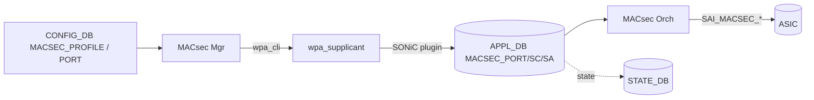

!!! success "裏取りステータス: Code-verified（基本構成のみ）"
    現行 master の `sonic-swss/orchagent/macsecorch.cpp` で `PAUSE_ETHER_TYPE 0x8808`、`PFC_MODE_BYPASS` を確認（PFC バイパス ACL の実装）。`macsecmgr` / `macsecorch` モジュール、`docker-macsec/etc/wpa_supplicant.conf` も存在。XPN / proactive SAK refresh / 可変 max-SA の wpa_supplicant 拡張は別パッチ系列で取り込まれている。詳細は元 HLD 参照（verified at: 2026-05-09）。

# MACsec on SONiC（wpa_supplicant + MACsec Mgr/Orch + SAI）

## 概要

IEEE 802.1AE / 802.1X-2010 準拠の **MACsec（Layer 2 暗号化）** を SONiC に実装する設計[^1]。`wpa_supplicant` を MACsec Key Agreement (MKA) のキー管理プレーンとして使い、SONiC 専用 plugin が SA (Security Association) を APPL_DB に書き出す。`MACsec Orch` が SAI MACsec オブジェクトに変換して ASIC を programming する。

機能は phase 分けされ、Phase IV まで規定されている：基本 → PFC 連携 → CLI / scale → ACL / multi-tenant 等[^1]。

## 動作仕様

### コンポーネント



### CONFIG_DB

```text
MACSEC_PROFILE|<profile_name>
    priority         = uint
    cipher_suite     = "GCM-AES-128" | "GCM-AES-256" | "GCM-AES-XPN-128" | "GCM-AES-XPN-256"
    primary_cak      = hex
    primary_ckn      = hex
    fallback_cak     = hex          ; OPTIONAL
    fallback_ckn     = hex          ; OPTIONAL
    policy           = "security" | "integrity_only"
    enable_replay_protect = bool
    replay_window    = uint
    send_sci         = bool
    rekey_period     = uint         ; seconds

PORT|<ifname>
    macsec = <profile_name>          ; OPTIONAL
```

### APPL_DB / STATE_DB

```text
APPL_DB:MACSEC_PORT_TABLE:<ifname>             ; port enable
APPL_DB:MACSEC_EGRESS_SC_TABLE:<ifname>:<sci>  ; SC 1 つ（Egress）
APPL_DB:MACSEC_INGRESS_SC_TABLE:<ifname>:<sci> ; 複数 SC（Ingress）
APPL_DB:MACSEC_EGRESS_SA_TABLE:<ifname>:<sci>:<an>  ; SA, AN ∈ 0..3
APPL_DB:MACSEC_INGRESS_SA_TABLE:<ifname>:<sci>:<an>
```

各 SA エントリは `sak`（Secure Association Key, 16/32 byte）と `lowest_acceptable_pn` 等のパケット番号情報を持つ。STATE_DB は同形式で oper 状態を返す[^1]。

### MKA キー管理（wpa_supplicant 拡張）

SONiC は `wpa_supplicant` を MKA エンドポイントとして使うが、HLD 時点で次の拡張を行っている[^1]：

- **XPN サポート**（GCM-AES-XPN-128/256）
- **Proactive SAK refresh**（タイマや PN 余命でリキー）
- **Configurable max SAs per SC**（デフォルト 4 から伸ばす）

SONiC 用の plugin が wpa_supplicant 内のイベント（SAK install / remove）を APPL_DB に流し込む。

### MACsec Orch

`MACsec Orch` は APPL_DB を購読し、SAI MACsec API を呼ぶ：

- `MACSEC_PORT` 作成 (Ingress / Egress 各 1)
- `MACSEC_FLOW` ↔ ACL_ENTRY バインディング（Ingress / Egress）
- `MACSEC_SC` 作成（SCI / cipher suite / replay window 等）
- `MACSEC_SA` 作成（SAK / AN / 入次パケット番号）

Flex Counter で SA × Direction 単位の ingress/egress count、replay drops、IC drops 等を polling する。

### PFC との相互作用

MACsec の暗号化対象から PFC フレームを除外する必要があり、Egress 側に PFC バイパス用 ACL（`ETHER_TYPE = 0x8808`）を入れる設計[^1]。Ingress 側も同様。PFC 用 counter は MACsec とは独立に維持する。

## 設定

### 関連する CONFIG_DB

| Table | 説明 |
|-------|------|
| `MACSEC_PROFILE` | 暗号スイート / CAK / CKN / リキー設定 |
| `PORT` | ポートに `macsec` プロファイル名 |

### 関連する CLI

```text
config macsec profile add <name> --cipher_suite <suite> --primary_cak <cak> --primary_ckn <ckn> ...
config macsec profile del <name>
config macsec port add <ifname> <profile>
config macsec port del <ifname>
show macsec
show macsec <ifname>
```

詳細サブコマンドは HLD §5（CLI）参照。

### 関連する YANG

HLD は YANG モデル名を明示していない（実装側で追加予定の `sonic-macsec` 系モジュールを想定）。

### 設定例

```bash
sudo config macsec profile add p1 --cipher_suite GCM-AES-XPN-256 \
    --primary_cak <hex> --primary_ckn <hex> --rekey_period 7200
sudo config macsec port add Ethernet0 p1
show macsec Ethernet0
```

## 制限事項

- HLD は 60KB 超。詳細フロー（Init / Create SC / Create SA / Disable SA / Deinit Port）は HLD §4 を参照。
- SAI MACsec オブジェクトのプラットフォームサポート（Broadcom / Mellanox / Cisco 等）に依存。Virtual MACsec SAI も HLD §3.4.5 で扱う。
- `wpa_supplicant` 側に SONiC 拡張パッチが必要。upstream wpa_supplicant のバージョン互換に注意。
- PFC との相互作用は ACL ベースのバイパスで対応。プラットフォーム依存の細かいタイミング差あり。
- 詳細は HLD `doc/macsec/MACsec_hld.md` を参照。

## 干渉する機能

- **PFC**: 0x8808 EtherType を MACsec 暗号化からバイパスするため ACL を 1 つ占有[^1]。
- **ACL**: 上記 PFC バイパス、および MACsec フロー用の ACL_ENTRY を MACsec Orch が暗黙に作る。
- **Counter (FlexCounter)**: SA 単位の counter polling。COUNTERS_DB に大量のエントリが追加される。
- **Warm reboot**: SAK と SA は揮発させて再生成する設計（HLD で warm 中の挙動説明あり）。

## トラブルシューティング

- MKA で peer 確立しない → wpa_supplicant のログ（`docker exec macsec cat /var/log/wpa_supplicant.log`）で MKA バーボーズログを確認。
- 暗号化されているように見えない → `redis-cli -n 1 keys 'ASIC_STATE:SAI_OBJECT_TYPE_MACSEC_*'` で SAI オブジェクトが作られているかを確認。
- PFC が止まる → MACsec 適用後に PFC バイパス ACL が正しく入ったかを `show acl-entry` 系で確認。

## 引用元

[^1]: `sonic-net/SONiC` `doc/macsec/MACsec_hld.md` @ `49bab5b5ff0e924f1ea52b3d9db0dfa4191a7c06`
