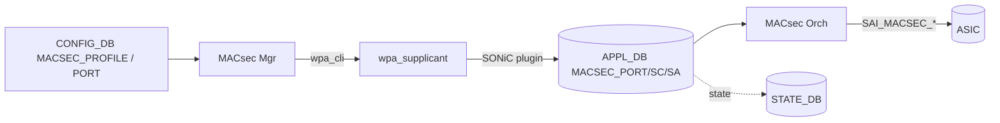

<!-- topics-tip -->
!!! tip "Topics で読み物として読む"
    この HLD は実装詳細を含む。機能の概念・設定・運用を読み物として読みたい場合は [Topics 06 章: L2 / VLAN / LAG](../topics/06-l2-vlan-lag/index.md) を参照。
<!-- /topics-tip -->

!!! success "裏取りステータス: code-verified（基本構成のみ）"
    現行 master の `sonic-swss/orchagent/macsecorch.cpp` で `PAUSE_ETHER_TYPE 0x8808`（L26）、`PFC_MODE_BYPASS`（L29）、PFC バイパス ACL を構築する分岐（L3120）を確認[^pfc-bypass]。`cfgmgr/macsecmgr.cpp` の `MACsecProfile::update`（L356-L393）で `cipher_suite` / `primary_cak` / `primary_ckn` を必須、`fallback_cak` / `fallback_ckn` / `rekey_period` / `send_sci` / `replay_window` / `enable_replay_protect` をオプションとして受理[^macsecmgr-fields]。`docker-macsec/etc/wpa_supplicant.conf` および MACsec Orch の XPN ハンドリング（`SAI_MACSEC_SA_ATTR_CONFIGURED_EGRESS_XPN` / `MINIMUM_INGRESS_XPN`）も存在。`wpa_supplicant` 側 SONiC 拡張パッチの取り込み具合は本リポでは未追跡（裏取り日は frontmatter `last_verified` を参照）。

# MACsec on SONiC（wpa_supplicant + MACsec Mgr/Orch + SAI）

## 読み手が知りたいこと

1. [SONiC](../reference/glossary.md#term-sonic) で [MACsec](../reference/glossary.md#term-macsec) を有効化すると **どのコンポーネントが動く** のか？
2. **[CONFIG_DB](../reference/glossary.md#term-config_db) に何を入れれば** 暗号化が始まるのか？
3. MKA（キー交換）は誰がやるのか？ なぜ **`wpa_supplicant` 拡張版** が必要なのか？
4. **[PFC](../reference/glossary.md#term-pfc)** や **[ACL](../reference/glossary.md#term-acl)** との相互作用は？
5. **トラブル時** に最初に見るべきログ / DB は？

## 1. 何が動くか（コンポーネント）

IEEE 802.1AE / 802.1X-2010 準拠の **Layer 2 暗号化** を実装する設計[^1]。HLD §1.1 で Phase I-IV まで段階規定されているが、現行 master の `macsecmgr` / `macsecorch` で確認できる範囲では Phase II-IV の SONiC 側 ([orchagent](../reference/glossary.md#term-orchagent) / cfgmgr) 要素は既に実装済みで、`wpa_supplicant` 拡張側の取り込みは別パッチ系列扱いで本リポでは未追跡。

### Phase 別 実装ステータス

HLD §1.1 [^1] の Phase 規定と、`sonic-swss` master で観測できる実装の対応:

| Phase | HLD 上の主要要求 | SONiC swss 側の状態 |
|-------|------------------|---------------------|
| I | GCM-AES-128/256、[PortChannel](../reference/glossary.md#term-portchannel) 同居、SAK 無停止入れ替え | `macsecorch` で SAI MACsec_PORT/SC/SA を生成、`macsecmgr` が `cipher_suite` 必須として受理[^macsecmgr-fields] |
| II | XPN（GCM-AES-XPN-128/256）、Proactive SAK refresh、`config macsec` CLI、`show macsec`、PFC バイパス | `SAI_MACSEC_CIPHER_SUITE_GCM_AES_XPN_128/256` 分岐 (macsecorch.cpp L1614-L1620、L2268-L2284)、`PFC_MODE_BYPASS` 用 ACL 生成 (L3120)[^pfc-bypass] |
| III | primary / fallback CAK 同時保持 | `macsecmgr` が `fallback_cak` / `fallback_ckn` をオプションで受理[^macsecmgr-fields] |
| IV | `send_sci` / `replay_protect` / `replay_window` / `rekey_period` のオンザフライ更新 | `macsecmgr` が `send_sci` / `enable_replay_protect` / `replay_window` / `rekey_period` フィールドを解釈[^macsecmgr-fields]。「オンザフライ更新」可否は wpa_supplicant 側に依存し本リポでは未確認 |

「`wpa_supplicant` 側 SONiC 拡張」（XPN サポート / proactive rekey / max-SA 可変）は upstream 非対応で別パッチ系列。本ページの code-verified 範囲は SONiC 側 (`macsecmgr` / `macsecorch` / SAI) に限る。



役割:

- **MACsec Mgr**: CONFIG_DB を読み `wpa_supplicant` を起動・制御
- **wpa_supplicant（SONiC 拡張）**: MKA（Key Agreement）の peer を確立し、SAK（Secure Association Key）を生成
- **SONiC plugin**: wpa_supplicant のイベント（SAK install/remove）を [APPL_DB](../reference/glossary.md#term-appl_db) に書く
- **MACsec Orch**: APPL_DB を購読し [SAI](../reference/glossary.md#term-sai) MACsec API を呼ぶ
- **[ASIC](../reference/glossary.md#term-asic)（SAI MACsec）**: 実際の暗号化・復号

## 2. 設定（CONFIG_DB と CLI）

### CONFIG_DB

```text
MACSEC_PROFILE|<profile_name>
    priority         = uint
    cipher_suite     = "GCM-AES-128" | "GCM-AES-256" | "GCM-AES-XPN-128" | "GCM-AES-XPN-256"
    primary_cak      = hex
    primary_ckn      = hex
    fallback_cak     = hex          ; OPTIONAL
    fallback_ckn     = hex          ; OPTIONAL
    policy           = "security" | "integrity_only"
    enable_replay_protect = bool
    replay_window    = uint
    send_sci         = bool
    rekey_period     = uint         ; seconds

PORT|<ifname>
    macsec = <profile_name>          ; OPTIONAL
```

### CLI

```text
config macsec profile add <name> --cipher_suite <suite> --primary_cak <cak> --primary_ckn <ckn> ...
config macsec profile del <name>
config macsec port add <ifname> <profile>
config macsec port del <ifname>
show macsec [<ifname>]
```

### 設定例

```bash
sudo config macsec profile add p1 --cipher_suite GCM-AES-XPN-256 \
    --primary_cak <hex> --primary_ckn <hex> --rekey_period 7200
sudo config macsec port add Ethernet0 p1
show macsec Ethernet0
```

## 3. MKA キー管理（wpa_supplicant 拡張）

SONiC は `wpa_supplicant` を MKA エンドポイントとして使う。[HLD](../reference/glossary.md#term-hld) 時点で **upstream に無い拡張** を施している[^1]:

- **XPN サポート**（GCM-AES-XPN-128/256）
- **Proactive SAK refresh**（タイマや PN 余命でリキー）
- **Configurable max SAs per SC**（デフォルト 4 から伸ばす）

plugin が wpa_supplicant 内のイベントを APPL_DB に流す。

## 4. SAI 反映（MACsec Orch）

`MACsec Orch` は APPL_DB を購読し SAI MACsec API を呼ぶ:

- `MACSEC_PORT` 作成（Ingress/Egress 各 1）
- `MACSEC_FLOW` ↔ `ACL_ENTRY` バインディング
- `MACSEC_SC`（SCI / cipher suite / replay window）
- `MACSEC_SA`（SAK / AN ∈ 0..3 / 入次パケット番号）

Flex Counter で SA × Direction 単位の ingress/egress count、replay drops、IC drops を polling。

APPL_DB / [STATE_DB](../reference/glossary.md#term-state_db) 形式:

```text
APPL_DB:MACSEC_PORT_TABLE:<ifname>
APPL_DB:MACSEC_EGRESS_SC_TABLE:<ifname>:<sci>       ; Egress 1 SC
APPL_DB:MACSEC_INGRESS_SC_TABLE:<ifname>:<sci>      ; Ingress 複数 SC
APPL_DB:MACSEC_EGRESS_SA_TABLE:<ifname>:<sci>:<an>  ; AN ∈ 0..3
APPL_DB:MACSEC_INGRESS_SA_TABLE:<ifname>:<sci>:<an>
```

各 SA は `sak`（16/32 byte）+ `lowest_acceptable_pn` を保持[^1]。

## 5. 他機能との干渉

| 機能 | 影響 |
|------|------|
| **PFC** | `ETHER_TYPE=0x8808` フレームを暗号化対象から外すため Ingress/Egress に PFC バイパス ACL を追加[^pfc-bypass]。PFCWD / buffer-pool / buffer-profile などは MACsec とは独立に動作（本 HLD のスコープ外） |
| **ACL** | PFC バイパス + MACsec フロー用 ACL_ENTRY を MACsec Orch が暗黙に作成 |
| **[FlexCounter](../reference/glossary.md#term-flexcounter)** | SA 単位 counter polling で [COUNTERS_DB](../reference/glossary.md#term-counters_db) に大量 entry |
| **Warm reboot** | SAK / SA は揮発し再生成する設計 |

## 6. トラブルシューティング

| 症状 | 最初に見る場所 |
|------|---------------|
| MKA で peer 確立しない | `docker exec macsec cat /var/log/wpa_supplicant.log` |
| 暗号化されない | `redis-cli -n 1 keys 'ASIC_STATE:SAI_OBJECT_TYPE_MACSEC_*'` で SAI オブジェクト確認 |
| PFC が止まる | MACsec 適用後の PFC バイパス ACL を `show acl-entry` 系で確認 |

### コマンド例

MACsec セッション (CA, SA) の状態と統計を確認する。

```bash
show macsec
docker exec macsec wpa_cli status 2>/dev/null | head
redis-cli -n 4 keys 'MACSEC_PROFILE|*'
redis-cli -n 1 keys 'ASIC_STATE:SAI_OBJECT_TYPE_MACSEC_*'
```

## 制限事項

- HLD は 60KB 超。詳細フロー（Init / Create SC / Create SA / Disable SA / Deinit Port）は HLD §4 参照
- SAI MACsec オブジェクトはプラットフォーム依存。Virtual MACsec SAI は HLD §3.4.5
- `wpa_supplicant` 側に SONiC 拡張パッチが必要。upstream バージョン互換に注意

## 既知の問題

### MACsec ポートと LAG の組み合わせ制約（#790）

MACsec を [LAG](../reference/glossary.md#term-lag) と組み合わせる場合には以下の制約がある。

1. **ハイブリッド LAG 非サポート（初期フェーズ）**: MACsec 有効ポートと無効ポートを同一 LAG に混在させることは初期実装では未サポート
2. **LAG インターフェースへの MACsec 適用**: `MACSEC_PROFILE` を LAG インターフェースに設定した場合、SONiC 内部でメンバーポートに変換する実装が必要。これは ACL の LAG 適用と同様のアプローチ（SAI が iterate しメンバーポートに適用）
3. **MACsec セッション再ネゴシエーション**: LAG にポートを追加/削除する際、MACsec セッションの再ネゴシエーションが発生する可能性がある

- 参照: [sonic-net/SONiC#790](https://github.com/sonic-net/SONiC/issues/790)
- [YANG](../reference/glossary.md#term-yang) モデル名は HLD では未明示（実装側で追加予定の `sonic-macsec` 系を想定）

## 引用元

[^1]: `sonic-net/SONiC` `doc/macsec/MACsec_hld.md` @ `49bab5b5ff0e924f1ea52b3d9db0dfa4191a7c06`
[^pfc-bypass]: `sonic-net/sonic-swss` `orchagent/macsecorch.cpp` L26（`PAUSE_ETHER_TYPE 0x8808`）, L29（`PFC_MODE_BYPASS`）, L3120（`pfc_mode == PFC_MODE_BYPASS` 分岐で `SAI_ACL_ENTRY_ATTR_FIELD_ETHER_TYPE = 0x8808` を持つ ACL エントリを生成）
[^macsecmgr-fields]: `sonic-net/sonic-swss` `cfgmgr/macsecmgr.cpp` `MACsecProfile::update` (L356-L393): 必須フィールド `cipher_suite` / `primary_cak` / `primary_ckn`、オプション `fallback_cak` / `fallback_ckn` / `enable_replay_protect` / `replay_window` / `send_sci` / `rekey_period` / `priority` / `policy`

<!-- topics-back-ref -->
## 関連 Topics

- [Topics: ACL / CoPP / Mirror](../topics/07-acl-copp-mirror/index.md) — PFC バイパス ACL の運用観点
- [Topics: Reference Index](../topics/22-reference-index/index.md)
- [Topics: Security / AAA / FIPS / Hardening](../topics/15-security-aaa/index.md)

<!-- /topics-back-ref -->

<!-- glossary-links-injected: 50927980e907 -->
