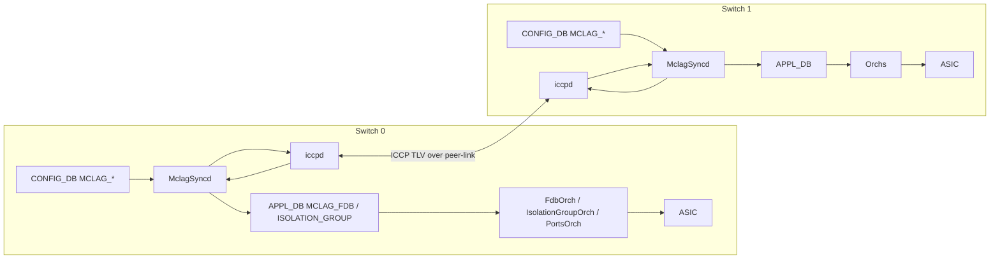
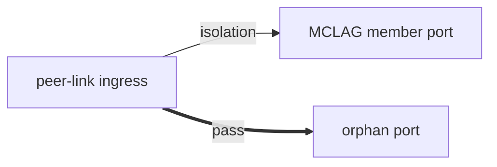

# MCLAG Enhancements 概念

このページは [MCLAG Enhancements（概要ハブ）](mclag-enhancements.md) の派生で、**7 軸の機能拡張をユースケース観点で整理** する。実装詳細は [mclag-enhancements-internals.md](mclag-enhancements-internals.md)、CLI / 運用は [mclag-enhancements-operations.md](mclag-enhancements-operations.md) を参照。

!!! success "裏取りステータス: code-verified"
    スキーマ名・SAI 属性・テーブル定義は `sonic-swss-common/common/schema.h`・`sonic-swss/orchagent/fdborch.cpp`・`sonic-swss/mclagsyncd/mclaglink.cpp` で確認済み。

## 1. なぜ拡張するのか

オリジナルの [SONiC](../reference/glossary.md#term-sonic) [MCLAG](../reference/glossary.md#term-mclag) は `config_db.json` 直書きで起動時にしか反映できず、また static MAC 同期 / L3 プロトコル / BUM 制御に弱点があった。本 [HLD](../reference/glossary.md#term-hld) はこれらを 7 軸で塞ぐ[^1]。

| # | 軸 | 解決したい問題 |
|---|----|----------------|
| 1 | dynamic config | `config_db.json` 編集 + 再起動なしで MCLAG domain / interface を [CONFIG_DB](../reference/glossary.md#term-config_db) から操作したい |
| 2 | timer 設定 | keep-alive (default 1s) / session-timeout (default 15s) が hardcode で運用上柔軟性に欠ける |
| 3 | static MAC support | 旧版は [FDB](../reference/glossary.md#term-fdb) TLV で static フラグを送らず、peer に static として伝播しない |
| 4 | aging disable | peer 学習 MAC が local aging で消える → 再学習トリガで transient flooding |
| 5 | MAC sync 最適化 | 60s 周期 polling、linked list、32B 文字列 MAC など scale (40K MAC / 4K VLAN) に耐えない |
| 6 | isolation group | peer-link 経由の duplicate BUM 抑止が egress [ACL](../reference/glossary.md#term-acl) ベースで非効率 |
| 7 | unique IP | MCLAG [VLAN](../reference/glossary.md#term-vlan) interface が同一 IP 必須 → OSPF / [BGP](../reference/glossary.md#term-bgp) / [BFD](../reference/glossary.md#term-bfd) などの L3 隣接が成立しない |

## 2. 全体構造（再掲）

要点[^1]:

- 設定経路は `CONFIG_DB → MclagSyncd → ICCPd`（旧 `config_db.json` 起動時読み込みは deprecated）
- データ経路は `ICCPd → MclagSyncd → APPL_DB(MCLAG_FDB/ISOLATION_GROUP) → FdbOrch/IsolationGroupOrch → ASIC`
- 旧 MclagSyncd 内部 FDB cache は廃止、[APPL_DB](../reference/glossary.md#term-appl_db) の `MCLAG_FDB_TABLE` に集約

## 3. Dynamic configuration（軸 1）

旧版は MCLAG docker 起動 **前** に `config_db.json` に MCLAG 設定を書き込む必要があった。enhancement では以下を実現[^1]:

- MclagSyncd が `CONFIG_DB` の `MCLAG_DOMAIN` / `MCLAG_INTERFACE` を SubscriberStateTable で監視
- 設定変化を ICCPd に message で通知
- MCLAG interface の **pre-provisioning**（[PortChannel](../reference/glossary.md#term-portchannel) 作成前に MCLAG メンバ宣言可能）

## 4. Keep-alive / session timeout（軸 2）

| パラメータ | 範囲 | デフォルト | 制約 |
|-----------|------|----------|------|
| `keepalive_interval` | 1–60 秒 | 1 秒 | — |
| `session_timeout` | 3–3600 秒 | 15 秒 | keep-alive の整数倍、かつ 3 倍以上推奨[^1] |

ユースケース: WAN 中継のように RTT が大きい場合に keep-alive を緩めて誤フェイルオーバを防ぐ。

## 5. Static MAC support（軸 3）

- ローカル設定の static MAC を FDB TLV の **static フラグ付き** で peer に送出
- 削除時は withdraw
- remote static が存在する宛先への dynamic MAC move は FdbOrch が **拒否**（後述 internals 参照）

ユースケース: server NIC bonding で fixed MAC を持つ機器を MCLAG 配下に置く構成、HSRP / [VRRP](../reference/glossary.md#term-vrrp) gateway MAC のような fixed L2 destination。

## 6. Aging disable（軸 4）

旧版は ICCP 由来 MAC を dynamic として programming → aging timer 経過で削除 → trafficが来ると再学習 → ICCPd 再 program、というループが BUM flooding を起こしていた。

新版は ICCP 由来 MAC に SAI 属性 `SAI_FDB_ENTRY_ATTR_ALLOW_MAC_MOVE` を立て、aging は無効化しつつ legitimate な MAC move は許容する[^1]。

## 7. MAC sync 最適化（軸 5）

| 旧 | 新 |
|----|----|
| 60 秒周期 polling | event-driven |
| ICCPd 内部 FDB cache + MclagSyncd 内部 FDB cache | MclagSyncd cache 廃止、APPL_DB `MCLAG_FDB_TABLE` 1 本に集約 |
| linked list | binary tree（add/del/lookup O(log n)） |
| MAC を 32 byte 文字列で TLV 化 | 6 byte バイナリで TLV 化 |
| local orphan port で peer 学習 MAC の age 通知を毎回 peer に送り返し | 自分が learner でない MAC の age 通知抑止 |

40K MAC / 4K VLAN scale 目標を達成する基盤[^1]。

## 8. Isolation group（軸 6）

BUM (Broadcast / Unknown unicast / Multicast) traffic が peer-link 経由で MHD（Multi-Homed Device）に届き、ローカル MCLAG メンバ port 経由とで **重複** するのを防ぐ。

旧版: egress ACL で MCLAG メンバ port 上での重複を drop（後付け、性能不利）
新版: ingress isolation group。peer-link を ingress とする traffic のうち、MCLAG メンバ port 宛のものを **ingress でドロップ**[^1]

[SAI](../reference/glossary.md#term-sai) は `SAI_ISOLATION_GROUP_TYPE_BRIDGE_PORT` を 1 つ確保、メンバ port の `SAI_BRIDGE_PORT_ATTR_ISOLATION_GROUP` 属性に紐付ける[^1]。platform が isolation group を未サポートの場合は既存 ACL 方式に fallback。

## 9. Unique IP（軸 7）

旧版は MCLAG VLAN interface に **両 peer で同一 IP** が必須で、`active/active` で gateway を提供できるが、OSPF / BGP / BFD のような **個別 router を識別する L3 プロトコルは隣接が成立しない**。

新版で MCLAG VLAN interface に **peer ごとに別 IP** を許可する `MCLAG_UNIQUE_IP` テーブルを追加[^1]:

- Standby 側で active 側 MAC を My-Station [TCAM](../reference/glossary.md#term-tcam) に program しない
- VLAN interface MAC を peer 間で sync、L2 table に peer MAC → peer-link で program
- [ARP](../reference/glossary.md#term-arp) / ND を local VLAN interface IP について sync

ユースケース[^1]:

- peer 同士で BGP / BFD を VLAN interface 上に張る
- peer ↔ MCLAG client device の間で BGP / BFD を張る
- gateway としては別途 SAG (Static Anycast Gateway) または VRRP が必須（dataplane 用）

## 引用元

[^1]: `sonic-net/SONiC` `doc/mclag/MCLAG_Enhancements_HLD.md` @ `49bab5b5ff0e924f1ea52b3d9db0dfa4191a7c06`

<!-- topics-back-ref -->
## 関連 Topics

- [Topics: L2 / VLAN / LAG / MC-LAG](../topics/06-l2-vlan-lag/index.md)
- [Topics: Dual ToR](../topics/05-dual-tor/index.md)

<!-- /topics-back-ref -->

<!-- glossary-links-injected: 601242a17776 -->
