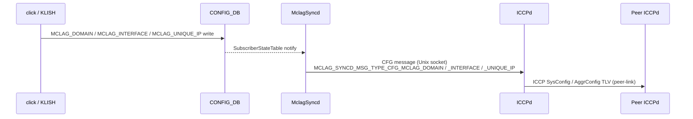
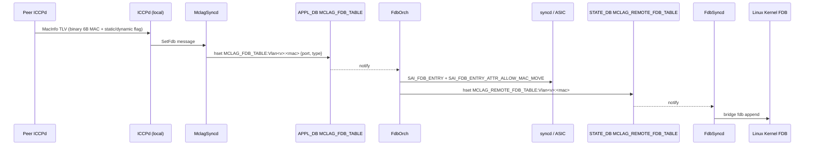

# MCLAG Enhancements 内部実装

このページは [MCLAG Enhancements（概要ハブ）](mclag-enhancements.md) の派生で、**daemon / orch 単位の実装** を扱う。概念は [mclag-enhancements-concepts.md](mclag-enhancements-concepts.md)、CLI / 運用は [mclag-enhancements-operations.md](mclag-enhancements-operations.md) を参照。

!!! success "裏取りステータス: code-verified"
    iccpd: `sonic-buildimage/src/iccpd/src` / mclagsyncd: `sonic-swss/mclagsyncd/mclaglink.cpp` (1964 行) / FdbOrch: `sonic-swss/orchagent/fdborch.cpp` / IsolationGroupOrch: `sonic-swss/orchagent/isolationgrouporch.cpp` (749 行) / schema: `sonic-swss-common/common/schema.h:118,119,378,379,440-443` で確認。

## 1. プロセス構成と役割

| プロセス | 実装位置 | 役割 |
|---------|---------|------|
| **iccpd** | `sonic-buildimage/src/iccpd/src/` (`iccp_main.c`, `iccp_csm.c`, `mlacp_fsm.c`, `mlacp_sync_*.c`, `mlacp_link_handler.c` ほか) | ICCP プロトコル本体。peer との session / [FDB](../reference/glossary.md#term-fdb) / interface state / isolation 同期 |
| **MclagSyncd** | `sonic-swss/mclagsyncd/mclaglink.cpp` (約 1964 行) + `mclagsyncd.cpp` | ICCPd と [Redis](../reference/glossary.md#term-redis) ([CONFIG_DB](../reference/glossary.md#term-config_db) / [APPL_DB](../reference/glossary.md#term-appl_db) / [STATE_DB](../reference/glossary.md#term-state_db)) の橋渡し。Unix socket で ICCPd と message 交換 |
| **FdbOrch** | `sonic-swss/orchagent/fdborch.cpp` | `APP_MCLAG_FDB_TABLE` を subscribe、`FDB_ORIGIN_MCLAG_ADVERTIZED` 起源の MAC を [ASIC](../reference/glossary.md#term-asic) に program |
| **IsolationGroupOrch** | `sonic-swss/orchagent/isolationgrouporch.cpp` (749 行) | `APP_ISOLATION_GROUP_TABLE` を subscribe、[SAI](../reference/glossary.md#term-sai) isolation group を生成・bridge port に attach |
| **PortsOrch** | `sonic-swss/orchagent/portsorch.cpp` | `traffic_disable` [LAG](../reference/glossary.md#term-lag) attribute を実装。interface up ack 待ちの間 LAG member を ASIC に程式しない |
| **FdbSyncd** | `sonic-swss/fdbsyncd/` | `STATE_DB` の `MCLAG_REMOTE_FDB_TABLE` を subscribe、kernel FDB に reflect |

## 2. CONFIG_DB スキーマ

```yaml
CONFIG_DB:
  MCLAG_DOMAIN|<domain_id>            # CFG_MCLAG_TABLE_NAME = "MCLAG_DOMAIN"
    source_ip:          IPv4          # 自分の loopback 等
    peer_ip:            IPv4          # ICCP セッション相手
    peer_link:          port_name     # L2 MCLAG では必須、L3 MCLAG では optional
    keepalive_interval: 1..60 sec     # default 1
    session_timeout:    3..3600 sec   # default 15
  MCLAG_INTERFACE|<domain_id>|<ifname>  # CFG_MCLAG_INTF_TABLE_NAME = "MCLAG_INTERFACE"
    if_type: "PortChannel"            # PortChannel のみ
  MCLAG_UNIQUE_IP|<vlan_intf>         # CFG_MCLAG_UNIQUE_IP_TABLE_NAME
    unique_ip: "enable"
```

`domain_id` は 1–4095。[MCLAG](../reference/glossary.md#term-mclag) インタフェースは **両 peer で同じ [PortChannel](../reference/glossary.md#term-portchannel) 名** を使う必要がある[^1]。

[YANG](../reference/glossary.md#term-yang) は `sonic-buildimage/src/sonic-yang-models/yang-models/sonic-mclag.yang` に `MCLAG_DOMAIN` / `MCLAG_INTERFACE` / `MCLAG_UNIQUE_IP` の 3 container として定義（行 37 以降）。

## 3. APPL_DB スキーマ

```yaml
APPL_DB:
  ISOLATION_GROUP_TABLE:<name>        # APP_ISOLATION_GROUP_TABLE_NAME = "ISOLATION_GROUP_TABLE" (schema.h:119)
    DESCRIPTION: 1*255VCHAR
    TYPE:    "port" | "bridge-port"   # MCLAG は bridge-port を使う
    PORTS:   <comma-sep ports>        # この group が attach される ingress port
    MEMBERS: <comma-sep ports>        # group メンバ（drop 対象 egress）

  MCLAG_FDB_TABLE:Vlan<vlanid>:<mac>  # APP_MCLAG_FDB_TABLE_NAME = "MCLAG_FDB_TABLE" (schema.h:118)
    port: <ifname>
    type: "static" | "dynamic"

  LAG_TABLE:<lag>
    traffic_disable: "true" | "false" # PortsOrch が解釈、interface up ack 待ち中は member を ASIC 未追加
```

`MclagSyncd` の `mclaglink.cpp:1811-1812` で `APP_ISOLATION_GROUP_TABLE_NAME` / `APP_MCLAG_FDB_TABLE_NAME` の [ProducerStateTable](../reference/glossary.md#term-producerstatetable) を確保している[^2]。

## 4. STATE_DB スキーマ

```yaml
STATE_DB:
  MCLAG_TABLE|<domain_id>              # STATE_MCLAG_TABLE_NAME (schema.h:440)
    oper_status: up|down
    role:        active|standby
    system_mac:  12HEXDIG
  MCLAG_LOCAL_INTF_TABLE|<ifname>      # schema.h:441
  MCLAG_REMOTE_INTF_TABLE|<domain>|<ifname>  # schema.h:442
    oper_status: up|down
  MCLAG_REMOTE_FDB_TABLE|Vlan<vlanid>:<mac>  # schema.h:443
    port: <ifname>
    type: static|dynamic
```

`MCLAG_REMOTE_FDB_TABLE` は **FdbOrch が producer / FdbSyncd が consumer**。kernel FDB への投入経路を担う[^1]。

## 5. データフロー

### 5.1 設定変更フロー



実装メモ: `mclaglink.cpp:865, 892, 1143, 1168` で各 CFG メッセージ組み立て。`p_mclag_unique_ip_cfg_tbl` (mclaglink.cpp:921) で `CFG_MCLAG_UNIQUE_IP_TABLE_NAME` を subscribe[^2]。

### 5.2 リモート MAC 受信フロー（ICCP → ASIC + kernel）



FdbOrch の実装ポイント[^3]:

- `fdborch.cpp:724` で `table_name == APP_MCLAG_FDB_TABLE_NAME` 分岐
- `fdborch.cpp:507` `attr.id = SAI_FDB_ENTRY_ATTR_ALLOW_MAC_MOVE;`（MAC age 抑止）
- `FDB_ORIGIN_MCLAG_ADVERTIZED` enum で起源を track（`fdborch.cpp:100, 124, 159, 332, 490, 571`）
- 既存ローカル MAC があるが MCLAG remote と被った場合 → ローカル優先、remote の type を dynamic に降格（`fdborch.cpp:570-600`）
- age イベントで MCLAG remote MAC は **削除せず再追加**（`fdborch.cpp:491, 507, 515`）

### 5.3 Static MAC 衝突処理

| 状況 | FdbOrch 挙動 |
|------|-------------|
| local static 既存 + remote (any) 到着 | remote を discard。local static 削除時に remote を再 program[^1] |
| remote static 既存 + local dynamic learn | dynamic move を拒否[^1] |
| remote dynamic 既存 + local learn | local 優先、`MCLAG_REMOTE_FDB_TABLE` から削除（`fdborch.cpp:124-129`）[^3] |

## 6. Isolation Group の SAI 連携

`IsolationGroupOrch` (`isolationgrouporch.cpp`, 749 行) の流れ[^4]:

1. MclagSyncd が `APP_ISOLATION_GROUP_TABLE:<name>` を書き込む
2. IsolationGroupOrch が `SAI_OBJECT_TYPE_ISOLATION_GROUP` を `SAI_ISOLATION_GROUP_TYPE_BRIDGE_PORT` で作成
3. `MEMBERS` の各 bridge port を `SAI_ISOLATION_GROUP_MEMBER` として attach
4. `PORTS`（= peer-link）に対し `SAI_BRIDGE_PORT_ATTR_ISOLATION_GROUP` を set
5. platform が isolation group 未対応の場合、`mlacp_link_handler.c` 内の旧 egress [ACL](../reference/glossary.md#term-acl) 経路に fallback

これにより peer-link ingress traffic は **MCLAG メンバ port 宛て分のみ drop** され、orphan port 宛ては通過する[^1]。

## 7. Unique IP の実装ポイント

`mclaglink.cpp:1672` の `MCLAG_SUB_OPTION_TYPE_ISOLATION_STATE` 等、ICCPd から MclagSyncd への message に unique IP 関連 sub-option が追加されている[^2]。Standby 側で行う処理[^1]:

- active 側 [VLAN](../reference/glossary.md#term-vlan) interface MAC を My-Station [TCAM](../reference/glossary.md#term-tcam) へ program **しない**（自分宛として終端しない）
- kernel に active 側 MAC を反映しない
- L2 table に `peer VLAN intf MAC → peer-link` を program（MAC learning は peer-link で disable のため手動 program）
- [ARP](../reference/glossary.md#term-arp) / ND を local VLAN interface IP について sync

データプレーン gateway は SAG / [VRRP](../reference/glossary.md#term-vrrp) が別途必要（[HLD](../reference/glossary.md#term-hld) §1.1.5 / §3.3.6）[^1]。

## 8. ICCP メッセージ統計（debug counters）

`mclagdctl -i <domain> dump debug counters` で観測できる主な TLV[^1]:

| 方向 | TLV | 用途 |
|------|-----|------|
| ICCP ↔ Peer | `SysConfig` | system MAC / role 等 |
| ICCP ↔ Peer | `AggrConfig` / `AggrState` | MCLAG interface 設定・状態 |
| ICCP ↔ Peer | `MacInfo` | FDB sync |
| ICCP ↔ Peer | `ArpInfo` | unique IP 時の ARP sync |
| ICCP ↔ Peer | `PeerLinkInfo` | peer-link 状態 |
| ICCP ↔ Peer | `IfUpAck` | interface up ack（loop 抑止） |
| ICCP → MSY | `SetFdb` / `PortIsolation` / `MacLearnMode` / `FlushFdb` / `SetIccpRole` / `SetRemoteIntfSts` | 状態書き込み |
| MSY → ICCP | `FdbChange` / `CfgMclag` / `CfgMclagIface` | 上りイベント |

## 9. 引用元

[^1]: `sonic-net/SONiC` `doc/mclag/MCLAG_Enhancements_HLD.md` @ `49bab5b5ff0e924f1ea52b3d9db0dfa4191a7c06`
[^2]: `sonic-net/sonic-swss` `mclagsyncd/mclaglink.cpp`（行番号は 2026-05 master の調査時点）
[^3]: `sonic-net/sonic-swss` `orchagent/fdborch.cpp`（行番号は 2026-05 master の調査時点）
[^4]: `sonic-net/sonic-swss` `orchagent/isolationgrouporch.cpp`（749 行、master 時点）

<!-- topics-back-ref -->
## 関連 Topics

- [Topics: L2 / VLAN / LAG / MC-LAG](../topics/06-l2-vlan-lag/index.md)
- [Topics: Dual ToR](../topics/05-dual-tor/index.md)

<!-- /topics-back-ref -->

<!-- glossary-links-injected: ba38183152a1 -->
