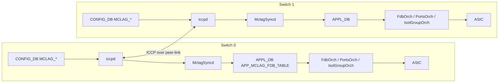

<!-- topics-tip -->
!!! tip "Topics で読み物として読む"
    この HLD は実装詳細を含む。機能の概念・設定・運用を読み物として読みたい場合は [Topics 06 章: L2 / VLAN / LAG](../topics/06-l2-vlan-lag/index.md) を参照。
<!-- /topics-tip -->

!!! success "裏取りステータス: code-verified"
    iccpd: `sonic-buildimage/src/iccpd` / mclagsyncd: `sonic-swss/mclagsyncd/mclagsyncd.cpp` / schema: `APP_MCLAG_FDB_TABLE_NAME`, `APP_ISOLATION_GROUP_TABLE_NAME`, `CFG_MCLAG_TABLE_NAME` (`MCLAG_DOMAIN`), `CFG_MCLAG_INTF_TABLE_NAME` (`MCLAG_INTERFACE`): `sonic-swss-common/common/schema.h:118,119,378,379` / `sonic-mclag.yang` で確認。

# MCLAG Enhancements

> 大きな [HLD](../reference/glossary.md#term-hld)（42 KB）。本ページは architecturally distinctive な要素に絞る。詳細は `doc/mclag/MCLAG_Enhancements_HLD.md` を参照。

## 派生ページ（章ごとの詳細）

このページは概要ハブ。掘り下げは派生ページに分割した:

- [MCLAG Enhancements 概念](mclag-enhancements-concepts.md) — 7 軸拡張のユースケース整理（dynamic config / timer / static MAC / aging / sync 最適化 / isolation group / unique IP）
- [MCLAG Enhancements 内部実装](mclag-enhancements-internals.md) — iccpd / MclagSyncd / FdbOrch / IsolationGroupOrch / PortsOrch の役割分担と APPL_DB / [STATE_DB](../reference/glossary.md#term-state_db) スキーマ・ICCP TLV
- [MCLAG Enhancements 運用](mclag-enhancements-operations.md) — click / KLISH CLI、典型設定、show / mclagdctl / redis-cli 確認、トラブルシュート

## なぜ拡張するのか

[MCLAG](../reference/glossary.md#term-mclag)（Multi-Chassis [LAG](../reference/glossary.md#term-lag)）は 2 台が **互いに peer** となり、下流ホストから 1 個の LAG（ICCP 同期）として見える冗長構成。本 HLD は以下 7 軸で拡張する[^1]:

1. **dynamic configuration**（再起動なしで domain / mclag_interface を [CONFIG_DB](../reference/glossary.md#term-config_db) から触れる）
2. **keep-alive / session timeout の動的設定**
3. **static MAC** の peer 間同期
4. **ICCP 学習 MAC の aging disable**
5. **MAC sync 最適化**
6. **isolation group** で peer-link 経由の重複転送を抑止
7. **unique IP** で MCLAG [VLAN](../reference/glossary.md#term-vlan) 上の L3 プロトコル（OSPF 等）対応

## 全体構造



要点[^1]:

- **`iccpd`** が ICCP メッセージで peer と同期
- **`MclagSyncd`** が ICCP 由来の MAC / interface state を [APPL_DB](../reference/glossary.md#term-appl_db) に橋渡し
- 旧 MclagSyncd 内部 [FDB](../reference/glossary.md#term-fdb) はリファクタで撤廃され、APPL_DB の `APP_MCLAG_FDB_TABLE` に集約[^1]

## 各拡張ポイント

| 項目 | 内容 |
|------|------|
| **Static MAC sync** | FdbOrch が CONFIG_DB 由来 static MAC を ICCP で peer に reflect[^1] |
| **Unique IP** | MCLAG VLAN intf に **個別 IP** を持たせ、OSPF 等 L3 隣接を成立させる。`MCLAG_UNIQUE_IP\|Vlan100 unique_ip=enable`[^1] |
| **Isolation Group** | peer-link 経由の重複転送/ループを防ぐため MCLAG メンバ port group から peer-link を isolate。[SAI](../reference/glossary.md#term-sai) は `SAI_OBJECT_TYPE_ISOLATION_GROUP`[^1] |
| **Aging disable** | remote 学習 MAC は local aging で消さない[^1] |
| **MAC sync 最適化** | bulk / 差分転送で多 VLAN 構成の収束時間短縮[^1] |

## CONFIG_DB / APPL_DB / STATE_DB

```yaml
CONFIG_DB:
  MCLAG_DOMAIN|<domain_id>
    source_ip, peer_ip, peer_link, keepalive_interval, session_timeout
  MCLAG_INTERFACE|<domain_id>|<intf>
    if_type = "PortChannel"
  MCLAG_UNIQUE_IP|<vlan_intf>
    unique_ip = "enable"

APPL_DB:
  ISOLATION_GROUP_TABLE:<group_id>      members = "...", exclude = "<peer-link>"
  APP_MCLAG_FDB_TABLE:<vlan>:<mac>      port, type=static|dynamic, mclag=remote|local

STATE_DB:
  STATE_MCLAG_TABLE|<domain>            oper_status, role, system_mac
  STATE_MCLAG_REMOTE_INTF_TABLE|<intf>
  STATE_MCLAG_REMOTE_FDB_TABLE|<vlan>:<mac>
```

## CLI / 設定例

```bash
config mclag add 1 10.0.0.1 10.0.0.2 PortChannel999
config mclag member add 1 PortChannel0001
config mclag unique-ip add Vlan100

show mclag brief
show mclag intf-list
```

## 制限事項

- HLD は Rev 0.1 で日付欄空欄
- ICCP は **2 台ピアまで**（3-way 以上は未対応）
- isolation group は SAI 対応必須。未対応 [ASIC](../reference/glossary.md#term-asic) では peer-link 経由のループ抑止は別手法
- unique IP では active/active 両方が L3 で見える。OSPF cost / [BGP](../reference/glossary.md#term-bgp) を peer 間で揃える必要
- 大量 static MAC sync は ICCP メッセージ量増、scalability 影響あり

## 既知の問題

### L2 MC-LAG 環境での ICMPv6 RS/NS ループ（#1253）

L2 MC-LAG 構成において、ICMPv6 Router Solicitation (type 133) や Neighbor Solicitation (type 135) パケットが peer-link を経由してループを形成する既知の問題がある。[SONiC](../reference/glossary.md#term-sonic) カーネルがこれらのパケットを処理する際に isolation group を迂回するためと考えられる。

**回避策:**

```bash
# tagged VLAN 上の IPv6 パケットを bridge レベルで遮断する
sudo ebtables -A FORWARD -p 802_1Q --vlan-encap IPv6 -j DROP
```

この ebtables ルールは再起動後に消えるため、永続化が必要な場合は startup スクリプトに追加すること。

- 参照: [sonic-net/SONiC#1253](https://github.com/sonic-net/SONiC/issues/1253)

## 干渉する機能

iccpd / FdbOrch / PortsOrch / [VRRP](../reference/glossary.md#term-vrrp) / OSPF / BGP（unique IP）/ [VXLAN](../reference/glossary.md#term-vxlan)・[EVPN](../reference/glossary.md#term-evpn) MH（別冗長機構）/ L3 [PortChannel](../reference/glossary.md#term-portchannel)・sub-interface。

## トラブルシューティング

```bash
show mclag brief
redis-cli -n 6 HGETALL "STATE_MCLAG_TABLE|1"
redis-cli -n 6 KEYS "STATE_MCLAG_REMOTE_FDB_TABLE|*" | head
redis-cli -n 0 KEYS "APP_MCLAG_FDB_TABLE:*" | head
redis-cli -n 0 HGETALL "ISOLATION_GROUP_TABLE:1"
```

## 引用元

[^1]: `sonic-net/SONiC` `doc/mclag/MCLAG_Enhancements_HLD.md` @ `49bab5b5ff0e924f1ea52b3d9db0dfa4191a7c06`

<!-- topics-back-ref -->
## 関連 Topics

- [Topics: L2 / VLAN / LAG / MC-LAG](../topics/06-l2-vlan-lag/index.md)

<!-- /topics-back-ref -->

<!-- glossary-links-injected: 6981be1a469d -->
