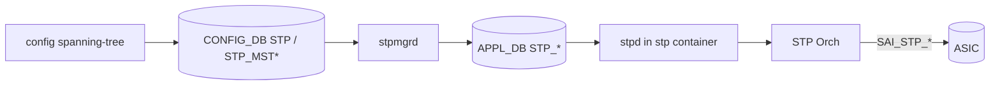
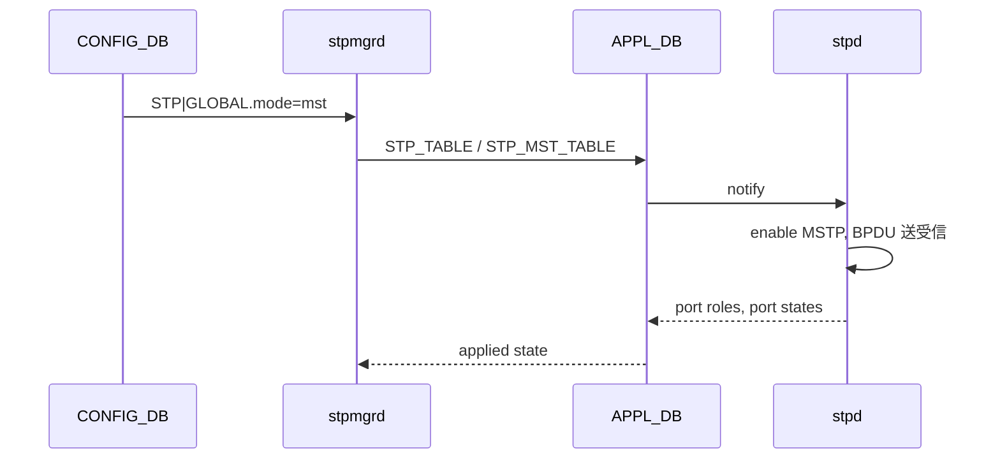

!!! success "裏取りステータス: Code-verified（基本構成のみ）"
    現行 master の `sonic-swss/cfgmgr/stpmgrd.cpp:47-49` で `STP_MST` / `STP_MST_INST` / `STP_MST_PORT` テーブルを TableConnector に登録、`stpmgr` クラスが存在することを確認。`sonic-yang-models` の `sonic-spanning-tree.yang` も存在。CLI / IS-IS のような MSTP 専用 CLI 詳細は元 HLD 参照（verified at: 2026-05-09）。

# Multiple Spanning Tree Protocol (MSTP) on SONiC

## 概要

IEEE 802.1Q-2014 準拠の **MSTP（Multiple Spanning Tree Protocol）** を SONiC に実装する設計[^1]。RSTP / PVST に対し MSTP は「VLAN 群を同一インスタンス (MSTI) にまとめて、インスタンス単位でトポロジを計算する」点が特徴。`stp` コンテナで `stpd` が走り、`stpmgrd` 経由で APPL_DB / CONFIG_DB と連携する。

## 動作仕様

### コンテナ構成



### CONFIG_DB スキーマ概要

```text
STP|GLOBAL
    mode             = "mst" | "rstp" | "pvst"
    rootguard_timeout, forward_delay, hello_time, max_age, ...

STP_MST|GLOBAL
    region_name      = string
    revision         = uint
    max_hops         = uint

STP_MST_INST|<instance_id>
    bridge_priority  = uint
    vlan_list        = comma-list

STP_MST_PORT|<instance_id>|<ifname>
    priority         = uint
    path_cost        = uint

STP_PORT|<ifname>
    enabled          = bool
    bpdu_guard / root_guard / edge_port / ... = bool
```

CIST (instance 0) は常に存在し、IST と呼ばれる。MSTI は `instance_id` 1..n[^1]。

### MST Region

MST Region は `region_name` / `revision` / VLAN→MSTI マッピングが一致するスイッチの集合で、Region 境界では IST 経由で BPDU 交換する。`max_hops` は Region 内の MSTI BPDU TTL。

### 主要シーケンス



`mode` を rstp / pvst から mst へ切り替える際、stpd は内部状態を破棄して MSTP モードで再起動する[^1]。

### SAI マッピング

CIST が SAI の default STP オブジェクトに対応し、各 MSTI が `SAI_STP_OBJECT_ID` の追加インスタンスとして表現される。Port × MSTI ごとに `SAI_STP_PORT_ATTR_STATE` を operate する。詳細は HLD の SAI 節および `sai_stp.h` を参照[^1]。

## 設定

### 関連する CONFIG_DB

| Table | 説明 |
|-------|------|
| `STP` | グローバル設定（mode 等） |
| `STP_MST` | MSTP リージョン情報 |
| `STP_MST_INST` | MSTI 単位の VLAN マッピング・bridge priority |
| `STP_MST_PORT` | MSTI × port の priority / path_cost |
| `STP_PORT` | 共通 port パラメータ（bpdu_guard 等） |

### 関連する CLI

```text
config spanning-tree mode mst
config spanning-tree mst region-name <name>
config spanning-tree mst revision <rev>
config spanning-tree mst instance <id> vlan <vlan-list>
config spanning-tree mst instance <id> priority <p>
config spanning-tree mst instance <id> interface <ifname> path-cost <c>
show spanning-tree
show spanning-tree mst instance <id>
```

`config spanning-tree disable mst` 等の Disabled Commands、`show spanning-tree counters` 等の Show / Clear / Debug 系コマンドは HLD の対応節を参照。

### 関連する YANG

HLD は `STP_MST_*` の YANG モデル提案を含むが、ファイル名・モジュール名はオフィシャルなマージ後に確定する想定。

### 設定例

```bash
sudo config spanning-tree mode mst
sudo config spanning-tree mst region-name region1
sudo config spanning-tree mst revision 1
sudo config spanning-tree mst instance 1 vlan 10,20,30
sudo config spanning-tree mst instance 1 priority 4096
show spanning-tree mst instance 1
```

## 制限事項

- HLD は v0.2 で **大型 (50KB)** のため、ここでは中心テーブルとフローのみ抜粋。詳細フローや edge case は HLD `doc/MSTP/MSTP.md` を参照。
- MSTP モード切替は stpd 再起動を伴うため、瞬間的に L2 トポロジが揺れる可能性。
- MSTI 数の上限はプラットフォーム SAI の `SAI_SWITCH_ATTR_MAX_STP_INSTANCE` に依存。
- Warm Boot 中の BPDU タイマ整合性は HLD で要件定義あり、実装側の対応は別途確認が必要。

## 干渉する機能

- **VLAN / Port-Channel / FDB**: MSTP の Port State 変化（Forwarding ↔ Discarding）に応じて FDB 学習や転送が変わる。
- **PVST / RSTP**: 同じ `STP|GLOBAL.mode` を共有するため、同時動作不可。モード切替時の挙動が中心。
- **BPDU Guard / Root Guard / Edge Port**: 共通の `STP_PORT` テーブル経由で MSTP でも有効。

## トラブルシューティング

- ルートが期待どおり選ばれない → `show spanning-tree mst instance <id>` で bridge priority と root bridge を確認。
- リージョン境界で IST にしか入らない → `region_name` / `revision` / VLAN→MSTI マッピングが対向と完全一致しているかを確認（1 文字でも違うと別リージョン）。
- BPDU が出ない → `STP_PORT.enabled=true` か、stpd ログで送信エラーが出ていないか確認。

## 引用元

[^1]: `sonic-net/SONiC` `doc/MSTP/MSTP.md` @ `49bab5b5ff0e924f1ea52b3d9db0dfa4191a7c06`
