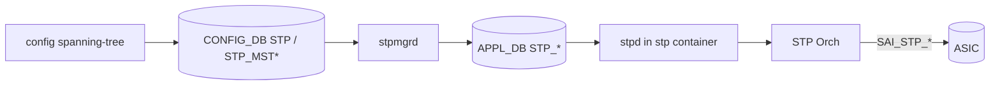
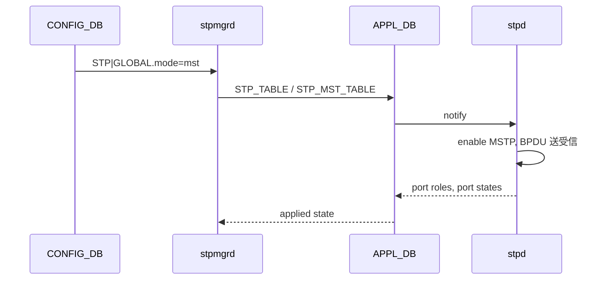

!!! success "裏取りステータス: Code-verified（基本構成のみ）"
    現行 master の `sonic-swss/cfgmgr/stpmgrd.cpp:47-49` で `STP_MST` / `STP_MST_INST` / `STP_MST_PORT` テーブルを TableConnector に登録、`stpmgr` クラスが存在することを確認。`sonic-yang-models` の `sonic-spanning-tree.yang` も存在。CLI / IS-IS のような MSTP 専用 CLI 詳細は元 HLD 参照（verified at: 2026-05-09）。

# Multiple Spanning Tree Protocol (MSTP) on SONiC

## 読み手が知りたいこと

1. **PVST / RSTP に比べて MSTP を選ぶ理由** は？
2. **どのテーブル** を編集すれば MSTP が動くのか？
3. **MST Region** とは何か、何を一致させると同一リージョンになるのか？
4. MSTP モードへの **切替時に通信は揺れる** のか？
5. **ルートが期待どおりに選ばれない** ときに見る場所は？

## 1. なぜ MSTP か

IEEE 802.1Q-2014 準拠の Spanning Tree。RSTP / PVST に対し **「VLAN 群を 1 つの MSTI（インスタンス）にまとめてインスタンス単位でトポロジを計算する」** のが特徴。VLAN 数が多くても MSTI 数だけの STP インスタンスで済むためスケールに有利[^1]。



`stp` コンテナで `stpd` が走り、`stpmgrd` が CONFIG_DB ↔ APPL_DB を橋渡しする。

## 2. 設定（CONFIG_DB と CLI）

### CONFIG_DB スキーマ

```text
STP|GLOBAL
    mode             = "mst" | "rstp" | "pvst"
    rootguard_timeout, forward_delay, hello_time, max_age, ...

STP_MST|GLOBAL
    region_name      = string
    revision         = uint
    max_hops         = uint

STP_MST_INST|<instance_id>
    bridge_priority  = uint
    vlan_list        = comma-list

STP_MST_PORT|<instance_id>|<ifname>
    priority         = uint
    path_cost        = uint

STP_PORT|<ifname>
    enabled          = bool
    bpdu_guard / root_guard / edge_port / ... = bool
```

CIST (instance 0) は常に存在し IST と呼ぶ。MSTI は `instance_id` 1..n[^1]。

| Table | 説明 |
|-------|------|
| `STP` | グローバル設定（mode 等） |
| `STP_MST` | MSTP リージョン情報 |
| `STP_MST_INST` | MSTI 単位の VLAN マッピング + bridge priority |
| `STP_MST_PORT` | MSTI × port の priority / path_cost |
| `STP_PORT` | 共通 port パラメータ（bpdu_guard 等） |

### CLI と設定例

```bash
sudo config spanning-tree mode mst
sudo config spanning-tree mst region-name region1
sudo config spanning-tree mst revision 1
sudo config spanning-tree mst instance 1 vlan 10,20,30
sudo config spanning-tree mst instance 1 priority 4096
show spanning-tree mst instance 1
```

詳細サブコマンド（Disabled Commands、`show spanning-tree counters` 系）は HLD の対応節を参照。

## 3. MST Region

MST Region は次が **完全一致** するスイッチの集合[^1]:

- `region_name`
- `revision`
- VLAN → MSTI マッピング

Region 境界では IST 経由で BPDU 交換する。`max_hops` は Region 内の MSTI BPDU TTL。**1 文字でも違うと別リージョン** になるので注意。

## 4. モード切替と SAI マッピング

### 主要シーケンス



`mode` を rstp / pvst から mst へ切り替える際、stpd は内部状態を破棄して MSTP モードで再起動する。**瞬間的に L2 トポロジが揺れる** 可能性あり[^1]。

### SAI

- CIST が SAI の default STP オブジェクト
- 各 MSTI は追加の `SAI_STP_OBJECT_ID` インスタンス
- Port × MSTI ごとに `SAI_STP_PORT_ATTR_STATE` を operate

MSTI 数の上限は `SAI_SWITCH_ATTR_MAX_STP_INSTANCE` に依存。

## 5. 他機能との干渉

- **VLAN / Port-Channel / FDB**: MSTP の Port State 変化（Forwarding ↔ Discarding）に応じて FDB 学習・転送が変化
- **PVST / RSTP**: 同じ `STP|GLOBAL.mode` を共有するため同時動作不可
- **BPDU Guard / Root Guard / Edge Port**: 共通の `STP_PORT` 経由で MSTP でも有効

## 6. トラブルシューティング

| 症状 | 最初に見る場所 |
|------|---------------|
| ルートが期待どおり選ばれない | `show spanning-tree mst instance <id>` で bridge priority と root bridge を確認 |
| リージョン境界で IST にしか入らない | `region_name` / `revision` / VLAN→MSTI マッピングが対向と完全一致しているか |
| BPDU が出ない | `STP_PORT.enabled=true` か、stpd ログで送信エラー |

## 制限事項

- HLD は v0.2 (50KB) のため、ここでは中心テーブルとフローのみ抜粋。詳細は HLD `doc/MSTP/MSTP.md`
- MSTP モード切替は stpd 再起動を伴う
- MSTI 数は SAI 依存
- Warm Boot 中の BPDU タイマ整合性は実装側の対応を別途確認

## 関連トピック

- [Topics: L2 / VLAN / LAG](../topics/06-l2-vlan-lag/index.md) — VLAN / FDB と STP の関係
- [Topics: Reference Index](../topics/22-reference-index/index.md)

## 引用元

[^1]: `sonic-net/SONiC` `doc/MSTP/MSTP.md` @ `49bab5b5ff0e924f1ea52b3d9db0dfa4191a7c06`

<!-- topics-back-ref -->
## 関連 Topics

- [Topics: L2 / VLAN / LAG / MC-LAG](../topics/06-l2-vlan-lag/index.md)

<!-- /topics-back-ref -->
