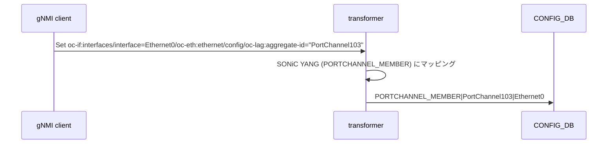

!!! success "裏取りステータス: Code-verified"
    `sonic-mgmt-common/translib/transformer/sw_portchannel.go` で PortChannel transformer を確認。`sonic-mgmt-common/translib/transformer/portchannel_openconfig_test.go` L54-73 で `interface[name=Ethernet0]/openconfig-if-ethernet:ethernet/config/openconfig-if-aggregate:aggregate-id` への PATCH と `interface[name=PortChannel111]/openconfig-if-aggregate:aggregation/config/min-links` への min-links 設定の REST テストを確認。`sonic-mgmt-common/models/yang/annotations/openconfig-interfaces-annot.yang` L87-90 で `min-links → min_links` の `lag_min_links_xfmr` field-transformer を、`sonic-mgmt-common/cvl/testdata/schema/sonic-portchannel.yang` L51 で SONiC 側 `min_links` フィールド定義を確認（verified at: 2026-05-09）。subinterface は本 HLD のスコープ外。

# PortChannel (LAG) の OpenConfig YANG サポート（REST / gNMI）

## 概要

SONiC の PortChannel 設定は **REST / gNMI** で操作可能だが、本 HLD は **OpenConfig YANG モデル** に基づくアクセスを `sonic-mgmt-common` の **transformer 基盤** を介して提供する[^1]。SONiC 独自 YANG（sonic-portchannel 等）ではなく、ベンダ間で共通化された `openconfig-interfaces` / `openconfig-if-aggregate` / `openconfig-if-ethernet` ツリーで read / write できることが要点。

スコープ[^1]:

- REST + gNMI 経由の PortChannel 設定（KLISH CLI は対象外）
- subinterface は対象外
- `min-links` を含む LAG 集約属性、interface 属性

要件[^1]:

- OpenConfig YANG モデル対応
- PortChannel 属性の Set / Get / Delete
- `min-links` を REST / gNMI でサポート
- PortChannel 型に対する interface 属性のサポート

## 動作仕様

### サポートする OpenConfig YANG ツリー

`openconfig-interfaces` の `interface` リストに対し、PortChannel 用に以下を扱う[^1]:

```text
+--rw interfaces
   +--rw interface* [name]
      +--rw config
      |  +--rw name? string
      |  +--rw mtu? uint16
      |  +--rw description? string
      |  +--rw enabled? boolean
      +--ro state
      |  +--ro counters (in/out octets, pkts, ucast/bcast/mcast, discards, errors)
      |  +--ro admin-status (UP/DOWN)
      +--rw oc-eth:ethernet            # メンバ Ethernet 側
      |  +--rw config.oc-lag:aggregate-id  -> /interfaces/interface/name
      +--rw oc-lag:aggregation         # PortChannel 自身
         +--rw config.min-links uint16
         +--ro state.min-links  uint16
```

ポイント:

- メンバ Ethernet の `oc-eth:ethernet/config/oc-lag:aggregate-id` に **対応 PortChannel 名** を入れることでメンバ追加
- PortChannel 自体には **`oc-lag:aggregation/config/min-links`** で集約条件を表現
- subinterface (index / IPv4 / IPv6) は **YANG ツリー上は存在するがスコープ外**

### Container / 実装基盤

実装は **Management Framework container**（REST server）と **gnmi container** が含まれる **`sonic-mgmt-common`** リポに入る[^1]。translib infrastructure ではなく **transformer 基盤** を採用する設計判断[^1]。

```mermaid
graph LR
    REST[REST client] -->|RESTCONF| MGMT[Mgmt Framework container]
    GNMI[gNMI client] -->|gRPC| GNMID[gnmi container]
    MGMT --> XF[transformer<br/>(sonic-mgmt-common)]
    GNMID --> XF
    XF -->|OpenConfig ↔ SONiC YANG mapping| CDB[CONFIG_DB / APPL_DB]
```

### DB スキーマへの影響

本 HLD は **CONFIG_DB / APPL_DB / STATE_DB / ASIC_DB / COUNTERS_DB のスキーマ変更を一切伴わない**[^1]。OpenConfig ↔ SONiC YANG の **マッピングは transformer 内に閉じる** 設計。

### REST API

#### GET 例

```bash
curl -X GET -k \
  "https://<switch>/restconf/data/openconfig-interfaces:interfaces/interface=PortChannel103" \
  -H "accept: application/yang-data+json"
```

戻り値（要約）[^1]:

```json
{
  "openconfig-interfaces:interface": [{
    "name": "PortChannel103",
    "config": {"name":"PortChannel103","mtu":9100,"enabled":true},
    "state":  {"name":"PortChannel103","mtu":9100,"enabled":true,"admin-status":"UP"},
    "openconfig-if-aggregate:aggregation": {
      "config": {"min-links": 1},
      "state":  {"min-links": 1}
    },
    "subinterfaces": { "subinterface": [{ "index": 0,
      "openconfig-if-ip:ipv6": {"config":{"enabled":false}}
    }] }
  }]
}
```

leaf 単位の GET も可能[^1]。

#### POST / PUT / PATCH / DELETE

OpenConfig 標準 RESTCONF オペレーションで PortChannel の作成・編集・削除を扱う。具体メソッドは RESTCONF / OpenConfig 仕様に従う。

### gNMI

`Capabilities` で OpenConfig YANG モデル群を返却し、`Get` / `Set` で同じパスへの read/write をサポートする[^1]。

### メンバ追加 / 削除

OpenConfig 表現では **メンバ側 Ethernet の `aggregate-id`** に PortChannel 名を入れる:



メンバ削除も同様に `aggregate-id` の DELETE で表現される。

### `min-links`

LAG が UP と判定される最少 active メンバ数。`oc-lag:aggregation/config/min-links` を SONiC 側 `PORTCHANNEL.<n>.min_links` 等にマッピング（具体マッピングは transformer 実装側）[^1]。

## 設定

### 関連する CONFIG_DB

スキーマ変更なし[^1]。SONiC 側の既存 `PORTCHANNEL` / `PORTCHANNEL_MEMBER` / `PORT` 等を transformer が背後で操作する。

### 関連する CLI

KLISH CLI は本 HLD の対象外[^1]。`config portchannel` 等の既存 CLI は変更されない。

### 関連する YANG

| YANG モジュール | 用途 |
|---------------|------|
| `openconfig-interfaces` | interface 全般（`config`, `state`, `counters`） |
| `openconfig-if-aggregate` | LAG (`min-links`) 表現と `aggregate-id` |
| `openconfig-if-ethernet` | メンバ Ethernet 側 (`auto-negotiate`, `port-speed`, `aggregate-id`) |

### 設定例

```bash
# REST で PortChannel104 を作成 + min-links=2
curl -X PUT -k -H 'Content-Type: application/yang-data+json' \
  "https://<switch>/restconf/data/openconfig-interfaces:interfaces/interface=PortChannel104" \
  -d '{
    "openconfig-interfaces:interface": [{
      "name": "PortChannel104",
      "config": {"name": "PortChannel104", "mtu": 9100, "enabled": true},
      "openconfig-if-aggregate:aggregation": {"config": {"min-links": 2}}
    }]
  }'

# Ethernet0 を PortChannel104 のメンバに
curl -X PATCH -k -H 'Content-Type: application/yang-data+json' \
  "https://<switch>/restconf/data/openconfig-interfaces:interfaces/interface=Ethernet0/openconfig-if-ethernet:ethernet/config" \
  -d '{"openconfig-if-ethernet:config":{"openconfig-if-aggregate:aggregate-id":"PortChannel104"}}'
```

## 制限事項

- **subinterface（VLAN / L3 サブ）は対象外**[^1]。OpenConfig YANG ツリー上は存在するが本 HLD では扱わない
- **KLISH CLI 経由の同等 OpenConfig 操作は提供しない**[^1]
- DB スキーマ変更は無いが、`min-links` のマッピング先など **transformer の実装に依存**
- transformer 基盤は translib より新しいインフラだが、すべての SONiC 機能で対応されているわけではない（PortChannel 限定の追加対応）
- gNMI 経由での **subscribe / streaming telemetry** の挙動は明示記述なし

## 干渉する機能

- **`sonic-mgmt-common`**: transformer + REST / gNMI server
- **`teamd` / `teamsyncd`**: 実際の LAG 制御（OpenConfig 操作の最終反映先）
- **`PortChannelOrch` / `PortChannelMember*`**: SAI 反映
- **既存 SONiC YANG (`sonic-portchannel`)**: KLISH CLI と translib 経由の経路は変わらない
- **既存 REST PATCH / GET（SONiC YANG ベース）**: 並存。OpenConfig 経路は別ルート

## トラブルシューティング

- OpenConfig PUT / PATCH で 400 / 403 → URI に正しい OpenConfig path が入っているか、`Content-Type: application/yang-data+json` を付けているか
- メンバが追加されない → `oc-lag:aggregate-id` を **メンバ Ethernet の oc-eth:ethernet/config 配下** に入れているか確認
- `min-links` が反映されない → `openconfig-if-aggregate:aggregation/config` の path に書いているか
- counter が常に 0 → `state/counters` は ASIC 側 polling に依存。`counterpoll port` の状態と `COUNTERS_DB` を確認

## 引用元

[^1]: `sonic-net/SONiC` `doc/mgmt/OpenConfig_PortChannel_Interface.md` @ `49bab5b5ff0e924f1ea52b3d9db0dfa4191a7c06`

<!-- concerns hint:
- sonic-mgmt-common の transformer ベース OpenConfig PortChannel 実装存在確認
- oc-lag:aggregate-id でメンバ Ethernet を PortChannel に紐付ける GET / SET 経路の実装確認
- min-links 属性の SONiC 側マッピング先（PORTCHANNEL table の min_links 等）確認
- gNMI Capabilities に openconfig-interfaces / openconfig-if-aggregate / openconfig-if-ethernet が含まれているか確認
- subinterface YANG ツリー対応の現行ステータス（本 HLD 範囲外だが運用上必要）の確認
-->
