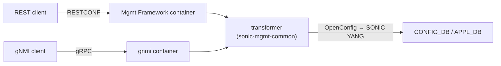
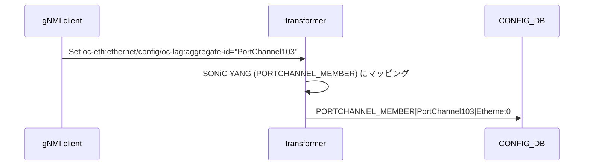

<!-- topics-tip -->
!!! tip "Topics で読み物として読む"
    この HLD は実装詳細を含みます。機能の概念・設定・運用を読み物として読みたい場合は [Topics 06 章: L2 / VLAN / LAG](../topics/06-l2-vlan-lag/index.md) を参照。
<!-- /topics-tip -->

!!! success "裏取りステータス: Code-verified"
    `sonic-mgmt-common/translib/transformer/sw_portchannel.go` で PortChannel transformer を確認。`portchannel_openconfig_test.go` L54-73 で `interface[name=Ethernet0]/openconfig-if-ethernet:ethernet/config/openconfig-if-aggregate:aggregate-id` の PATCH と `interface[name=PortChannel111]/openconfig-if-aggregate:aggregation/config/min-links` の設定 REST テストを確認。`openconfig-interfaces-annot.yang` L87-90 で `min-links → min_links` の `lag_min_links_xfmr` field-transformer、`sonic-portchannel.yang` L51 で SONiC 側 `min_links` 定義を確認。subinterface は本 HLD のスコープ外。

# PortChannel (LAG) の OpenConfig YANG サポート

## なぜ OpenConfig が必要か

[SONiC](../reference/glossary.md#term-sonic) の [PortChannel](../reference/glossary.md#term-portchannel) は REST/[gNMI](../reference/glossary.md#term-gnmi) で操作できるが、SONiC 独自 [YANG](../reference/glossary.md#term-yang)（`sonic-portchannel` 等）に縛られる。本 [HLD](../reference/glossary.md#term-hld) は **ベンダ間共通の OpenConfig** ツリー（`openconfig-interfaces` / `openconfig-if-aggregate` / `openconfig-if-ethernet`）で read/write できることを目指す[^1]。マッピングは **`sonic-mgmt-common` の transformer 基盤** に閉じ、**DB スキーマ変更を一切伴わない**[^1]。

スコープ: REST + gNMI（KLISH CLI / subinterface は対象外）[^1]。

## アーキテクチャ



## サポートする YANG ツリー

```text
+--rw interfaces/interface* [name]
   +--rw config (name, mtu, description, enabled)
   +--ro state  (counters, admin-status)
   +--rw oc-eth:ethernet           # メンバ Ethernet 側
   |  +--rw config.oc-lag:aggregate-id
   +--rw oc-lag:aggregation        # PortChannel 自身
      +--rw config.min-links
      +--ro state.min-links
```

ポイント:

- メンバ Ethernet の `oc-eth:ethernet/config/oc-lag:aggregate-id` に PortChannel 名を書く → メンバ追加
- PortChannel 側は `oc-lag:aggregation/config/min-links` で集約条件を表現
- subinterface は YANG ツリー上は存在するがスコープ外[^1]

## メンバ操作フロー



`min-links` は SONiC 側 `PORTCHANNEL.<n>.min_links` にマッピング[^1]。DELETE は逆向き。

## REST 例

```bash
# GET
curl -X GET -k \
  "https://<switch>/restconf/data/openconfig-interfaces:interfaces/interface=PortChannel103" \
  -H "accept: application/yang-data+json"

# PUT で PortChannel104 を作成 + min-links=2
curl -X PUT -k -H 'Content-Type: application/yang-data+json' \
  "https://<switch>/restconf/data/openconfig-interfaces:interfaces/interface=PortChannel104" \
  -d '{"openconfig-interfaces:interface":[{
    "name":"PortChannel104",
    "config":{"name":"PortChannel104","mtu":9100,"enabled":true},
    "openconfig-if-aggregate:aggregation":{"config":{"min-links":2}}
  }]}'

# Ethernet0 を PortChannel104 のメンバに
curl -X PATCH -k -H 'Content-Type: application/yang-data+json' \
  "https://<switch>/restconf/data/openconfig-interfaces:interfaces/interface=Ethernet0/openconfig-if-ethernet:ethernet/config" \
  -d '{"openconfig-if-ethernet:config":{"openconfig-if-aggregate:aggregate-id":"PortChannel104"}}'
```

gNMI も `Capabilities` で同 YANG を公開し `Get` / `Set` で同等[^1]。

## DB / CLI への影響

- [CONFIG_DB](../reference/glossary.md#term-config_db) / [APPL_DB](../reference/glossary.md#term-appl_db) / [STATE_DB](../reference/glossary.md#term-state_db) / [ASIC_DB](../reference/glossary.md#term-asic_db) / [COUNTERS_DB](../reference/glossary.md#term-counters_db) のスキーマ変更なし[^1]
- 既存 `config portchannel` 等の KLISH CLI は変更されない（対象外）[^1]
- 既存 SONiC YANG ベースの REST PATCH/GET は並存。OpenConfig 経路は別ルート

## 関連 YANG

| YANG | 用途 |
|------|------|
| `openconfig-interfaces` | interface 全般（config/state/counters）|
| `openconfig-if-aggregate` | [LAG](../reference/glossary.md#term-lag)（`min-links`, `aggregate-id`）|
| `openconfig-if-ethernet` | メンバ Ethernet（`auto-negotiate`, `port-speed`, `aggregate-id`）|

## 制限事項

- subinterface（[VLAN](../reference/glossary.md#term-vlan) / L3 サブ）は対象外[^1]
- KLISH CLI 経由の同等 OpenConfig 操作は提供しない[^1]
- `min-links` 等のマッピングは transformer 実装に依存
- gNMI subscribe / streaming telemetry の挙動は明示記述なし

## 干渉する機能

`sonic-mgmt-common` transformer / `teamd` / `teamsyncd`（最終反映先）/ `PortChannelOrch` / `PortChannelMemberOrch`（[SAI](../reference/glossary.md#term-sai) 反映）/ 既存 SONiC YANG ベースの経路。

## トラブルシューティング

- PUT/PATCH で 400/403 → URI と `Content-Type: application/yang-data+json` を確認
- メンバが追加されない → `oc-lag:aggregate-id` を **メンバ Ethernet の `oc-eth:ethernet/config`** 配下に入れているか
- `min-links` が反映されない → `oc-lag:aggregation/config` のパスを確認
- counter が 0 → `counterpoll port` 状態と `COUNTERS_DB` 確認

### コマンド例

OpenConfig 経由の PortChannel 情報取得を確認する。

```bash
gnmic -a localhost:8080 --skip-verify -u admin -p YourPaSsWoRd \
  get --path '/openconfig-interfaces:interfaces/interface[name=PortChannel0001]/aggregation' 2>&1 | head
show interfaces portchannel
```

## 関連 Topics

- [10-gnmi-openconfig](../topics/10-gnmi-openconfig/index.md): gNMI / OpenConfig 全体像
- [06-l2-vlan-lag](../topics/06-l2-vlan-lag/index.md): LAG 機能本体

## 引用元

[^1]: `sonic-net/SONiC` `doc/mgmt/OpenConfig_PortChannel_Interface.md` @ `49bab5b5ff0e924f1ea52b3d9db0dfa4191a7c06`

<!-- topics-back-ref -->
## Topics 一覧

- [Topics: L2 / VLAN / LAG / MC-LAG](../topics/06-l2-vlan-lag/index.md)

<!-- /topics-back-ref -->

<!-- glossary-links-injected: 8ba32e5aa69d -->
