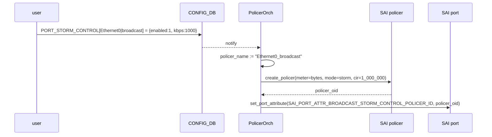

!!! success "裏取りステータス: Code-verified"
    `sonic-swss/tests/test_storm_control.py` L9-247 で `PORT_STORM_CONTROL` テーブル経由の broadcast / unknown unicast / unknown multicast の kbps 設定 / 削除テストを確認。`sonic-utilities/show/main.py` L175-235 で `show storm-control` コマンド一式、`config/main.py` L788-822 で `storm_control_interface_validate` / `is_storm_control_supported` / `storm_control_set_entry` を確認、`scripts/storm_control.py` を `setup.py` L194 で同梱していることを確認（verified at: 2026-05-09）。

# BUM ストームコントロール（PORT_STORM_CONTROL）

## 概要

BUM（Broadcast / Unknown-unicast / unknown-Multicast）ストームは、L2 ドメインに大量の宛先未学習・ブロードキャスト・未登録マルチキャストフレームが流入することでネットワーク全体を劣化させる障害である。本機能は **物理ポート単位で BUM の各タイプを個別に kbps レート制限する** ためのもので、ポートに SAI ポリサーを紐付けて入力方向のレートを抑え込む。3 種それぞれを独立に有効化でき、超過分は単純にドロップされる[^1]。

設定の許容範囲は 0 kbps 〜 100 Gbps（10^8 kbps）で、**物理ポート専用**。VLAN / ポートチャネルインタフェースには直接設定できず、メンバの物理ポート側で設定する必要がある。統計（ヒット数等）は本 HLD 範囲ではサポート外と明記されている[^1]。

## 動作仕様

### 全体アーキテクチャ

```mermaid
flowchart LR
    USR[CLI / mgmt-framework\n(Klish/REST/gNMI)] --> CDB[(CONFIG_DB\nPORT_STORM_CONTROL)]
    CDB -->|subscribe| PO[PolicerOrch]
    PO -->|create_policer| SAI[SAI policer]
    PO -->|set_port_attribute\n(BCAST/UCAST/MCAST policer ID)| PORT[SAI port]
```

1. ユーザは `config interface storm-control ...` などを通じて `PORT_STORM_CONTROL` テーブルに設定を入れる。
2. `PolicerOrch` は `PORT_STORM_CONTROL` の通知を購読し、`<interface>|<storm_type>` をキーに **内部 policer 名** を生成する。
3. `create_policer` SAI API でメータを作成し、戻ってきたポリサー識別子を内部名に紐付ける。
4. `set_port_attribute` SAI API で対応するポート属性に policer ID を設定する。
5. ポート属性とストームタイプの対応は次のとおり。

| ストームタイプ | SAI ポート属性 |
|----------------|----------------|
| Unknown-unicast | `SAI_PORT_ATTR_FLOOD_STORM_CONTROL_POLICER_ID` |
| Broadcast | `SAI_PORT_ATTR_BROADCAST_STORM_CONTROL_POLICER_ID` |
| Unknown-multicast | `SAI_PORT_ATTR_MULTICAST_STORM_CONTROL_POLICER_ID` |

<!-- evidence:
source: sonic-net/SONiC/doc/bum_storm_control/bum_storm_control_hld.md#L207-L228 (sha: 49bab5b5ff0e924f1ea52b3d9db0dfa4191a7c06)
excerpt: |
  | Unknown-unicast policer  | SAI_PORT_ATTR_FLOOD_STORM_CONTROL_POLICER_ID           |
  | Broadcast policer        | SAI_PORT_ATTR_BROADCAST_STORM_CONTROL_POLICER_ID       |
  | Unknown-Multicast policer| SAI_PORT_ATTR_MULTICAST_STORM_CONTROL_POLICER_ID       |
reasoning: ポート属性とストームタイプ 3 種の対応の根拠。
-->

### ポリサーパラメータ

`create_policer` 時の SAI 属性は次のとおり[^1]。

| SAI 属性 | 値 |
|----------|----|
| `SAI_POLICER_ATTR_METER_TYPE` | `bytes`（パケット数ではなくバイト基準） |
| `SAI_POLICER_ATTR_MODE` | `storm`（専用モード。`sr_TCM` / `tr_TCM` ではない） |
| `SAI_POLICER_ATTR_CIR` | bps 値（CLI で指定された kbps を bps に換算した値） |

CIR 超過分は単純ドロップ。`storm` モードのため CBS / EBS / PBS は使わない。

### 設定 → ASIC 反映フロー



無効化（`del`）時は対応するポート属性を解除し、policer を削除する。値の更新は同じ key に対する再書き込みで行い、`PolicerOrch` 側で CIR 更新あるいは作り直しが行われる。

### Warm boot

設定は CONFIG_DB に永続化されているため、計画的なシステム warm boot および SWSS Docker warm boot を跨いで設定が維持され、レート制限が継続することが要件として明示されている[^1]。

### 制限事項

- VLAN / ポートチャネルインタフェースには直接設定できない。物理ポート側で設定する。
- 統計（ヒット数 / ドロップ数）は本 HLD のスコープ外。
- スケール上限は **物理ポート数**（システムの `max_physical_ports`）。各ポートに 3 タイプまで独立設定可。

## 設定

### 関連する CONFIG_DB

| Table | Key | フィールド | 説明 |
|-------|-----|-----------|------|
| `PORT_STORM_CONTROL` | `<port>\|<storm_control_type>` | `enabled` | `1` で有効、`0` で無効 |
| | | `kbps` | CIR 値（kbps、最大 13 桁の数字） |

`storm_control_type` は `broadcast` / `unknown-unicast` / `unknown-multicast` のいずれか[^1]。

### 関連する CLI

| Command | 用途 |
|---------|------|
| `config interface storm-control {broadcast \| unknown-unicast \| unknown-multicast} {add\|del} <intf> [<kbps>]` | 物理ポートに対するストーム制御の追加・削除 |
| `show storm-control all` | 全インタフェースの設定一覧 |
| `show storm-control interface <intf>` | 単一インタフェースの設定 |

`add` 時には `kbps` が必須、`del` 時には `kbps` を渡してはならない（渡すと拒否される）旨が Negative Test に記載されている[^1]。

### 設定例

```bash
# Ethernet0 に Broadcast を 1 Mbps、Unknown-unicast を 2 Mbps で制限
config interface storm-control broadcast add Ethernet0 1000
config interface storm-control unknown-unicast add Ethernet0 2000

# 解除
config interface storm-control broadcast del Ethernet0
```

### 表示例

```text
+------------------+-----------------+---------------+
| Interface Name   | Storm Type      |   Rate (kbps) |
+==================+=================+===============+
| Ethernet0        | broadcast       |          1000 |
| Ethernet0        | unknown-unicast |          2000 |
| Ethernet2        | unknown-unicast |          5000 |
+------------------+-----------------+---------------+
```

## 干渉する機能

- **VLAN / ポートチャネル**: メンバ物理ポートで設定する。LAG ハッシュ後ではなく、物理ポートの入力段で計測されるためポート間で独立して効く。
- **PolicerOrch（汎用 ACL ポリサー等）**: 同じ Orch だが、ストーム制御は内部命名規則 `<intf>_<storm_type>` で別管理されており、ACL ポリサーとは識別子が混ざらない。
- **Warm boot**: ストーム制御設定は warm boot を跨いで継続することが要件。warm boot シーケンスで PolicerOrch が CONFIG_DB を再読込し、SAI に再投入する想定。

## トラブルシューティング

- 設定したのにレート制限が効かない場合、まず `redis-cli -n 4 hgetall 'PORT_STORM_CONTROL|Ethernet0|broadcast'` 等で CONFIG_DB に値が入っているか確認する。次に `ASIC_DB` の `SAI_OBJECT_TYPE_POLICER` および対応ポートの `BROADCAST_STORM_CONTROL_POLICER_ID` 属性を確認する。
- VLAN / ポートチャネル名を渡して拒否された場合、本機能の制約により仕様どおり。物理ポート側で設定する。
- 同タイプの上書き設定で値が変わらない場合、`PolicerOrch` が CIR 更新を行うべきだが、ベンダー SAI が `SET` をサポートしないと再作成が必要。syslog の SWSS / SAI ログを確認。
- `kbps` の上限は 100,000,000（100 Gbps）。範囲外は CLI で拒否される。

## 引用元

[^1]: `sonic-net/SONiC` `doc/bum_storm_control/bum_storm_control_hld.md` @ `49bab5b5ff0e924f1ea52b3d9db0dfa4191a7c06`
