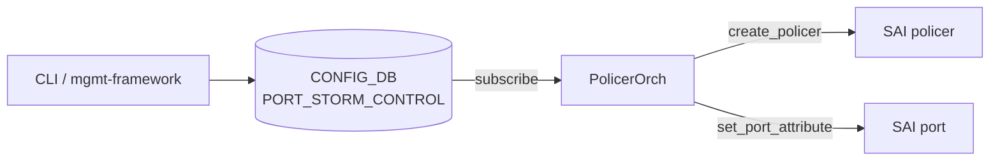

!!! success "裏取りステータス: Code-verified"
    `sonic-swss/tests/test_storm_control.py` L9-247 で `PORT_STORM_CONTROL` 経由の broadcast / unknown unicast / unknown multicast の kbps 設定 / 削除を確認。`sonic-utilities/show/main.py` L175-235 で `show storm-control`、`config/main.py` L788-822 で `storm_control_interface_validate` / `is_storm_control_supported` / `storm_control_set_entry` を確認。`scripts/storm_control.py` を `setup.py` L194 で同梱。

# BUM ストームコントロール

## なぜ必要か

BUM（Broadcast / Unknown-unicast / unknown-Multicast）ストームは L2 ドメインを劣化させる典型的障害。本機能は **物理ポート単位で 3 タイプを個別に kbps レート制限** し、SAI policer をポート入力段に紐付ける[^1]:

- レンジ 0 kbps 〜 100 Gbps（10^8 kbps）
- 物理ポート専用（VLAN / PortChannel には直接設定不可、メンバ port で設定）
- 超過分は単純ドロップ
- 統計（hit / drop 数）は本 HLD のスコープ外

## アーキテクチャ



1. `config interface storm-control ...` が `PORT_STORM_CONTROL` に書く
2. `PolicerOrch` が購読し、内部名 `<intf>_<storm_type>` で policer を管理
3. `create_policer` で meter 作成
4. `set_port_attribute` で対応ポート属性に policer ID をセット

| ストームタイプ | SAI ポート属性 |
|----------------|----------------|
| Unknown-unicast | `SAI_PORT_ATTR_FLOOD_STORM_CONTROL_POLICER_ID` |
| Broadcast | `SAI_PORT_ATTR_BROADCAST_STORM_CONTROL_POLICER_ID` |
| Unknown-multicast | `SAI_PORT_ATTR_MULTICAST_STORM_CONTROL_POLICER_ID` |

## SAI policer の設定

| SAI 属性 | 値 |
|----------|----|
| `SAI_POLICER_ATTR_METER_TYPE` | `bytes` |
| `SAI_POLICER_ATTR_MODE` | `storm`（`sr_TCM` / `tr_TCM` ではない）|
| `SAI_POLICER_ATTR_CIR` | bps 値（kbps × 1000）|

`storm` モードのため CBS / EBS / PBS は使わない[^1]。

## Warm boot

CONFIG_DB に永続化、system warm boot および SWSS Docker warm boot を跨いで継続することが要件[^1]。

## CONFIG_DB / CLI

| Table | Key | フィールド |
|-------|-----|------------|
| `PORT_STORM_CONTROL` | `<port>\|<storm_control_type>` | `enabled: 0/1`, `kbps`（最大 13 桁）|

`storm_control_type` = `broadcast` / `unknown-unicast` / `unknown-multicast`。

```bash
# Ethernet0: Broadcast 1 Mbps、Unknown-unicast 2 Mbps
config interface storm-control broadcast add Ethernet0 1000
config interface storm-control unknown-unicast add Ethernet0 2000

# 解除（kbps を渡してはならない）
config interface storm-control broadcast del Ethernet0

show storm-control all
show storm-control interface Ethernet0
```

## 制限事項

- VLAN / PortChannel には設定不可（物理ポート側で）
- 統計はスコープ外
- スケール上限は物理ポート数 × 3 タイプ
- `kbps` の上限は 100,000,000

## 干渉する機能

- VLAN / PortChannel: メンバ物理ポートで設定。LAG ハッシュ前の入力段で計測されるため独立に効く
- PolicerOrch: ACL ポリサーと同じ Orch だが、ストーム制御は内部命名規則 `<intf>_<storm_type>` で別管理
- Warm boot: PolicerOrch が CONFIG_DB 再読み込みで SAI 再投入

## トラブルシューティング

- レート制限が効かない → `redis-cli -n 4 hgetall 'PORT_STORM_CONTROL|Ethernet0|broadcast'` で CONFIG_DB 確認 → `ASIC_DB` の `SAI_OBJECT_TYPE_POLICER` とポート属性 `*_STORM_CONTROL_POLICER_ID` 確認
- VLAN / PortChannel 名で拒否 → 仕様どおり、メンバ物理 port で設定
- 値の上書きが反映されない → ベンダ SAI が `SET` 未対応の場合は再作成が必要。SWSS/SAI ログ確認
- `kbps` 範囲外で CLI 拒否 → 0〜100,000,000 にする

## 関連 Topics

- [06-l2-vlan-lag](../topics/06-l2-vlan-lag/index.md): L2 フラッディング全般
- [07-acl-copp-mirror](../topics/07-acl-copp-mirror/index.md): policer / レート制御の文脈
- [08-qos-buffer](../topics/08-qos-buffer/index.md): policer / QoS との関係

## 引用元

[^1]: `sonic-net/SONiC` `doc/bum_storm_control/bum_storm_control_hld.md` @ `49bab5b5ff0e924f1ea52b3d9db0dfa4191a7c06`
