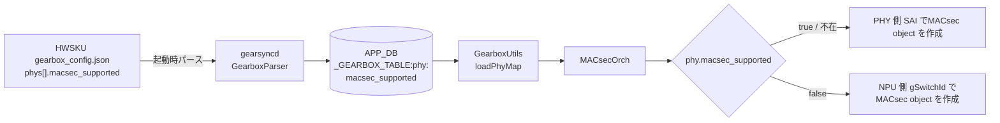
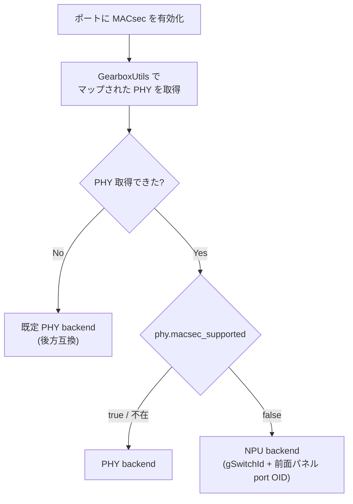

<!-- topics-tip -->
!!! tip "Topics で読み物として読む"
    この HLD は実装詳細を含みます。機能の概念・設定・運用を読み物として読みたい場合は [Topics 15 章: Security / AAA / FIPS / Hardening](../topics/15-security-aaa/index.md) を参照。
<!-- /topics-tip -->

!!! success "裏取りステータス: Code-verified"
    現行 master で実装済みを確認。`sonic-swss/gearsyncd/gearboxparser.cpp:161-164` で `macsec_supported` パース、`sonic-swss/lib/gearboxutils.h:67` で `gearbox_phy_t::macsec_supported` フィールド、`sonic-swss/lib/gearboxutils.cpp:141,199-201` で default true / `loadPhyMap` のパース。`sonic-swss/orchagent/macsecorch.cpp:363,409` で `force_npu = !phy->macsec_supported`、`macsecorch.cpp:2539-2563` で `phy->macsec_supported` 分岐ガード。HWSKU では `nexthop NH-5010-F-O32-C32` / `arista 7280R4-32QF-32DF` 等の `gearbox_config.json` に取り込み済み（verified at: 2026-05-09）。

# Gearbox PHY ごとの MACsec backend 決定（`macsec_supported`）

## 概要

外部 PHY / Gearbox を持つプラットフォームでは、ポートが PHY 側 [SAI](../reference/glossary.md#term-sai)（gbsyncd）の `switch_id` に紐づいて管理されている。従来の [MACsec](../reference/glossary.md#term-macsec) orchestration は **「Gearbox ポートなら PHY 側で MACsec オブジェクトを作る」** という固定動作だった[^1]。問題は、PHY SAI が MACsec エンジンを実装していない場合に **`SAI_STATUS_NOT_IMPLEMENTED`** が返り、`gbsyncd` がエラー、[orchagent](../reference/glossary.md#term-orchagent) が不安定になる点。

本 [HLD](../reference/glossary.md#term-hld) は HWSKU の `gearbox_config.json` に **PHY ごとの `macsec_supported`（boolean）** を加え、`MACsecOrch` がその capability を見て「PHY backend」か「[NPU](../reference/glossary.md#term-npu) backend（既定 SAI switch）」を **決定論的に選ぶ** ようにする[^1]。runtime probing やフォールバックは行わない。

互換性を保つため、フィールドが無い場合は **`true`（PHY backend）扱い**。既存挙動を壊さない[^1]。

## 動作仕様

### 全体フロー



### gearbox_config.json への追加

```json
{
  "phys": [{
    "phy_id": 1,
    "name": "phy1",
    "macsec_supported": false,
    "phy_access": "mdio",
    "config_file": "...",
    "...": "..."
  }],
  "interfaces": [
    { "name": "Ethernet0", "phy_id": 1, "system_lanes": [0,1,2,3], "line_lanes": [4,5,6,7] }
  ]
}
```

| フィールド | 型 | デフォルト | 意味 |
|----------|----|----------|------|
| `phys[].macsec_supported` | bool | `true` | PHY が MACsec をサポートするか。`false` のとき NPU backend を強制 |

### バックエンド決定ロジック



ルール（HLD まとめ）[^1]:

- `macsec_supported == false`: NPU backend
- `macsec_supported == true` または不在: PHY backend（既定）
- `_GEARBOX_TABLE` のエントリ自体が無い: PHY backend（NOTICE ログ、後方互換）
- PHY 側 SAI から `SAI_STATUS_NOT_IMPLEMENTED` が返ったとき **runtime fallback はしない**。エラーログを出して失敗扱い

「自動フォールバックしない」というのが本 HLD の重要な設計判断で、[ASIC](../reference/glossary.md#term-asic) ベンダーが自分の plat で `macsec_supported` を正しく宣言することが運用要件になる。

### コンポーネント変更

#### A) gearsyncd（`GearboxParser`）

`phys` ループに以下の追加が入る[^1]:

```cpp
if (phy.find("macsec_supported") != phy.end()) {
    val = phy["macsec_supported"];
    attrs.emplace_back("macsec_supported", val.get<bool>() ? "true" : "false");
}
```

`_GEARBOX_TABLE:phy:<id>` の他の PHY 属性と並べて attribute として書き込む。

#### B) `GearboxUtils`（orchagent / lib）

`gearbox_phy_t` 構造体に `bool macsec_supported`（デフォルト true）を追加し、`loadPhyMap()` でパースする[^1]:

```cpp
bool cap = true; // default
for (auto &fv : ovalues) {
    if (fv.first == "macsec_supported") cap = (fv.second == "true");
}
phy.macsec_supported = cap;
```

#### C) `MACsecOrch`

ポート単位で次のように分岐する[^1]:

```cpp
bool use_phy = true; // default
if (phy && (phy->macsec_supported == false)) {
    SWSS_LOG_NOTICE("MACsec: %s -> backend=NPU (phy marked unsupported)", port_name.c_str());
    use_phy = false;
}
return use_phy ? usePhy() : useNpu();
```

`useNpu()` 経路では既定 SAI switch（`gSwitchId`）と front-panel port OID で MACsec object を作る。

<!-- evidence:
source: sonic-net/SONiC/doc/macsec-gearbox/macsec_backend_gearbox.md#L78-L100 (sha: 49bab5b5ff0e924f1ea52b3d9db0dfa4191a7c06)
excerpt: |
  For each port:
  - If `macsec_supported == false`: use NPU/global switch for MACsec
  - If `macsec_supported == true` OR field is absent: use PHY switch for MACsec (default, preserves existing behavior)
  No runtime fallback. If PHY SAI does not implement MACsec and the field is true/absent, the operation fails and is logged.
reasoning: 「フォールバックしない」「不在は true 扱い」という本設計の中核ルールの根拠。
-->

<!-- evidence-rendered:start -->
??? note "📋 検証エビデンス: sonic-net/SONiC/doc/macsec-gearbox/macsec_backend_gearbox.md#L78-L100 (sha: 49bab5b5ff0e924f1ea52b3d9db0dfa4191a7c06)"

    **出典**:

    `sonic-net/SONiC/doc/macsec-gearbox/macsec_backend_gearbox.md#L78-L100 (sha: 49bab5b5ff0e924f1ea52b3d9db0dfa4191a7c06)`

    **抜粋**:

    ```text
    For each port:
    - If `macsec_supported == false`: use NPU/global switch for MACsec
    - If `macsec_supported == true` OR field is absent: use PHY switch for MACsec (default, preserves existing behavior)
    No runtime fallback. If PHY SAI does not implement MACsec and the field is true/absent, the operation fails and is logged.
    ```

    **判断根拠**: 「フォールバックしない」「不在は true 扱い」という本設計の中核ルールの根拠。

<!-- evidence-rendered:end -->

### Warm boot / Fast boot

バックエンド選定は決定論的（`gearbox_config.json` 由来）であり、再起動後も同じ結果になる。Warm/Fast boot に対する追加処理は不要[^1]。

### Backward Compatibility

- `macsec_supported` は **optional**。指定が無いプラットフォームは従来どおり PHY backend
- [CONFIG_DB](../reference/glossary.md#term-config_db) / APP_DB の意味論は変わらない（追加フィールドのみ）
- ローリングアップグレード安全[^1]

## 設定

### 関連する CONFIG_DB

CONFIG_DB スキーマには変更を加えない。設定の入口は HWSKU の `gearbox_config.json`[^1]。

### APP_DB

```text
_GEARBOX_TABLE:phy:<phy_id>
    macsec_supported : "true" | "false"
```

他の PHY 属性（`phy_id`, `name`, `bus_id`, `context_id`, `macsec_ipg` など）と同じテーブルに並ぶ。

### 関連する CLI

専用 CLI は導入しない。プラットフォームオーナが HWSKU 側 `gearbox_config.json` で宣言する[^1]。

### 関連する YANG

該当 [YANG](../reference/glossary.md#term-yang) モジュールは HLD で言及されていない。

## 制限事項

- 対象は **外部 PHY / Gearbox プラットフォームのみ**。NPU 直結ポートには影響なし
- `macsec_supported=true` を宣言しているのに PHY SAI が MACsec を実装していない場合、フォールバックされず **エラーで失敗する**[^1]。プラットフォーム側の宣言責任が大きい
- `wpa_supplicant` のドライバ動作には変更なし[^1]
- 運用者向け CLI は無い（後方互換と単純性のためあえて切られている）

## 干渉する機能

- **`gbsyncd`**: PHY backend を選んだとき MACsec オブジェクトは `gbsyncd` 経由で PHY SAI に作られる
- **`PortsOrch`**: Gearbox ポートを PHY `switch_id` に紐づけている既存ロジックと組み合わさる
- **`MACsecOrch`**: 既存 MACsec orch ロジックに「PHY 能力に応じた backend 切替」が割り込む
- **HWSKU パッケージング**: `gearbox_config.json` の更新が必須となる platform がある

## トラブルシューティング

- MACsec が PHY backend で `SAI_STATUS_NOT_IMPLEMENTED` で失敗する場合、HWSKU `gearbox_config.json` で当該 PHY に `"macsec_supported": false` を入れる
- バックエンド選定結果は orchagent ログの `MACsec: <port> -> backend=NPU (phy marked unsupported)` NOTICE で確認できる
- `_GEARBOX_TABLE` 自体が無い場合、`gearsyncd` が `gearbox_config.json` をパースできていない可能性。gearsyncd ログを確認

### コマンド例

Gearbox port での MACsec backend 選択を確認する。

```bash
show macsec
show interfaces transceiver presence
docker logs macsec 2>&1 | tail
```

## 引用元

[^1]: `sonic-net/SONiC` `doc/macsec-gearbox/macsec_backend_gearbox.md` @ `49bab5b5ff0e924f1ea52b3d9db0dfa4191a7c06`

<!-- concerns hint:
- gearsyncd / gearboxparser.cpp に macsec_supported パース処理が入っているか
- GearboxUtils gearbox_phy_t と loadPhyMap の現行コード差分
- MACsecOrch の usePhy() / useNpu() 切替実装
- APP_DB _GEARBOX_TABLE スキーマの最終形
- HWSKU 側 gearbox_config.json サンプルの存在
-->

<!-- topics-back-ref -->
## 関連 Topics

- [Topics: Security / AAA / FIPS / Hardening](../topics/15-security-aaa/index.md)

<!-- /topics-back-ref -->

<!-- glossary-links-injected: 8a1c8f4a431d -->
