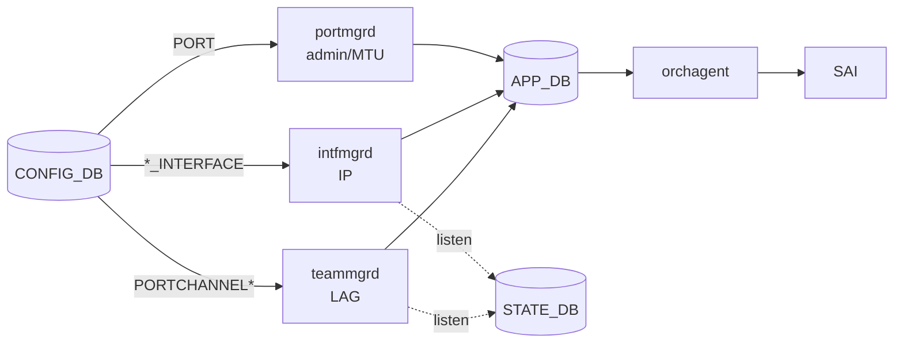

<!-- topics-tip -->
!!! tip "Topics で読み物として読む"
    この HLD は実装詳細を含む。機能の概念・設定・運用を読み物として読みたい場合は [Topics 06 章: L2 / VLAN / LAG](../topics/06-l2-vlan-lag/index.md) を参照。
<!-- /topics-tip -->

!!! success "裏取りステータス: code-verified"
    `portmgrd` / `intfmgrd` / `teammgrd` の 3 daemon は現行 master の `sonic-swss/cfgmgr/{portmgr,intfmgr,teammgr}.cpp` に存在し、HLD の責務分担と一致。`config portchannel add` は `min_links` / `fallback` を受け付ける（`sonic-utilities/config/main.py:2835-2853`）。Phase 1/2（loopback の portmgrd 移管、teamd docker 再起動の状態復元）の現状は別途裏取り。

# IP / LAG / MTU の Incremental Update

## なぜ「1 テーブル 1 マネージャ」なのか

[SONiC](../reference/glossary.md#term-sonic) の初期実装は port / IP / [LAG](../reference/glossary.md#term-lag) を `/etc/network/interfaces` や `/etc/teamd/` の **静的ファイル** に書き出していた。再起動なしの設定変更ができず運用上厳しい。本 [HLD](../reference/glossary.md#term-hld) は構成変更を **[CONFIG_DB](../reference/glossary.md#term-config_db) から incremental に流す** モデルを定め、原則を **theorem** として明文化する[^1]:

> "Each configuration table can have one and only one manager daemon associated with it."

これで「同じ設定を別ルートから書き換えて競合する」事態を構造的に排除する。

## 責任分担

| 責任 | CONFIG_DB | 担当 daemon |
|------|-----------|------------|
| port admin / MTU | `PORT` | `portmgrd` |
| IP（port / portchannel / [VLAN](../reference/glossary.md#term-vlan)）| `INTERFACE` / `PORTCHANNEL_INTERFACE` / `VLAN_INTERFACE` | `intfmgrd` |
| portchannel と member | `PORTCHANNEL` / `PORTCHANNEL_MEMBER` | `teammgrd` |



主な挙動[^1]:

- `intfmgrd` / `teammgrd` は **[STATE_DB](../reference/glossary.md#term-state_db) を listen** して依存解決（portchannel 生成 / member netdev 出現を待つ）
- `teammgrd` は **LAG から外れた port の admin/MTU を元に戻す** 責務も持つ
- `portsyncd` / `teamsyncd` は netdev 検知で `state=ok` を STATE_DB に書くだけ
- `orchagent` は LAG MTU → 全 member MTU、port/LAG MTU → [RIF](../reference/glossary.md#term-rif) MTU を追従

## Phase 別ゴール

| Phase | 到達点 |
|-------|--------|
| 0 | minigraph で boot 直後に動作状態へ。IP / LAG / admin / MTU が正しく入る |
| 1 | フロントパネル / [teamd](../reference/glossary.md#term-teamd-teamsyncd-teammgrd) の静的設定を排除。CLI で port up/down、IP 追加削除、MTU、LAG 作成削除、member 追加削除が incremental に可能。**`docker swss` 再起動** で状態復元 |
| 2 | loopback も [portmgrd](../reference/glossary.md#term-portmgrd) 管理へ。**`docker teamd` 再起動** で LAG 全再構築（一旦削除 → 作り直し） |

Phase 2 は IPv6 neighbor 削除や [SAI](../reference/glossary.md#term-sai) 問題で Phase 1 から切り出された経緯[^1]。

## サポートしない conflicting 操作

ユーザに手順分割を要求する[^1]:

- IP がついたままの portchannel を削除（先に IP 削除が必要）
- IP がついた port を portchannel に取り込む
- portchannel メンバに IP を割り当て
- 存在しない port を portchannel に追加/削除

## 既定値と継承

- 既定 admin UP / MTU 9100
- portchannel と member の admin status は **独立**
- member port は portchannel の MTU を **継承**。LAG から外れると元 MTU に自動復帰[^1]

## CONFIG_DB スキーマ

| Table | Key | フィールド |
|-------|-----|------------|
| `PORT` | `<port>` | `admin_status`, `mtu` |
| `INTERFACE` | `<port>\|<IP>` | （key のみ）|
| `PORTCHANNEL` | `<pc>` | `admin_status`, `mtu`, `min_links`, `fallback` |
| `PORTCHANNEL_INTERFACE` | `<pc>\|<IP>` | （key のみ）|
| `PORTCHANNEL_MEMBER` | `<pc>\|<port>` | （key のみ）|
| `VLAN_INTERFACE` | `<vlan>\|<IP>` | （key のみ）|

## 設定例

```bash
# port に IP
config interface Ethernet0 add ip 10.0.0.0/31

# LAG 作成 + member + IP
config portchannel add PortChannel0001 --min_links 1 --fallback false
config portchannel member add PortChannel0001 Ethernet4
config interface PortChannel0001 add ip 10.0.0.2/31

# MTU
config interface PortChannel0001 mtu 9216
```

## 既知の問題

### teamd が netdev 再作成後に LAG を再構築できない（#40）

`swss` / `teamd` Docker の再起動後、`teamd` が LAG ([PortChannel](../reference/glossary.md#term-portchannel)) を再作成できないケースがある。`teamsyncd` が Docker 再起動時にクラッシュする別問題も報告されている。

**回避策:** `--no-ports` オプション（ポートなしで起動）を使用して teamd を起動し、後から `teamdctl` でポートを追加:

```bash
teamd -d -r -f /etc/sonic/teamd/PortChannel1.conf --no-ports
teamdctl PortChannel1 port add Ethernet0
teamdctl PortChannel1 port add Ethernet4
```

- 参照: [sonic-net/SONiC#40](https://github.com/sonic-net/SONiC/issues/40)

### PortChannel メンバーポートの MAC アドレス不一致による ARP 不完全（#87）

PortChannel のメンバーポートの1つが他のポートと異なる MAC アドレスを持つ場合（SAI ホストインターフェースの MAC 割り当てバグ）、[ARP](../reference/glossary.md#term-arp) エントリが不完全状態（flags = 0x0）になり通信ができなくなる。

**デバッグ方法:**

```bash
# 各 Ethernet ポートの MAC アドレスを確認（全て同一が正常）
ip link show | grep -A1 Ethernet | grep link/ether
# または
teamdctl PortChannel1 state dump | grep dev_addr
```

**暫定回避策:** 静的 ARP エントリを手動追加:

```bash
sudo arp -s <peer_IP> <peer_MAC_addr>
```

- 参照: [sonic-net/SONiC#87](https://github.com/sonic-net/SONiC/issues/87)

### Kernel 4.9 においてポートチャネル作成時に race condition が発生する既知の問題（sonic-buildimage#1981）

Kernel 4.9 においてポートチャネル作成時に race condition が発生する既知の問題。並行してポートチャネルを作成・削除するとカーネルクラッシュが起きる可能性

- 参照: [sonic-net/sonic-buildimage#1981](https://github.com/sonic-net/sonic-buildimage/issues/1981)


### PortChannel を削除後もインターフェースが PortChannel メンバーとして表示される問題（sonic-buildimage#5051）

PortChannel を削除後もインターフェースが PortChannel メンバーとして表示される問題。`config portchannel member del` コマンドを実行してから PortChannel を削除する必要がある

- 参照: [sonic-net/sonic-buildimage#5051](https://github.com/sonic-net/sonic-buildimage/issues/5051)


### 1000 個の PortChannel を設定すると orchagent がクラッシュする制約（sonic-buildimage#5054）

1000 個の PortChannel を設定すると orchagent がクラッシュする制約。プラットフォームごとの PortChannel 数上限を事前確認すること。一般的には 256 または 512 が上限

- 参照: [sonic-net/sonic-buildimage#5054](https://github.com/sonic-net/sonic-buildimage/issues/5054)


### インターフェースを追加・削除した後にインターフェース状態が down のままになる問題（sonic-buildimage#5347）

インターフェースを追加・削除した後にインターフェース状態が down のままになる問題。`config interface startup <ifname>` を実行してインターフェースを明示的に有効化すること

- 参照: [sonic-net/sonic-buildimage#5347](https://github.com/sonic-net/sonic-buildimage/issues/5347)


### warm-reboot 中に teamd が SIOCADDMULTI/SIOCDELMULTI ioctl で LAG（sonic-buildimage#5761）

warm-reboot 中に teamd が SIOCADDMULTI/SIOCDELMULTI ioctl で LAG フラップを引き起こす問題。チームドライバとカーネルバージョンの互換性を確認すること

- 参照: [sonic-net/sonic-buildimage#5761](https://github.com/sonic-net/sonic-buildimage/issues/5761)


### PortChannel のメンバーとして設定されているインターフェースをブレークアウトしようとするとエラーになる制約（sonic-buildimage#6630）

PortChannel のメンバーとして設定されているインターフェースをブレークアウトしようとするとエラーになる制約。[DPB](../reference/glossary.md#term-dpb) 実行前に PortChannel メンバーを削除すること

- 参照: [sonic-net/sonic-buildimage#6630](https://github.com/sonic-net/sonic-buildimage/issues/6630)

## 制限事項

- conflicting configuration は未対応（前項）
- 既定値（admin UP / MTU 9100）以外を要する機器は明示設定が要る
- LAG member 単独の MTU は LAG 配下では無視される
- HLD は 2018 年時点。Phase 2 の現行実装範囲は別途裏取り対象

## 干渉する機能

旧 `/etc/network/interfaces` 静的設定 / warm reboot（incremental 前提と整合）/ VLAN_INTERFACE / DHCP relay / SAI RIF MTU（[orchagent](../reference/glossary.md#term-orchagent) が追従）/ [LACP](../reference/glossary.md#term-lacp) `fallback` / `min_links`。

## トラブルシューティング

- LAG member の MTU が変わらない → portchannel 側で MTU を変更（member 単独は無効）
- LAG 削除エラー → IP が残っていないか確認
- member 抜去後に admin が元に戻らない → teammgrd ログを確認
- docker swss 再起動後に IP が消える → Phase 1 復元実装の現状を確認
- `ip` コマンド直叩き等の別ルート操作 → theorem 違反、CONFIG_DB 経由のみ正規


### コマンド例

LAG / IP の差分更新が CONFIG_DB を経由しているか確認する。

```bash
redis-cli -n 4 keys 'PORTCHANNEL|*'
redis-cli -n 4 keys 'PORTCHANNEL_MEMBER|*'
teamdctl PortChannel1 state
show interfaces portchannel
```

## 実装との乖離 / 補足

- `portmgrd` / `intfmgrd` / `teammgrd` は `sonic-swss/cfgmgr/{portmgr,intfmgr,teammgr}.cpp` に存在し HLD と一致
- CLI: `config portchannel add` は `--min_links` / `--fallback` / `--fast_rate` を受け付ける（`sonic-utilities/config/main.py:2835-2853`）
- Phase 2（loopback portmgrd 化、teamd docker 再起動時の state 復元）は本ページの裏取り範囲外

## 関連 Topics

- [06-l2-vlan-lag](../topics/06-l2-vlan-lag/index.md): L2 / VLAN / LAG の全体像
- [11-reboot](../topics/11-reboot/index.md): warm/fast reboot との関係

## 引用元

[^1]: `sonic-net/SONiC` `doc/incremental-update-ip-lag/Incremental IP LAG Update.md` @ `49bab5b5ff0e924f1ea52b3d9db0dfa4191a7c06`

<!-- topics-back-ref -->
## Topics 一覧

- [Topics: L2 / VLAN / LAG / MC-LAG](../topics/06-l2-vlan-lag/index.md)

<!-- /topics-back-ref -->

<!-- glossary-links-injected: c69fb8ae1da9 -->
