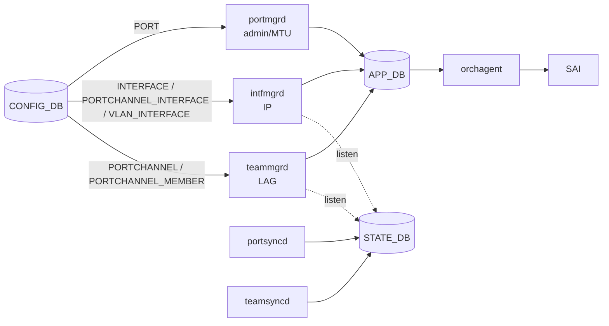
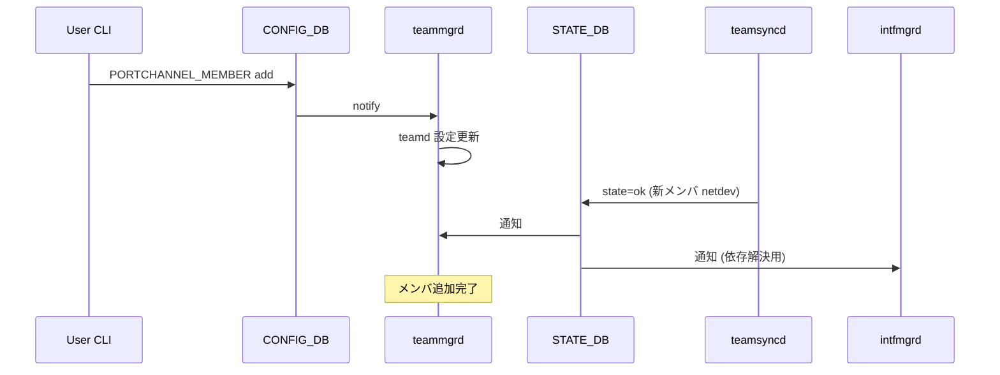

!!! warning "裏取りステータス: HLD-only"
    このページは公式 HLD（2018 年版・初期 incremental update 設計）のみを根拠にしている。`portmgrd` / `intfmgrd` / `teammgrd` の現行実装、`/etc/network/interfaces` から portmgrd 管理への移行完了状況、`config interface` / `config portchannel` CLI の現状は未裏取り。HLD 当時の Phase 0/1/2 完了度合いも別途裏取りが必要。

# IP / LAG / MTU の Incremental Update（portmgrd / intfmgrd / teammgrd 分担）

## 概要

SONiC の初期実装は port / IP / LAG の構成を `/etc/network/interfaces` や `/etc/teamd/` の **静的ファイル** に書き出す方式に依存していた。これだと **再起動なしの設定変更** ができず、運用上の制約が大きい。

本 HLD は構成変更を **incremental に CONFIG_DB から流す** ためのモデルを定義し、各 manager daemon の **責務分担** を整理する。設計の中核となる原則は次の **theorem**[^1]:

> "Each configuration table can have one and only one manager daemon associated with it."

つまり 1 テーブル 1 マネージャ。これを守ることで「同じ設定を別ルートから書き換えて競合する」事態を構造的に避けている。

責任分担[^1]:

| 責任 | 関連 CONFIG_DB | 担当 |
|------|----------------|------|
| port admin status / MTU | `PORT` | `portmgrd` |
| IP（port / port channel / VLAN）| `INTERFACE` / `PORTCHANNEL_INTERFACE` / `VLAN_INTERFACE` | `intfmgrd` |
| port channel と member | `PORTCHANNEL` / `PORTCHANNEL_MEMBER` | `teammgrd` |

## 動作仕様

### Phase 別の到達点

HLD は到達ゴールを Phase 分割している[^1]。

#### Phase 0

- minigraph をもとに **boot 直後に動作状態に到達** できること。
  1. 各 router interface に IP が正しく入る
  2. port channel が作成され、メンバが正しく enslave される
  3. 設定ポートが admin UP
  4. 設定ポートが希望 MTU

#### Phase 1

- フロントパネル interface の **静的設定を `/etc/network/interfaces` から排除**。
- teamd の **静的設定を `/etc/teamd/` から排除**。
- CLI で次の **incremental update** を実行できる:
  - port / port channel の up/down
  - 非 LAG メンバ port および port channel に対する IP 追加 / 削除
  - port / port channel の MTU 変更
  - port channel の作成 / 削除
  - port channel のメンバ追加 / 削除
- **`docker swss` の再起動** に対し、再起動前の状態へ復元できること。

#### Phase 2

- loopback interface も `/etc/network/interfaces` から `portmgrd` 管理へ移管。
- **`docker teamd` 再起動** に対し、すべての port channel 設定が再適用される。再起動中は制御 / データ両プレーンから一旦削除し、新規構成で作り直す。

Phase 2 は IPv6 neighbor 削除や SAI 実装の問題で Phase 1 から切り出された経緯がある[^1]。

### サポート範囲外（Phase 1 時点）

「直接解消できない conflicting configuration は **サポートしない**」とされている代表例[^1]:

- IP がついたままの port channel を削除する（先に IP を消す必要）
- IP がついた port を port channel に取り込む
- port channel メンバに IP を割り当てる
- 存在しない port を port channel に追加 / 削除する

これらはユーザに **手順を分けて投入する責任** を負わせる設計。

### 既定値と継承規則[^1]

- **既定 admin status は UP**、**既定 MTU は 9100**。
- port channel と member の admin status は **独立に設定** される。port channel の admin DOWN がそのままメンバを DOWN にすることはない。
- メンバ port は **port channel の MTU を継承** する。port channel から外れると **元の MTU に自動で戻る**。

### CONFIG_DB スキーマ

要点抜粋[^1]:

| Table | Key | フィールド |
|-------|-----|-----------|
| `PORT` | `<port_name>` | `admin_status`, `mtu` |
| `INTERFACE` | `<port_name>|<IP>` | （key のみ）|
| `PORTCHANNEL` | `<pc_name>` | `admin_status`, `mtu`, `min_links`, `fall_back` |
| `PORTCHANNEL_INTERFACE` | `<pc_name>|<IP>` | （key のみ）|
| `PORTCHANNEL_MEMBER` | `<pc_name>|<port_name>` | （key のみ）|
| `VLAN_INTERFACE` | `<vlan_name>|<IP>` | （key のみ）|

`PORTCHANNEL` のスキーマ[^1]:

```text
key           = PORTCHANNEL:name
admin_status  = "down" / "up"
MTU           = 1*4DIGIT
MIN_LINKS     = 1*2DIGIT
FALL_BACK     = "false" / "true"
```

### Daemon の責務（詳細）



担当の細かい挙動[^1]:

- **`portmgrd`**: `PORT` を購読し admin / MTU を反映。
- **`intfmgrd`**: `*_INTERFACE` 系を購読し IP を反映。**STATE_DB を listen** して port channel の生成 / 削除を検知する（依存解決のため）。
- **`teammgrd`**: `PORTCHANNEL` / `PORTCHANNEL_MEMBER` を購読。**STATE_DB を listen** してメンバの生成 / 削除を検知。**port を LAG から外したときに、その port の admin / MTU を元に戻す責務** も持つ。
- **`portsyncd`**: admin / MTU の設定責任は **持たない**（portmgrd へ移管済）。netdev が出来たら STATE_DB に `state -> ok` を書く。
- **`teamsyncd`**: 同様に netdev 生成検知で `state -> ok` を書く。
- **`orchagent`**:
  - LAG MTU 更新 → 全メンバの MTU も更新。
  - port / LAG MTU 更新 → 関連 router interface の MTU を更新。
  - port が port channel の member の場合、その port 自体への MTU は **適用しない**（LAG が継承させるため）。



<!-- evidence:
source: sonic-net/SONiC/doc/incremental-update-ip-lag/Incremental IP LAG Update.md#L83-L86 (sha: 49bab5b5ff0e924f1ea52b3d9db0dfa4191a7c06)
excerpt: |
  Database Design
  CONF_DB
  Theorem: Each configuration table can have one and only one manager daemon associated with it.
reasoning: 「1 テーブル 1 マネージャ」が責務分担の根本原則であることの根拠。
-->

### CLI

`config interface` / `config portchannel` 系で incremental に投入できる[^1]:

```bash
config interface <if> add ip <ip>
config interface <if> remove ip <ip>
config interface <if> mtu <mtu>

config portchannel add <pc> --min_links <n> --fall_back <true|false>
config portchannel remove <pc>
config portchannel member add <pc> <port>
config portchannel member remove <pc> <port>
```

CLI 引数名 / 構文の現行スペルは sonic-utilities 側の実装に依存する（裏取り課題）。

### docker 再起動時の復元

- **`docker swss` 再起動**: Phase 1 で再起動前の状態に戻れること、と要件化されている[^1]。具体経路は HLD 時点では TBD。
- **`docker teamd` 再起動**: Phase 2。再起動中は **制御 / データ両プレーンから既存 LAG をいったん削除** し、新構成で作り直す[^1]。

## 設定

### 関連する CONFIG_DB

冒頭 frontmatter `related.config_db` のとおり。詳細は「動作仕様」のスキーマ表を参照。

### 関連する CLI

| Command | 用途 |
|---------|------|
| `config interface <if> add/remove ip <ip>` | IP 付与・削除 |
| `config interface <if> mtu <mtu>` | MTU 変更 |
| `config portchannel add/remove <pc>` | LAG 作成 / 削除 |
| `config portchannel member add/remove <pc> <port>` | メンバ追加 / 削除 |

### 設定例

```bash
# port に IP を付ける
config interface Ethernet0 add ip 10.0.0.0/31

# LAG を作って member を入れて IP を付ける
config portchannel add PortChannel0001 --min_links 1 --fall_back false
config portchannel member add PortChannel0001 Ethernet4
config interface PortChannel0001 add ip 10.0.0.2/31

# MTU 変更
config interface PortChannel0001 mtu 9216
```

## 制限事項

- **conflicting configuration は未対応** （IP 付き port channel の削除、IP 付き port の LAG 取り込み、LAG メンバへの IP 付与など）[^1]。
- 既定値は **admin UP / MTU 9100**。これと異なる初期状態が必要な機器は明示設定が要る[^1]。
- LAG メンバの port 単独に MTU を設定しても、port channel に取り込まれている間は **適用されない**。LAG から外すと元値に戻る[^1]。
- HLD は **2018 年時点** の設計。Phase 2（loopback の portmgrd 移管、teamd docker 再起動対応）は当時 future work / 別要件として切り出されており、現行 master でどこまで実装されているかは別途裏取りが必要。

## 干渉する機能

- **`/etc/network/interfaces` ベースの旧静的設定**: Phase 1 で排除する方向。両者が混在するとどちらの責任で IP / admin が設定されたか分からなくなる[^1]。
- **warm reboot**: incremental update が前提となるためこの設計は warm reboot のフローと整合する。LAG 再構築のセマンティクスが warm reboot と矛盾しない範囲で構成される必要がある。
- **VLAN_INTERFACE / DHCP relay 等**: VLAN 上の IP は `intfmgrd` 経由なので、本設計の責務分担に乗る。VLAN メンバ port の admin/MTU は portmgrd 配下のまま。
- **SAI 側の RIF MTU**: orchagent が port/LAG MTU 変更時に RIF MTU を追従する責務を持つ[^1]。RIF MTU が ICMP fragmentation 等の挙動に直結するため、注意点。
- **fall_back / min_links**: LACP の fall_back と min_links は port channel 単位で CONFIG_DB に乗る。teamd レベルの設定として teammgrd が反映する[^1]。

## トラブルシューティング

- LAG メンバの MTU が変わらない: port channel の MTU 設定経由でしか変えられない。member 単独で MTU を変更しても port channel 配下の間は無効[^1]。
- LAG 削除でエラー: IP が残っていないか確認。HLD 上「IP 付き LAG の削除」は未対応[^1]。
- LAG メンバ抜去後に port admin が UP に戻らない: teammgrd が「LAG から外れた port の admin/MTU 復元」責務を持つ。実装どおりに復元されない場合は teammgrd ログを確認[^1]。
- docker swss 再起動後に IP が消える: Phase 1 の要件として state 復元が掲げられているが[^1]、HLD 当時の段階では TBD。実装裏取りが必要。
- 設定変更を別ルート（`ip` コマンド直叩き等）から行うと挙動がずれる: HLD の theorem「1 テーブル 1 マネージャ」を破る操作。CONFIG_DB 経由のみが正規。

## 引用元

[^1]: `sonic-net/SONiC` `doc/incremental-update-ip-lag/Incremental IP LAG Update.md` @ `49bab5b5ff0e924f1ea52b3d9db0dfa4191a7c06`
