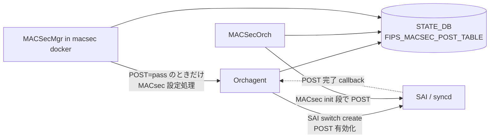
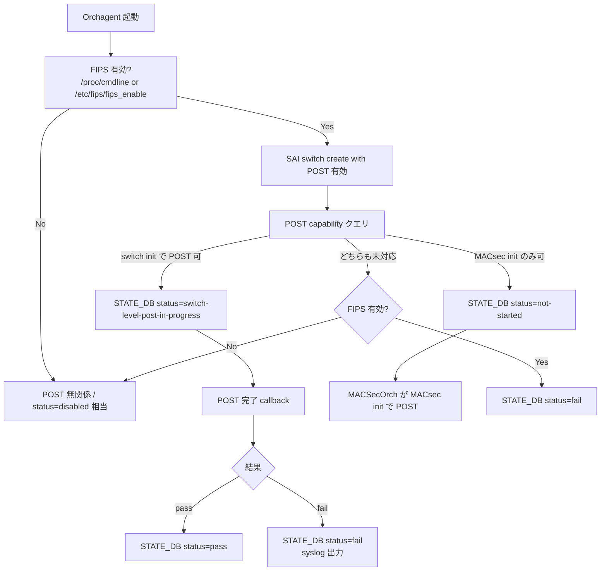
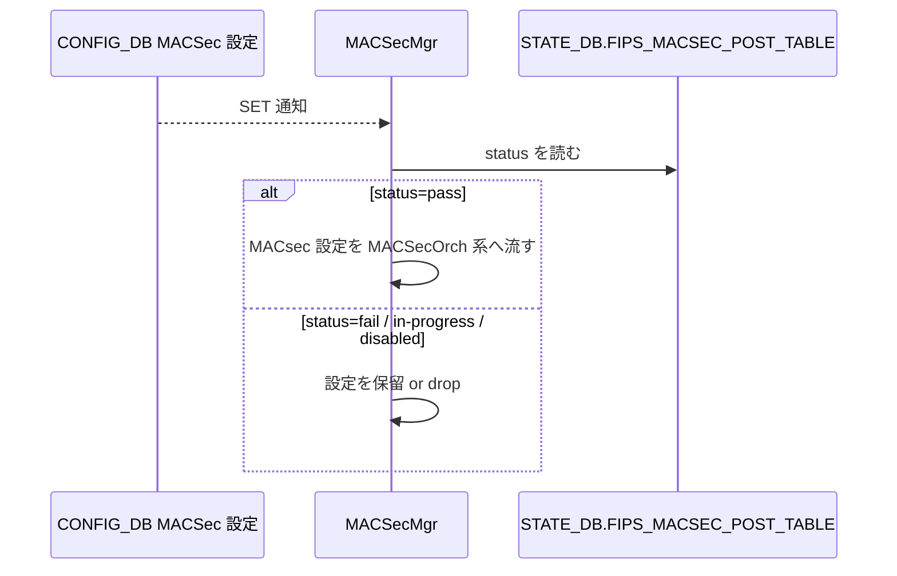

<!-- topics-tip -->
!!! tip "Topics で読み物として読む"
    この HLD は実装詳細を含みます。機能の概念・設定・運用を読み物として読みたい場合は [Topics 06 章: L2 / VLAN / LAG](../topics/06-l2-vlan-lag/index.md) を参照。
<!-- /topics-tip -->

!!! success "裏取りステータス: Code-verified"
    現行 master の `sonic-swss/orchagent/macsecpost.cpp` (`STATE_FIPS_MACSEC_POST_TABLE_NAME` を読み書き)、`sonic-swss-common/common/schema.h:471` の `STATE_FIPS_MACSEC_POST_TABLE_NAME = "FIPS_MACSEC_POST_TABLE"`、`sonic-buildimage/build_image.sh:214` の `sonic_fips=1` カーネルコマンドライン、`build_debian.sh:691-692` の `/etc/fips/fips_enable` 初期化、`dockers/docker-macsec/cli/show/plugins/show_macsec.py:351-389` の FIPS_MACSEC_POST_TABLE 読み出し CLI を確認済み（verified at: 2026-05-09）。

# FIPS 向け MACsec SAI POST（FIPS_MACSEC_POST_TABLE）

## 概要

FIPS 140-3 準拠を維持するには、暗号機構（[MACsec](../reference/glossary.md#term-macsec) ハードウェアエンジンを含む）が **動作開始前に Pre-Operational Self-Test (POST)** を通っていなければならない。本 [HLD](../reference/glossary.md#term-hld) は [SONiC](../reference/glossary.md#term-sonic) で MACsec の POST を [SAI](../reference/glossary.md#term-sai) 経由でトリガし、その結果を `STATE_DB.FIPS_MACSEC_POST_TABLE` に公開、`MACSecMgr` が POST pass を確認してから MACsec 設定を流す設計を定義する[^1]。

設計上の要件は次の 4 点[^1]:

1. [ASIC](../reference/glossary.md#term-asic) / SAI 実装の差異を吸収するため、POST は **SAI switch init 段** または **SAI MACsec init 段** のいずれでも有効化できること
2. POST 通過まで MACsec 設定を流さないこと
3. POST 失敗が **非 MACsec ポートの動作に影響しない** こと
4. 失敗時に syslog で詳細（失敗ポートの SAI OID と MACsec エンジン）を出すこと

## 動作仕様

### 全体構成



要点:

- POST 結果は `STATE_DB.FIPS_MACSEC_POST_TABLE` 1 つに集約
- `Orchagent` は SAI switch 作成時に POST capability を問い合わせ、対応箇所で POST を有効化
- `MACSecMgr` は [STATE_DB](../reference/glossary.md#term-state_db) を見て POST pass を確認するまで MACsec 設定を処理しない（FIPS 準拠の核）

### STATE_DB スキーマ

```text
FIPS_MACSEC_POST_TABLE

key    = FIPS_MACSEC_POST_TABLE|sai
status = switch-level-post-in-progress  | macsec-level-post-in-progress |
         pass | fail | disabled
```

`status` の意味[^1]:

| 値 | 意味 |
|----|------|
| `switch-level-post-in-progress` | SAI switch 段の POST 実行中 |
| `macsec-level-post-in-progress` | SAI MACsec 段の POST がトリガ済み or 実行中 |
| `pass` | POST 通過 |
| `fail` | POST 失敗 |
| `disabled` | POST 無効（FIPS 無効など） |

### FIPS 有効化の判定経路

FIPS は次の 2 経路で有効化できる[^1]:

- `sonic-installer set-fips` → `/proc/cmdline` に `sonic_fips=1`
- `/etc/sonic/fips.json` 経由 → `/etc/fips/fips_enable` に反映

`STATE_DB.FIPS_STATS` も最終的には更新されるが、Orchagent は startup タイミングで STATE_DB が未更新なケースに備え、**`/proc/cmdline` または `/etc/fips/fips_enable` を直接読む**[^1]。どちらかで FIPS 有効なら POST をトリガする。

### POST 有効化フロー（switch init）



「SAI switch 作成時に POST を有効化することで、後から MACsec を有効化するシナリオでも POST 直後に進む」のがポイント[^1]。

### POST 有効化フロー（MACsec init）

POST が SAI MACsec init 段でしかサポートされない実装向け[^1]:

- `MACSecOrch` の初期化で SAI MACsec object を **proactively に作成** し、POST を起動
- POST 完了 callback で STATE_DB を更新

そのため、MACsec ポートが 1 つも設定されていなくても SAI MACsec object が先に作られ得る。

### POST 失敗時の挙動と syslog

`MACSecOrch` は POST 失敗時、各 MACsec ポートの POST 状態を読み、失敗ポートを特定して syslog に書く[^1]。

| 失敗種別 | syslog メッセージ |
|---------|------------------|
| Switch 段失敗 | `Switch MACSec POST failed` |
| MACsec 段失敗 | `MACSec POST failed: oid <macsec-oid>, direction ingress\|egress` |

要件「非 MACsec ポートに影響を出さない」を満たすため、POST 失敗が switch まるごと down にすることは避ける設計である[^1]。

### MACSecMgr の POST ガード



`MACSecMgr` は `macsec` コンテナで動作し、[CONFIG_DB](../reference/glossary.md#term-config_db) を購読する従来のロールに **POST 状態の事前チェック** を足す形で拡張される[^1]。これが FIPS 準拠の最終ガード。

<!-- evidence:
source: sonic-net/SONiC/doc/fips/SONiC-SAI-POST.md#L97-L102 (sha: 49bab5b5ff0e924f1ea52b3d9db0dfa4191a7c06)
excerpt: |
  In order to be compliant to FIPS, SONiC should process MACSec configuration only after POST passes.
  This is achieved by enhancing MACSecMgr, running in MACSec container, to check POST status published
  in State DB before processing any MACSec configuration
reasoning: MACSecMgr が POST 完了確認を担当し、POST=pass までは MACsec 設定を処理しないという中核ルールの根拠。
-->

<!-- evidence-rendered:start -->
??? note "📋 検証エビデンス: sonic-net/SONiC/doc/fips/SONiC-SAI-POST.md#L97-L102 (sha: 49bab5b5ff0e924f1ea52b3d9db0dfa4191a7c06)"

    **出典**:

    `sonic-net/SONiC/doc/fips/SONiC-SAI-POST.md#L97-L102 (sha: 49bab5b5ff0e924f1ea52b3d9db0dfa4191a7c06)`

    **抜粋**:

    ```text
    In order to be compliant to FIPS, SONiC should process MACSec configuration only after POST passes.
    This is achieved by enhancing MACSecMgr, running in MACSec container, to check POST status published
    in State DB before processing any MACSec configuration
    ```

    **判断根拠**: MACSecMgr が POST 完了確認を担当し、POST=pass までは MACsec 設定を処理しないという中核ルールの根拠。

<!-- evidence-rendered:end -->

## 設定

### 関連する CONFIG_DB

専用 CONFIG_DB スキーマは本 HLD では新設しない。FIPS 自体の有効化は `sonic-installer` または `/etc/sonic/fips.json` で行う[^1]。

### 関連する CLI

専用 CLI は HLD で言及されていない（FIPS 有効化に既存の `sonic-installer set-fips` を使う）。MACsec POST 状態は `redis-cli` 等で `STATE_DB.FIPS_MACSEC_POST_TABLE|sai` を直接読む形になる。

### 関連する YANG

該当 [YANG](../reference/glossary.md#term-yang) モジュールは HLD で言及されていない。

## 制限事項

- POST 機能は **SAI 実装が POST capability を持っていることが前提**。POST capability が switch / MACsec のどちらにも無い ASIC では FIPS 有効時に `status=fail` 固定になる[^1]
- FIPS 有効化後は **switch reboot が必要**[^1]
- POST 通過前に投入された MACsec 設定は MACSecMgr がガードする。POST 失敗のままだと該当ポートの MACsec は永久に上がらない

## 干渉する機能

- **MACSecMgr / MACSecOrch**: 通常の MACsec 設定経路に POST 状態確認が割り込む
- **FIPS の他の暗号モジュール**: FIPS 有効化は MACsec 以外（OpenSSL / kernel 等）にも作用する。本 HLD では MACsec のみ扱う
- **`config save` / `config reload`**: FIPS 設定（`fips.json`）の永続化と整合する
- **STATE_DB.FIPS_STATS**: ブート完了後に FIPS 状態を保持。Orchagent はタイミング上これに依存できないため、`/proc/cmdline` 等を見る

## トラブルシューティング

- MACsec ポートが上がらない場合、まず `redis-cli -n 6 hgetall "FIPS_MACSEC_POST_TABLE|sai"` で `status` を確認
- `fail` の場合 syslog の `Switch MACSec POST failed` / `MACSec POST failed: oid ...` を grep して詳細を取得
- `in-progress` で進まない場合、SAI から完了 callback が来ていない可能性。`syncd` ログで POST API 呼び出しと callback を確認
- FIPS 有効化したのに POST が走らない場合、`/proc/cmdline` の `sonic_fips=1` または `/etc/fips/fips_enable` を確認

### コマンド例

MACsec FIPS POST の進捗と結果を確認する。

```bash
redis-cli -n 6 hgetall 'FIPS_MACSEC_POST_TABLE|sai'
docker logs syncd 2>&1 | grep -i 'macsec post'
grep -E 'Switch MACSec POST' /var/log/syslog
cat /proc/cmdline | tr ' ' '\n' | grep fips
```

## 関連 reference

- [YANG: sonic-macsec](../reference/yang/sonic-macsec.md)
- [Runbook: macsec mka not established](../reference/runbooks/macsec-mka-not-established.md)
- [Topics: Security / AAA](../topics/15-security-aaa/index.md)

## 引用元

[^1]: `sonic-net/SONiC` `doc/fips/SONiC-SAI-POST.md` @ `49bab5b5ff0e924f1ea52b3d9db0dfa4191a7c06`

<!-- concerns hint:
- Orchagent / MACSecOrch / MACSecMgr の POST 対応コードが現行 master に取り込まれているか
- STATE_DB FIPS_MACSEC_POST_TABLE のキー・status 値の最終形
- SAI POST capability query / completion callback API が community SAI に存在するか
- /proc/cmdline 経由 sonic_fips=1 と /etc/fips/fips_enable の取り扱い実装
- 2025-07 HLD と現行 master 取り込み状況
-->

<!-- topics-back-ref -->
## 関連 Topics

- [Topics: Security / AAA / FIPS / Hardening](../topics/15-security-aaa/index.md)

<!-- /topics-back-ref -->

## 参考リンク

本ページに関連する参照ドキュメント:

- [`FIPS` CONFIG_DB スキーマ](../reference/config-db/fips.md)
- [`MACSEC_PROFILE` CONFIG_DB スキーマ](../reference/config-db/macsec-profile.md)
- [`PORT` CONFIG_DB スキーマ](../reference/config-db/port.md)
- [`CRM` CONFIG_DB スキーマ](../reference/config-db/crm.md)
- [`sonic-fips` YANG モジュール](../reference/yang/sonic-fips.md)

<!-- augmented-links: v1 -->

<!-- glossary-links-injected: 21ed5be09831 -->
