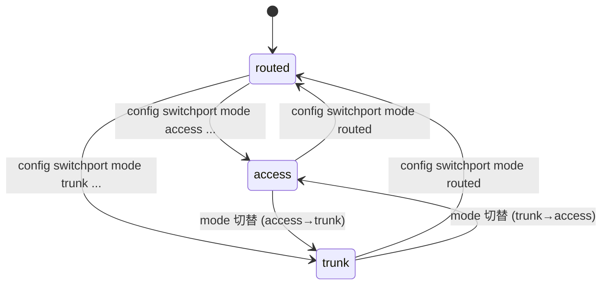
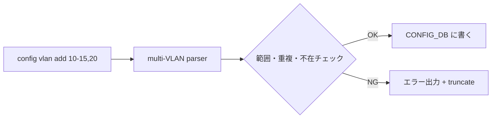

# Switchport モードと VLAN CLI 拡張 — 概念

本ページは親 [HLD](../reference/glossary.md#term-hld) [Switchport モード（access / trunk / routed）と VLAN CLI 拡張](switch-port-modes-and-vlan-cli-enhancement.md) から **概念 / 用語 / モード定義** を切り出した派生ページ。実装詳細は [internals](switch-port-modes-and-vlan-cli-internals.md)、設定例は [operations](switch-port-modes-and-vlan-cli-operations.md)、HLD と実装の乖離は [discrepancy](switch-port-modes-and-vlan-cli-discrepancy.md) を参照。

!!! note "実装状況の境界（partially implemented）"
    モード概念のうち **`access` / `trunk` の CLI（`config switchport mode access|trunk`）と複数 VLAN 一括 add/del は master に取り込み済** で動作する。一方、HLD が想定していた **`routed` モードへの明示遷移コマンドと PORTCHANNEL 一括移行は未実装** に近く、対応 PR が未取り込みの部分が残る。詳細は [discrepancy](switch-port-modes-and-vlan-cli-discrepancy.md) を参照。

## なぜこの機能が必要か

[SONiC](../reference/glossary.md#term-sonic) のレガシー [VLAN](../reference/glossary.md#term-vlan) CLI は `config vlan add 10` / `config vlan member add 10 Ethernet0 -u` のように **VLAN ID 単発操作** を強いる。多数 VLAN の運用では繰り返し叩くことになり、誤入力やループスクリプトでのレース問題があった。さらにポートの「routed / access / trunk」のような **意味的なモード** は CLI に明示されておらず、運用者の認知コストが高かった[^1]。

本機能は次の 2 つを導入する[^1]:

1. **Switchport mode**: ポート（`PORT`）と [LAG](../reference/glossary.md#term-lag)（`PORTCHANNEL`）に対して `routed` / `access` / `trunk` のモード概念を [CONFIG_DB](../reference/glossary.md#term-config_db) に持ち、CLI から切替可能にする
2. **複数 VLAN 一括 CLI**: 範囲指定（`10-20`）またはカンマ区切り（`10,15,20`）で複数 VLAN を 1 コマンドで add / del

アーキテクチャは大きく変わらず、変更は **CLI コンテナと CONFIG_DB に閉じる**[^1]。

## モードの定義

| モード | パケット入出力 |
|--------|---------------|
| `routed` | L3 インタフェース（既定）|
| `access` | 単一 VLAN の **untagged** 受信・送信のみ |
| `trunk`  | 1 つの untagged VLAN（native）+ 複数 VLAN の **tagged** 受信・送信 |

物理ポート / [PortChannel](../reference/glossary.md#term-portchannel) いずれも同じ 3 モードをサポートする[^1]。

## 状態遷移

既定値は `routed`。`access` / `trunk` への切替は所属 VLAN を伴う設定が必要（VLAN 未指定だと不完全状態）[^1]。

## 複数 VLAN 一括 CLI のスコープ

要点[^1]:

- VLAN 範囲は `2 〜 4094`
- 重複・存在チェックでエラーが出たらそこで **truncate**（後続スキップ）
- メンバ追加 (`config vlan member add <VLAN_LIST> <PORT_LIST>`) も同様に複数指定可能

## 関連ページ

- 親 HLD: [switch-port-modes-and-vlan-cli-enhancement](switch-port-modes-and-vlan-cli-enhancement.md)
- 実装詳細: [switch-port-modes-and-vlan-cli-internals](switch-port-modes-and-vlan-cli-internals.md)
- 設定 / 運用: [switch-port-modes-and-vlan-cli-operations](switch-port-modes-and-vlan-cli-operations.md)
- HLD と実装の乖離: [switch-port-modes-and-vlan-cli-discrepancy](switch-port-modes-and-vlan-cli-discrepancy.md)
- Topics 読み物: [06 章: L2 / VLAN / LAG](../topics/06-l2-vlan-lag/index.md)

<!-- phase-boundary -->
## 実装フェーズ境界

!!! info "Phase 別の実装済 / 未実装 サマリ"
    本ページは `monitor: partially_implemented` で、HLD で示された一連の機能
    が **段階的に取り込まれている** 状態を扱う。フェーズ毎の実装境界を
    1 枚の表に集約する (詳細は本ページ上部の `diff` admonition および
    [discrepancy-index](../reference/verification/discrepancy-index.md) を参照)。

    | Phase | 範囲 (機能 / 段階) | 実装済 (master 取り込み済) | 未実装 (HLD 提案のみ) |
    |---|---|---|---|
    | Phase 1 — 基本機能 | HLD §概要 / §設計の中核ユースケース | 取り込み済 — 本ページの「実装の概観」「実装詳細」節および `diff` admonition の現状側を参照 | — (Phase 1 は実装済) |
    | Phase 2 — 拡張機能 | HLD §拡張 / §追加要件 / §周辺統合 | 一部のみ取り込み済 — 本ページ「実装詳細」の補足参照 | 未実装 / 未マージ — HLD §未対応箇所、本ページ「制限事項」および `diff` admonition の差分側に列挙 |
    | Phase 3 — 将来拡張 | HLD §Future Work / §将来課題 | — | 未実装 — HLD 提案段階。対応 PR は確認されていない (last_verified 時点) |

    凡例: 「実装済」=現行 master で動作確認できる範囲 / 「未実装」=HLD には記載があるが対応 PR が未マージまたは設計のみで code が存在しない範囲。
<!-- /phase-boundary -->

## 実装との乖離

`monitor: partially_implemented` — 部分実装 — HLD の中核は実装済みだが、フィールド / API / 制約のいくつかが上流に未取り込み、または挙動が緩和されている。 本ページは split-child。差分の根拠 / 影響 / 回避策は親ページの同セクションを参照のこと。

## 引用元

[^1]: `sonic-net/SONiC` `doc/vlan/switchport-mode-support/Switchport Mode and VLAN CLI Enhancement.md` @ `49bab5b5ff0e924f1ea52b3d9db0dfa4191a7c06`

<!-- glossary-links-injected: 8ba32e5aa69d -->
