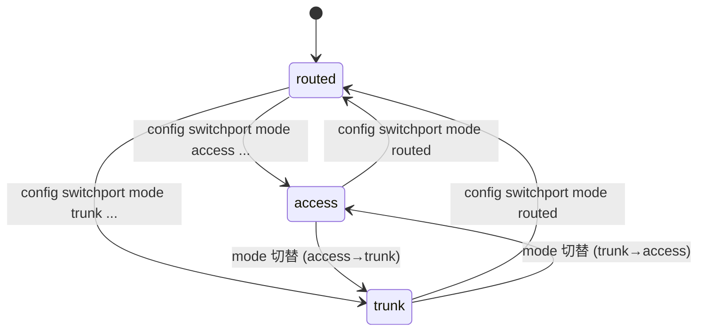
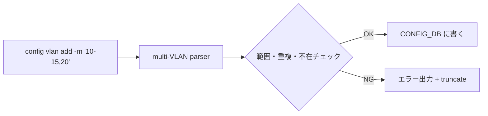

# Switchport モードと VLAN CLI 拡張 — 概念

本ページは親 [HLD](../reference/glossary.md#term-hld) [Switchport モード（access / trunk / routed）と VLAN CLI 拡張](switch-port-modes-and-vlan-cli-enhancement.md) から **概念 / 用語 / モード定義** を切り出した派生ページ。実装詳細は [internals](switch-port-modes-and-vlan-cli-internals.md)、設定例は [operations](switch-port-modes-and-vlan-cli-operations.md)、HLD と実装の乖離は [discrepancy](switch-port-modes-and-vlan-cli-discrepancy.md) を参照。

!!! note "実装状況の境界（partially implemented）"
    モード概念のうち **`access` / `trunk` / `routed` の 3 モードへの切替 CLI（`config switchport mode {access|trunk|routed} <port>`）と複数 VLAN 一括 add/del は master に取り込み済** で動作する[^cli-switchport][^cli-vlan]。一方、HLD が示していた **PORTCHANNEL に対する一括モード移行など一部の運用便宜オプション** は master のコマンド体系に取り込まれておらず、HLD と実装の細部に乖離が残る。詳細は [discrepancy](switch-port-modes-and-vlan-cli-discrepancy.md) を参照。

## なぜこの機能が必要か

[SONiC](../reference/glossary.md#term-sonic) のレガシー [VLAN](../reference/glossary.md#term-vlan) CLI は `config vlan add 10` / `config vlan member add 10 Ethernet0 -u` のように **VLAN ID 単発操作** を強いる。多数 VLAN の運用では繰り返し叩くことになり、誤入力やループスクリプトでのレース問題があった。さらにポートの「routed / access / trunk」のような **意味的なモード** は CLI に明示されておらず、運用者の認知コストが高かった[^1]。

本機能は次の 2 つを導入する[^1]:

1. **Switchport mode**: ポート（`PORT`）と [LAG](../reference/glossary.md#term-lag)（`PORTCHANNEL`）に対して `routed` / `access` / `trunk` のモード概念を [CONFIG_DB](../reference/glossary.md#term-config_db) に持ち、CLI から切替可能にする
2. **複数 VLAN 一括 CLI**: 範囲指定（`10-20`）またはカンマ区切り（`10,15,20`）で複数 VLAN を 1 コマンドで add / del

アーキテクチャは大きく変わらず、変更は **CLI コンテナと CONFIG_DB に閉じる**[^1]。

## モードの定義

| モード | パケット入出力 |
|--------|---------------|
| `routed` | L3 インタフェース（既定）|
| `access` | 単一 VLAN の **untagged** 受信・送信のみ |
| `trunk`  | 1 つの untagged VLAN（native）+ 複数 VLAN の **tagged** 受信・送信 |

物理ポート / [PortChannel](../reference/glossary.md#term-portchannel) いずれも同じ 3 モードをサポートする[^1]。

## 状態遷移

既定値は `routed`。`access` / `trunk` への切替は所属 VLAN を伴う設定が必要（VLAN 未指定だと不完全状態）[^1]。`routed` への遷移時には `tagged` / `untagged` メンバが残っているとエラーで弾かれる実装になっている[^cli-switchport]。

## 複数 VLAN 一括 CLI のスコープ

要点[^1][^cli-vlan]:

- 範囲・カンマ区切りを使うときは **`-m` / `--multiple` フラグが必須** (`config vlan add -m 10-20`、`config vlan add -m 10,15,20`)。フラグ無しでは単一 VLAN ID のみ受理する
- VLAN 範囲は `2 〜 4094` (`1` はデフォルト VLAN として弾かれる)
- 重複・存在チェックでエラーが出たらそこで **truncate**（`ctx.fail` で打ち切り、後続 VLAN はスキップ）
- メンバ追加 / 削除 (`config vlan member add|del -m <VLAN_LIST> <PORT>`) も同じ `-m` フラグで複数指定可能

## phase-by-phase 実装境界

| Phase / 機能 | 実装済み (master) | 未実装 / HLD のみ |
|--------------|-------------------|--------------------|
| `access` / `trunk` CLI (`config switchport mode access\|trunk <port>`) | 取り込み済み[^cli-switchport] | — |
| `routed` モードへの明示遷移コマンド (`config switchport mode routed <port>`) | 取り込み済み[^cli-switchport] | — |
| 複数 VLAN 一括 add/del (range / カンマ区切り、`-m` フラグ付き) | 取り込み済み[^cli-vlan] | — |
| PORTCHANNEL に対する一括モード移行などの運用便宜オプション | — | HLD 提案段階 |

## 関連ページ

- 親 HLD: [switch-port-modes-and-vlan-cli-enhancement](switch-port-modes-and-vlan-cli-enhancement.md)
- 実装詳細: [switch-port-modes-and-vlan-cli-internals](switch-port-modes-and-vlan-cli-internals.md)
- 設定 / 運用: [switch-port-modes-and-vlan-cli-operations](switch-port-modes-and-vlan-cli-operations.md)
- HLD と実装の乖離: [switch-port-modes-and-vlan-cli-discrepancy](switch-port-modes-and-vlan-cli-discrepancy.md)
- Topics 読み物: [06 章: L2 / VLAN / LAG](../topics/06-l2-vlan-lag/index.md)

## 実装との乖離

`monitor: partially_implemented` — 部分実装。本ページが扱う 概念 / モード定義 / 状態遷移 / 一括 CLI のスコープのうち、`access` / `trunk` / `routed` の 3 モード CLI（`config switchport mode <type> <port>`）と複数 VLAN 一括 add/del（`-m` フラグ）は master に取り込み済み[^cli-switchport][^cli-vlan]。PORTCHANNEL に対する一括モード移行など、HLD が示唆していた一部の運用便宜オプションは取り込まれていない。差分の根拠 / 影響 / 回避策は派生先 [discrepancy](switch-port-modes-and-vlan-cli-discrepancy.md) を参照。

## 引用元

[^1]: `sonic-net/SONiC` `doc/vlan/switchport-mode-support/Switchport Mode and VLAN CLI Enhancement.md` @ `49bab5b5ff0e924f1ea52b3d9db0dfa4191a7c06`
[^cli-switchport]: `sonic-net/sonic-utilities` `config/switchport.py` L16-L135 — `@switchport.command("mode")` の `click.Choice(["access", "trunk", "routed"])` で 3 モードを受理し、`routed` 遷移時に tagged / untagged メンバ残存をエラーにする実装。@ `39732bceb8bdefe706518ab40623bbbba6ff33b9`
[^cli-vlan]: `sonic-net/sonic-utilities` `config/vlan.py` L95-L142, L186-L230, L335-L430 — `add_vlan` / `del_vlan` / `add_vlan_member` / `del_vlan_member` の `-m / --multiple` フラグと `multiple_vlan_parser`、VLAN ID 範囲 2-4094 のチェック、`ctx.fail` による truncate 動作。@ `39732bceb8bdefe706518ab40623bbbba6ff33b9`

<!-- glossary-links-injected: 8ba32e5aa69d -->
