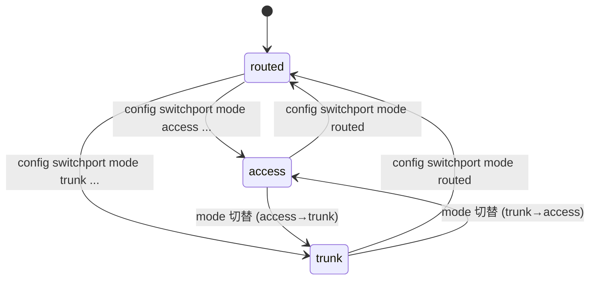
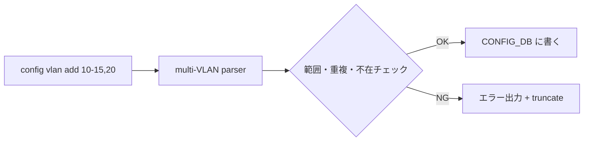

!!! warning "裏取りステータス: Discrepancy-found"
    sonic-utilities `config/switchport.py` L17 で `mode_type` enum `["access", "trunk", "routed"]` を、L57-78 で `port_data["mode"]` への書き込みを確認、`config/main.py` L119 で `PORT_MODE = "switchport_mode"` 定数定義、L1787 `config.add_command(switchport.switchport)` 登録、L5777 で `interface_mode == "trunk" or interface_mode == "access"` 判定を確認。YANG 側は sonic-yang-models `yang-models/sonic-port.yang` L86-89 / `sonic-portchannel.yang` L71 で `leaf mode { type stypes:switchport_mode; }`、`sonic-types.yang.j2` L244 で `typedef switchport_mode` を確認。
    
    **discrepancy**: HLD と本文は CONFIG_DB のフィールド名を `switchport_mode` と表記しているが、実装上は `PORT.<name>.mode` (YANG: `leaf mode`) で `switchport_mode` は YANG **typedef 名**。`db_migrator` への明示的な switchport モード推論ロジックも現行 master に未追加（既存 entry に `mode` フィールドが無ければ `routed` 相当として振る舞う実装）。

# Switchport モード（access / trunk / routed）と VLAN CLI 拡張

## 概要

SONiC のレガシー VLAN CLI は `config vlan add 10` / `config vlan member add 10 Ethernet0 -u` のように **VLAN ID 単発操作** を強いる。多数 VLAN の運用では繰り返し叩くことになり、誤入力やループスクリプトでのレース問題があった。さらにポートの「routed / access / trunk」のような **意味的なモード**は CLI に明示されておらず、運用者の認知コストが高かった[^1]。

本機能は次の 2 つを導入する[^1]:

1. **Switchport mode**: ポート（`PORT`）と LAG（`PORTCHANNEL`）に対して `routed` / `access` / `trunk` のモード概念を CONFIG_DB に持ち、CLI から切替可能にする
2. **複数 VLAN 一括 CLI**: 範囲指定（`10-20`）またはカンマ区切り（`10,15,20`）で複数 VLAN を 1 コマンドで add / del

アーキテクチャは大きく変わらず、変更は **CLI コンテナと CONFIG_DB に閉じる**[^1]。

## 動作仕様

### モードの定義

| モード | パケット入出力 |
|--------|---------------|
| `routed` | L3 インタフェース（既定）|
| `access` | 単一 VLAN の **untagged** 受信・送信のみ |
| `trunk`  | 1 つの untagged VLAN（native）+ 複数 VLAN の **tagged** 受信・送信 |

物理ポート / PortChannel いずれも同じ 3 モードをサポートする[^1]。

### 状態遷移（Port / PortChannel）



既定値は `routed`。`access`/`trunk` への切替は所属 VLAN を伴う設定が必要（VLAN 未指定だと不完全状態）[^1]。

### 複数 VLAN 一括 add / del



要点[^1]:

- VLAN 範囲は `2 〜 4094`
- 重複・存在チェックでエラーが出たらそこで **truncate**（後続スキップ）
- メンバ追加 (`config vlan member add <VLAN_LIST> <PORT_LIST>`) も同様に複数指定可能

例[^1]:

```bash
sudo config vlan add 10-12,20      # Vlan10,Vlan11,Vlan12,Vlan20 を一括追加
sudo config vlan member add 10-12 Ethernet0 -u     # 連続 VLAN を一括メンバ化
```

### Switchport CLI

新規[^1]:

```
config switchport mode <routed|access|trunk> <Ethernet0|PortChannel1> [<vlan-list>]
```

例[^1]:

```bash
# routed → access (Vlan10 untagged)
sudo config switchport mode access Ethernet0 10

# routed → trunk (native=Vlan10, tagged=20-22)
sudo config switchport mode trunk PortChannel1 10 20-22

# 任意モードから routed に戻す（VLAN メンバは事前削除が必要）
sudo config switchport mode routed Ethernet0
```

### YANG / CONFIG_DB

`sonic-port` / `sonic-portchannel` に新規 leaf を追加[^1]:

```yang
typedef switchport-mode-type {
  type enumeration {
    enum routed;
    enum access;
    enum trunk;
  }
  default routed;
}

leaf switchport_mode { type switchport-mode-type; }
```

CONFIG_DB:

```
PORT|<name>
  switchport_mode = "routed" | "access" | "trunk"

PORTCHANNEL|<name>
  switchport_mode = ...
```

メンバ関係は既存 `VLAN_MEMBER` を流用（`tagging_mode`: `untagged` / `tagged`）。本機能は **モード概念を明示** することで CLI の意味付けを揃えるのが主目的で、データプレーン挙動は既存と互換[^1]。

### `db_migrator` 拡張

旧 `config_db.json` には `switchport_mode` 欄が無い。`db_migrator` は次のルールで補完する[^1]:

- `VLAN_MEMBER` を持たないポート → `routed`
- `untagged` メンバ 1 個のみ → `access`
- `tagged` メンバを 1 つでも持つ → `trunk`

これにより既存 SONiC からのアップグレードで CONFIG_DB が破綻しない[^1]。

<!-- evidence:
source: sonic-net/SONiC/doc/vlan/switchport-mode-support/Switchport Mode and VLAN CLI Enhancement.md#L141-L156 (sha: 49bab5b5ff0e924f1ea52b3d9db0dfa4191a7c06)
excerpt: |
  The overall SONiC architecture will remain the same and no new sub-modules will be introduced.
  Changes are made only in the CLI container and Config_DB.
  ... Default port mode is "routed".
reasoning: 影響範囲を CLI と CONFIG_DB に閉じる設計と既定モードの根拠。
-->

## 設定

### 関連する CONFIG_DB

| Table | フィールド |
|-------|-----------|
| `PORT.<name>` | `switchport_mode` (新規) |
| `PORTCHANNEL.<name>` | `switchport_mode` (新規) |
| `VLAN_MEMBER` | 既存 (`tagging_mode`)。CLI から複数指定可能になる |
| `VLAN` | 既存 (`vlanid`)。複数追加可能 |

### 関連する CLI

| CLI | 用途 |
|-----|------|
| `config vlan add <vid|range|list>` | 複数 VLAN 追加 |
| `config vlan del <vid|range|list>` | 複数 VLAN 削除 |
| `config vlan member add <vlan> <port|range>` | メンバ一括追加 |
| `config vlan member del <vlan> <port|range>` | メンバ一括削除 |
| `config switchport mode <mode> <port> [<vlan-list>]` | ポートのモード変更 |

### 設定例

```bash
# 1. VLAN 10〜12 を一括作成
sudo config vlan add 10-12

# 2. Ethernet0 を access、Vlan10 untagged
sudo config switchport mode access Ethernet0 10

# 3. PortChannel1 を trunk、native=Vlan10、tagged=Vlan20-22
sudo config vlan add 20-22
sudo config switchport mode trunk PortChannel1 10 20-22

# 4. 元に戻す
sudo config switchport mode routed Ethernet0
```

## 制限事項

- **モード切替は VLAN 整合が前提**: `routed` に戻すには既存 VLAN メンバを先に外す必要がある（HLD 例参照）[^1]。
- **truncate ポリシー**: 一括 CLI で 1 件失敗するとそこで停止する。前段は反映済みなので途中状態に注意[^1]。
- **アーキテクチャ拡張なし**: orchagent / SAI / vlanmgr 等の改修は無く、CLI と CONFIG_DB の契約だけが変わる。新ベンダ依存・SAI 改修なし。
- **詳細仕様は原文必読**: 本ページは概要のみ。state diagram・sequence diagram・コーナーケース例は原文 HLD §High-level Design / §Examples を参照[^1]。

## 干渉する機能

- **既存 `config interface` 系**: ポートの IP 設定（`config interface ip add`）は **`routed` モード前提**。`access`/`trunk` 中に IP を入れるとエラーが期待される[^1]。
- **`vlanmgrd` / orchagent**: 影響なし（CONFIG_DB の `switchport_mode` は CLI 側のメタ情報。既存の `VLAN_MEMBER`/`tagging_mode` を介して下流が動く）[^1]。
- **`db_migrator`**: アップグレード経路で各ポートの `switchport_mode` を推論して埋める[^1]。
- **OpenConfig VLAN（[OpenConfig VLAN Interface](add-support-for-vlan-interface-using-openconfig-yang.md)）**: 同じ CONFIG_DB を別経路でも操作する。`switchport_mode` の整合性を OpenConfig 経路でも維持する必要がある（HLD はその互換性の具体は明記せず）。

## トラブルシューティング

- mode を変えたのに通信が変わらない: `VLAN_MEMBER` テーブルが想定どおりかを確認。`switchport_mode` だけ変えてもメンバは自動で動かない場合がある（CLI の引数で VLAN を指定したか確認）。
- アップグレード後にモードが routed のまま: `db_migrator` の推論が走ったか確認（メンバ無しなら routed が正しい結果）。
- 範囲指定 CLI が一部しか反映されない: truncate ポリシーで途中エラーで停止した可能性。エラーメッセージを確認し、不正 VID を除外して再実行。

## 引用元

[^1]: `sonic-net/SONiC` `doc/vlan/switchport-mode-support/Switchport Mode and VLAN CLI Enhancement.md` @ `49bab5b5ff0e924f1ea52b3d9db0dfa4191a7c06`
