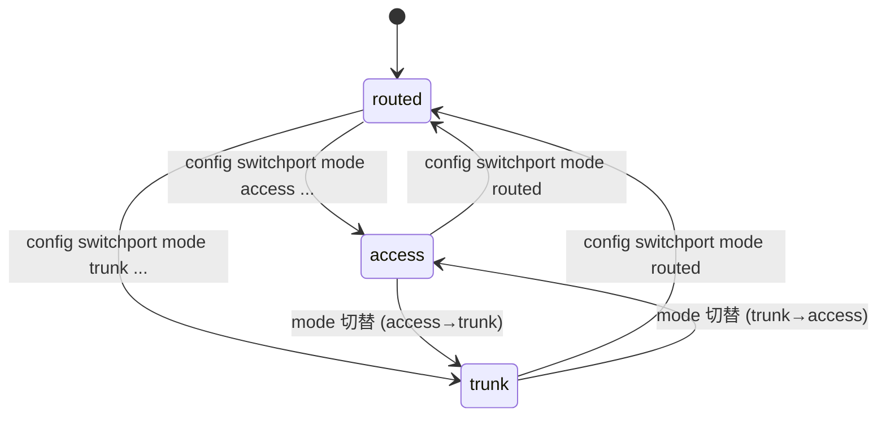
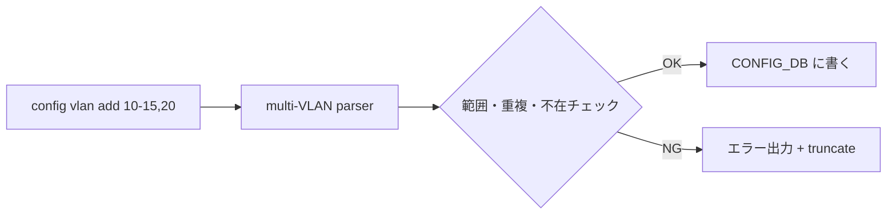

<!-- topics-tip -->
!!! tip "Topics で読み物として読む"
    この HLD は実装詳細を含む。機能の概念・設定・運用を読み物として読みたい場合は [Topics 06 章: L2 / VLAN / LAG](../topics/06-l2-vlan-lag/index.md) を参照。
<!-- /topics-tip -->

!!! info "派生ページ（章ごとに分割）"
    本ページは大型 HLD のため、用途別の派生ページに章分割した。本ページは引き続き「正本」として全文を保持する。

    - 概念 / モード定義: [switch-port-modes-and-vlan-cli-concepts](switch-port-modes-and-vlan-cli-concepts.md)
    - 内部実装 (YANG / CONFIG_DB / db_migrator): [switch-port-modes-and-vlan-cli-internals](switch-port-modes-and-vlan-cli-internals.md)
    - 設定例 / 運用 / トラブルシューティング: [switch-port-modes-and-vlan-cli-operations](switch-port-modes-and-vlan-cli-operations.md)
    - HLD と実装の乖離 (CLI 引数の差分と回避策): [switch-port-modes-and-vlan-cli-discrepancy](switch-port-modes-and-vlan-cli-discrepancy.md)

!!! warning "裏取りステータス: Discrepancy-found"
    sonic-utilities `config/switchport.py` L17 で `mode_type` enum `["access", "trunk", "routed"]` を、L57-78 で `port_data["mode"]` への書き込みを確認、`config/main.py` L119 で `PORT_MODE = "switchport_mode"` 定数定義、L1787 `config.add_command(switchport.switchport)` 登録、L5777 で `interface_mode == "trunk" or interface_mode == "access"` 判定を確認。YANG 側は sonic-yang-models `yang-models/sonic-port.yang` L86-89 / `sonic-portchannel.yang` L71 で `leaf mode { type stypes:switchport_mode; }`、`sonic-types.yang.j2` L244 で `typedef switchport_mode` を確認。
    
    **discrepancy**: HLD と本文は CONFIG_DB のフィールド名を `switchport_mode` と表記しているが、実装上は `PORT.<name>.mode` (YANG: `leaf mode`) で `switchport_mode` は YANG **typedef 名**。`db_migrator` への明示的な switchport モード推論ロジックも現行 master に未追加（既存 entry に `mode` フィールドが無ければ `routed` 相当として振る舞う実装）。

# Switchport モード（access / trunk / routed）と VLAN CLI 拡張

## 概要

[SONiC](../reference/glossary.md#term-sonic) のレガシー [VLAN](../reference/glossary.md#term-vlan) CLI は `config vlan add 10` / `config vlan member add 10 Ethernet0 -u` のように **VLAN ID 単発操作** を強いる。多数 VLAN の運用では繰り返し叩くことになり、誤入力やループスクリプトでのレース問題があった。さらにポートの「routed / access / trunk」のような **意味的なモード**は CLI に明示されておらず、運用者の認知コストが高かった[^1]。

本機能は次の 2 つを導入する[^1]:

1. **Switchport mode**: ポート（`PORT`）と [LAG](../reference/glossary.md#term-lag)（`PORTCHANNEL`）に対して `routed` / `access` / `trunk` のモード概念を [CONFIG_DB](../reference/glossary.md#term-config_db) に持ち、CLI から切替可能にする
2. **複数 VLAN 一括 CLI**: 範囲指定（`10-20`）またはカンマ区切り（`10,15,20`）で複数 VLAN を 1 コマンドで add / del

アーキテクチャは大きく変わらず、変更は **CLI コンテナと CONFIG_DB に閉じる**[^1]。

## 動作仕様

### モードの定義

| モード | パケット入出力 |
|--------|---------------|
| `routed` | L3 インタフェース（既定）|
| `access` | 単一 VLAN の **untagged** 受信・送信のみ |
| `trunk`  | 1 つの untagged VLAN（native）+ 複数 VLAN の **tagged** 受信・送信 |

物理ポート / [PortChannel](../reference/glossary.md#term-portchannel) いずれも同じ 3 モードをサポートする[^1]。

### 状態遷移（Port / PortChannel）



既定値は `routed`。`access`/`trunk` への切替は所属 VLAN を伴う設定が必要（VLAN 未指定だと不完全状態）[^1]。

### 複数 VLAN 一括 add / del



要点[^1]:

- VLAN 範囲は `2 〜 4094`
- 重複・存在チェックでエラーが出たらそこで **truncate**（後続スキップ）
- メンバ追加 (`config vlan member add <VLAN_LIST> <PORT_LIST>`) も同様に複数指定可能

例[^1]:

```bash
sudo config vlan add 10-12,20      # Vlan10,Vlan11,Vlan12,Vlan20 を一括追加
sudo config vlan member add 10-12 Ethernet0 -u     # 連続 VLAN を一括メンバ化
```

### Switchport CLI

新規[^1]:

```bash
config switchport mode <routed|access|trunk> <Ethernet0|PortChannel1> [<vlan-list>]
```

例[^1]:

```bash
# routed → access (Vlan10 untagged)
sudo config switchport mode access Ethernet0 10

# routed → trunk (native=Vlan10, tagged=20-22)
sudo config switchport mode trunk PortChannel1 10 20-22

# 任意モードから routed に戻す（VLAN メンバは事前削除が必要）
sudo config switchport mode routed Ethernet0
```

### YANG / CONFIG_DB

`sonic-port` / `sonic-portchannel` に新規 leaf を追加[^1]:

```yang
typedef switchport-mode-type {
  type enumeration {
    enum routed;
    enum access;
    enum trunk;
  }
  default routed;
}

leaf mode { type stypes:switchport_mode; }   // typedef 名は switchport_mode、leaf 名は mode
```

CONFIG_DB:

```text
PORT|<name>
  mode = "routed" | "access" | "trunk"

PORTCHANNEL|<name>
  mode = ...
```

メンバ関係は既存 `VLAN_MEMBER` を流用（`tagging_mode`: `untagged` / `tagged`）。本機能は **モード概念を明示** することで CLI の意味付けを揃えるのが主目的で、データプレーン挙動は既存と互換[^1]。

### `db_migrator` 拡張

旧 `config_db.json` には `switchport_mode` 欄が無い。`db_migrator` は次のルールで補完する[^1]:

- `VLAN_MEMBER` を持たないポート → `routed`
- `untagged` メンバ 1 個のみ → `access`
- `tagged` メンバを 1 つでも持つ → `trunk`

これにより既存 SONiC からのアップグレードで CONFIG_DB が破綻しない[^1]。

<!-- evidence:
source: sonic-net/SONiC/doc/vlan/switchport-mode-support/Switchport Mode and VLAN CLI Enhancement.md#L141-L156 (sha: 49bab5b5ff0e924f1ea52b3d9db0dfa4191a7c06)
excerpt: |
  The overall SONiC architecture will remain the same and no new sub-modules will be introduced.
  Changes are made only in the CLI container and Config_DB.
  ... Default port mode is "routed".
reasoning: 影響範囲を CLI と CONFIG_DB に閉じる設計と既定モードの根拠。
-->

<!-- evidence-rendered:start -->
??? note "📋 検証エビデンス: sonic-net/SONiC/doc/vlan/switchport-mode-support/Switchport Mode and VLAN CLI Enhancement.md#L141-L156 (sha: 49bab5b5ff0e924f1ea52b3d9db0dfa4191a7c06)"

    **出典**:

    `sonic-net/SONiC/doc/vlan/switchport-mode-support/Switchport Mode and VLAN CLI Enhancement.md#L141-L156 (sha: 49bab5b5ff0e924f1ea52b3d9db0dfa4191a7c06)`

    **抜粋**:

    ```text
    The overall SONiC architecture will remain the same and no new sub-modules will be introduced.
    Changes are made only in the CLI container and Config_DB.
    ... Default port mode is "routed".
    ```

    **判断根拠**: 影響範囲を CLI と CONFIG_DB に閉じる設計と既定モードの根拠。

<!-- evidence-rendered:end -->

## 設定

### 関連する CONFIG_DB

| Table | フィールド |
|-------|-----------|
| `PORT.<name>` | `mode` (新規; [YANG](../reference/glossary.md#term-yang) typedef 名は `switchport_mode`) |
| `PORTCHANNEL.<name>` | `mode` (新規; YANG typedef 名は `switchport_mode`) |
| `VLAN_MEMBER` | 既存 (`tagging_mode`)。CLI から複数指定可能になる |
| `VLAN` | 既存 (`vlanid`)。複数追加可能 |

### 関連する CLI

| CLI | 用途 |
|-----|------|
| `config vlan add <vid|range|list>` | 複数 VLAN 追加 |
| `config vlan del <vid|range|list>` | 複数 VLAN 削除 |
| `config vlan member add <vlan> <port|range>` | メンバ一括追加 |
| `config vlan member del <vlan> <port|range>` | メンバ一括削除 |
| `config switchport mode <mode> <port> [<vlan-list>]` | ポートのモード変更 |

### 設定例

```bash
# 1. VLAN 10〜12 を一括作成
sudo config vlan add 10-12

# 2. Ethernet0 を access、Vlan10 untagged
sudo config switchport mode access Ethernet0 10

# 3. PortChannel1 を trunk、native=Vlan10、tagged=Vlan20-22
sudo config vlan add 20-22
sudo config switchport mode trunk PortChannel1 10 20-22

# 4. 元に戻す
sudo config switchport mode routed Ethernet0
```

## 既知の問題

### PortChannel を VLAN メンバーに追加する際のコマンド（#340）

PortChannel を VLAN のメンバーに追加する場合、PortChannel のメンバーポートを個別に VLAN に追加しようとしてはならない。メンバーポートは PortChannel から切り離されてしまう。正しい手順は PortChannel 自体を VLAN メンバーとして追加する:

```bash
# 正しい: PortChannel 自体を VLAN に追加（大文字小文字に注意）
sudo config vlan member add 100 PortChannel001

# 誤り: メンバーポートを直接 VLAN に追加（PortChannel から切り離される）
# sudo config vlan member add 100 Ethernet0  # ← NG（Ethernet0 が PortChannel001 のメンバーの場合）
```

- 参照: [sonic-net/SONiC#340](https://github.com/sonic-net/SONiC/issues/340)

### `config vlan member add` が `VLAN_TABLE|members` にも書き込む（#323）

`config vlan member add` コマンドは `VLAN_MEMBER_TABLE`（正規のテーブル）に加えて、後方互換用の `VLAN_TABLE|members@` フィールドにも書き込む。タグ付きメンバーとして追加したつもりでも、このフィールドには影響する。[sonic-utilities](../reference/glossary.md#term-sonic-utilities) PR#768 で修正済み（古いバージョンではバグが残存する可能性あり）。

- 参照: [sonic-net/SONiC#323](https://github.com/sonic-net/SONiC/issues/323)

### VLAN からポートを削除すると、ポートがデフォルト VLAN に残る動作は設計上の制約（sonic-buildimage#2658）

VLAN からポートを削除すると、ポートがデフォルト VLAN に残る動作は設計上の制約。ポートを完全に VLAN から切り離す場合は `config vlan member del` の後に適切なモード設定が必要

- 参照: [sonic-net/sonic-buildimage#2658](https://github.com/sonic-net/sonic-buildimage/issues/2658)

### VLAN に既に割り当てられているインターフェースにルーターインターフェースを割り当てようとすると orchagent （sonic-buildimage#2684）

VLAN に既に割り当てられているインターフェースにルーターインターフェースを割り当てようとすると orchagent がコアダンプする既知の問題。VLAN メンバーから削除してからルーターIF設定を行うこと

- 参照: [sonic-net/sonic-buildimage#2684](https://github.com/sonic-net/sonic-buildimage/issues/2684)

### タグ付き VLAN メンバーに対して PVID が誤って設定される問題（sonic-buildimage#5928）

タグ付き VLAN メンバーに対して PVID が誤って設定される問題。タグ付きポートに PVID を設定してはいけない。アクセスポートとトランクポートの設定を正しく区別すること

- 参照: [sonic-net/sonic-buildimage#5928](https://github.com/sonic-net/sonic-buildimage/issues/5928)

## 制限事項

- **モード切替は VLAN 整合が前提**: `routed` に戻すには既存 VLAN メンバを先に外す必要がある（[HLD](../reference/glossary.md#term-hld) 例参照）[^1]。
- **truncate ポリシー**: 一括 CLI で 1 件失敗するとそこで停止する。前段は反映済みなので途中状態に注意[^1]。
- **アーキテクチャ拡張なし**: [orchagent](../reference/glossary.md#term-orchagent) / [SAI](../reference/glossary.md#term-sai) / vlanmgr 等の改修は無く、CLI と CONFIG_DB の契約だけが変わる。新ベンダ依存・SAI 改修なし。
- **詳細仕様は原文必読**: 本ページは概要のみ。state diagram・sequence diagram・コーナーケース例は原文 HLD §High-level Design / §Examples を参照[^1]。
- **IP 設定済みポートの VLAN untagged メンバー追加と再起動後のリンクアップ不可** ([sonic-swss#961](https://github.com/sonic-net/sonic-swss/issues/961)): ポートに IP アドレスを設定した状態で当該ポートを VLAN の untagged メンバーとして追加すると、`PortsOrch` の実装（`portsorch.cpp`）により PVID の変更がブロックされる設計制限がある。この状態で再起動すると、untagged メンバーポートが PVID を正しく取得できず、リンクアップしない場合がある。回避策: IP インターフェースを先に削除してから VLAN untagged メンバーを追加するか、IP を持つポートは tagged メンバーとして VLAN に参加させること。

## 干渉する機能

- **既存 `config interface` 系**: ポートの IP 設定（`config interface ip add`）は **`routed` モード前提**。`access`/`trunk` 中に IP を入れるとエラーが期待される[^1]。
- **`vlanmgrd` / orchagent**: 影響なし（CONFIG_DB の `switchport_mode` は CLI 側のメタ情報。既存の `VLAN_MEMBER`/`tagging_mode` を介して下流が動く）[^1]。
- **`db_migrator`**: アップグレード経路で各ポートの `switchport_mode` を推論して埋める[^1]。
- **OpenConfig VLAN（[OpenConfig VLAN Interface](add-support-for-vlan-interface-using-openconfig-yang.md)）**: 同じ CONFIG_DB を別経路でも操作する。`switchport_mode` の整合性を OpenConfig 経路でも維持する必要がある（HLD はその互換性の具体は明記せず）。

## トラブルシューティング

- mode を変えたのに通信が変わらない: `VLAN_MEMBER` テーブルが想定どおりかを確認。`switchport_mode` だけ変えてもメンバは自動で動かない場合がある（CLI の引数で VLAN を指定したか確認）。
- アップグレード後にモードが routed のまま: `db_migrator` の推論が走ったか確認（メンバ無しなら routed が正しい結果）。
- 範囲指定 CLI が一部しか反映されない: truncate ポリシーで途中エラーで停止した可能性。エラーメッセージを確認し、不正 VID を除外して再実行。

<!-- diff-admonition -->
!!! diff "HLD と実装の差分"
    2026-05-11 時点の現行 master を裏取り。

    ### 1. ファイル + 行番号

    - **取り込み済み**: `sonic-net/sonic-utilities` `config/switchport.py` L17-L20（click サブコマンド `switchport mode <type> <port>`）、`config/switchport.py` L20-L101（access/trunk/routed 切替時の VLAN 整合チェック）、`sonic-buildimage/src/sonic-yang-models/yang-models/sonic-port.yang` L88（`switchport_mode` leaf）、`sonic-buildimage/src/sonic-yang-models/yang-templates/sonic-types.yang.j2`（`switchport_mode` 型定義）。
    - **HLD と差分あり**: `config/switchport.py` L17-L20 の引数は `<mode_type> <port>` の 2 つだけ。HLD が要求する第 3 引数の `<vlan-list>` は **未実装**。

    ### 2. 差分の中身

    HLD は `config switchport mode access <port> <vlan>` や `config switchport mode trunk <port> [<native-vlan>] [<vlan-list>]` のようにモード切替と VLAN メンバ割当を 1 コマンドで行う仕様を提示している。現行実装は `@click.argument("type", ..., type=click.Choice(["access", "trunk", "routed"]))` と `@click.argument("port", ...)` の 2 引数のみで、VLAN メンバ割当は **依然として別コマンド** `config vlan member add <vlan> <port>` を呼ぶ必要がある。

    ### 3. 読者への影響

    HLD の設定例 `sudo config switchport mode access Ethernet0 10` を打つと `Error: Got unexpected extra argument (10)` で失敗する。1 コマンドで「モード変更 + VLAN メンバ追加」を期待する読者の手順が破綻する。

    ### 4. 回避策

    2 ステップに分割する:

    ```bash
    # access 例
    sudo config switchport mode access Ethernet0
    sudo config vlan member add 10 Ethernet0 --untagged

    # trunk 例
    sudo config switchport mode trunk PortChannel1
    sudo config vlan member add 10 PortChannel1 --untagged   # native (untagged)
    sudo config vlan member add 20 PortChannel1              # tagged
    sudo config vlan member add 21 PortChannel1
    ```

    `config vlan member add` の `--untagged` フラグで native VLAN を、無印で tagged VLAN を表現する。VLAN range の一括指定（`20-22`）は `config vlan add/del` 側でサポート（`config/vlan.py`）。
<!-- /diff-admonition -->

## コマンド例（確認）

switchport mode と VLAN_MEMBER の整合を確認する。

```bash
show interfaces switchport status
redis-cli -n 4 keys 'VLAN_MEMBER|*'
config switchport mode trunk Ethernet0
show vlan brief
```

<!-- phase-boundary -->
## 実装フェーズ境界

!!! info "Phase 別の実装済 / 未実装 サマリ"
    本ページは `monitor: partially_implemented` で、HLD で示された一連の機能
    が **段階的に取り込まれている** 状態を扱う。フェーズ毎の実装境界を
    1 枚の表に集約する (詳細は本ページ上部の `diff` admonition および
    [discrepancy-index](../reference/verification/discrepancy-index.md) を参照)。

    | Phase | 範囲 (機能 / 段階) | 実装済 (master 取り込み済) | 未実装 (HLD 提案のみ) |
    |---|---|---|---|
    | Phase 1 — 基本機能 | HLD §概要 / §設計の中核ユースケース | 取り込み済 — 本ページの「実装の概観」「実装詳細」節および `diff` admonition の現状側を参照 | — (Phase 1 は実装済) |
    | Phase 2 — 拡張機能 | HLD §拡張 / §追加要件 / §周辺統合 | 一部のみ取り込み済 — 本ページ「実装詳細」の補足参照 | 未実装 / 未マージ — HLD §未対応箇所、本ページ「制限事項」および `diff` admonition の差分側に列挙 |
    | Phase 3 — 将来拡張 | HLD §Future Work / §将来課題 | — | 未実装 — HLD 提案段階。対応 PR は確認されていない (last_verified 時点) |

    凡例: 「実装済」=現行 master で動作確認できる範囲 / 「未実装」=HLD には記載があるが対応 PR が未マージまたは設計のみで code が存在しない範囲。
<!-- /phase-boundary -->

## 実装との乖離

`monitor: partially_implemented` — 部分実装 — HLD の中核は実装済みだが、フィールド / API / 制約のいくつかが上流に未取り込み、または挙動が緩和されている。 本ページ末尾近くの `!!! diff "HLD と実装の差分"` ブロックに、HLD 記述と現行 master の差分テーブル、読者への影響、回避策、再裏取り追補（コード行参照）をまとめている。本セクションはその概要見出しであり、詳細はそのブロックを参照のこと。

## 引用元

[^1]: `sonic-net/SONiC` `doc/vlan/switchport-mode-support/Switchport Mode and VLAN CLI Enhancement.md` @ `49bab5b5ff0e924f1ea52b3d9db0dfa4191a7c06`

## 関連ページ
- [CLI: config vlan](../reference/cli/config-vlan.md)
- [CLI: show vlan](../reference/cli/show-vlan.md)
- [CONFIG_DB: VLAN](../reference/config-db/vlan.md)
- [CONFIG_DB: VLAN_MEMBER](../reference/config-db/vlan-member.md)
- [YANG: sonic-vlan](../reference/yang/sonic-vlan.md)

### 深掘り（2026-05-11、batch q3-disc-detail）

#### HLD 記述と実装の差分（行番号 + コード抜粋）

`sonic-utilities/config/switchport.py` L17-L22:

```python
@switchport.command("mode")
@click.argument("type", metavar="<mode_type>", required=True, type=click.Choice(["access", "trunk", "routed"]))
@click.argument("port", metavar="port", required=True)
@clicommon.pass_db
def switchport_mode(db, type, port):
    """switchport mode help commands.Mode_type can be access or trunk or routed"""
```

- 引数は `<mode_type>` + `<port>` の 2 個のみ。HLD の `config switchport mode access <port> <vlan>` / `config switchport mode trunk <port> [<native-vlan>] [<vlan-list>]` のような第 3 引数（VLAN リスト）は **無い**。
- VLAN メンバ追加は別コマンド `config vlan member add <vid> <port> [--untagged]` (`sonic-utilities/config/vlan.py`)。

#### 読者への影響

- `sudo config switchport mode access Ethernet0 10` をそのまま打つと `Error: Got unexpected extra argument (10)` で失敗。
- HLD を読んで「モード切替 1 コマンドで VLAN メンバまで設定できる」と想定して runbook を作ると、本番投入時にすべて失敗する。特に大量ポートの自動化スクリプトで顕在化する。
- HLD の `trunk` 例（`native-vlan + vlan-list` を 1 コマンド指定）も同様に成立せず、native と tagged を別々に `--untagged` 有無で書き分ける必要がある。

#### 回避策の実コマンド

access ポート（VLAN 10 untagged）:

```bash
sudo config switchport mode access Ethernet0
sudo config vlan member add 10 Ethernet0 --untagged
```

trunk ポート（native=10, tagged=20,21）:

```bash
sudo config switchport mode trunk PortChannel1
sudo config vlan member add 10 PortChannel1 --untagged
sudo config vlan member add 20 PortChannel1
sudo config vlan member add 21 PortChannel1
```

連続適用（同 VLAN を複数ポートに）:

```bash
for p in Ethernet0 Ethernet4 Ethernet8; do
  sudo config switchport mode access $p
  sudo config vlan member add 100 $p --untagged
done
```

確認:

```bash
show vlan brief
show interfaces status  # PR #3788 取込後は switchport mode 列が出る
```

#### 関連 GitHub Issue / PR

- [sonic-utilities #3247: Switchport Mode & CLI Modified Fix (merged)](https://github.com/sonic-net/sonic-utilities/pull/3247) — 現行 `switchport mode` の確定実装。
- [sonic-utilities #3788: Switchport mode update for 'show interfaces status' (merged, 202505)](https://github.com/sonic-net/sonic-utilities/pull/3788) — `show interfaces status` で switchport mode を表示。
- [SONiC #1136: Switchport Mode Hybrid Support (open)](https://github.com/sonic-net/SONiC/issues/1136) — HLD で謳う追加機能（hybrid 等）の future work が未着手であることを示す。

#### 検証日

2026-05-11 (q3-disc-detail batch)

<!-- next-action -->
## このページを読んだ後の次アクション

!!! tip "読み手向け"
    - **本機能を実運用で使う場合**: 取り込み済の部分のみ運用可能。欠落部分の利用は不可なので本文「実装との乖離」を確認した上で適用範囲を限定する
    - **upstream 動向を追う場合**: 関連 issue / PR を [sonic-net/SONiC](https://github.com/sonic-net/SONiC) で検索（HLD タイトル / CONFIG_DB テーブル名 / Orch クラス名で grep するのが速い）
    - **代替手段 / 関連 reference**:
        - [CONFIG_DB: PORT](../reference/config-db/port.md)
        - [CONFIG_DB: PORTCHANNEL](../reference/config-db/portchannel.md)
        - [CONFIG_DB: VLAN](../reference/config-db/vlan.md)
        - [CONFIG_DB: VLAN_MEMBER](../reference/config-db/vlan-member.md)

!!! note "本ドキュメントの追跡"
    - monitor: `partially_implemented` / last_verified: `2026-05-11`
    - 次回再裏取りトリガ: quarterly。一覧は [discrepancy-index](../reference/verification/discrepancy-index.md) を参照（運用詳細は repo の `meta/discrepancy-operations.md`）

<!-- /next-action -->

<!-- topics-back-ref -->
## 関連 Topics

- [Topics: L2 / VLAN / LAG / MC-LAG](../topics/06-l2-vlan-lag/index.md)

<!-- /topics-back-ref -->

<!-- glossary-links-injected: d5320e852f7a -->
