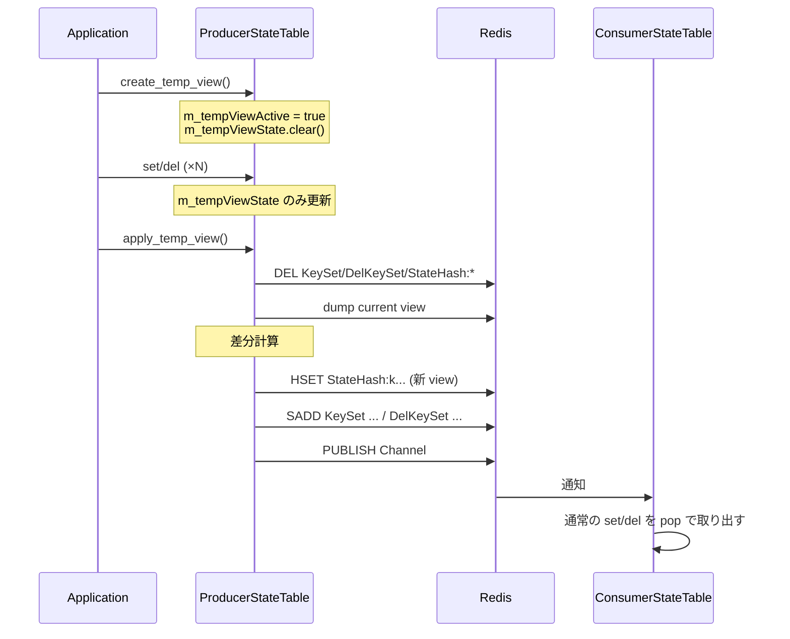

!!! success "裏取りステータス: Code-verified"
    `sonic-swss-common/common/producerstatetable.h` L51/L53 で `create_temp_view()` / `apply_temp_view()`、L58 で `bool m_tempViewActive`、L66 で `TableDump m_tempViewState` を確認。`producerstatetable.cpp` L31 で `m_tempViewActive(false)` 初期化、L132/L172/L205/L254 の各 set/del 系で `m_tempViewActive` 分岐により `m_tempViewState` を更新、L324-479 で `create_temp_view` / `apply_temp_view` の差分計算（既存 key の比較 + 新規 add + 既存削除）と Lua 引数組み立てを確認（verified at: 2026-05-09）。

# ProducerStateTable の view switching（warm reboot 用の差分適用）

## 概要

warm reboot を支えるためには、各 daemon が **新しい状態を一気に作って consumer に届ける** 機構が必要になる。再起動直後に旧 view と新 view を比較し、**差分だけ** SAI に流せれば、再 program によるデータプレーン断を最小化できる。

この HLD は `ProducerStateTable` に **「一時 view」を在メモリで構築 → `apply_temp_view()` で旧 view との差分だけを Redis に書き出す** 仕組みを追加する設計を定義している[^1]。差分計算は producer 側で行い、`pop()` を含む `ConsumerStateTable` 側のロジックは **無変更** で済むのがポイント[^1]。

設計の前提として、**1 つのテーブルに対して producer は 1 つだけ** という仮定を置く[^1]。複数 producer が同時に同テーブルを書く構成では、view 切替中の二次 producer の書き込みが `apply_temp_view()` で失われる可能性がある。

## 動作仕様

### 既存の Redis オブジェクト

ProducerStateTable / ConsumerStateTable は既存で次のオブジェクト群を使っている[^1]:

| 用途 | 例（テーブル名 `ROUTE_TABLE` の場合）|
|------|-----------------------------------|
| TableHash | ` ROUTE_TABLE:25.78.106.0/27`（先頭に空白）|
| StateHash | `_ROUTE_TABLE:25.78.106.0/27` |
| KeySet | `ROUTE_TABLE_KEY_SET` |
| DelKeySet | `ROUTE_TABLE_DEL_SET` |
| Channel | `ROUTE_TABLE_CHANNEL` |

view switching では **追加の Redis オブジェクトは作らない**。代わりに producer プロセス内に在メモリで `TableDump m_tempViewState`（TableHash 相当の構造）と `bool m_tempViewActive` フラグを持つ[^1]。

### 追加 API

`ProducerStateTable` に以下 2 つの API を追加し、既存の `set()` / `del()` の挙動を `m_tempViewActive` で分岐させる[^1]:

| API | 役割 |
|-----|------|
| `create_temp_view()` | `m_tempViewActive=true`、`m_tempViewState.clear()` |
| `apply_temp_view()` | 旧 view との差分を計算し、最小の `set/del` を Redis に書き出す。最後に `m_tempViewActive=false` |

### `set()` / `del()` の二重挙動

```mermaid
flowchart TD
    SET[set/del 呼び出し] --> Q{m_tempViewActive?}
    Q -- false --> R[既存どおり Redis に直接書く]
    Q -- true --> M[m_tempViewState のみ更新\n(consumer に届かない)]
```

`m_tempViewActive == true` の間は、`set()` / `del()` は **DB に書かず、`m_tempViewState` のみ更新**する。この間 consumer 側には何も届かない[^1]。

### `apply_temp_view()` の差分計算

`apply_temp_view()` の処理ステップ[^1]:

1. **既存の pending 操作を捨てる**: `KeySet` / `DelKeySet` / `StateHash:*` を全削除。前回の view 切替の途中残骸や保留中の更新を一掃する。
2. **現在 view の dump**: `TableDump tableDump; dump(tableDump);` で旧 view の内容を取得。
3. **差分計算**: `tableDump`（旧）と `m_tempViewState`（新）を突き合わせ、必要最小の `set` / `del` キーリストを作る。
4. **書き出し**: 新 view の field/value を `StateHash:*` に書き、`KeySet` / `DelKeySet` に対象キーを加え、`Channel` に publish。最後に `m_tempViewActive=false`。

差分判定の規則（HLD の擬似コードより）[^1]:

| 旧 view | 新 view | 動作 |
|---------|---------|------|
| key あり | key なし | `del` |
| key あり | key あり、値完全一致 | 何もしない（StateHash も書き直さない）|
| key あり、ある field が新にない | — | `del` + `set`（一旦消して新規で作り直す）|
| ある field の値が変化 | — | `set` |
| 新側に追加 field がある | — | `set` |
| key なし（旧）| key あり（新）| `set`（このループ外で扱われる）|

`pop()` を含む `ConsumerStateTable` 側は **何も変更しない**。`apply_temp_view()` が結局のところ **通常の `set` / `del` シーケンスを Redis に出す** だけなので、consumer から見ると普通の更新の連続にしか見えない[^1]。



<!-- evidence:
source: sonic-net/SONiC/doc/warm-reboot/view_switch.md#L92-L98 (sha: 49bab5b5ff0e924f1ea52b3d9db0dfa4191a7c06)
excerpt: |
  To apply temporary view, there are several steps:
  1. Drop all pending operations by clearing KeySet, DelKeySet, and StateHash
  2. Dump content of current view
  3. Compare current view and target view, generate a minimal set of `set()` and `del()` operations
  4. Write to KeySet, DelKeySet, and StateHash accordingly, publish the change to the channel, and unset `m_tempViewActive` flag.
reasoning: apply_temp_view の 4 ステップが「既存削除 → dump → diff → 書き戻し」である根拠。
-->

### 設計上のトレードオフ

#### 一時 view を **DB ではなく producer メモリ** に置く理由

- DB に置くと producer がクラッシュしても他 producer が継続できるが、**Redis 上のオブジェクトが増えて分かりにくく** なる。
- 比較ロジックを Redis Lua で書くのは設計意図に反する。
- そもそも「1 producer / 1 table」という前提と「producer クラッシュ時の継続が高優先要件ではない」という割り切りで、メモリ持ちにする方がシンプル[^1]。

#### 文字列同一だが意味同一でない場合

例: `nexthop` フィールドに `"10.0.0.1,10.0.0.3"` と `"10.0.0.3,10.0.0.1"` が来ると、ProducerStateTable は **literal で比較** するため別物扱いになり不要な `set` が生成される[^1]。

これは ProducerStateTable 側で吸収せず、**アプリ側で「semantic consistency = literal consistency」を担保** する責務とする。例えば `fpmsyncd` は nexthop アドレスを **ソートしてから `set`** する必要がある[^1]。

## 設定

このページの機能はライブラリレベルの API。CONFIG_DB / CLI / YANG への直接の制御点は存在しない。

### 関連する CONFIG_DB

該当エントリは無い（warm reboot トリガ自体は別系統）。

### 関連する CLI

該当 CLI は無い。warm reboot のオーケストレーション CLI （`warm-reboot` 等）から間接的に発火する想定。

## 制限事項

HLD 上で明示・暗黙の制限[^1]:

- **1 producer / 1 table** の前提。複数 producer が同テーブルに書くと secondary の書き込みが `apply_temp_view()` で失われうる。
- producer が `create_temp_view()` 後にクラッシュすると **未適用の差分はメモリと共に消える**。再起動した producer は通常の手順で view を再構築する必要がある。
- field 値の **semantic 同一性** はアプリ側責任。ProducerStateTable は文字列比較しかできない[^1]。
- 差分計算は producer プロセス内のメモリで行う。**テーブル全体の dump をメモリに保持する** ため、巨大テーブル（数十万エントリ）でメモリ消費が増える可能性がある（HLD では明示の上限なし）。

## 干渉する機能

- **warm reboot 全般**: 各 daemon（`bgpd` / `fpmsyncd` / `swssconfig` 等）が `create_temp_view()` で新状態を組み立て、`apply_temp_view()` で原子的に SAI に降ろす流れの一部となる。
- **`fpmsyncd`（FRR → APP_DB の橋）**: nexthop ソートのようなアプリ側の正規化が必須。これを怠ると warm reboot 時に大量の不要 `set` が走り、データプレーン断のリスクが上がる[^1]。
- **`ConsumerStateTable`**: 変更不要。`apply_temp_view()` から見える挙動は通常の `set/del` のシーケンスのみ[^1]。
- **Redis のメモリ**: pending 操作の cleanup（`DEL KeySet/DelKeySet/StateHash:*`）が走るため、view 切替の瞬間に Redis 上の残骸を一掃するセマンティクスがある。これに依存している経路があると影響が出る可能性がある。

## トラブルシューティング

- view 切替後にデータプレーンに古い状態が残る: `apply_temp_view()` の最初の DEL が想定どおり走っているか、producer が他の view（別 ProducerStateTable インスタンス）と取り違えていないか確認。
- 不要な `set` が大量発生: アプリ側で field 値の正規化（ソート、表記揺れ吸収）が抜けている可能性。`fpmsyncd` の nexthop ソートが代表例[^1]。
- view 切替の途中で producer クラッシュ: `m_tempViewState` はメモリ上のため失われる。Redis 上の `KeySet` / `DelKeySet` / `StateHash:*` が部分的に残っている可能性は無い（apply 開始時に DEL するため、apply 前なら旧 view のまま）。再起動して view 構築をやり直す。
- 二次 producer の更新が消える: 「1 producer / 1 table」前提が崩れている構成。HLD 範囲外なので、構成を見直すか別機構を検討する[^1]。

## 引用元

[^1]: `sonic-net/SONiC` `doc/warm-reboot/view_switch.md` @ `49bab5b5ff0e924f1ea52b3d9db0dfa4191a7c06`
