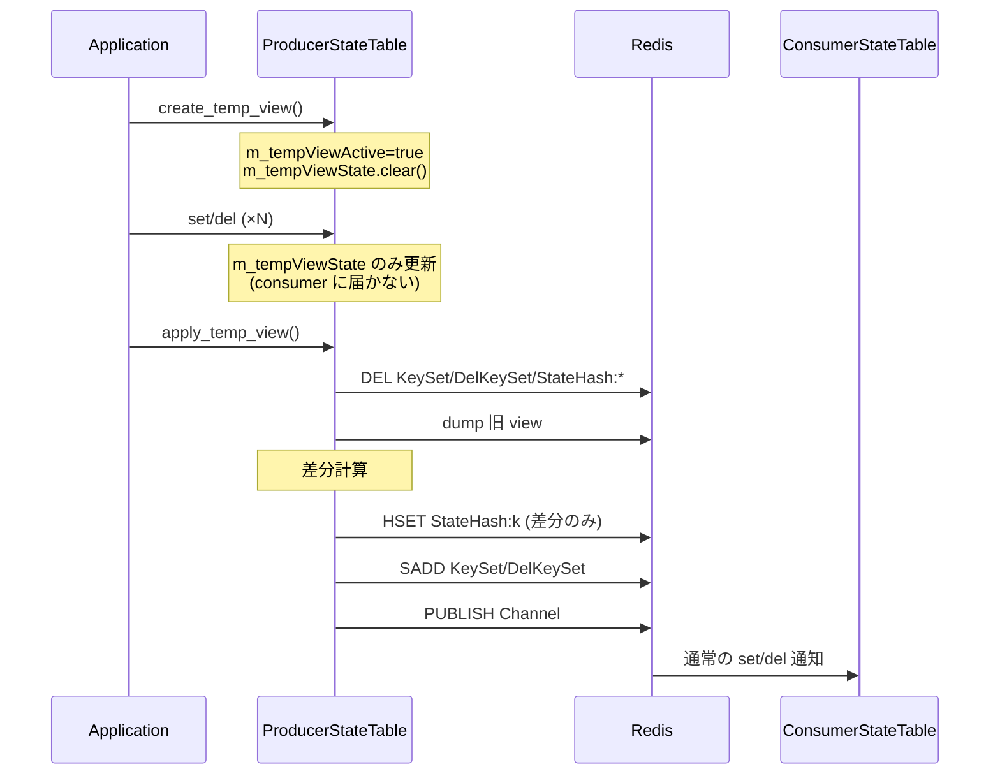

<!-- topics-tip -->
!!! tip "Topics で読み物として読む"
    この HLD は実装詳細を含みます。機能の概念・設定・運用を読み物として読みたい場合は [Topics 20 章: SWSS / SAI / Redis](../topics/20-swss-sai-redis/index.md) を参照。
<!-- /topics-tip -->

!!! success "裏取りステータス: code-verified"
    `sonic-swss-common/common/producerstatetable.h` `create_temp_view()` / `apply_temp_view()` / `m_tempViewActive` / `m_tempViewState`、`producerstatetable.cpp` の set/del 分岐と差分計算 (L324-479) を確認（verified at: 2026-05-09）。

# ProducerStateTable view switching

## なぜ必要か

warm reboot では、各 daemon が **新しい状態を一気に作って consumer に届ける** 必要がある。再起動直後に旧 view と新 view を比較し **差分だけ** [SAI](../reference/glossary.md#term-sai) に流せれば、再 program によるデータプレーン断が最小化される。

本 [HLD](../reference/glossary.md#term-hld) は `ProducerStateTable` に「一時 view をプロセス内メモリで構築 → `apply_temp_view()` で旧 view との差分だけ [Redis](../reference/glossary.md#term-redis) に書き出す」機構を追加する[^1]。差分計算は producer 側で行うため **`ConsumerStateTable` (pop 含む) は無変更**[^1]。

前提: **1 テーブルにつき producer は 1 つだけ**。複数 producer が同テーブルを書くと、view 切替中の二次 producer の書き込みが `apply_temp_view()` で失われる可能性がある[^1]。

## API と動作

`ProducerStateTable` 追加 2 API[^1]:

| API | 役割 |
|-----|------|
| `create_temp_view()` | `m_tempViewActive=true`、`m_tempViewState.clear()` |
| `apply_temp_view()` | 旧 view と diff、最小の set/del を Redis に出す。最後に `m_tempViewActive=false` |



### `apply_temp_view()` の 4 ステップ[^1]

1. **pending を捨てる**: `KeySet` / `DelKeySet` / `StateHash:*` を全削除
2. **旧 view dump**: `dump(tableDump)` で現状取得
3. **差分計算**: `tableDump` と `m_tempViewState` を突合
4. **書き出し**: 差分のみ書き、`KeySet`/`DelKeySet`/`Channel` に通知。`m_tempViewActive=false`

### 差分判定ルール

| 旧 | 新 | 動作 |
|----|----|------|
| あり | なし | `del` |
| あり | あり (完全一致) | 何もしない |
| あり field 欠落 | — | `del` + `set`（消して作り直し） |
| field 値変化 / 追加 | — | `set` |
| なし | あり | `set` |

## 設計上のトレードオフ

- **メモリ持ち vs Redis 持ち**: Redis に置けば producer クラッシュ時も他 producer が継続できるが、Redis オブジェクトが増え、比較を Lua で書く設計は嫌がられる。「1 producer / 1 table」と「クラッシュ復帰は高優先でない」割り切りでメモリ持ち[^1]
- **literal 比較**: `"10.0.0.1,10.0.0.3"` と `"10.0.0.3,10.0.0.1"` は別物扱い。**semantic 正規化はアプリ側責任**。`fpmsyncd` は nexthop をソートしてから set する必要がある[^1]

## 制限事項

- **1 producer / 1 table** 前提（secondary の更新は消えうる）
- `create_temp_view()` 後にプロセスクラッシュすると未適用 diff は失われる（再構築要）
- field 値の semantic 同一性はアプリ責任（literal 比較のみ）
- 巨大テーブル（数十万 entry）で **dump をメモリ保持** するメモリ消費（HLD 上限明示なし）

## 干渉する機能

- **warm reboot 全般**: `bgpd` / `fpmsyncd` / `swssconfig` 等が view 切替を使う
- **`fpmsyncd`**: nexthop ソート等の正規化必須[^1]
- **`ConsumerStateTable`**: 変更不要（普通の set/del にしか見えない）
- **Redis のメモリ**: `apply_temp_view` の DEL に依存している経路があると影響あり

## トラブルシューティング

- 切替後に古い状態が残る → `apply_temp_view()` 冒頭の DEL が走ったか確認
- 不要 `set` 大量発生 → アプリ側 field 正規化が抜けている可能性
- 切替途中で producer クラッシュ → `m_tempViewState` はメモリ消失。apply 前なら Redis は旧 view のまま、再構築可能


## コマンド例（確認）

ProducerStateTable の view 切替挙動を確認する。

```bash
docker logs swss 2>&1 | grep -iE 'view|producer'
redis-cli -n 1 keys '*_TABLE:*' | head
redis-cli -n 0 monitor | grep -E 'PUBLISH|HSET' | head
show platform summary
```

## 関連 Topics

- [11-reboot/architecture](../topics/11-reboot/architecture.md): warm reboot 全体像
- [11-reboot/internals](../topics/11-reboot/internals.md): view switching 内部
- [20-swss-sai-redis/internals](../topics/20-swss-sai-redis/internals.md): [ProducerStateTable](../reference/glossary.md#term-producerstatetable) / [ConsumerStateTable](../reference/glossary.md#term-consumerstatetable)

## 引用元

[^1]: `sonic-net/SONiC` `doc/warm-reboot/view_switch.md` @ `49bab5b5ff0e924f1ea52b3d9db0dfa4191a7c06`

<!-- glossary-links-injected: ccf91819747c -->
