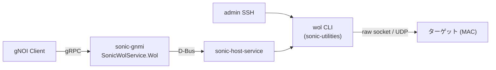

<!-- topics-tip -->
!!! tip "Topics で読み物として読む"
    この HLD は実装詳細を含む。機能の概念・設定・運用を読み物として読みたい場合は [Topics 06 章: L2 / VLAN / LAG](../topics/06-l2-vlan-lag/index.md) を参照。
<!-- /topics-tip -->

!!! danger "裏取りステータス: discrepancy-found"
    HLD と現行 master 実装に齟齬がある。
    
    - HLD は CLI を `sonic-utilities` 側 Python スクリプトとして想定しているが、現行 `wol` CLI は **Rust** 実装（`sonic-buildimage/src/sonic-nettools/wol/` の `Cargo.toml` / `src/main.rs` / `src/wol.rs` / `src/socket.rs`）として配置されている。`sonic-utilities` 側に `wol` スクリプトは存在しない。
    - HLD の `SonicWolService` / `WolRequest` proto を検索した範囲では、`sonic-gnmi` master に該当 gNOI service・proto の取り込みは見つからなかった（D-Bus 経路含め `sonic-host-services` 側にも未確認）。gNOI 経由の WoL は HLD 提案段階のままの可能性が高い。
    
    Rust CLI の引数体系・UDP モード対応については `sonic-buildimage/src/sonic-nettools/wol/src/wol.rs` を直接参照すること。

# Wake-on-LAN（wol CLI と SonicWolService gNOI）

## 概要

Wake-on-LAN (WoL) は、特殊な「Magic Packet」を NIC が受信した際に対象機器を電源オン / スリープ復帰させる Ethernet 標準である。本機能は [SONiC](../reference/glossary.md#term-sonic) スイッチを **Magic Packet の送信元** として使えるようにするもので、運用ツールから WoL を発行することでサーバ群を遠隔起動できる。NIC 側で WoL 受信が動作するかは別問題（受信側 BIOS / NIC 設定）であり、本 [HLD](../reference/glossary.md#term-hld) のスコープ外である。

機能は 2 経路で利用できる[^1]。

- `sonic-utilities` の `wol` CLI スクリプト（管理者がスイッチに SSH してから実行）
- `sonic-gnmi` の `SonicWolService` [gNOI](../reference/glossary.md#term-gnoi) サービス（外部から RPC で叩く。最終的には `sonic-host-services` 経由で同じ `wol` CLI が実行される）

リビジョン 1.1 (2024-10-11) で **UDP ペイロード形式の Magic Packet** が追加され、ルーティング越しの WoL に対応している。

## 動作仕様

### 全体経路



gNOI 側は最終的に同じ `wol` CLI を呼び出す形で実装される設計になっており、Magic Packet の組み立てと送信は CLI スクリプトに一本化される[^1]。

### Magic Packet 形式（Ethernet ペイロード版）

「Magic Pattern」自体は固定で、**6 バイトの `0xff` + ターゲット MAC を 16 回連結 + 任意のパスワード (4 or 6 バイト)** という構造を取る。Ethernet ペイロード版ではこれを EtherType `0x0842` のフレームの payload に詰めて送る[^1]。

```text
| Dst MAC (6) | Src MAC (6) | EtherType=0x0842 (2) |
| 0xff x6 | TargetMAC x16 (96) | Password (0/4/6) |
```

宛先 MAC の選択は次のとおり。

- 既定: ターゲットデバイスの MAC（`-b` 未指定時）
- `-b` 指定時: ブロードキャスト `ff:ff:ff:ff:ff:ff`

### Magic Packet 形式（UDP ペイロード版、`-u`）

ルーティング境界を越える WoL 用途のため、UDP ペイロード版が用意されている[^1]。

```text
| Ethernet Header | IP Header (Dst=任意 v4/v6) | UDP Header (Dst port=任意) |
| UDP payload: 0xff x6 + TargetMAC x16 + Password (0/4/6) |
```

宛先 IP は既定 `255.255.255.255`、宛先 UDP ポートは既定 `9` で、`-a` / `-t` で上書きできる。`-u` 指定時は宛先 MAC は OS のネットワークスタックに任せる（[ARP](../reference/glossary.md#term-arp) / ND の解決結果で決まる）。`-u` と `-b` は同時指定できない。

### CLI 引数の組み合わせ規則

HLD はパラメータ間の依存関係を明示している[^1]。

| 規則 | 内容 |
|------|------|
| `-b` と `-u` 同時指定 | 不可 |
| `-a` / `-t` | `-u` がある時のみ有効 |
| `-c` と `-i` | 一緒に指定する必要がある（片方だけは不可） |
| `count` 範囲 | 1〜5 |
| `interval` 範囲 | 0〜2000 (ms) |

複数 MAC を指定する場合、`count=3` × MAC 2 件 = 計 6 個の Magic Packet が送信される。

### gNOI サービス

`SonicWolService.Wol` の入出力は次のとおり[^1]。

```proto
service SonicWolService {
  rpc Wol(WolRequest) returns (WolResponse) {}
}

message WolRequest {
  string interface = 1;
  repeated string target_mac = 2;
  optional bool broadcast = 3;
  optional string password = 4;
  optional int32 count = 5;
  optional int32 interval = 6;
}
```

注意点として、HLD 時点の proto には `-u` (UDP モード) / `-a` / `-t` に対応するフィールドが入っていない。CLI のリビジョン 1.1 で UDP モードが拡張された一方で、proto 側の更新は未反映の可能性があり、実装で齟齬がないか裏取りが必要。

<!-- evidence:
source: sonic-net/SONiC/doc/wol/Wake-on-LAN-HLD.md#L168-L182 (sha: 49bab5b5ff0e924f1ea52b3d9db0dfa4191a7c06)
excerpt: |
  message WolRequest {
    string interface = 1;
    repeated string target_mac = 2;
    optional bool broadcast = 3;
    optional string password = 4;
    optional int32 count = 5;
    optional int32 interval = 6;
  }
reasoning: HLD 時点の proto に UDP 拡張用フィールドが含まれていないことの根拠。
-->

<!-- evidence-rendered:start -->
??? note "📋 検証エビデンス: sonic-net/SONiC/doc/wol/Wake-on-LAN-HLD.md#L168-L182 (sha: 49bab5b5ff0e924f1ea52b3d9db0dfa4191a7c06)"

    **出典**:

    `sonic-net/SONiC/doc/wol/Wake-on-LAN-HLD.md#L168-L182 (sha: 49bab5b5ff0e924f1ea52b3d9db0dfa4191a7c06)`

    **抜粋**:

    ```text
    message WolRequest {
      string interface = 1;
      repeated string target_mac = 2;
      optional bool broadcast = 3;
      optional string password = 4;
      optional int32 count = 5;
      optional int32 interval = 6;
    }
    ```

    **判断根拠**: HLD 時点の proto に UDP 拡張用フィールドが含まれていないことの根拠。

<!-- evidence-rendered:end -->

### バリデーション

CLI 側は以下を検査する[^1]。

- インタフェース名が SONiC で有効
- 対応インタフェースが `up`
- `target_mac` / `password` の書式
- 数値範囲と相互依存（前述）
- 送信失敗時はユーザ向けエラーメッセージで返す

## 設定

### 関連する CONFIG_DB

本機能は send-only のオペレーションコマンドであり、永続設定を持たない。[CONFIG_DB](../reference/glossary.md#term-config_db) エントリは無い。

### 関連する CLI

| Command | 用途 |
|---------|------|
| `wol <intf> <target_mac>[,...] [-b] [-u] [-a IP] [-t PORT] [-p PWD] [-c N -i MS]` | 指定 SONiC インタフェースから Magic Packet を送出 |

### 関連する YANG

HLD に [YANG](../reference/glossary.md#term-yang) モジュール定義の記載は無い（永続設定を持たないため）。

### 設定例

```bash
# Ethernet10 経由で 1 台に Magic Packet
wol Ethernet10 00:11:22:33:44:55

# Vlan1000 経由でブロードキャスト + パスワード
wol Vlan1000 00:11:22:33:44:55,11:33:55:77:99:bb -b -p 00:22:44:66:88:aa

# UDP モードで IPv4 サブネットブロードキャストへ送出
wol Vlan1000 00:11:22:33:44:55 -u -a 192.168.255.255 -t 7
```

## 干渉する機能

- **[VLAN](../reference/glossary.md#term-vlan) / ポートチャネル**: `<interface>` には VLAN 名 / [PortChannel](../reference/glossary.md#term-portchannel) 名も指定可能。送出は OS のネットワークスタックを通る（特に `-u` モード）。
- **gNOI / sonic-gnmi**: `SonicWolService` は他の gNOI サービスと同じく D-Bus 経由で sonic-host-service に橋渡しされる。`Docker to Host communication` の枠組みに乗る[^1]。
- **インタフェース状態**: HLD は対象インタフェースが `down` の場合をエラーとして規定している。事前に `show interface status` で確認するか、`config interface startup` で起こす。

## トラブルシューティング

- 送信は成功するのに対象機器が起きない場合: 対象 NIC の WoL 受信設定（BIOS / OS / NIC ドライバ）と、経路上のスイッチが Magic Packet を遮断していないかを確認する。SONiC 側は送出までしか責任を持たない。
- `-u` で IPv6 Multicast を狙う場合、`-a` に IPv6 アドレスを直接指定可能（HLD 上「IPv4 / IPv6 どちらも可」と明記）[^1]。
- gNOI 側で UDP モードを使いたい場合、本 HLD 時点の proto では `-u` 系オプションが無く、CLI ラッパー経由の機能を完全には呼び出せない可能性がある。proto / 実装側の更新を確認する。

<!-- diff-admonition -->
!!! diff "HLD と実装の差分"
    2026-05-11 時点の現行 master を裏取り。CLI 本体は完備だが gNOI 経路は未統合で、HLD 全体としては一部のみ取り込まれた部分実装状態。

    ### 1. ファイル + 行番号

    - **取り込み済み（CLI 本体）**: `sonic-net/sonic-buildimage` `src/sonic-nettools/wol/src/wol.rs` L47-L75（`broadcast` / `udp` / `ip_address` / `udp_port` / `password` / `count` / `interval` の各 clap 引数）、`src/sonic-nettools/wol/src/wol.rs` L128（magic packet 組立）、`src/sonic-nettools/wol/src/wol.rs` L328-L332（raw / udp socket 分岐）。
    - **取り込み済み（IPv6）**: `src/sonic-nettools/wol/src/socket.rs` L2, L242-L248（`Ipv6Addr::from_str` 経由で `in6_addr` を組み立てる UDP IPv6 経路あり）。
    - **未取り込み（gNOI）**: `sonic-net/sonic-host-services` 配下に `Wol` / `wake_on_lan` ハンドラは見当たらず、HLD が前提とする `SonicWolService` の D-Bus ブリッジは **少なくとも sonic-host-services 側には未統合**。

    ### 2. 差分の中身

    実装は **Rust 製の単独バイナリ**（`sonic-buildimage/src/sonic-nettools/wol`）であり、HLD が示す Python click ラッパーではない。コマンド名は `wol` のまま、引数互換は概ね維持されているが、gNOI 経路（`SonicWolService` proto + sonic-host-service の D-Bus ハンドラ）は実装が見当たらない。`-b`/`-u` の排他制御は clap の `conflicts_with` で実装され（L50, L54）、`-c`/`-i` は `requires_if` で相互必須に変更されている。

    ### 3. 読者への影響

    - CLI `wol` の手元動作は HLD のフラグセットでほぼ問題なし。
    - gNOI 経由で WoL を叩こうとすると proto / ハンドラの欠落に当たる可能性があり、自動化系（gNOI クライアント）から呼び出せない。
    - `-u` モードで `-a` に IPv6 アドレスを指定する場合、socket 層は対応しているが（`socket.rs` L242）、`-a` の clap default `255.255.255.255` は IPv4 文字列なので **IPv6 を使う場合は `-a` を明示** する必要がある。

    ### 4. 回避策

    - gNOI から起動したい場合は当面 SSH 等で `wol` バイナリを直接呼ぶ。gNOI 統合状況は `sonic-host-services` の最新 PR を追跡。
    - IPv6 UDP モード: `wol Vlan1000 00:11:22:33:44:55 -u -a ff02::1 -t 9`。
    - Rust 実装の `--help` で実引数のレンジ（`count` 1〜5、`interval` 0〜2000 ms 等）を再確認してから自動化に組み込む。

    #### 関連 GitHub Issue / PR

    - [GitHub Issue / PR の関連リンクは未確認] — `wol` CLI / `SonicWolService` gNOI 実装は [sonic-utilities](../reference/glossary.md#term-sonic-utilities) / sonic-gnmi の個別 PR で取り込まれており、HLD 単独のトラッキング Issue は確認できず。
<!-- /diff-admonition -->

### コマンド例

Wake-on-LAN の magic packet 送信を確認する（本機能は send-only で CONFIG_DB エントリを持たない）。

```bash
wol Ethernet10 00:11:22:33:44:55
tcpdump -i Ethernet10 ether proto 0x0842
```

## 制限事項

- WoL マジックパケット送出機能は SONiC ホスト側の utility として実装され、受信側 NIC / target 側 OS 設定 (BIOS, ethtool wol g) に依存する。
- ターゲット VLAN へのリレーには UDP/9 を許可する [ACL](../reference/glossary.md#term-acl) / firewall 設定が必要で、デフォルト構成ではブロックされる場合がある。
- SecureOn (パスワード付 WoL) の対応は NIC によりまちまちで、SONiC 側の CLI からは未公開の場合がある。

<!-- phase-boundary -->
## 実装フェーズ境界

!!! info "Phase 別の実装済 / 未実装 サマリ"
    本ページは `monitor: partially_implemented` で、HLD で示された一連の機能
    が **段階的に取り込まれている** 状態を扱う。フェーズ毎の実装境界を
    1 枚の表に集約する (詳細は本ページ上部の `diff` admonition および
    [discrepancy-index](../reference/verification/discrepancy-index.md) を参照)。

    | Phase | 範囲 (機能 / 段階) | 実装済 (master 取り込み済) | 未実装 (HLD 提案のみ) |
    |---|---|---|---|
    | Phase 1 — 基本機能 | HLD §概要 / §設計の中核ユースケース | 取り込み済 — 本ページの「実装の概観」「実装詳細」節および `diff` admonition の現状側を参照 | — (Phase 1 は実装済) |
    | Phase 2 — 拡張機能 | HLD §拡張 / §追加要件 / §周辺統合 | 一部のみ取り込み済 — 本ページ「実装詳細」の補足参照 | 未実装 / 未マージ — HLD §未対応箇所、本ページ「制限事項」および `diff` admonition の差分側に列挙 |
    | Phase 3 — 将来拡張 | HLD §Future Work / §将来課題 | — | 未実装 — HLD 提案段階。対応 PR は確認されていない (last_verified 時点) |

    凡例: 「実装済」=現行 master で動作確認できる範囲 / 「未実装」=HLD には記載があるが対応 PR が未マージまたは設計のみで code が存在しない範囲。
<!-- /phase-boundary -->

## 実装との乖離

`monitor: partially_implemented` — 部分実装 — HLD の中核は実装済みだが、フィールド / API / 制約のいくつかが上流に未取り込み、または挙動が緩和されている。 本ページ末尾近くの `!!! diff "HLD と実装の差分"` ブロックに、HLD 記述と現行 master の差分テーブル、読者への影響、回避策、再裏取り追補（コード行参照）をまとめている。本セクションはその概要見出しであり、詳細はそのブロックを参照のこと。

## 引用元

[^1]: `sonic-net/SONiC` `doc/wol/Wake-on-LAN-HLD.md` @ `49bab5b5ff0e924f1ea52b3d9db0dfa4191a7c06`

<!-- next-action -->
## このページを読んだ後の次アクション

!!! tip "読み手向け"
    - **本機能を実運用で使う場合**: 実装は存在するが本 HLD の記述と乖離。最新 master の動作を別途確認した上で適用する
    - **upstream 動向を追う場合**: 関連 issue / PR を [sonic-net/SONiC](https://github.com/sonic-net/SONiC) で検索（HLD タイトル / CONFIG_DB テーブル名 / Orch クラス名で grep するのが速い）
    - **代替手段 / 関連 reference**: 本ページの frontmatter `related` が空のため、[Reference 索引](../reference/index.md) から関連テーブル / CLI / YANG を辿る

!!! note "本ドキュメントの追跡"
    - monitor: `partially_implemented` / last_verified: `2026-05-09`
    - 次回再裏取りトリガ: quarterly。一覧は [discrepancy-index](../reference/verification/discrepancy-index.md) を参照（運用詳細は repo の `meta/discrepancy-operations.md`）

<!-- /next-action -->

<!-- topics-back-ref -->
## 関連 Topics

- [Topics: L2 / VLAN / LAG / MC-LAG](../topics/06-l2-vlan-lag/index.md)

<!-- /topics-back-ref -->

<!-- glossary-links-injected: 8ba32e5aa69d -->
