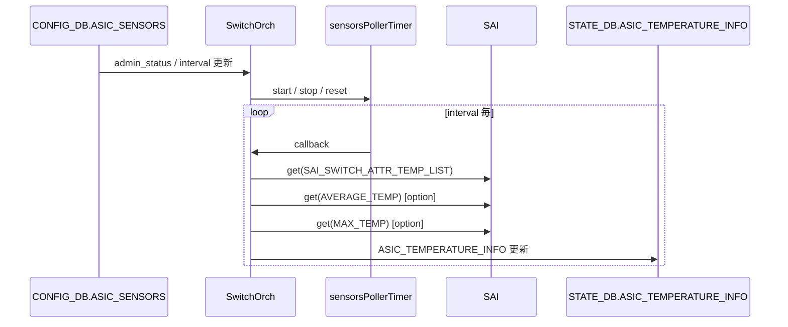
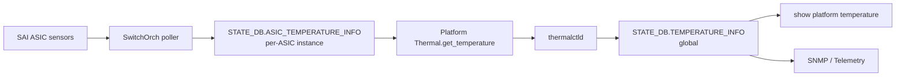

!!! warning "裏取りステータス: HLD-only / 古い HLD"
    本 HLD は 2019-01 初版（2020-10 改訂）であり、`SwitchOrch` の `sensorsPollerTimer` 実装、`ASIC_SENSORS` テーブルでの enable/disable 制御、`ASIC_TEMPERATURE_INFO` の `temperature_N` 列拡張、platform 側 `_thermal_list[]` への ASIC 内部センサ追加は実コードでの裏取り未済。CLI 制御は本 HLD では未定義。

# ASIC 内部温度センサのポーリング（`ASIC_SENSORS` / `ASIC_TEMPERATURE_INFO`）

## 概要

スイッチ上の温度センサには **外部（オンボード）** と **内部（CPU / ASIC / DIMM / 光学トランシーバ等）** がある。前者は既存ドライバで読めるが、**ASIC 内部センサは ASIC SDK 経由でしか読めない**[^1]。SAI には ASIC 内部温度を取り出す属性が用意されている:

| SAI 属性 | 内容 |
|----------|------|
| `SAI_SWITCH_ATTR_MAX_NUMBER_OF_TEMP_SENSORS` | ASIC 内部の温度センサ最大個数 |
| `SAI_SWITCH_ATTR_TEMP_LIST` | 全センサの読み値リスト |
| `SAI_SWITCH_ATTR_AVERAGE_TEMP` | 全センサ平均 |
| `SAI_SWITCH_ATTR_MAX_TEMP` | 全センサ最大 |

本 HLD は **`SwitchOrch` 内に設定可能なポーラ** を入れ、定期的にこれらを取得して `STATE_DB.ASIC_TEMPERATURE_INFO` に書き込む。`thermalctld` / `show platform temperature` / SNMP / Telemetry がこの値を参照する[^1]。

要件[^1]:

- ポーラは **CONFIG_DB で enable / disable 可能**（multi-ASIC では ASIC ごと）
- polling interval を **5〜300 秒** で設定可能
- 値は **STATE_DB に書き出し**、Thermal Control infrastructure から利用可
- `show platform temperature` に **ASIC 内部センサも含めて表示**
- Platform API `ThermalBase()` 経由でも取得可能

## 動作仕様

### CONFIG_DB スキーマ

各 ASIC の DB instance に追加[^1]:

```text
ASIC_SENSORS|ASIC_SENSORS_POLLER_STATUS
    admin_status: "enable" | "disable"

ASIC_SENSORS|ASIC_SENSORS_POLLER_INTERVAL
    interval: <秒, 5〜300>
```

### STATE_DB スキーマ

各 ASIC の DB instance に追加[^1]:

```text
ASIC_TEMPERATURE_INFO
    average_temperature: FLOAT
    maximum_temperature: FLOAT
    temperature_0: FLOAT
    ...
    temperature_N: FLOAT
```

### `SwitchOrch` の拡張

`SwitchOrch` を `CFG_ASIC_SENSORS_TABLE_NAME` (`ASIC_SENSORS`) の consumer に追加し、新しい **`SelectableTimer sensorsPollerTimer`** （default 10 秒）を持つ[^1]。

#### ポーラ設定変更

- `admin_status=enable` → `sensorsPollerTimer` 開始
- `admin_status=disable` → 次回 callback で timer 停止フラグを立てる
- `interval` 変更 → 次回 callback で新 interval を反映

#### ポーラ動作

`sensorsPollerTimer` の callback で[^1]:

1. disable フラグが立っていれば timer 停止
2. interval 変更があれば timer リセット
3. `SAI_SWITCH_ATTR_TEMP_LIST` を取得し、`ASIC_TEMPERATURE_INFO.temperature_N` を更新
4. SAI が `SAI_SWITCH_ATTR_AVERAGE_TEMP` をサポートしていれば取得し `average_temperature` を更新
5. SAI が `SAI_SWITCH_ATTR_MAX_TEMP` をサポートしていれば取得し `maximum_temperature` を更新



### Platform 層

ASIC 内部センサも platform の **`Thermal` リスト (`_thermal_list[]`)** に追加する。Platform API 自体に変更は無く、`get_temperature()` の実装で **`ASIC_TEMPERATURE_INFO` から値を引く** ことで対応する[^1]:

- センサ命名（multi-ASIC 例）: `ASIC0 Internal 0`, ..., `ASIC0 Internal N0`, `ASIC1 Internal 0`, ..., `ASIC2 Internal N2`
- 既存の `get_high_threshold()` / `get_low_threshold()` / `get_high_critical_threshold()` / `get_name()` / `get_presence()` は **platform 側で実装**（ASIC 個別の閾値）
- `get_temperature()` だけが対応 ASIC の DB instance から値を引く

`thermalctld` の `TemperatureUpdater::_refresh_temperature_status()` は既存通り `get_temperature()` を呼び出し、global DB の `TEMPERATURE_INFO` table に集約する。**`thermalctld` 自体に変更は無い**[^1]。

### 結果のデータパス



## 設定

### 関連する CONFIG_DB

| Table | Key | フィールド | 説明 |
|-------|-----|-----------|------|
| `ASIC_SENSORS` | `ASIC_SENSORS_POLLER_STATUS` | `admin_status: enable/disable` | ポーラ on/off |
| `ASIC_SENSORS` | `ASIC_SENSORS_POLLER_INTERVAL` | `interval: 5..300` | polling 間隔（秒） |

### 関連する STATE_DB

| Table | フィールド | 説明 |
|-------|-----------|------|
| `ASIC_TEMPERATURE_INFO` | `average_temperature`, `maximum_temperature`, `temperature_0..N` | per-ASIC のセンサ値 |

### 関連する CLI

| Command | 用途 |
|---------|------|
| `show platform temperature` | ASIC 内部センサも含む全温度の表示 |

> **HLD 当時 ポーラ制御専用 CLI は未定義**[^1]。`redis-cli` で直接 `ASIC_SENSORS` を書く運用が前提となる。

### 設定例

```bash
# 単一 ASIC 機での enable + 30 秒間隔
sonic-db-cli CONFIG_DB hset 'ASIC_SENSORS|ASIC_SENSORS_POLLER_STATUS' admin_status enable
sonic-db-cli CONFIG_DB hset 'ASIC_SENSORS|ASIC_SENSORS_POLLER_INTERVAL' interval 30

# 確認
sonic-db-cli STATE_DB hgetall 'ASIC_TEMPERATURE_INFO'
show platform temperature
```

## 制限事項

- ASIC 内部センサ値は **SDK / SAI 経由でしか取得できない**[^1]
- HLD 当時 **ポーラ制御専用 CLI 未定義**。`config asic-sensors ...` のような CLI が無いため、ユーザは redis に直接書く必要がある[^1]
- `SAI_SWITCH_ATTR_AVERAGE_TEMP` / `MAX_TEMP` は **SAI 実装側のサポートに依存**。サポートしない ASIC では `average_temperature` / `maximum_temperature` が更新されない可能性
- `thermalctld.UPDATE_INTERVAL` のデフォルトは 60 秒。`ASIC_SENSORS_POLLER_INTERVAL` を **それより短く設定** しないと convergence が悪化[^1]
- multi-ASIC 機では各 ASIC instance に対し **個別に enable / interval 設定** が必要
- thermal control の閾値（high / low / critical）は platform 実装側に委ねられ、SAI からは取得しない

## 干渉する機能

- **`SwitchOrch`**: 主体。`ASIC_SENSORS` consumer + `sensorsPollerTimer`
- **`thermalctld`**: 既存通り `get_temperature()` を呼び全センサ値を集約
- **Platform `Thermal` 実装**: `_thermal_list[]` に ASIC 内部センサを追加し、`get_temperature()` で `ASIC_TEMPERATURE_INFO` から引く
- **`pmon`**: 本 HLD では SAI 呼び出しを担わない（pmon に SAI 依存を入れないのが目的の一つ）
- **SNMP / Telemetry**: `STATE_DB.TEMPERATURE_INFO` 経由で値を読める

## トラブルシューティング

- `show platform temperature` に ASIC センサが出ない → `ASIC_SENSORS_POLLER_STATUS.admin_status=enable` か確認、`ASIC_TEMPERATURE_INFO` の値が更新されているか確認
- 値が古いまま → `interval` の設定値、`SwitchOrch` ログ、`sensorsPollerTimer` の起動有無を確認
- 一部センサ列のみ NULL → SAI 側で `SAI_SWITCH_ATTR_AVERAGE_TEMP` / `MAX_TEMP` 未サポートの可能性
- multi-ASIC で一部 ASIC のみ表示されない → 該当 ASIC の DB instance に `ASIC_SENSORS` が入っているか確認

## 引用元

[^1]: `sonic-net/SONiC` `doc/asic-thermal-monitoring/asic_thermal_monitoring_hld.md` @ `49bab5b5ff0e924f1ea52b3d9db0dfa4191a7c06`

<!-- concerns hint:
- SwitchOrch の sensorsPollerTimer 実装存在確認（sonic-swss/orchagent）
- ASIC_SENSORS テーブルの CONFIG_DB スキーマ取り込み確認
- ASIC_TEMPERATURE_INFO の STATE_DB 書き込みコード（temperature_N 列）確認
- Platform vendor の _thermal_list[] への ASIC 内部センサ追加状況確認
- HLD 当時未定義の poller 制御 CLI が現行 sonic-utilities に追加されたか未確認
- HLD は 2019/2020 改訂のため現行 master 実装との乖離リスクあり
-->
