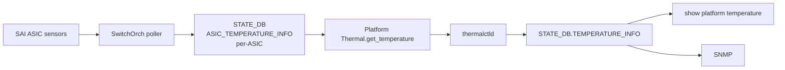

<!-- topics-tip -->
!!! tip "Topics で読み物として読む"
    この HLD は実装詳細を含む。機能の概念・設定・運用を読み物として読みたい場合は [Topics 14 章: Platform / Port / Optics](../topics/14-platform-port-optics/index.md) を参照。
<!-- /topics-tip -->

!!! success "裏取りステータス: code-verified"
    `sonic-swss/orchagent/switchorch.h:12-14, 170-179` で `ASIC_SENSORS_POLLER_*` 定数と `m_asicSensorsTable / m_sensorsPollerTimer / m_sensorsPollerEnabled` メンバ、`sonic-swss-common/common/schema.h:138` で `ASIC_TEMPERATURE_INFO_TABLE_NAME`、`switchorch.cpp:154,173,402,408,425-436` で `SelectableTimer` 実装と `ASIC_SENSORS` 動的反映を確認（verified at: 2026-05-09）。

# ASIC 内部温度センサのポーリング（`ASIC_SENSORS` / `ASIC_TEMPERATURE_INFO`）

## 何が課題なのか

スイッチ上の温度センサのうち **外部（オンボード）** は既存ドライバで読めるが、**[ASIC](../reference/glossary.md#term-asic) 内部センサは [ASIC SDK](../reference/glossary.md#term-asic-sdk) 経由でしか読めない**[^1]。pmon に [SAI](../reference/glossary.md#term-sai) 依存を入れたくないため、[orchagent](../reference/glossary.md#term-orchagent) 側に poller を置いて [STATE_DB](../reference/glossary.md#term-state_db) に書き出し、`thermalctld` / `show platform temperature` / [SNMP](../reference/glossary.md#term-snmp) / Telemetry から透過的に参照できるようにする。

SAI が提供する関連属性[^1]:

| SAI 属性 | 内容 |
|----------|------|
| `SAI_SWITCH_ATTR_MAX_NUMBER_OF_TEMP_SENSORS` | センサ最大個数 |
| `SAI_SWITCH_ATTR_TEMP_LIST` | 全センサ読み値 |
| `SAI_SWITCH_ATTR_AVERAGE_TEMP` | 平均 |
| `SAI_SWITCH_ATTR_MAX_TEMP` | 最大 |

## どう動くのか

`SwitchOrch` を `ASIC_SENSORS` の consumer に追加し、`SelectableTimer sensorsPollerTimer`（既定 10 秒）を持つ。[CONFIG_DB](../reference/glossary.md#term-config_db) の `admin_status` / `interval` 変更は次回 callback で反映[^1]。



ポーラ動作: timer callback で `TEMP_LIST` を必ず取得、`AVERAGE_TEMP` / `MAX_TEMP` は SAI 実装が対応する場合のみ取得[^1]。

## CONFIG_DB / STATE_DB

```text
# CONFIG_DB (per-ASIC)
ASIC_SENSORS|ASIC_SENSORS_POLLER_STATUS    admin_status: enable | disable
ASIC_SENSORS|ASIC_SENSORS_POLLER_INTERVAL  interval: 5..300 秒

# STATE_DB (per-ASIC)
ASIC_TEMPERATURE_INFO  average_temperature / maximum_temperature
                       temperature_0 .. temperature_N
```

## Platform 層

ASIC 内部センサも platform の `_thermal_list[]` に追加するが、Platform API 自体に変更はない。`get_temperature()` の実装で **`ASIC_TEMPERATURE_INFO` から値を引く** ことで対応する。閾値（high/low/critical）は platform 実装に委ねる。`thermalctld` 本体に変更なし[^1]。

## CLI と設定例

`show platform temperature` で ASIC 内部センサも含めて表示される。**[HLD](../reference/glossary.md#term-hld) 当時 poller 制御専用 CLI は未定義** で、`redis-cli` / `sonic-db-cli` で直接書く運用[^1]:

```bash
sonic-db-cli CONFIG_DB hset 'ASIC_SENSORS|ASIC_SENSORS_POLLER_STATUS' admin_status enable
sonic-db-cli CONFIG_DB hset 'ASIC_SENSORS|ASIC_SENSORS_POLLER_INTERVAL' interval 30
sonic-db-cli STATE_DB hgetall 'ASIC_TEMPERATURE_INFO'
show platform temperature
```

## 制限事項

- 値取得は **SDK / SAI 経由必須**[^1]
- HLD 当時 **poller 制御専用 CLI 未定義**[^1]
- `AVERAGE_TEMP` / `MAX_TEMP` は **SAI 実装次第**で NULL のことあり
- `thermalctld.UPDATE_INTERVAL`（既定 60 秒）より `ASIC_SENSORS_POLLER_INTERVAL` を短くしないと収束が遅くなる[^1]
- multi-ASIC では **各 ASIC instance ごとに個別設定**
- 閾値は platform 側で持ち、SAI からは取得しない

## 干渉する機能

`SwitchOrch`（主体） / `thermalctld`（既存集約） / Platform `Thermal` 実装（`_thermal_list[]`） / `pmon`（SAI 呼ばない） / SNMP / Telemetry。

## トラブルシューティング

- ASIC センサ非表示 → `admin_status=enable` か、`ASIC_TEMPERATURE_INFO` が更新されているか
- 値が古い → `interval` 設定、`SwitchOrch` ログ、timer 起動有無
- 一部 NULL → SAI 側 `AVERAGE_TEMP` / `MAX_TEMP` 未サポート
- multi-ASIC で一部 ASIC 非表示 → 該当 ASIC の DB instance に `ASIC_SENSORS` が入っているか


### コマンド例

ASIC 温度監視データを確認する。

```bash
show platform temperature
redis-cli -n 6 keys 'ASIC_TEMPERATURE_INFO|*'
docker exec pmon thermalctld -v 2>&1 | head
grep -i thermal /var/log/syslog | tail -20
```

## 関連 Topics

- [14-platform-port-optics](../topics/14-platform-port-optics/index.md): pmon / platform daemon 全体像
- [09-telemetry-snmp](../topics/09-telemetry-snmp/index.md): 温度値の publish

## 引用元

[^1]: `sonic-net/SONiC` `doc/asic-thermal-monitoring/asic_thermal_monitoring_hld.md` @ `49bab5b5ff0e924f1ea52b3d9db0dfa4191a7c06`

<!-- glossary-links-injected: c006405759d8 -->
