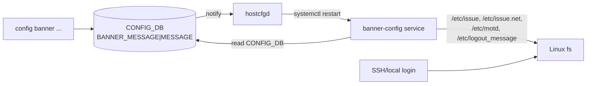
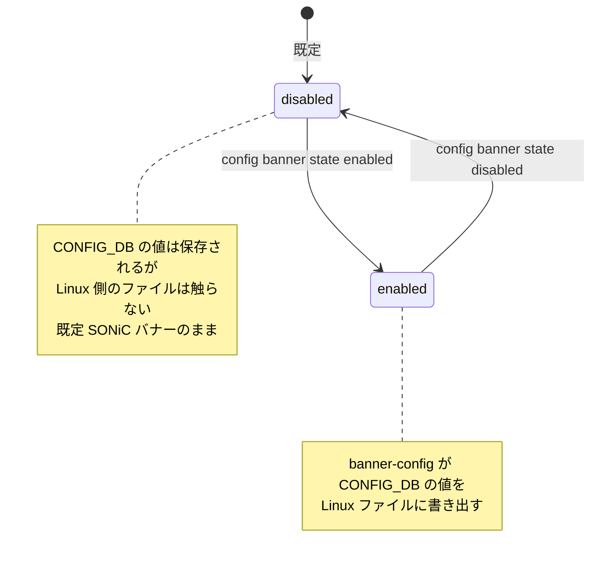
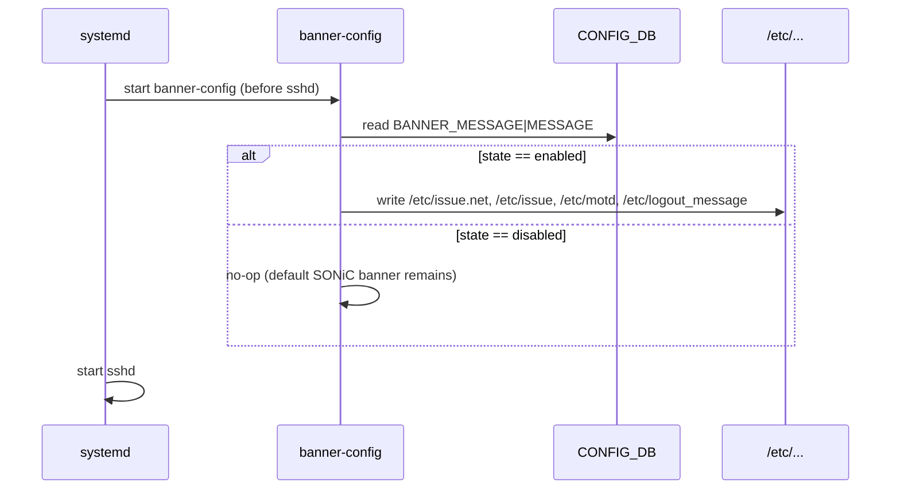

<!-- topics-tip -->
!!! tip "Topics で読み物として読む"
    この HLD は実装詳細を含みます。機能の概念・設定・運用を読み物として読みたい場合は [Topics 15 章: Security / AAA](../topics/15-security-aaa/index.md) を参照。
<!-- /topics-tip -->

!!! note "裏取りステータス: code-verified"
    verifier-batch-18 で確認:

    - `sonic-host-services/scripts/hostcfgd` に `BANNER_MESSAGE` テーブル変更ハンドラがあり、変更時に `systemctl restart banner-config` を実行
    - `sonic-utilities/config/main.py:10004-` に `config banner` group と `state` / `login` / `motd` / `logout` サブコマンド定義
    - 起動順序 / sshd before constraint の systemd unit 配置詳細は sonic-buildimage build_templates 側で個別確認のこと

# バナーメッセージ（login / motd / logout）

## 概要

業務スイッチには、ログイン前後やログアウト時に **法的注意文・運用情報・MOTD** を表示する要件が頻繁にある。[SONiC](../reference/glossary.md#term-sonic) 既定の Debian バナー（`Debian GNU/Linux 11`）と SONiC のアスキーアート MOTD はそのままでは運用ポリシーを満たさないことが多い。本機能は **[CONFIG_DB](../reference/glossary.md#term-config_db) → [hostcfgd](../reference/glossary.md#term-hostcfgd) → banner-config systemd サービス → Linux ファイル** という経路でログインバナー / ログアウトバナー / MOTD を集中管理できるようにする[^1]。

| 種別 | タイミング | 反映先ファイル |
|------|-----------|----------------|
| `login` | ログインプロンプト前（ローカル / SSH 共通） | `/etc/issue.net` と `/etc/issue` |
| `motd` | ログイン後 | `/etc/motd` |
| `logout` | ログアウト時 | `/etc/logout_message` |

機能既定値は **disabled**。`disabled` の間は CONFIG_DB を編集しても Linux 側のファイルは書き換わらず、SONiC OS の標準バナーが表示され続ける[^1]。

## 動作仕様

### 全体経路



`banner-config` は **SSH を受け付ける前段階で起動する単発サービス** として設計されており、CONFIG_DB から現在の値を読んで対応するファイルに書き出す[^1]。`hostcfgd` は CONFIG_DB の `BANNER_MESSAGE` テーブルを購読しており、変更があれば `banner-config` を再実行する。

### 状態遷移



`disabled` の状態でも CLI で個別の `login` / `motd` / `logout` メッセージを設定できる。これは CONFIG_DB のみに保存され、`enabled` に遷移した時点で Linux に適用される設計である[^1]。

### マルチライン文字列

`config banner login "Hello!\nWelcome to SONiC CLI!"` のように `\n` を含めることで複数行バナーを設定できる[^1]。

```text
Hello!
Welcome to SONiC CLI!
```

### 起動時シーケンス



設定変更時のシーケンスは `hostcfgd` が変更を検知して `banner-config` を再起動する点が異なる。

<!-- evidence:
source: sonic-net/SONiC/doc/banner/banner_hld.md#L84-L91 (sha: 49bab5b5ff0e924f1ea52b3d9db0dfa4191a7c06)
excerpt: |
  Hostcfgd will listen for the configuration changes in corresponding tables and restart banner-config service.
  Banner config service - it is simple SystemD service which runs before we get SSH connection.
  ...
  /etc/issue.net and /etc/issue - Login message
  /etc/motd - Message of the day
  /etc/logout_message - Logout message
reasoning: hostcfgd → banner-config → 4 ファイル書き出し、sshd 前段で動くという挙動の根拠。
-->

<!-- evidence-rendered:start -->
??? note "📋 検証エビデンス: sonic-net/SONiC/doc/banner/banner_hld.md#L84-L91 (sha: 49bab5b5ff0e924f1ea52b3d9db0dfa4191a7c06)"

    **出典**:

    `sonic-net/SONiC/doc/banner/banner_hld.md#L84-L91 (sha: 49bab5b5ff0e924f1ea52b3d9db0dfa4191a7c06)`

    **抜粋**:

    ```text
    Hostcfgd will listen for the configuration changes in corresponding tables and restart banner-config service.
    Banner config service - it is simple SystemD service which runs before we get SSH connection.
    ...
    /etc/issue.net and /etc/issue - Login message
    /etc/motd - Message of the day
    /etc/logout_message - Logout message
    ```

    **判断根拠**: hostcfgd → banner-config → 4 ファイル書き出し、sshd 前段で動くという挙動の根拠。

<!-- evidence-rendered:end -->

## 設定

### 関連する CONFIG_DB

| Table | Key | フィールド | 説明 |
|-------|-----|-----------|------|
| `BANNER_MESSAGE` | `MESSAGE` | `state` | `enabled` / `disabled`（既定 `disabled`） |
| | | `login` | ログインプロンプト前メッセージ |
| | | `motd` | ログイン後 MOTD |
| | | `logout` | ログアウト時メッセージ |

### 関連する CLI

| Command | 用途 |
|---------|------|
| `config banner state {enabled\|disabled}` | 機能オン / オフ |
| `config banner login <message>` | login バナー設定 |
| `config banner logout <message>` | logout バナー設定 |
| `config banner motd <message>` | MOTD 設定 |
| `show banner` | 現在の設定を一覧表示（state / login / motd / logout の表）|

### 関連する YANG

`sonic-banner.yang` モジュールに `BANNER_MESSAGE.MESSAGE` コンテナを定義[^1]。

```yang
container BANNER_MESSAGE {
    container MESSAGE {
        leaf state  { type string { pattern "enabled|disabled"; } default disabled; }
        leaf login  { type string; default "Debian GNU/Linux 11"; }
        leaf motd   { type string; default "You are on ____   ___  _   _ _  ____ ..."; }
        leaf logout { type string; default ""; }
    }
}
```

[YANG](../reference/glossary.md#term-yang) 既定値: `state=disabled`, `login=Debian GNU/Linux 11`, `motd=` SONiC ASCII art ([HLD](../reference/glossary.md#term-hld) 中の長文), `logout=""`.

### 設定例

```bash
config banner state enabled
config banner login "Authorized access only. All activity is monitored."
config banner motd "Welcome to ToR-A1 (SONiC)."
config banner logout "Bye!"
show banner
```

### 永続化

設定は CONFIG_DB に書かれているだけでは再起動後に消える可能性がある。HLD の Test Plan は `do not save → reboot → 既定` / `save → reboot → 設定維持` を明示している[^1]。永続化したい場合は `config save` を別途実行する。

## 干渉する機能

- **`/etc/issue` / `/etc/motd`**: 他の systemd サービスや Debian メンテナンスでこれらのファイルを再生成すると、`banner-config` の出力と競合する。基本的には `banner-config` が後勝ちで上書きする想定。
- **`hostcfgd`**: 既存の他テーブル監視（NTP / [SNMP](../reference/glossary.md#term-snmp) / TACACS 等）と同居する。BANNER_MESSAGE 更新が他のサービス再起動を誘発しない設計になっている前提。
- **SSH (`sshd`)**: `/etc/issue.net` の変更は次回接続から反映される。既存セッションには影響しない。

## トラブルシューティング

- 設定したバナーが表示されない: 機能 `state` が `enabled` か確認。`disabled` のままだと CONFIG_DB の値は反映されない。
- 一部だけ反映される: `/etc/issue` と `/etc/issue.net` は同じ login メッセージで両方更新される設計。片方だけ反映されている場合は `banner-config` のサービスログ (`journalctl -u banner-config`) を確認。
- リブート後に消えた: `config save` 未実行。CONFIG_DB スナップショットを永続化する必要がある。
- マルチライン: `\n` をシェル経由で渡す際にクォートを正しくしないと改行が消える。`config banner login "line1\nline2"` のようにダブルクォート + `\n` で渡す。
- `show banner` でロゴが崩れる: ターミナル幅に合わせて整形しているわけではない。生の文字列を返している。

### コマンド例

Banner 設定の状態を確認する。

```bash
show banner
redis-cli -n 4 hgetall 'BANNER_MESSAGE|global'
cat /etc/issue /etc/issue.net /etc/motd
config banner login 'WARNING: authorized only'
```

## 制限事項

- **`state=disabled` のとき CONFIG_DB の値は無視**: `BANNER_MESSAGE` テーブルに login/motd/logout が書かれていても、`state` が `disabled` だと反映されない。
- **永続化は別オペレーション**: バナー設定は CONFIG_DB に書かれているだけでは再起動後に消える可能性がある。`config save` を別途実行しないと永続化されない。
- **`/etc/issue` / `/etc/issue.net` の race**: 他の systemd ユニット (cloud-init, debian-maintenance) がこれらファイルを再生成する場合、`banner-config` と書き込みが競合する。基本は `banner-config` 後勝ち。
- **既存セッションには反映されない**: SSH の `/etc/issue.net` 更新は次回接続から有効。すでに接続中のセッションには適用されない。
- **マルチラインのクォート扱い**: `\n` をシェル経由で渡す場合のクォートに注意が必要 (`"line1\nline2"`)。HLD では escape 規約の厳密な仕様は未定義。
- **整形 / 幅調整なし**: `show banner` は生の文字列をそのまま出力する。ターミナル幅やロゴアスキーアートの整形は行わない。

## 引用元

[^1]: `sonic-net/SONiC` `doc/banner/banner_hld.md` @ `49bab5b5ff0e924f1ea52b3d9db0dfa4191a7c06`

<!-- topics-back-ref -->
## 関連 Topics

- [Topics: Security / AAA / FIPS / Hardening](../topics/15-security-aaa/index.md)

<!-- /topics-back-ref -->

<!-- glossary-links-injected: 8ba32e5aa69d -->
