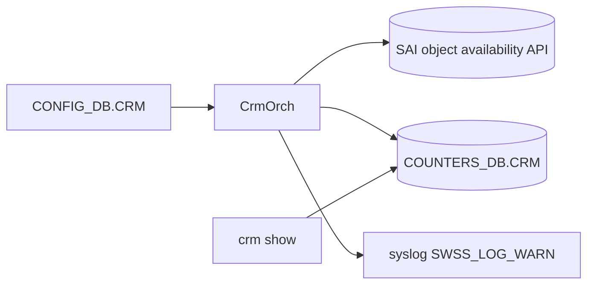

!!! success "裏取りステータス: code-verified"
    `sonic-swss/orchagent/crmorch.h` / `crmorch.cpp` に `CrmOrch` 実装、`sonic-yang-models/yang-models/sonic-crm.yang` に CONFIG_DB CRM スキーマ。`fdborch.cpp` / `routeorch.cpp` / `srv6orch.cpp` 等から CRM カウンタ更新が呼ばれることを grep で確認。閾値超過 / 復旧通知は両方とも `SWSS_LOG_WARN` で出力される (`crmorch.cpp` L1175, L1183)[^crmorch] (verified at: 2026-06-06)。

# Critical Resource Monitoring（CRM・SAI 表枯渇のしきい値監視）

## なぜ必要なのか

[ASIC](../reference/glossary.md#term-asic) 側の各種リソース（route 表、neighbor、[ACL](../reference/glossary.md#term-acl) counter、[FDB](../reference/glossary.md#term-fdb)、[NAT](../reference/glossary.md#term-nat) 等）は **ハードウェアサイズで上限がある**。上限到達で**運用中に突然パケットドロップやプログラム失敗**が起きるため、[CRM](../reference/glossary.md#term-crm) は使用量を定期ポーリングし、**しきい値超え / 復旧時に `SWSS_LOG_WARN` レベルで syslog 通知** することで障害前検知を狙う[^1][^crmorch]。

ねらい:

- 表枯渇を **障害発生前に** 通知
- `crm show` で使用量・上限値を常時可視化
- しきい値の `percentage` / `used` / `free` モード、`high` / `low` の双方を扱う

## 監視対象の resource

主要種別（[HLD](../reference/glossary.md#term-hld) は L3/L2/ACL/NAT/IPMC まで定義、master では `crmorch.cpp` で [MPLS](../reference/glossary.md#term-mpls)/SRv6/NEXTHOP_GROUP_MAP/[DASH](../reference/glossary.md#term-dash) 系まで拡張済み）[^1][^crmorch]:

- L3: `IPV4_ROUTE` / `IPV6_ROUTE` / `IPV4_NEIGHBOR` / `IPV6_NEIGHBOR` / `IPV4_NEXTHOP` / `IPV6_NEXTHOP`
- L3 group: `NEXTHOP_GROUP` / `NEXTHOP_GROUP_MEMBER` / `NEXTHOP_GROUP_MAP`
- L2: `FDB_ENTRY`
- ACL: `ACL_TABLE` / `ACL_GROUP` / `ACL_ENTRY` / `ACL_COUNTER`
- NAT / multicast: `DNAT_ENTRY` / `SNAT_ENTRY` / `IPMC_ENTRY`
- MPLS: `MPLS_INSEG` / `MPLS_NEXTHOP`
- [SRv6](../reference/glossary.md#term-srv6): `SRV6_MY_SID_ENTRY` / `SRV6_NEXTHOP`
- 拡張枠組み: `EXTENSION_TABLE` (vendor 追加 resource)
- DASH: `DASH_VNET` / `DASH_ENI` / `DASH_*_INBOUND_ROUTING` / `DASH_*_OUTBOUND_ROUTING` / `DASH_*_PA_VALIDATION` / `DASH_*_OUTBOUND_CA_TO_PA`

## どう動くのか



しきい値モード[^1][^crmorch]:

- **percentage**: 上限の % で `high_threshold` / `low_threshold` (`crmorch.cpp` L301-303 で文字列 enum マップ)
- **used**: 絶対使用量
- **free**: 残量（演算は `used` の逆向き）

利用率が `high_threshold` 以上になった時点で `THRESHOLD_EXCEEDED` メッセージを `SWSS_LOG_WARN` で出力、`low_threshold` 以下に下がった時点で `THRESHOLD_CLEAR` を同じ WARN レベルで出力する (`crmorch.cpp` L1168-1186)。同一 resource あたりの exceeded ログは `CRM_EXCEEDED_MSG_MAX = 10` で頭打ちにレートリミットされる (`crmorch.cpp` L16, L1168)。

デフォルト値 (`crmorch.cpp` L12-15):

- `polling_interval`: 300 秒 (`CRM_POLLING_INTERVAL_DEFAULT = 5 * 60`)
- `threshold_type`: `percentage`
- `low_threshold` / `high_threshold`: 70 / 85

## CONFIG_DB / CLI

| Key | 説明 |
|-----|------|
| `CRM\|Config` | `polling_interval`、各 resource ごとに `<r>_threshold_type` / `<r>_high_threshold` / `<r>_low_threshold` |

| Command | 用途 |
|---------|------|
| `crm config polling interval <n>` | 周期 |
| `crm config thresholds <r> type <p\|u\|f>` | mode |
| `crm config thresholds <r> high <n>` / `low <n>` | しきい値 |
| `crm show resources [all\|ipv4 route\|...]` | 残量 / 使用量 |
| `crm show thresholds` | 現行しきい値 |

## 制限事項

- **[SAI](../reference/glossary.md#term-sai) `sai_object_type_get_availability()` が必要**。vendor 未対応 resource は値が出ない (`crmorch.cpp` L801, L854, L1035 で呼び出し)[^crmorch]
- 通知は `SWSS_LOG_WARN` syslog のみで **自動 recovery アクションは無い**。exceeded ログは resource あたり 10 回で止まる (`CRM_EXCEEDED_MSG_MAX`)
- 多 resource を高頻度ポーリングすると **[ASIC SDK](../reference/glossary.md#term-asic-sdk) 負荷増**
- `ACL_COUNTER` / `FDB_ENTRY` は SDK query が高コストになることがあり、長めの polling 推奨

## 干渉する機能

generic SAI extension CRM（新 resource 追加枠組み） / system health monitor（critical 集約） / NAT / mux / SRv6 / multi-asic（resource 種別を増やす側）。

## トラブルシューティング

- `crm show` が `N/A` → SAI vendor の object_availability 実装の有無
- 通知が来ない → `polling_interval`、syslog rate-limit、threshold mode 確認
- counter が振動する → 周期と使用量変動の解像度差を再検討


### コマンド例

CRM カウンタの現在値と閾値を確認する。

```bash
crm show summary
crm show thresholds all
crm show resources all
redis-cli -n 2 keys 'CRM:*'
```

## 関連 Topics

- [07-acl-copp-mirror](../topics/07-acl-copp-mirror/index.md): ACL リソース消費
- [20-swss-sai-redis](../topics/20-swss-sai-redis/index.md): [orchagent](../reference/glossary.md#term-orchagent) と SAI の関係

## 引用元

[^1]: `sonic-net/SONiC` `doc/crm/Critical-Resource-Monitoring-High-Level-Design.md` @ `49bab5b5ff0e924f1ea52b3d9db0dfa4191a7c06`
[^crmorch]: `sonic-net/sonic-swss` `orchagent/crmorch.cpp` / `orchagent/crmorch.h` @ master — `CrmResourceType` enum 全リスト (L30-65)、threshold mode 文字列マップ (L301-303)、default 定数 (L12-17)、`sai_object_type_get_availability()` 呼び出し (L801, L854, L1035)、`THRESHOLD_EXCEEDED` / `THRESHOLD_CLEAR` の WARN ログ (L1175, L1183)、レートリミット (L1168, L1179)

<!-- topics-back-ref -->
## 関連 Topics (索引)

- [Topics: Telemetry / SNMP / Observability](../topics/09-telemetry-snmp/index.md)

<!-- /topics-back-ref -->

<!-- glossary-links-injected: ac479ac27678 -->
