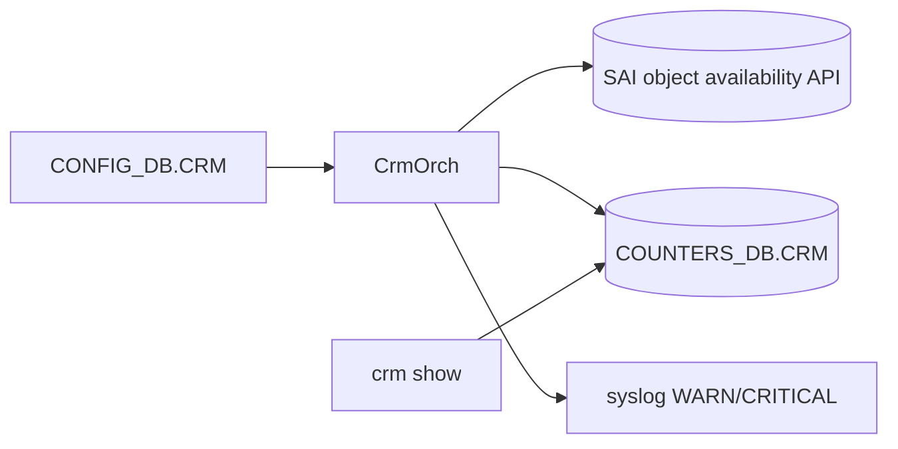

!!! success "裏取りステータス: code-verified"
    `sonic-swss/orchagent/crmorch.h` / `crmorch.cpp` に CrmOrch 実装、`sonic-yang-models/yang-models/sonic-crm.yang` に CONFIG_DB CRM スキーマ。`fdborch.cpp` / `routeorch.cpp` / `srv6orch.cpp` 等から CRM カウンタ更新が呼ばれることを grep で確認（verified at: 2026-05-10）。

# Critical Resource Monitoring（CRM・SAI 表枯渇のしきい値監視）

## なぜ必要なのか

ASIC 側の各種リソース（route 表、neighbor、ACL counter、FDB、NAT 等）は **ハードウェアサイズで上限がある**。上限到達で**運用中に突然パケットドロップやプログラム失敗**が起きるため、CRM は使用量をポーリングして **しきい値超えで WARN / CRITICAL を syslog に出す** ことで障害前検知を狙う[^1]。

ねらい:

- 表枯渇を **障害発生前に** 通知
- `crm show` で使用量・上限値を常時可視化
- しきい値の `percentage` / `used` / `free` モード、`high` / `low` の双方を扱う

## 監視対象の resource

主要種別（HLD ベース、後発追加あり）[^1]:

- L3: `IPV4_ROUTE` / `IPV6_ROUTE` / `IPV4_NEIGHBOR` / `IPV6_NEIGHBOR` / `IPV4_NEXTHOP` / `IPV6_NEXTHOP`
- L3 group: `NEXTHOP_GROUP` / `NEXTHOP_GROUP_MEMBER`
- L2: `FDB_ENTRY`
- ACL: `ACL_TABLE` / `ACL_GROUP` / `ACL_ENTRY` / `ACL_COUNTER`
- NAT / multicast: `DNAT_ENTRY` / `SNAT_ENTRY` / `IPMC_ENTRY`
- Tunnel / SRv6 等は後発で追加

## どう動くのか

しきい値モード[^1]:

- **percentage**: 上限の % で `high_threshold` / `low_threshold`
- **used**: 絶対使用量
- **free**: 残量

`high` 超えで WARN/CRIT、`low` を下回ると clear（`free` モードはその逆）。周期は `polling_interval`。

## CONFIG_DB / CLI

| Key | 説明 |
|-----|------|
| `CRM\|Config` | `polling_interval`、各 resource ごとに `<r>_threshold_type` / `<r>_high_threshold` / `<r>_low_threshold` |

| Command | 用途 |
|---------|------|
| `crm config polling interval <n>` | 周期 |
| `crm config thresholds <r> type <p\|u\|f>` | mode |
| `crm config thresholds <r> high <n>` / `low <n>` | しきい値 |
| `crm show resources [all\|ipv4 route\|...]` | 残量 / 使用量 |
| `crm show thresholds` | 現行しきい値 |

## 制限事項

- **SAI 側 availability API が必要**。vendor 未対応 resource は値が出ない
- WARN/CRIT は syslog のみで **自動 recovery アクションは無い**
- 多 resource を高頻度ポーリングすると **ASIC SDK 負荷増**
- `ACL_COUNTER` / `FDB_ENTRY` は SDK query が高コストになることがあり、長めの polling 推奨

## 干渉する機能

generic SAI extension CRM（新 resource 追加枠組み） / system health monitor（critical 集約） / NAT / mux / SRv6 / multi-asic（resource 種別を増やす側）。

## トラブルシューティング

- `crm show` が `N/A` → SAI vendor の object_availability 実装の有無
- 通知が来ない → `polling_interval`、syslog rate-limit、threshold mode 確認
- counter が振動する → 周期と使用量変動の解像度差を再検討

## 関連 Topics

- [07-acl-copp-mirror](../topics/07-acl-copp-mirror/index.md): ACL リソース消費
- [20-swss-sai-redis](../topics/20-swss-sai-redis/index.md): orchagent と SAI の関係

## 引用元

[^1]: `sonic-net/SONiC` `doc/crm/Critical-Resource-Monitoring-High-Level-Design.md` @ `49bab5b5ff0e924f1ea52b3d9db0dfa4191a7c06`
